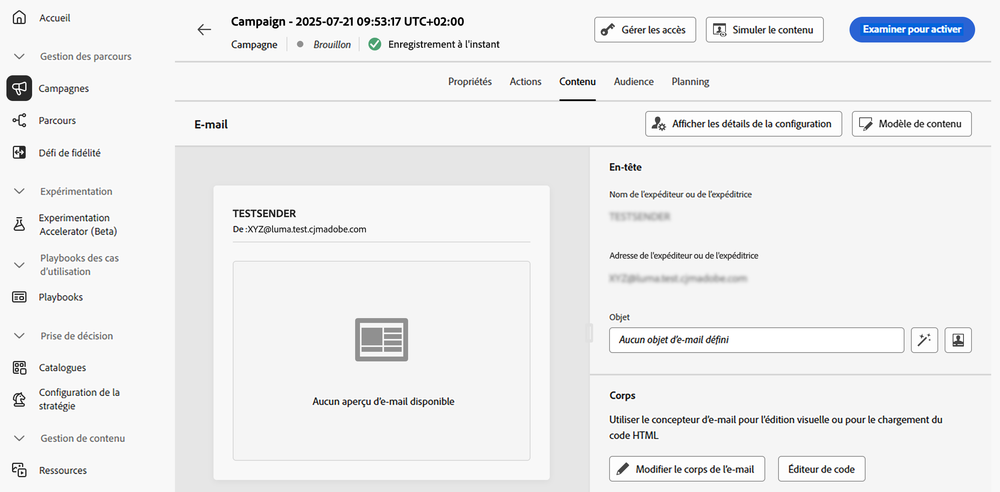

# Modifier le contenu d’une campagne d’action {#action-campaign-content}

Pour configurer le contenu du message, accédez à l’onglet **[!UICONTROL Contenu]** ou cliquez sur le bouton **[!UICONTROL Modifier le contenu]**.

## Concevoir le contenu

Le processus de création du contenu dépend du canal que vous avez sélectionné. Découvrez les étapes détaillées pour créer le contenu de votre message dans les pages suivantes :

<table style="table-layout:fixed"><tr style="border: 0;">
<td>

<a href="../email/create-email.md"><strong>E-mail</strong></a>
</td>
<td>

<a href="../sms/create-sms.md"><strong>SMS</strong></a>
</td>
<td>

<a href="../push/create-push.md"><strong>Notification push</strong></a>
</td>
<td>

<a href="../direct-mail/create-direct-mail.md"><strong>Courrier</strong></a>
</td>
</tr></table>

<table style="table-layout:fixed"><tr style="border: 0;">
<td>

<a href="../in-app/create-in-app.md"><strong>In-app</strong></a>
</td>
<td>

<a href="../web/create-web.md"><strong>Web</strong></a>
</td>
<td>

<a href="../code-based/create-code-based.md"><strong>Expérience basée sur du code</strong></a>
</td>
<td>

<a href="../content-card/create-content-card.md"><strong>Cartes de contenu</strong></a>
</td>
</tr></table>

## Tester et vérifier votre contenu

Une fois votre contenu défini, utilisez le bouton **[!UICONTROL Simuler le contenu]** pour prévisualiser et tester votre contenu avec des profils de test ou des exemples de données d’entrée chargés à partir d’un fichier CSV/JSON ou ajoutés manuellement. [Découvrez comment prévisualiser et tester du contenu](../content-management/preview-test.md).

Pour revenir à l’écran de création de campagne, cliquez sur la flèche pointant vers la gauche.

## Étapes suivantes {#next}

Une fois que le contenu de votre campagne d’action est prêt, vous pouvez définir l’audience de la campagne. [En savoir plus](campaign-audience.md)
