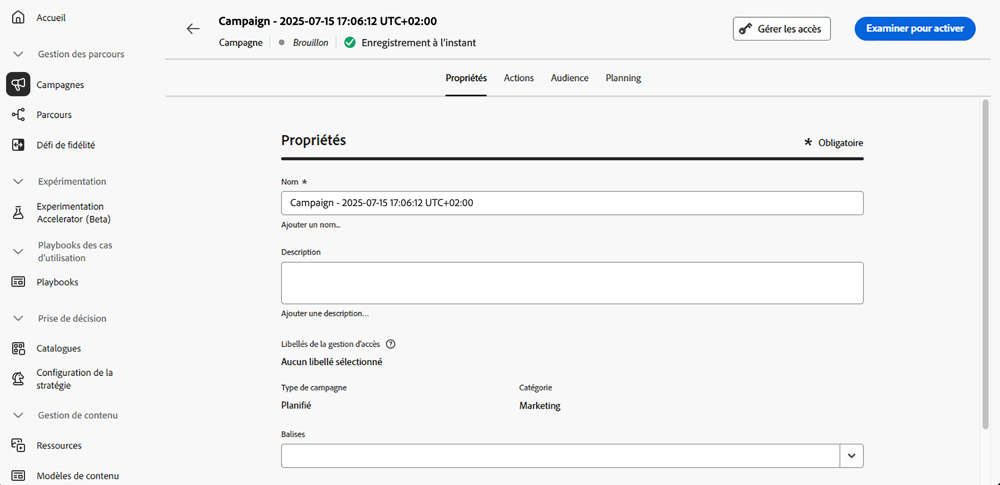

# Définir les propriétés de la campagne d’action {#action-campaign-properties}

Pour créer une campagne d’action et définir ses propriétés, procédez comme suit :

1. Accédez au menu **[!UICONTROL Campagnes]** et sélectionnez l’onglet **[!UICONTROL Action]**.

1. Cliquez sur le bouton **[!UICONTROL Créer une campagne]** et sélectionnez le type de campagne **[!UICONTROL Planifiée - Marketing]**.

   

1. Dans l’onglet **[!UICONTROL Propriétés]**, saisissez un nom et une description pour votre campagne.

   

1. Utilisez le champ **Balises** pour affecter des balises unifiées Adobe Experience Platform à votre campagne. Vous pouvez ainsi facilement les classer et améliorer la recherche à partir de la liste des campagnes. [Découvrez comment utiliser les balises](../start/search-filter-categorize.md#tags).

1. Vous pouvez limiter l’accès à cette campagne en fonction de libellés d’accès. Pour ajouter une limitation d’accès, cliquez sur le bouton **[!UICONTROL Gérer les accès]** en haut de cette page. Assurez-vous de sélectionner uniquement les libellés pour lesquels vous disposez des autorisations. [En savoir plus sur le contrôle d’accès au niveau de l’objet](../administration/object-based-access.md)

## Étapes suivantes {#next}

Une fois votre campagne d’action créée et configurée, vous pouvez configurer son action. [En savoir plus](campaign-action.md)
