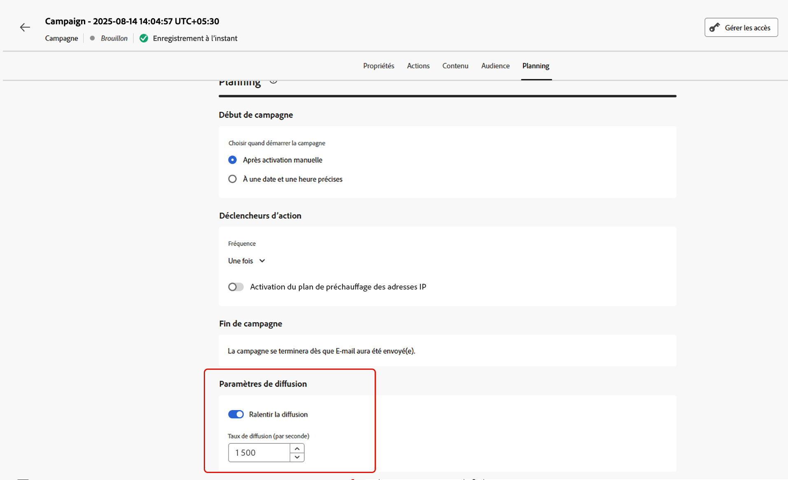

# Planifier la campagne d’action {#action-campaign-schedule}

Utilisez l’onglet **[!UICONTROL Planifier]** pour définir le planning de la campagne.

## Définir une date de début de campagne

Par défaut, les campagnes d’action démarrent après avoir été activées manuellement et se terminent dès que le message a été envoyé une fois.

Si vous ne souhaitez pas exécuter votre campagne juste après son activation, vous pouvez spécifier la date et l’heure auxquelles le message doit être envoyé dans la section **[!UICONTROL Début de campagne]**.

>[!NOTE]
>
>Lors de la planification de campagnes dans [!DNL Adobe Journey Optimizer], assurez-vous que la date/l’heure de début correspond à la première diffusion souhaitée. Pour les campagnes récurrentes, si l’heure planifiée initiale est déjà dépassée, les campagnes sont reportées au prochain créneau horaire disponible en fonction de leurs règles de périodicité.

## Définir une fréquence d’exécution

Pour les actions **E-mail**, **SMS** et **notification push**, vous pouvez définir la fréquence d’envoi du message de la campagne. Pour ce faire, utilisez l’option **[!UICONTROL Déclencheurs d’action]** dans l’écran de création de la campagne pour indiquer si la campagne doit être exécutée tous les jours, toutes les semaines ou tous les mois.

>[!NOTE]
>
>Pour les actions **E-mail**, vous pouvez créer des campagnes spécifiques d’activation de plans de préchauffage d’adresses IP. Le planning de la campagne sera piloté par le plan de préchauffage d’adresses IP auquel il sera associé, ce qui signifie que le planning ne sera plus défini dans la campagne elle-même. [Découvrez comment créer des campagnes de préchauffage d’adresses IP](../configuration/ip-warmup-campaign.md).

## Définir une date de fin

La section **[!UICONTROL Fin de la campagne]** vous permet de spécifier le moment où une campagne doit cesser d’être exécutée. En dehors des dates spécifiées, la campagne ne sera pas exécutée.

## Définir le contrôle du débit

[!DNL Journey Optimizer] vous permet d’activer le contrôle du débit pour les actions sortantes (e-mails, SMS, notifications push).

Cette fonctionnalité est particulièrement utile pour éviter la surcharge sur les systèmes en aval, tels que les pages de destination ou les plateformes d’assistance clientèle. Par exemple, vous pouvez définir une limite de débit de 165 messages par seconde pour garantir une diffusion régulière sans surcharger les systèmes en aval.

Pour définir le contrôle du débit, activez l’option **[!UICONTROL Limiter la diffusion]** dans la section **[!UICONTROL Paramètres de diffusion]** et indiquez le **[!UICONTROL Taux de diffusion]** par seconde souhaité.

* Taux de diffusion minimum pris en charge : 1 par seconde.
* Taux de diffusion maximal pris en charge : 2 000 par seconde lorsque l’option « Limiter la diffusion » est activée.

>[!IMPORTANT]
>
>Lors de la définition d’un taux de diffusion, le délai maximal d’exécution de l’audience de la campagne est de 12 heures. Si le taux de diffusion est défini sur une valeur qui ne permet pas d’envoyer le message à l’ensemble de l’audience dans un délai de 12 heures, les profils restants seront exclus de la campagne. Le nombre de ces profils exclus apparaît dans le rapport de campagne.

## Étapes suivantes {#next}

Une fois votre planning de campagne prêt, vous pouvez vérifier et activer la campagne. [En savoir plus](review-activate-campaign.md)
