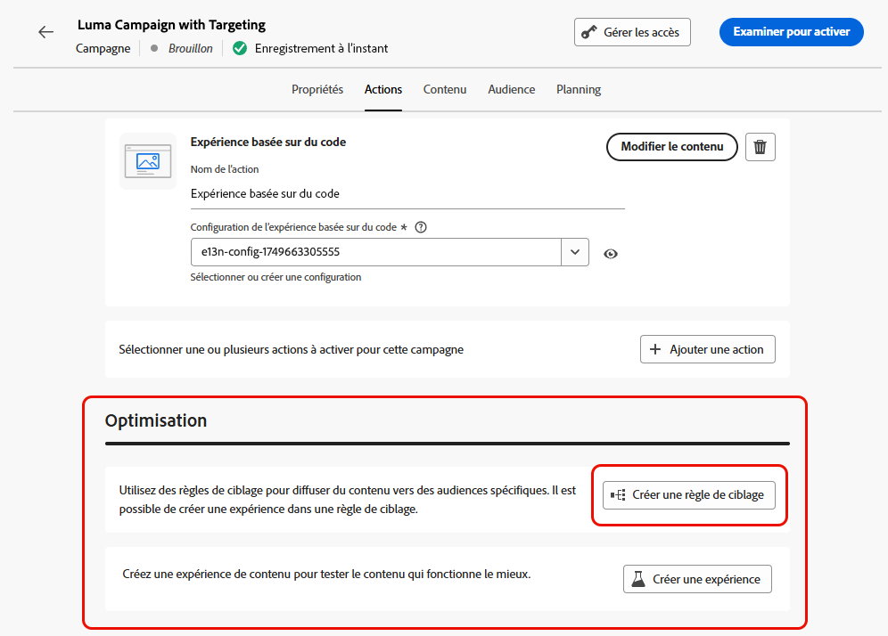

# Optimisation des campagnes et des parcours {#message-optimization}

L’optimisation fournit les outils nécessaires pour diffuser du contenu personnalisé et optimisé auprès de votre audience, <!--based on marketer-defined advanced decision configurations. This ensures that the right message reaches the right audience at the right time in order to maximize the effectiveness of your campaigns. (Removed for now as Decisioning is not yet supported)-->garantissant ainsi un engagement et un succès optimaux afin de créer des campagnes et des parcours hautement efficaces<!--customized and -->.

Avec l’optimisation, vous pouvez réaliser les actions suivantes :

* Exploiter les règles de [ciblage](#targeting)
* Exécuter des [expériences de contenu](#experimentation)
* Utiliser des [combinaisons avancées](#combination) d’expérimentation et de ciblage dans une seule campagne

Une fois la campagne ou le parcours actif, les profils sont évalués en fonction des critères définis. Puis, en fonction des critères correspondants, ils sont diffusés avec l’expérience ou le contenu approprié de la campagne ou du parcours.

La différence entre les expériences et le ciblage peut être décrite comme suit :

* L’expérimentation consiste en une répartition aléatoire de la diffusion du contenu selon l’affectation du trafic.
* Le ciblage utilise des techniques déterministes pour diffuser du contenu en fonction du profil de l’utilisateur ou de l’utilisatrice, de l’appartenance à une audience ou de règles contextuelles.

{width="110%" zoomable="yes"}

➡️ [En savoir plus sur l’optimisation d’une campagne dans cette vidéo](#video)

## Tirer profit du ciblage {#targeting}

>[!CONTEXTUALHELP]
>id="ajo_content_targeting_fallback"
>title="Qu’est-ce que le contenu de secours ?"
>abstract="Le contenu de secours permet à votre audience de recevoir un contenu par défaut lorsqu’aucune règle de ciblage n’est applicable. Si cette option n’est pas sélectionnée, toute audience qui ne correspond pas à une règle de ciblage définie ci-dessus ne recevra aucun contenu."

Le ciblage diffuse du contenu personnalisé vers des segments d’audience spécifiques en fonction d’attributs de profil utilisateur ou utilisatrice, ou d’attributs contextuels.

Contrairement à l’expérimentation, qui correspond à une attribution aléatoire du contenu d’un message, le ciblage est déterministe en matière de diffusion du contenu à la bonne audience.

Avec le ciblage, des règles spécifiques peuvent être définies en fonction des éléments suivants :

* **Attributs du profil utilisateur**, tels que la localisation (par ex. le géociblage), l’âge ou les préférences. Par exemple, les utilisateurs ou utilisatrices aux États-Unis voient une promotion « Golden Gate », tandis que les utilisateurs ou utilisatrices en France voient une promotion « Tour Eiffel ».

* **Données contextuelles**, telles que le type d’appareil (par ex. ciblage de l’appareil), l’heure de la journée ou les détails de la session. Par exemple, les utilisateurs ou utilisatrices sur ordinateur reçoivent du contenu optimisé pour poste de travail, tandis que les utilisateurs ou utilisatrices sur mobile reçoivent du contenu optimisé pour mobile.

* **Audiences**, qui peuvent être utilisées pour inclure ou exclure des profils ayant une appartenance spécifique à une audience.

Pour configurer le ciblage, suivez les étapes ci-dessous.

1. Créez un [parcours](../building-journeys/journey-gs.md#jo-build) ou une [campagne](../campaigns/create-campaign.md).

   >[!NOTE]
   >
   >Si vous vous trouvez dans un parcours, ajoutez une activité **[!UICONTROL Action]**, choisissez une activité de canal et sélectionnez **[!UICONTROL Configurer l’action]**. [En savoir plus](../building-journeys/journey-action.md#add-action)

1. Dans l’onglet **[!UICONTROL Actions]**, sélectionnez au moins une action.

1. Dans la section **[!UICONTROL Optimisation]**, sélectionnez **[!UICONTROL Créer une règle de ciblage]**.

   {width=85%}

1. Cliquez sur **[!UICONTROL Créer une règle]** > **[!UICONTROL Créer]** et utilisez le créateur de règles pour définir directement vos critères.

   {width=100%}

   Par exemple, définissez une règle pour les personnes vivant aux États-Unis, une règle pour les personnes vivant en France et une règle pour les personnes vivant en Inde.

   {width=85%}

1. Vous pouvez également cliquer sur **[!UICONTROL Créer une règle]** > **[!UICONTROL Sélectionner une règle]** pour sélectionner une règle de ciblage existante créée à partir du menu **[!UICONTROL Règles]**. [En savoir plus](../experience-decisioning/rules.md)

   {width=70%}

   Dans ce cas, la formule qui constitue la règle est simplement copiée dans le parcours ou la campagne. Les modifications ultérieures apportées à cette règle à partir du menu **[!UICONTROL Règles]** n’auront aucune incidence sur la copie du parcours ou de la campagne.

   >[!AVAILABILITY]
   >
   >La fonction [Création de règles de ciblage](../experience-decisioning/rules.md#create) à partir du menu [!DNL Journey Optimizer] dédié est actuellement disponible pour les organisations qui ont acheté le module complémentaire Decisioning. Elle est disponible à la demande pour les autres organisations (disponibilité limitée).
   >
   >Cette fonctionnalité sera progressivement déployée pour l’ensemble de la clientèle. En attendant, contactez votre représentant ou votre représentante Adobe pour obtenir l’accès.

1. Après avoir ajouté une règle, vous pouvez toujours la modifier. Choisissez **[!UICONTROL Modifier directement]** pour effectuer la mise à jour directement à l’aide du créateur de règles, ou **[!UICONTROL Sélectionner une règle]** pour sélectionner une autre règle.

   {width=100%}

   >[!NOTE]
   >
   >La modification directe d’une règle n’a aucune incidence sur la règle d’où elle provient.

1. Sélectionnez l’option **[!UICONTROL Activer le contenu de secours]** si nécessaire. Le contenu de secours permet à l’audience de recevoir un contenu par défaut lorsqu’aucune règle de ciblage n’est applicable.

   >[!NOTE]
   >
   >Si cette option n’est pas sélectionnée, toute audience qui ne correspond pas à une règle de ciblage définie ci-dessus ne recevra aucun contenu.

1. Enregistrez les paramètres de votre règle de ciblage.

1. De retour dans l’onglet **[!UICONTROL Actions]**, sélectionnez **[!UICONTROL Modifier le contenu]**.

1. Concevoir un contenu adapté pour chaque groupe défini par les paramètres de règle de ciblage

   {width=85%}

   Dans cet exemple, concevez un contenu spécifique pour les personnes vivant aux États-Unis, un contenu différent pour les personnes vivant en France et encore un autre pour les personnes vivant en Inde.

1. [Activez](review-activate-campaign.md) votre parcours ou campagne.

Une fois la campagne ou le parcours actif, le contenu adapté à chaque cible est envoyé : les personnes vivant aux États-Unis reçoivent un message spécifique, les personnes vivant en France un message différent, et ainsi de suite.

<!--Default content:

* If no targeting rules match, default content can be delivered.

* If default content is not enabled, passthrough behavior ensures lower-priority campaigns are evaluated.-->

## Utiliser l’expérimentation {#experimentation}

L’expérimentation permet de tester plusieurs versions d’un contenu afin de déterminer celle qui offre les meilleures performances en fonction de mesures de succès prédéfinies.

Pour configurer l’expérimentation, suivez les étapes ci-dessous.

Supposons que vous vouliez tester les messages promotionnels suivants dans une campagne :

* **Traitement A** : « 20 % de réduction sur votre prochain achat »
* **Traitement B** : « Livraison gratuite sur les commandes de plus de 50 $ »
* **Traitement C** : « Obtenez votre carte-cadeau de 10 $ »

Pour configurer l’expérimentation et déterminer le message qui génère le plus d’achats, procédez comme suit.

1. Créez un [parcours](../building-journeys/journey-gs.md#jo-build) ou une [campagne](../campaigns/create-campaign.md).

   >[!NOTE]
   >
   >Si vous vous trouvez dans un parcours, ajoutez une activité **[!UICONTROL Action]**, choisissez une activité de canal et sélectionnez **[!UICONTROL Configurer l’action]**. [En savoir plus](../building-journeys/journey-action.md#add-action)

1. Dans l’onglet **[!UICONTROL Actions]**, sélectionnez au moins deux actions entrantes, par exemple [expérience basée sur du code](../code-based/get-started-code-based.md) et [in-app](../../rp_landing_pages/in-app-landing-page.md).

1. Dans la section **[!UICONTROL Optimisation]**, sélectionnez **[!UICONTROL Créer une expérience]**.

   {width=85%}

1. Concevez et configurez votre expérience de contenu selon vos besoins. [Voici comment procéder](../content-management/content-experiment.md)

   {width=85%}

   Une fois l’expérience définie, elle s’applique à toutes les actions insérées dans la campagne ou par le biais de l’activité **[!UICONTROL Action]** du parcours, ce qui signifie que les mêmes clients et clientes voient les mêmes offres sur l’ensemble des surfaces.

   >[!NOTE]
   >
   >Vous pouvez sélectionner d’autres actions : l’expérimentation s’applique à toutes les actions ajoutées à la campagne ou au parcours.

1. [Activez](review-activate-campaign.md) votre parcours ou campagne.

Une fois la campagne ou le parcours actif, les utilisateurs et utilisatrices se voient attribuer aléatoirement les différentes variations de contenu. [!DNL Journey Optimizer] suit la variation qui génère le plus d’achats et fournit des informations exploitables.

Suivez le succès de votre campagne avec les rapports de [parcours](../reports/journey-global-report-cja.md) et de [campagne](../reports/campaign-global-report-cja-experimentation.md). <!--Link to Experimentation journey reportis missing-->

## Combiner ciblage et expérimentation {#combination}

Journey Optimizer permet également de combiner le ciblage et les expériences au sein d’un seul parcours ou d’une seule campagne afin de créer des stratégies plus sophistiquées.

En effet, il est possible d’utiliser le ciblage pour créer plusieurs variantes et, pour chacune d’elles, de recourir à l’expérimentation afin d’optimiser davantage chaque contenu. Cela garantit que les expériences sont propres à chaque règle de ciblage et ne s’étendent pas aux variantes.

Par exemple, il est possible de tester une « promotion -50 % » par rapport à une « carte-cadeau de 50 $ » pour la clientèle américaine, et d’exécuter un test différent pour la clientèle européenne, comme « livraison gratuite pour toute commande supérieure à 50 € » par rapport à « 20 % de réduction sur l’achat suivant ».

Pour combiner le ciblage et les expériences dans un parcours ou une campagne, suivez les étapes ci-dessous.

1. Créez un parcours ou une campagne où plusieurs règles de ciblage sont définies. [Voici comment procéder](#targeting)

   {width=85%}

1. Créez une expérience pour la première règle de ciblage.

1. Concevez et configurez votre expérience de contenu selon vos besoins. [Voici comment procéder](../content-management/content-experiment.md)

   {width=85%}

   Une fois l’expérience définie, elle s’applique uniquement à la première règle de ciblage.

1. De retour dans l’onglet **[!UICONTROL Actions]**, sélectionnez **[!UICONTROL Modifier le contenu]**.

1. Pour le groupe défini par la première règle de ciblage, il est possible de définir du contenu spécifique pour chaque variante de l’expérience.

   Si plusieurs actions entrantes sont ajoutées au parcours ou à la campagne, la même combinaison de ciblage et d’expérience s’applique à chaque action. Cependant, un contenu spécifique doit être défini pour chaque variante de chaque action.

   {width=85%}

1. Procédez de la même manière pour les autres règles de ciblage et concevez le contenu correspondant pour chaque variante.

1. Enregistrez vos modifications et [activez](review-activate-campaign.md) votre parcours ou campagne.

Une fois la campagne ou le parcours actif, les utilisateurs et utilisatrices de chaque groupe ciblé se voient attribuer aléatoirement les différentes variations de contenu définies pour leur groupe respectif.

<!--
## Reporting on Message optimization

E.g. explaining how a marketer can look at the report to determine which treatment (e.g. which message content) is performing the best for the targeting audience
-->

## Vidéo pratique{#video}

Apprenez à tirer parti de l’optimisation des messages dans les campagnes déclenchées par des actions ou des API. Vous découvrirez comment cibler des sous-audiences, créer des variations de messages en fonction de la localisation, activer un contenu de secours et mener plusieurs expériences au sein d’une même campagne. Ce tutoriel explique également comment gérer des campagnes à plusieurs canaux, tout en maintenant la cohérence du message.

>[!VIDEO](https://video.tv.adobe.com/v/3470370?captions=fre_fr&quality=12)