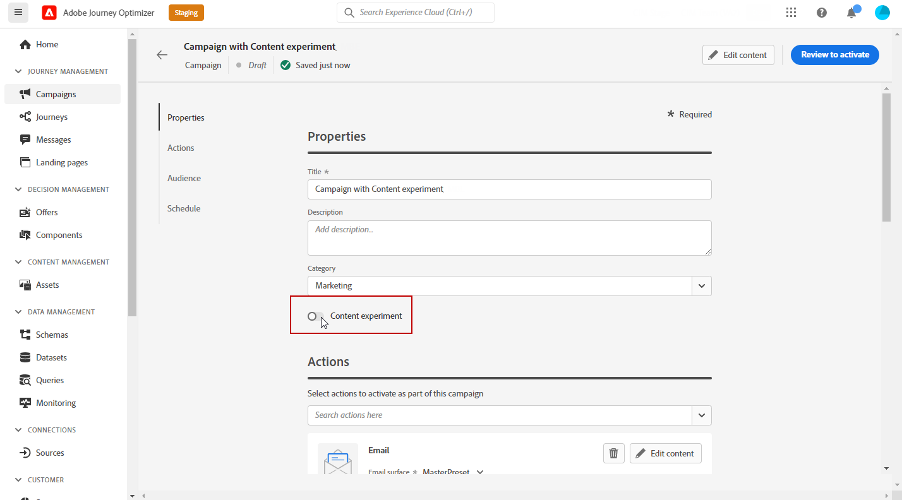
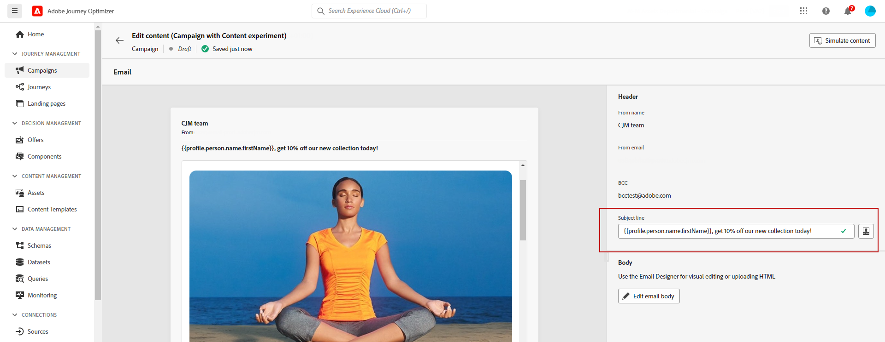
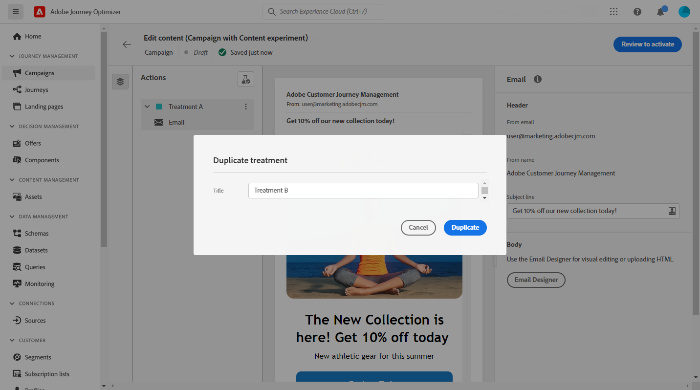

# Création d’une expérience de contenu {#content-experiment}

>[!AVAILABILITY]
>
>Le **Expérience de contenu** Cette fonctionnalité est actuellement disponible uniquement pour un ensemble d’organisations (disponibilité limitée). Pour en savoir plus, contactez votre représentant Adobe.

Utilisez l’expérience de contenu Journey Optimizer pour définir plusieurs traitements de diffusion. L’audience ciblée est attribuée de manière aléatoire à chaque traitement afin de déterminer lequel est le plus performant par rapport à la mesure d’intérêt. Vous pouvez choisir de varier le contenu, l’objet ou l’expéditeur de l’e-mail.

>[!NOTE]
>
>Avant de commencer l’expérience de contenu, assurez-vous que votre configuration de création de rapports est définie pour vos jeux de données personnalisés. En savoir plus dans [cette section](reporting-configuration.md).

Dans l&#39;exemple ci-dessous, la cible de la diffusion a été divisée en deux groupes, représentant chacun 45 % de la population ciblée, et un groupe d’exclusion de 10 %, qui ne recevra pas la diffusion.

Chaque personne de l’audience ciblée recevra une version de l’e-mail, avec un objet qui est l’un des deux suivants :

* une promotion directe d&#39;une offre de 10 % sur la nouvelle collection et une image,
* l’autre ne fait de la publicité que pour une offre spéciale sans spécifier les 10 % de réduction, sans image.

L’objectif ici est de voir si les destinataires interagissent avec l’e-mail en fonction de l’expérience reçue. Nous choisirons donc **[!UICONTROL Ouvertures d’e-mails]** comme mesure d’objectif principal dans cette expérience de contenu.

## Créer votre campagne {#campaign-experiment}

1. Dans la **[!UICONTROL Campagnes]** page, cliquez sur **[!UICONTROL Créer une campagne]**.

   

1. Sélectionnez **[!UICONTROL E-mail]** puis la fonction **[!UICONTROL Surface]** que vous souhaitez utiliser pour cette diffusion. Pour plus d’informations à ce sujet, consultez la page [Surfaces de canaux](../configuration/channel-surfaces.md).

   

1. Cliquez sur **[!UICONTROL Créer]**.

1. Configurez les **[!UICONTROL Propriétés]** de votre diffusion :
   * **[!UICONTROL Titre]**
   * **[!UICONTROL Description]**
   * **[!UICONTROL Catégorie]** : **[!UICONTROL Marketing]** / **[!UICONTROL Transactionnel]**

1. Pour lancer votre expérience de contenu, activez l’option **[!UICONTROL Expérience de contenu]**. Le **[!UICONTROL Expérience de contenu]** s’affiche.

   

1. Configurez les paramètres **[!UICONTROL Audience]** et **[!UICONTROL Planification]** de vos diffusions. [En savoir plus](create-campaign.md)

1. Cliquez sur **[!UICONTROL Modifier le contenu]** pour commencer à personnaliser vos **[!UICONTROL Traitements]**.

   

## Créer vos traitements {#treatment-experiment}

1. Dans la fenêtre **[!UICONTROL Modifier le contenu]**, ajoutez la fenêtre **[!UICONTROL Objet]** pour votre Traitement A e-mail et cliquez sur **[!UICONTROL Enregistrer]**.

   Pour ce traitement, nous spécifions l’offre directement dans la ligne d’objet.

   

1. Cliquez sur **[!UICONTROL Concepteur d’email]** pour commencer à personnaliser vos diffusions.

   

1. Après avoir conçu votre e-mail, cliquez sur **[!UICONTROL Enregistrer]** et revenez à la fenêtre **[!UICONTROL Modifier le contenu]** pour créer le Traitement B.

1. Depuis le bouton **[!UICONTROL Plus d’actions]**, cliquez sur **[!UICONTROL Dupliquer]**.

   Vous pouvez également choisir de commencer un nouveau traitement à partir de zéro en cliquant sur le bouton **[!UICONTROL Expérience de contenu]** pour accéder aux options avancées, puis sur **[!UICONTROL Ajouter un traitement]**.

   

1. Modifiez le **[!UICONTROL Titre]** de votre traitement pour mieux les différencier.

   

1. Sélectionnez la diffusion e-mail associée à votre **[!UICONTROL Traitement]** nouvellement créé.

1. Ajoutez la variable **[!UICONTROL Objet]** pour votre diffusion.

   Pour ce traitement, nous choisissons de ne pas spécifier l’offre dans l’**[!UICONTROL Objet]**.

   

1. Cliquez sur **[!UICONTROL Concepteur d’e-mail]** pour personnaliser davantage la diffusion du Traitement B si nécessaire.

Une fois vos traitements personnalisés, vous pouvez commencer à configurer votre expérience de contenu.

## Configuration de votre expérience de contenu {#configure-experiment}

1. Lorsque les deux diffusions sont personnalisées, dans la fenêtre **[!UICONTROL Modifier le contenu]**, sélectionnez **[!UICONTROL Configurer l’expérience de contenu]**.

   

1. Sélectionnez les objectifs que vous souhaitez définir pour votre expérience.

   Pour notre expérience, nous sélectionnons **[!UICONTROL Ouvertures d’e-mails]** pour tester si les destinataires ouvriront leurs e-mails lorsque le code de promotion se trouve dans l’objet.

   

1. Choisissez d’ajouter un groupe d’**[!UICONTROL exclusion]** à votre diffusion. Ce groupe ne recevra aucun contenu de cette campagne.

   Le fait d’activer la barre de bascule retirera automatiquement 10 % de votre population. Vous pouvez ajuster ce pourcentage si nécessaire.

   

1. Vous pouvez ensuite choisir d’attribuer un pourcentage précis à chaque **[!UICONTROL Traitement]** ou simplement activer la fonction **[!UICONTROL Répartir proportionnellement]** grâce à la barre de bascule.

   

1. Cliquez sur **[!UICONTROL Enregistrer]** lorsque la configuration est terminée.

1. Lorsque votre expérience de contenu est prête, vous pouvez cliquer sur **[!UICONTROL Examiner pour activer]** pour afficher un résumé de la campagne. Des alertes s’affichent si un paramètre est incorrect ou manquant.

   

1. Vérifiez que votre campagne est correctement configurée, puis cliquez sur **[!UICONTROL Activer]** pour la lancer.

   

Après avoir paramétré votre expérimentation et votre campagne, vous pouvez suivre le succès de votre diffusion avec le rapport Campagne .

## Rapport Objectifs {#objectives-global}

>[!AVAILABILITY]
>
>La fonctionnalité Expérience de contenu est actuellement disponible uniquement pour un ensemble d’organisations (disponibilité limitée). Pour en savoir plus, contactez votre représentant Adobe.

L’onglet **[!UICONTROL Objectifs]** de votre rapport Campaign vous permet d’affiner davantage les rapports de vos diffusions en ciblant une mesure spécifique.

Les **[!UICONTROL objectifs]** répertoriés sont liés aux **[!UICONTROL Jeux de données]** définissant une connexion à un système afin de récupérer des informations supplémentaires. Une liste d’**[!UICONTROL objectifs]** intégrés est disponible, mais vous pouvez l’accroître en ajoutant un nouveau **[!UICONTROL Jeu de données]**. Voir à ce sujet la procédure détaillée [section](reporting-configuration.md).

Après avoir sélectionné les objectifs que vous souhaitez cibler, les deux widgets **[!UICONTROL Présentation des performances]** et **[!UICONTROL Objectif de la campagne]** fournissent un résumé détaillé des performances de votre diffusion.

Avec le widget **[!UICONTROL Objectif de la campagne]** vous pouvez également choisir de comparer votre objectif principal à une autre mesure.

Notez que chaque widget peut être redimensionné et supprimé en cas de besoin. Pour plus d&#39;informations à ce propos, consultez cette [section](../reports/global-report.md#modify-dashboard).

## Expérimentation rapport {#experimentation-global}

>[!AVAILABILITY]
>
>La fonctionnalité Expérience de contenu est actuellement disponible uniquement pour un ensemble d’organisations (disponibilité limitée). Pour en savoir plus, contactez votre représentant Adobe.

L’onglet **[!UICONTROL Expérimentation]** de votre **[!UICONTROL Rapport global]** Campaign détaille les informations principales relatives aux performances de chaque variante et vous indique s’il y a un meilleur résultat.

Notez que la définition de meilleure performance peut prendre un certain temps, elle sera représentée par cette icône .

Le widget **[!UICONTROL Résultat de l’expérience]** décrit les performances de chaque variante. Vous pouvez modifier votre ligne de base en sélectionnant l’un des traitements du menu déroulant **[!UICONTROL Ligne de base]**. Le meilleur traitement sera signalé par une icône en forme d’étoile.

Le tableau présente les mesures suivantes :

* **[!UICONTROL Profils]** : nombre de profils ciblés pour ce traitement.

* **[!UICONTROL Clics sortants uniques]** : nombre total de clics sur les canaux sortants.

* **[!UICONTROL Nombre par profil]** : valeur totale de la mesure de l’objectif de l’expérience divisée par le nombre de profils.

* **[!UICONTROL Intervalle de confiance]** : différence en pourcentage de performance entre la ligne de base et le traitement le plus performant. [En savoir plus](../campaigns/experiment-calculations.md#confidence-intervals).

* **[!UICONTROL Effet élévateur moyen]** : pourcentage d’amélioration du taux de conversion d’un traitement donné par rapport à la ligne de base. [En savoir plus](../campaigns/experiment-calculations.md#understand-lift)

* **[!UICONTROL Confiance]** : preuves qu’un traitement donné est le même que le traitement de la ligne de base. [En savoir plus](../campaigns/experiment-calculations.md#understand-confidence)

Pour un examen approfondi de ces résultats et de leur interprétation, reportez-vous à [cette page](../campaigns/get-started-experiment.md#interpret-results).
