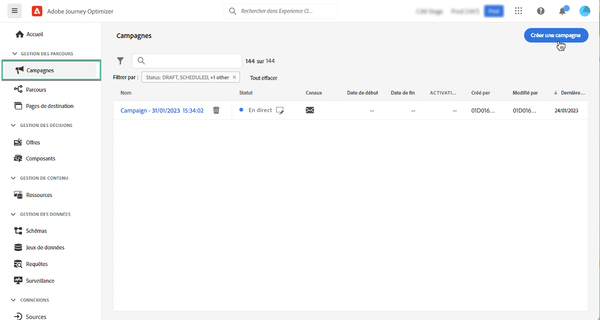
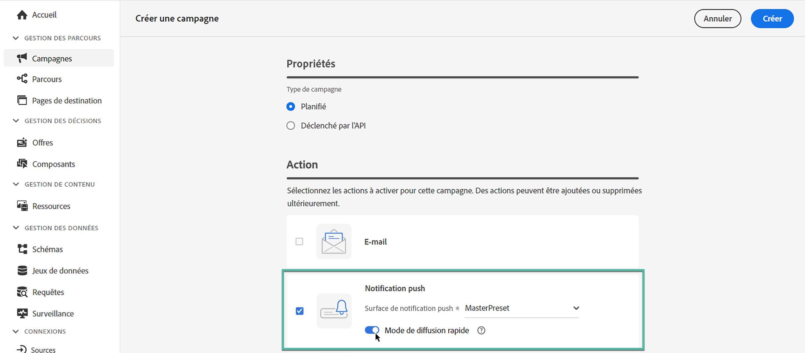

# Créer une campagne {#create-campaign}

>[!NOTE]
>
>Avant de créer une campagne, assurez-vous de disposer d’un canal de surface (c’est-à-dire un préréglage de message) et d’un segment Adobe Experience Platform prêt à l’emploi. En savoir plus dans ces sections :
>
>* [Création de surfaces de canal](../configuration/channel-surfaces.md)
>* [Prise en main des segments](../segment/about-segments.md)

## Créer votre première campagne {#create}

1. Accédez au menu **[!UICONTROL Campagnes]**, puis cliquez sur **[!UICONTROL Créer une campagne]**.

   >[!NOTE]
   >
   >Vous pouvez également dupliquer une campagne active existante pour en créer une nouvelle. [En savoir plus](modify-stop-campaign.md#duplicate)

   

1. Dans la section **[!UICONTROL Propriétés]**, indiquez quand exécuter la campagne :

   * **[!UICONTROL Planifié]** : permet d’exécuter immédiatement la campagne ou à une date spécifiée. Les campagnes planifiées visent à envoyer des messages de type **marketing**.
   * **[!UICONTROL Déclenché par API]** : permet d’exécuter la campagne à l’aide d’un appel API. Les campagnes déclenchées par API sont destinées à envoyer des messages **transactionnels**, c’est-à-dire des messages envoyés suite à une action effectuée par un individu : réinitialisation du mot de passe, abandon de panier, etc. [Découvrez comment déclencher une campagne à l’aide d’API](api-triggered-campaigns.md)

1. Dans la section **[!UICONTROL Actions]**, choisissez le canal et la surface de canal à utiliser pour envoyer votre message, puis cliquez sur **[!UICONTROL Créer]**.

   Une surface est une configuration définie par un [administrateur système](../start/path/administrator.md). Elle contient tous les paramètres techniques relatifs à l’envoi du message, tels que les paramètres d’en-tête, le sous-domaine, les applications mobiles, etc. [En savoir plus](../configuration/channel-surfaces.md).

   

   >[!NOTE]
   >
   >Seules les surfaces de canal compatibles avec le type de campagne marketing sont répertoriées dans la liste déroulante.

1. Indiquez un titre et une description pour la campagne.

   <!--To test the content of your message, toggle the **[!UICONTROL Content experiment]** option on. This allows you to test multiple variables of a delivery on populations samples, in order to define which treatment has the biggest impact on the targeted population.[Learn more about content experiment](../campaigns/content-experiment.md).-->

1. Dans la section **[!UICONTROL Actions]**, configurez le message à envoyer avec la campagne :

   1. Cliquez sur le bouton **[!UICONTROL Modifier le contenu]**, puis configurez et concevez le contenu de votre message. [En savoir plus sur les messages](../messages/get-started-content.md).

      Découvrez les étapes détaillées pour créer le contenu de votre message dans la page suivante :

      * [Création d&#39;un e-mail](../messages/create-email.md)
      * [Créer des notification push](../messages/create-push.md)
      * [Créer un SMS](../messages/create-sms.md)
   1. Une fois votre contenu défini, cliquez sur le bouton **[!UICONTROL Simuler du contenu]** pour prévisualiser et tester votre contenu avec des profils de test. [En savoir plus](../design/preview.md).

   1. Cliquez sur la flèche pour revenir à l’écran de création de la campagne.

      

   1. Dans la section **[!UICONTROL Tracking des actions]**, indiquez si vous souhaitez suivre la réaction des destinataires à votre diffusion : vous pouvez effectuer le suivi des clics et/ou des ouvertures.

      Les résultats du suivi seront accessibles dans le rapport de la campagne, une fois celle-ci exécutée. [En savoir plus sur les rapports de campagne](../reports/campaign-global-report.md)

1. Définissez l’audience à cibler. Pour ce faire, cliquez sur le bouton **[!UICONTROL Sélectionner l’audience]** pour afficher la liste des segments Adobe Experience Platform disponibles. [En savoir plus sur les segments](../segment/about-segments.md)

   >[!NOTE]
   >
   >Pour les campagnes déclenchées par API, l’audience doit être définie via un appel API. [En savoir plus](api-triggered-campaigns.md)

   Dans le champ **[!UICONTROL Espace de noms d’identité]**, choisissez l’espace de noms à utiliser pour identifier les personnes à partir du segment sélectionné. [En savoir plus sur les espaces de noms](../event/about-creating.md#select-the-namespace)

   

   >[!NOTE]
   >
   >Les individus appartenant à un segment qui n’a pas l’identité sélectionnée (espace de nommage) parmi leurs différentes identités ne seront pas ciblés par la campagne.

   <!--If you are are creating an API-triggered campaign, the **[!UICONTROL cURL request]** section allows you to retrieve the **[!UICONTROL Campaign ID]** to use in the API call. [Learn more](api-triggered-campaigns.md)-->

1. Pour exécuter votre campagne à une date spécifique ou à une fréquence récurrente, configurez la section **[!UICONTROL Planifier]**. [Découvrez comment planifier des campagnes](#schedule)

1. Pour attribuer des étiquettes d’utilisation des données personnalisées ou de base à la campagne, cliquez sur le bouton **[!UICONTROL Gérer l’accès]**. [En savoir plus sur le contrôle d’accès au niveau de l’objet (OLA)](../administration/object-based-access.md)

Une fois votre campagne prête, vous pouvez la réviser et la publier. [En savoir plus](#review-activate)

## Planifier une campagne {#schedule}

Par défaut, les campagnes démarrent une fois qu’elles ont été activées manuellement et se terminent dès que le message a été envoyé une fois.

Vous pouvez définir la fréquence d’envoi du message de la campagne. Pour ce faire, utilisez la méthode **[!UICONTROL Déclencheurs d’action]** dans l’écran de création de la campagne pour indiquer si la campagne doit être exécutée tous les jours, toutes les semaines ou tous les mois.

Si vous ne souhaitez pas exécuter votre campagne juste après son activation, vous pouvez spécifier la date et l’heure auxquelles le message doit être envoyé à l’aide de l’option **[!UICONTROL Début de campagne]**. L’option **[!UICONTROL Fin de campagne]** permet de spécifier le moment où une campagne récurrente doit cesser d’être exécutée.

## Mode de diffusion rapide {#rapid-delivery}

>[!CONTEXTUALHELP]
>id="ajo_campaigns_rapid_delivery"
>title="Mode de diffusion rapide"
>abstract="Mode de diffusion rapide vous permet d’envoyer des messages à grande vitesse sur le canal push pour une taille d’audience inférieure à 30 millions."

Le mode de diffusion rapide, précédemment connu sous le nom de mode rafale dans les parcours, est un module complémentaire [!DNL Journey Optimizer] permettant d’envoyer très rapidement des messages push dans de grands volumes par le biais de campagnes.

Le mode de diffusion rapide est utilisé lorsque le retard dans la diffusion des messages est critique pour l’entreprise, quand vous souhaitez envoyer une alerte push urgente sur les téléphones mobiles, par exemple des nouvelles importantes destinées aux utilisateurs qui ont installé votre application de canal d’actualités.

Pour plus d’informations sur les performances lors de l’utilisation du mode de diffusion rapide, reportez-vous à la section [Description du produit Adobe Journey Optimizer](https://helpx.adobe.com/fr/legal/product-descriptions/adobe-journey-optimizer.html).

### Conditions préalables {#prerequisites}

La messagerie en diffusion rapide est fournie avec les conditions suivantes :

* La diffusion rapide est disponible pour les campagnes **[!UICONTROL planifiées]** uniquement et n’est pas disponible pour les campagnes déclenchées par l’API.
* Aucune personnalisation n’est autorisée dans le message push.
* L’audience cible doit contenir moins de 30 millions de profils.
* Vous pouvez exécuter jusqu’à 5 campagnes simultanément à l’aide du mode de diffusion rapide.

### Activer le mode de diffusion rapide

1. Créez une campagne de notification push et activez/désactivez l’option **[!UICONTROL Diffusion rapide]**.

1. Configurez le contenu du message et sélectionnez l’audience à cibler. [Découvrez comment créer une campagne](#create).

   >[!IMPORTANT]
   >
   >Assurez-vous que le contenu du message ne contient aucune personnalisation et que l’audience contient moins de 30 millions de profils.

1. Vérifiez et activez votre campagne comme vous le faites habituellement. Notez que, en mode test, les messages ne sont pas envoyés via le mode de diffusion rapide. [Découvrez comment vérifier et activer une campagne.](review-activate-campaign.md)
