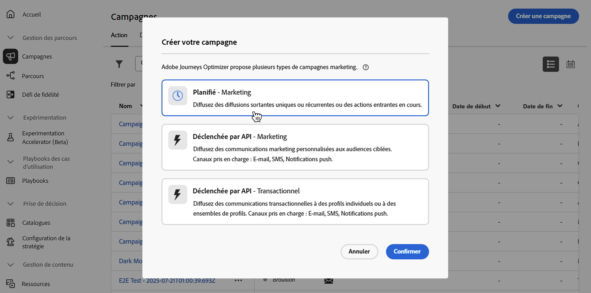
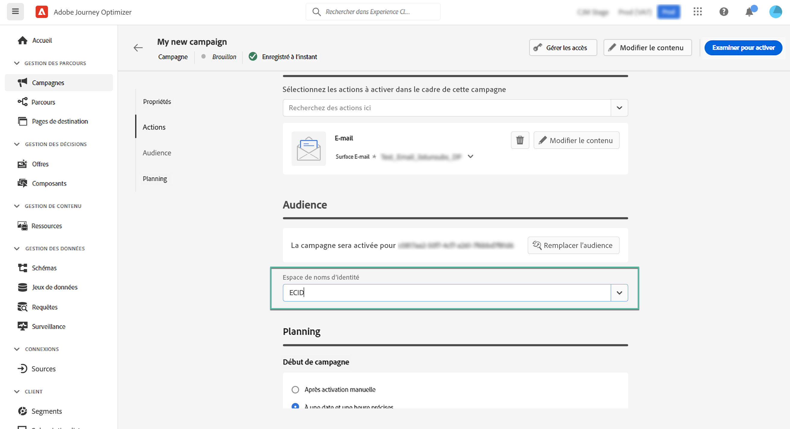
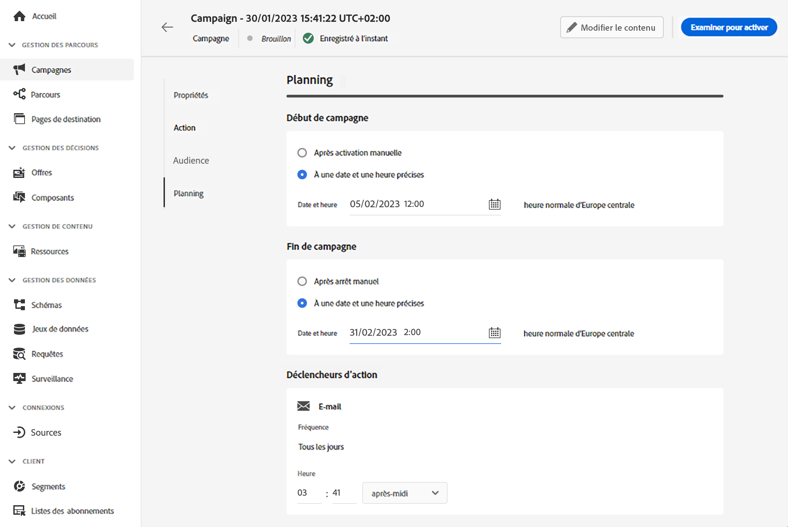

# Créer une campagne {#create-campaign}

Pour créer une campagne, accédez au menu **[!UICONTROL Campagnes]** dans le rail de gauche, puis cliquez sur **[!UICONTROL Créer une campagne]**. Vous pouvez également dupliquer une campagne active existante pour en créer une nouvelle. [Découvrez comment procéder](modify-stop-campaign.md#duplicate).

Avant de commencer, lisez les prérequis des campagnes sur [cette page](get-started-with-campaigns.md#before-starting-campaign-prerequisites).

## Sélectionner le type de campagne {#campaigntype}

>[!CONTEXTUALHELP]
>id="ajo_campaigns_campaign_type"
>title="Type de campagne"
>abstract="Les **campagnes planifiées** sont exécutées immédiatement ou à une date spécifiée et sont destinées à envoyer des messages de type marketing. Les campagnes **déclenchées par API** sont exécutées à l’aide d’un appel API. Elles sont destinées à envoyer soit des messages marketing (messages promotionnels nécessitant le consentement de la personne), soit des messages transactionnels (messages non commerciaux, qui peuvent également être envoyés à des profils désabonnés dans des contextes spécifiques)."

Lorsque vous créez une campagne, vous devez d’abord sélectionner le type de campagne. Trois types de campagnes sont disponibles :

1. **[!UICONTROL Planifiée - Marketing]** : ces campagnes sont exécutées immédiatement ou à une date spécifiée. Les campagnes planifiées sont destinées à envoyer des messages **marketing** ou à créer des actions entrantes. Elles sont configurées et exécutées à partir de l’interface d’utilisation.

1. **[!UICONTROL Déclenchée par API - Marketing]** : ces campagnes sont exécutées à l’aide d’un appel API. Sélectionnez ce type de campagne pour envoyer des communications marketing personnalisées à des audiences ciblées.  [Découvrir comment déclencher une campagne à l’aide d’API](api-triggered-campaigns.md)

1. **[!UICONTROL Déclenchée par API - Transactionelle]** : comme pour les campagnes « Déclenchée par API - Marketing », ces campagnes sont exécutées à l’aide d’un appel API. Les campagnes déclenchées par API sont destinées à envoyer des messages **transactionnels**, c’est-à-dire des messages envoyés suite à une action effectuée par une personne : demande de réinitialisation du mot de passe, achat de panier, etc.  [Découvrir comment déclencher une campagne à l’aide d’API](api-triggered-campaigns.md)

   

## Définir les propriétés de la campagne {#create}

Une fois la campagne créée, vous devez définir ses propriétés. Suivez les étapes ci-dessous :

1. Dans la section **[!UICONTROL Propriétés]**, indiquez un nom et une description pour votre campagne.

   <!--To test the content of your message, toggle the **[!UICONTROL Content experiment]** option on. This allows you to test multiple variables of a delivery on populations samples, in order to define which treatment has the biggest impact on the targeted population.[Learn more about content experiment](../content-management/content-experiment.md).-->

1. (Facultatif) Le champ **Balises** vous permet d’affecter des balises unifiées Adobe Experience Platform à votre campagne. Vous pouvez ainsi facilement les classer et améliorer la recherche à partir de la liste des campagnes. [Découvrez comment utiliser les balises](../start/search-filter-categorize.md#tags).

1. (Facultatif) Vous pouvez limiter l’accès à cette campagne en fonction de libellés d’accès. Pour ajouter une limitation d’accès, cliquez sur le bouton **[!UICONTROL Gérer les accès]** en haut de cette page. Assurez-vous de sélectionner uniquement les libellés pour lesquels vous disposez des autorisations. [En savoir plus sur le contrôle d’accès au niveau de l’objet](../administration/object-based-access.md)

## Définir l’audience de la campagne {#audience}

Vous pouvez maintenant sélectionner l’audience de votre campagne. Une audience est un ensemble de personnes qui partagent des comportements et/ou des caractéristiques similaires.

>[!IMPORTANT]
>
>* L’utilisation des audiences et des attributs de la [composition d’audiences](../audience/get-started-audience-orchestration.md) est actuellement indisponible avec Healthcare Shield ou Privacy and Security Shield.
>
>* Pour les campagnes déclenchées par API, l’audience doit être définie via un appel API.

Pour définir la population ciblée par une campagne marketing planifiée, suivez les étapes ci-après :

1. Dans la section **Audience**, cliquez sur le bouton **[!UICONTROL Sélectionner une audience]** pour afficher la liste des audiences Adobe Experience Platform disponibles. Pour en savoir plus sur les audiences, consultez [cette section](../audience/about-audiences.md).

1. Dans le champ **[!UICONTROL Type d’identité]**, choisissez le type de clé à utiliser pour identifier les personnes dans l’audience sélectionnée. Vous pouvez soit utiliser un type d’identité existant, soit en créer un nouveau à l’aide du service d’identités Adobe Experience Platform. Les espaces de noms d’identité standard sont répertoriés dans [cette page](https://experienceleague.adobe.com/fr/docs/experience-platform/identity/features/namespaces#standard){target="_blank"}.

   Un seul type d’identité est autorisé par campagne. Les personnes appartenant à un segment qui n’a pas le type d’identité sélectionné parmi leurs différentes identités ne seront pas ciblées par la campagne.

   {width="80%"}

   Pour en savoir plus sur les types d’identité et les espaces de noms, consultez la [documentation d’Adobe Experience Platform](https://experienceleague.adobe.com/docs/experience-platform/identity/home.html?lang=fr){target="_blank"}.

   <!--If you are are creating an API-triggered campaign, the **[!UICONTROL cURL request]** section allows you to retrieve the **[!UICONTROL Campaign ID]** to use in the API call. [Learn more](api-triggered-campaigns.md)-->

## Sélectionner le canal {#channel}

Vous pouvez maintenant sélectionner le canal et sa configuration. Suivez les étapes ci-dessous :

1. Dans la section **[!UICONTROL Action]**, sélectionnez le canal de communication.

   La liste des canaux disponibles dépend de votre type de licence et de vos modules complémentaires. Pour les campagnes déclenchées par API, seuls les canaux E-mail, SMS et Notification push sont disponibles.

1. Sélectionnez la configuration du canal.

   Celle-ci est définie par une [équipe d’administration système](../start/path/administrator.md). Elle contient tous les paramètres techniques relatifs à l’envoi du message, tels que les paramètres d’en-tête, le sous-domaine, les applications mobiles, etc. [En savoir plus](../configuration/channel-surfaces.md).

   Seules les configurations de canal compatibles avec le type de campagne marketing sont répertoriées dans la liste déroulante.

   

   >[!NOTE]
   >
   >Si vous créez une campagne de notification push, vous pouvez activer le **[!UICONTROL Mode de diffusion rapide]**, qui est un module complémentaire Journey Optimizer permettant d’envoyer des messages push très rapidement et en grandes quantités. [En savoir plus](../push/create-push.md#rapid-delivery).

## Modifier le contenu {#content}

Vous pouvez maintenant définir le contenu de votre message à l’aide du bouton **[!UICONTROL Modifier le contenu]**. Le processus de création de contenu dépend du canal que vous avez sélectionné.

Découvrez les étapes détaillées pour créer le contenu de votre message dans les pages suivantes :

<table style="table-layout:fixed"><tr style="border: 0;">
<td>

<a href="../email/create-email.md"><strong>E-mail</strong></a>
</td>
<td>

<a href="../sms/create-sms.md"><strong>SMS</strong></a>
</td>
<td>

<a href="../push/create-push.md"><strong>Notification push</strong></a>
</td>
<td>

<a href="../direct-mail/create-direct-mail.md"><strong>Courrier</strong></a>
</td>
</tr></table>

<table style="table-layout:fixed"><tr style="border: 0;">
<td>

<a href="../in-app/create-in-app.md"><strong>In-app</strong></a>
</td>
<td>

<a href="../web/create-web.md"><strong>Web</strong></a>
</td>
<td>

<a href="../code-based/create-code-based.md"><strong>Expérience basée sur du code</strong></a>
</td>
<td>

<a href="../content-card/create-content-card.md"><strong>Cartes de contenu</strong></a>
</td>
</tr></table>

Une fois votre contenu défini, utilisez le bouton **[!UICONTROL Simuler le contenu]** pour prévisualiser et tester votre contenu avec des profils de test ou des exemples de données d’entrée chargés à partir d’un fichier CSV/JSON ou ajoutés manuellement. [En savoir plus](../content-management/preview-test.md). Pour revenir à l’écran de création de campagne, cliquez sur la flèche vers la gauche.

En plus du contenu du message, vous pouvez configurer les paramètres suivants :

1. (Facultatif) Dans la section **[!UICONTROL Expérience de contenu]**, vous pouvez utiliser le bouton **[!UICONTROL Créer une expérience]** pour tester le contenu et déterminer le contenu qui fonctionne le mieux. Les fonctionnalités des expériences de contenu sont décrites dans [cette section](../content-management/content-experiment.md).

1. Dans la section **[!UICONTROL Suivi des actions]**, indiquez si vous souhaitez suivre la réaction des destinataires à votre diffusion : vous pouvez effectuer le suivi des clics et/ou des ouvertures.

   Les résultats du suivi sont accessibles dans le rapport de la campagne, une fois celle-ci exécutée. [En savoir plus sur les rapports de campagne](../reports/campaign-global-report-cja.md)

## Planifier la campagne {#schedule}

>[!CONTEXTUALHELP]
>id="ajo_campaigns_schedule"
>title="Planning de la campagne"
>abstract="Par défaut, les campagnes démarrent via une activation manuelle et se terminent immédiatement après un seul envoi du message. Vous avez la possibilité de définir une date et une heure spécifiques pour l’envoi du message. De plus, vous pouvez spécifier une date de fin pour les campagnes récurrentes ou déclenchées par l’API. Dans les déclencheurs d’action, vous pouvez également configurer la fréquence d’envoi des messages en fonction de vos préférences."

>[!CONTEXTUALHELP]
>id="ajo_campaigns_schedule_start"
>title="Début de campagne"
>abstract="Indiquez la date et l’heure auxquelles le message doit être envoyé."

>[!CONTEXTUALHELP]
>id="ajo_campaigns_schedule_end"
>title="Fin de campagne"
>abstract="Indiquez à quel moment une campagne récurrente doit cesser d’être exécutée."

>[!CONTEXTUALHELP]
>id="ajo_campaigns_schedule_triggers"
>title="Déclencheurs d’action de campagne"
>abstract="Vous pouvez définir la fréquence d’envoi du message de la campagne."

>[!CONTEXTUALHELP]
>id="ajo_campaigns_throttling"
>title="Contrôle du taux de limitation"
>abstract="Contrôle du taux de limitation"

Par défaut, les campagnes démarrent une fois qu’elles ont été activées manuellement et se terminent dès que le message a été envoyé une fois.

Si vous ne souhaitez pas exécuter votre campagne juste après son activation, vous pouvez spécifier la date et l’heure auxquelles le message doit être envoyé à l’aide de l’option **[!UICONTROL Début de campagne]**. L’option **[!UICONTROL Fin de la campagne]** vous permet de spécifier le moment où une campagne doit cesser d’être exécutée.

Pour les campagnes par e-mail, SMS et notification push, vous pouvez définir la fréquence d’envoi du message de la campagne. Pour ce faire, utilisez la méthode **[!UICONTROL Déclencheurs d’action]** dans l’écran de création de la campagne pour indiquer si la campagne doit être exécutée tous les jours, toutes les semaines ou tous les mois.

>[!NOTE]
>
>Lors de la planification de campagnes dans [!DNL Adobe Journey Optimizer], assurez-vous que la date/l’heure de début correspond à la première diffusion souhaitée. Pour les campagnes récurrentes, si l’heure planifiée initiale est déjà dépassée, les campagnes sont reportées au prochain créneau horaire disponible en fonction de leurs règles de périodicité.

## Autres paramètres {#settings}

Certains paramètres sont spécifiques au canal de communication sélectionné pour la campagne ou utilisés pour des cas d’utilisation spécifiques. Ceux-ci sont détaillés ci-dessous.

* Pour les e-mails, vous pouvez créer des campagnes d’activation de plans de préchauffage d’adresses IP spécifiques. En savoir plus dans [cette section](../configuration/ip-warmup-campaign.md).
* Pour les canaux web, in-app et basés sur du code, vous pouvez attribuer un score de priorité à votre campagne. En savoir plus dans [cette section](../conflict-prioritization/priority-scores.md).
* Pour les campagnes par cartes de contenu, vous pouvez activer des règles de diffusion supplémentaires afin de choisir le ou les événements et critères qui déclenchent votre message. En savoir plus dans [cette section](../content-card/create-content-card.md).
* Pour les messages in-app, vous pouvez utiliser le bouton **[!UICONTROL Modifier les déclencheurs]** pour choisir le ou les événements et les critères qui déclenchent votre message. En savoir plus dans [cette section](../in-app/create-in-app.md).

## Étapes suivantes {#next}

Une fois la configuration et le contenu de votre campagne prêts, vous pouvez les vérifier, puis les activer. [En savoir plus](review-activate-campaign.md)
