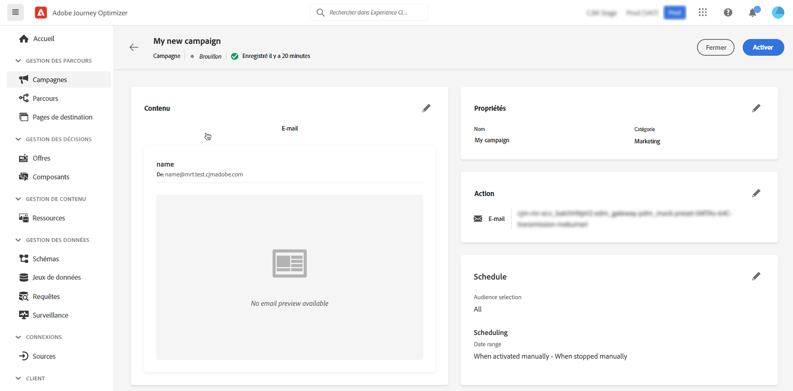

# Créer une campagne {#create-campaign}

>[!NOTE]
>
>Avant de créer une campagne, assurez-vous d’avoir un paramètre de message prédéfini et un segment Adobe Experience Platform prêt à l’emploi. En savoir plus dans ces sections :
>
>* [Création de préréglages de message](../configuration/message-presets.md)
>* [Prise en main des segments](../segment/about-segments.md)

## Configurer une campagne {#configure}

Les étapes de création d&#39;une opération sont les suivantes :

1. Accédez au **[!UICONTROL Campagnes]** , puis cliquez sur **[!UICONTROL Créer une campagne]**.

   

<!--1. In the **[!UICONTROL Properties]** section, specify when you want to execute the campaign:

    * **[!UICONTROL Scheduled]**: execute the campaign immediately or on a specified date,
    * **[!UICONTROL API-triggered]**: execute the campaign using an API call. In this case, profiles to be targeted and triggers for actions need to be set via the API call.-->

1. Dans le **[!UICONTROL Actions]** , sélectionnez le canal et la surface du message (c’est-à-dire le paramètre prédéfini du message) à utiliser pour envoyer votre message.

   

1. Indiquez un titre et une description pour la campagne.

   <!--To test the content of your message, toggle the **[!UICONTROL Content experiment]** option on. This allows you to test multiple variables of a delivery on populations samples, in order to define which treatment has the biggest impact on the targeted population.[Learn more about content experiment](../campaigns/content-experiment.md).-->

   

1. Dans le **[!UICONTROL Actions]** , configurez le message à envoyer avec l&#39;opération :

   1. Cliquez sur le bouton **[!UICONTROL Modifier le contenu]** puis configurez et concevez votre message. [Découvrez comment configurer des messages](../messages/get-started-content.md).

      Une fois votre contenu prêt, cliquez sur la flèche pour revenir à l&#39;écran de création de la campagne.

      

   1. Dans le **[!UICONTROL Suivi des actions]** , indiquez si vous souhaitez suivre la réaction de vos destinataires à votre diffusion.

      Les résultats du tracking seront accessibles à partir du rapport de l&#39;opération, une fois l&#39;opération exécutée. [En savoir plus sur les rapports de campagne](campaign-global-report.md)

      

1. Définissez l’audience à cibler. Pour ce faire, cliquez sur le bouton **[!UICONTROL Sélection de l’audience]** pour afficher la liste des segments Adobe Experience Platform disponibles. [En savoir plus sur les segments](../segment/about-segments.md)

   

   <!--By default, the targeted audience for in-app messages includes all the users of the selected mobile application.-->

   Dans le **[!UICONTROL Espace de noms d’identité]** , choisissez l’espace de noms à utiliser pour identifier les individus du segment sélectionné. [En savoir plus sur les espaces de noms](../event/about-creating.md#select-the-namespace)

   

   >[!NOTE]
   >
   >Les personnes appartenant à un segment qui n’a pas l’identité sélectionnée (espace de noms) parmi leurs différentes identités ne seront pas ciblées par la campagne. <!--info vue dans section journeys, read segment-->

   <!--If you are creating a campaign to send an in-app message, you can choose how and when the message will be shown to the audience using existing mobile app triggers.-->
   <!-- where are triggers configured?-->

1. Configurez les dates de début et de fin de la campagne.

   Par défaut, les campagnes sont configurées pour démarrer une fois qu’elles sont activées manuellement et pour se terminer dès que le message a été envoyé une fois.

1. De plus, vous pouvez paramétrer une fréquence d&#39;exécution de l&#39;action paramétrée dans l&#39;opération.

   

Une fois votre campagne prête, vous pouvez la passer en revue et la publier (voir [Révision et activation d’une campagne](#review-activate)).

## Révision et activation d’une campagne {#review-activate}

Une fois votre campagne configurée, vous devez revoir son paramètre et son contenu avant de l&#39;activer. Pour ce faire, procédez comme suit :

1. Dans l&#39;écran de configuration de l&#39;opération, cliquez sur **[!UICONTROL Réviser pour activer]** pour afficher un résumé de l&#39;opération.

   Le résumé vous permet de modifier votre campagne si nécessaire et de vérifier si un paramètre est incorrect ou manquant.

   >[!IMPORTANT]
   >
   >En cas d&#39;erreur, vous ne pourrez pas activer la campagne. Résolvez les erreurs avant de continuer.

   

1. Vérifiez que votre campagne est correctement configurée, puis cliquez sur **[!UICONTROL Activer]**.

   

1. La campagne est maintenant activée et contient la variable **[!UICONTROL En direct]** status (ou **[!UICONTROL Planifié]**  si vous avez spécifié une date de début). [En savoir plus sur les statuts des campagnes](get-started-with-campaigns.md#statuses)

   Le message paramétré dans l&#39;opération est exécuté immédiatement ou à la date indiquée.

   >[!NOTE]
   >
   >Une fois qu&#39;une campagne a été activée, elle conserve le statut &quot;En ligne&quot; même après l&#39;exécution du message. Pour modifier son état, vous devez l’arrêter manuellement. [Découvrez comment arrêter une campagne](modify-stop-campaign.md)

1. Une fois qu&#39;une campagne a été activée, vous pouvez vérifier à tout moment ses informations en l&#39;ouvrant. Le résumé vous permet d’obtenir des statistiques sur le nombre de profils ciblés et les actions diffusées et en échec.

   Vous pouvez également obtenir des statistiques supplémentaires dans les rapports dédiés en cliquant sur le bouton **[!UICONTROL Rapports]** bouton . [En savoir plus](campaign-global-report.md)

   

   >[!IMPORTANT]
   >
   >Les messages créés dans les campagnes sont spécifiques à [!DNL Journey Optimizer] fonctionnalités de campagne. Une fois créés, ils sont accessibles à partir des campagnes uniquement et ne s’affichent pas dans la variable **[!UICONTROL Messages]** .