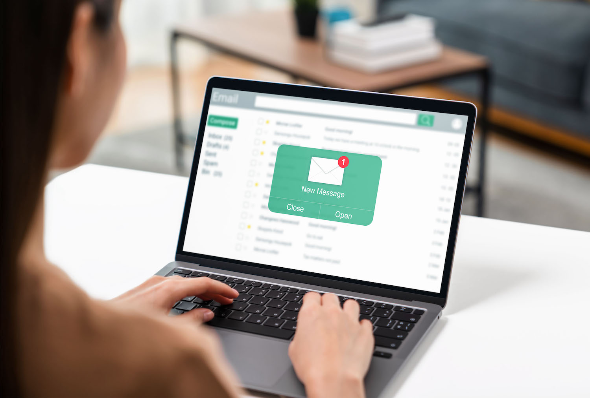

# Créer une campagne {#create-campaign}

>[!NOTE]
>
>Avant de créer une campagne, assurez-vous de disposer d’un canal de surface (c’est-à-dire un préréglage de message) et d’un segment Adobe Experience Platform prêt à l’emploi. En savoir plus dans ces sections :
>
>* [Création de surfaces de canal](../configuration/channel-surfaces.md)
>* [Prise en main des segments](../segment/about-segments.md)

## Créer votre première campagne {#create}

1. Accédez au menu **[!UICONTROL Campagnes]**, puis cliquez sur **[!UICONTROL Créer une campagne]**.

   >[!NOTE]
   >
   >Vous pouvez également dupliquer une campagne active existante pour en créer une nouvelle. [En savoir plus](modify-stop-campaign.md#duplicate)

   

1. Dans le **[!UICONTROL Propriétés]** , indiquez comment exécuter l’opération :

   * **[!UICONTROL Planifié]**
   * **[!UICONTROL déclenché par l’API]**

   Pour plus d&#39;informations sur le type d&#39;opération et les interventions associées, reportez-vous à cette section [section](#campaigntype).

1. Dans la section **[!UICONTROL Actions]**, choisissez le canal et la surface de canal à utiliser pour envoyer votre message, puis cliquez sur **[!UICONTROL Créer]**.

   Une surface est une configuration définie par un [administrateur système](../start/path/administrator.md). Elle contient tous les paramètres techniques relatifs à l’envoi du message, tels que les paramètres d’en-tête, le sous-domaine, les applications mobiles, etc. [En savoir plus](../configuration/channel-surfaces.md).

   

   >[!NOTE]
   >
   >Seules les surfaces de canal compatibles avec le type de campagne marketing sont répertoriées dans la liste déroulante.

1. Indiquez un titre et une description pour la campagne.

   <!--To test the content of your message, toggle the **[!UICONTROL Content experiment]** option on. This allows you to test multiple variables of a delivery on populations samples, in order to define which treatment has the biggest impact on the targeted population.[Learn more about content experiment](../campaigns/content-experiment.md).-->

1. Pour attribuer des étiquettes d’utilisation des données personnalisées ou de base à la campagne, cliquez sur le bouton **[!UICONTROL Gérer l’accès]**. [En savoir plus sur le contrôle d’accès au niveau de l’objet (OLA)](../administration/object-based-access.md)

## Créer le message {#content}

Dans le **[!UICONTROL Actions]** , créez le message à envoyer avec la campagne.

1. Cliquez sur le bouton **[!UICONTROL Modifier le contenu]** , puis créez et concevez le contenu de votre message.

   Découvrez les étapes détaillées pour créer le contenu de votre message dans les pages suivantes :

   <table style="table-layout:fixed">
    <tr style="border: 0;">
    <td>
    
    
<a href="../email/create-email.md"><strong>Créer des e-mails</strong>
    

    

    </td>
    <td>
    
    

    <a href="../push/create-push.md"><strong>Créer des notifications push</strong></a>
    

    

    </td>
    <td>
    
    

    <a href="../sms/create-sms.md"><strong>Création de SMS</strong></a>
    

    

    </td>
    </tr>
    </table>

1. Une fois votre contenu défini, cliquez sur le bouton **[!UICONTROL Simuler du contenu]** pour prévisualiser et tester votre contenu avec des profils de test. [En savoir plus](../email/preview.md).

1. Cliquez sur la flèche pour revenir à l’écran de création de la campagne.

   

1. Dans la section **[!UICONTROL Tracking des actions]**, indiquez si vous souhaitez suivre la réaction des destinataires à votre diffusion : vous pouvez effectuer le suivi des clics et/ou des ouvertures.

   Les résultats du suivi seront accessibles dans le rapport de la campagne, une fois celle-ci exécutée. [En savoir plus sur les rapports de campagne](../reports/campaign-global-report.md)

## Définition de l’audience {#audience}

1. Définissez l’audience à cibler. Pour ce faire, cliquez sur le bouton **[!UICONTROL Sélectionner l’audience]** pour afficher la liste des segments Adobe Experience Platform disponibles. [En savoir plus sur les segments](../segment/about-segments.md)

   >[!NOTE]
   >
   >Pour les campagnes déclenchées par API, l’audience doit être définie via un appel API. [En savoir plus](api-triggered-campaigns.md)

   Dans le champ **[!UICONTROL Espace de noms d’identité]**, choisissez l’espace de noms à utiliser pour identifier les personnes à partir du segment sélectionné. [En savoir plus sur les espaces de noms](../event/about-creating.md#select-the-namespace)

   

   >[!NOTE]
   >
   >Les individus appartenant à un segment qui n’a pas l’identité sélectionnée (espace de nommage) parmi leurs différentes identités ne seront pas ciblés par la campagne.

   <!--If you are are creating an API-triggered campaign, the **[!UICONTROL cURL request]** section allows you to retrieve the **[!UICONTROL Campaign ID]** to use in the API call. [Learn more](api-triggered-campaigns.md)-->

## Planification de la campagne {#schedule}

1. Pour exécuter votre campagne à une date spécifique ou à une fréquence récurrente, configurez la section **[!UICONTROL Planifier]**. [Découvrez comment planifier des campagnes](#schedule)

1. Pour attribuer des étiquettes d’utilisation des données personnalisées ou de base à la campagne, cliquez sur le bouton **[!UICONTROL Gérer l’accès]**. [En savoir plus sur le contrôle d’accès au niveau de l’objet (OLA)](../administration/object-based-access.md)

Une fois votre campagne prête, vous pouvez la réviser et la publier. [En savoir plus](#review-activate)

## Type de campagne {#campaigntype}

>[!CONTEXTUALHELP]
>id="ajo_campaigns_campaign_type"
>title="Type de campagne"
>abstract="TBC"

>[!CONTEXTUALHELP]
>id="ajo_campaigns_campaign_category"
>title="Catégorie de campagne"
>abstract="TBC"

Deux types de campagne sont disponibles :

* **[!UICONTROL Planifié]** : permet d’exécuter immédiatement la campagne ou à une date spécifiée. Les campagnes planifiées visent à envoyer des messages de type **marketing**.

* **[!UICONTROL Déclenché par API]** : permet d’exécuter la campagne à l’aide d’un appel API. Les campagnes déclenchées par API sont destinées à envoyer des messages **transactionnels**, c’est-à-dire des messages envoyés suite à une action effectuée par un individu : réinitialisation du mot de passe, abandon de panier, etc. [Découvrez comment déclencher une campagne à l’aide d’API](api-triggered-campaigns.md)
