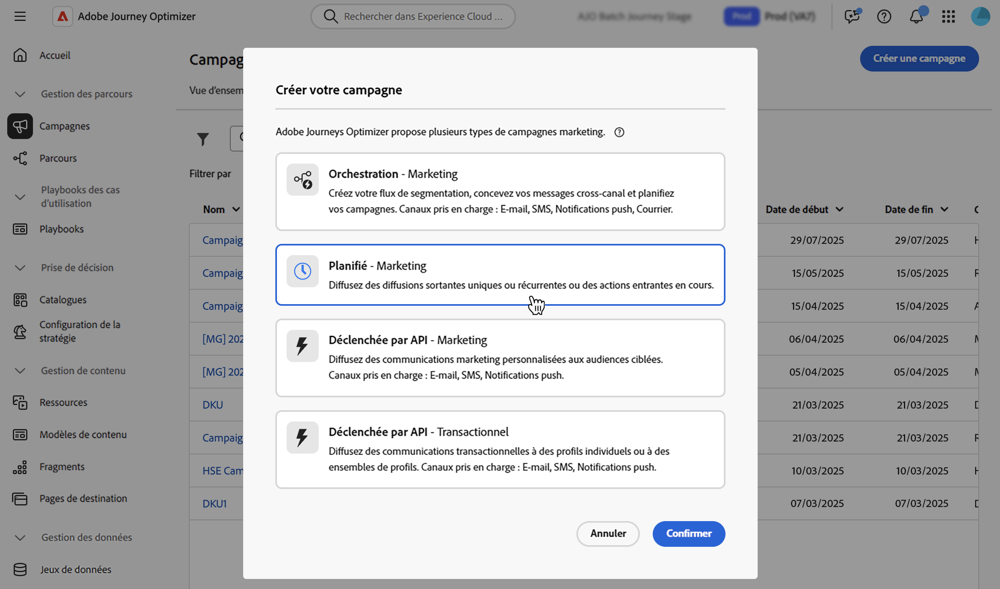

# Créer une campagne {#create-campaign}

>[!NOTE]
>
>Avant de créer une campagne, assurez-vous de disposer d’une configuration de canal (c’est-à-dire une surface de message) et d’une audience Adobe Experience Platform prête à l’emploi. En savoir plus dans ces sections :
>
>* [Créer des configurations de canal](../configuration/channel-surfaces.md)
>* [Commencer avec les audiences](../audience/about-audiences.md)

Pour créer une campagne, accédez au menu **[!UICONTROL Campagnes]**, puis cliquez sur **[!UICONTROL Créer une campagne]**. Vous pouvez également dupliquer une campagne active existante pour en créer une nouvelle. [En savoir plus](modify-stop-campaign.md#duplicate)

## Choisir le type de campagne {#campaigntype}

>[!CONTEXTUALHELP]
>id="ajo_campaigns_campaign_type"
>title="Type de campagne"
>abstract="Les **campagnes planifiées** sont exécutées immédiatement ou à une date spécifiée et sont destinées à envoyer des messages de type marketing. Les campagnes **déclenchées par API** sont exécutées à l’aide d’un appel API. Elles sont destinées à envoyer soit des messages marketing (messages promotionnels nécessitant le consentement de la personne), soit des messages transactionnels (messages non commerciaux, qui peuvent également être envoyés à des profils désabonnés dans des contextes spécifiques)."

>[!CONTEXTUALHELP]
>id="ajo_campaigns_campaign_category"
>title="Catégorie de campagne"
>abstract="Si vous créez une campagne planifiée, le type **marketing** est automatiquement sélectionné. Pour les campagnes déclenchées par l’API, choisissez si vous souhaitez envoyer un message **marketing** (message promotionnel nécessitant le consentement de la personne) ou un message **transactionnel** (message non commercial, qui peut également être envoyé à des profils désabonnés dans des contextes spécifiques)."

1. Sélectionner le type de campagne que vous souhaitez exécuter.

   * **[!UICONTROL Scheduled - Marketing]** : permet d’exécuter la campagne immédiatement ou à une date spécifiée. Les campagnes planifiées visent à envoyer des messages de **marketing**. Elles sont configurées et exécutées à partir de l’interface d’utilisation.

   * **[!UICONTROL API-triggered - Marketing/Transactional]** : permet d’exécuter la campagne à l’aide d’un appel API. Les campagnes déclenchées par API sont destinées à envoyer des messages **marketing**, ou **transactionnels**, c’est-à-dire des messages envoyés suite à une action effectuée par une personne : réinitialisation du mot de passe, abandon de panier, etc. [Découvrez comment déclencher une campagne à l’aide d’API](api-triggered-campaigns.md)

   

1. Cliquez sur **[!UICONTROL Créer]** pour créer la campagne.

## Définir les propriétés de la campagne {#create}

1. Dans la section **[!UICONTROL Propriétés]**, indiquez un nom et une description pour la campagne.

   <!--To test the content of your message, toggle the **[!UICONTROL Content experiment]** option on. This allows you to test multiple variables of a delivery on populations samples, in order to define which treatment has the biggest impact on the targeted population.[Learn more about content experiment](../content-management/content-experiment.md).-->

1. Le champ **Balises** vous permet d’affecter des balises unifiées Adobe Experience Platform à votre campagne. Vous pouvez ainsi facilement les classer et améliorer la recherche à partir de la liste des campagnes. [Découvrir comment utiliser les balises](../start/search-filter-categorize.md#tags)

1. Pour attribuer des étiquettes d’utilisation des données personnalisées ou de base à la campagne, cliquez sur le bouton **[!UICONTROL Gérer l’accès]**. [En savoir plus sur le contrôle d’accès au niveau de l’objet (OLA)](../administration/object-based-access.md)

## Définir l’audience de la campagne {#audience}

Définissez la population ciblée par la campagne en suivant les étapes suivantes :

>[!IMPORTANT]
>
>L’utilisation d’audiences et d’attributs provenant de la [composition de l’audience](../audience/get-started-audience-orchestration.md) et du [chargement personnalisé (fichier CSV)](https://experienceleague.adobe.com/docs/experience-platform/segmentation/ui/overview.html?lang=fr#import-audience) n’est actuellement pas disponible avec Healthcare Shield ou Privacy and Security Shield.
>
>Pour les campagnes déclenchées par API, l’audience doit être définie via un appel d’API.

1. Dans la section **Audience**, cliquez sur le bouton **[!UICONTROL Sélectionner une audience]** pour afficher la liste des audiences Adobe Experience Platform disponibles. [En savoir plus sur les audiences](../audience/about-audiences.md)

1. Dans le champ **[!UICONTROL Espace de noms d’identité]**, choisissez l’espace de noms à utiliser pour identifier les personnes à partir du segment sélectionné.

   Les individus appartenant à un segment qui n’a pas l’identité sélectionnée (espace de noms) parmi leurs différentes identités ne seront pas ciblés par la campagne. [En savoir plus sur les espaces de noms](../event/about-creating.md#select-the-namespace)

   

   <!--If you are are creating an API-triggered campaign, the **[!UICONTROL cURL request]** section allows you to retrieve the **[!UICONTROL Campaign ID]** to use in the API call. [Learn more](api-triggered-campaigns.md)-->

## Créer le message et configurer le suivi {#content}

1. Dans la section **[!UICONTROL Actions]**, sélectionnez ou créez une configuration.

   Celle-ci est définie par une [équipe d’administration système](../start/path/administrator.md). Elle contient tous les paramètres techniques relatifs à l’envoi du message, tels que les paramètres d’en-tête, le sous-domaine, les applications mobiles, etc. [En savoir plus](../configuration/channel-surfaces.md).

   Seules les configurations de canal compatibles avec le type de campagne marketing sont répertoriées dans la liste déroulante.

   

   >[!NOTE]
   >
   >Si vous créez une campagne de notification push, vous pouvez activer le **[!UICONTROL Mode de diffusion rapide]**, qui est un module complémentaire Journey Optimizer permettant d’envoyer des messages push très rapidement et en grandes quantités. [En savoir plus](../push/create-push.md#rapid-delivery).

1. Cliquez sur le bouton **[!UICONTROL Modifier le contenu]** pour créer et concevoir votre message. Découvrez les étapes détaillées pour créer le contenu de votre message dans les pages suivantes :

   <table style="table-layout:fixed">
    <tr style="border: 0;">
    <td>
    
    
<a href="../email/create-email.md"><strong>Créer des e-mails</strong>
    

    

    </td>
    <td>
    
    

    <a href="../push/create-push.md"><strong>Créer des notifications push</strong></a>
    

    

    </td>
    <td>
    
    

    <a href="../sms/create-sms.md"><strong>Créer des SMS</strong></a>
    

    

    </td>
    </tr>
    </table>

1. Une fois votre contenu défini, cliquez sur le bouton **[!UICONTROL Simuler du contenu]** pour prévisualiser et tester votre contenu avec des profils de test. [En savoir plus](../content-management/preview-test.md).

1. Cliquez sur la flèche pour revenir à l’écran de création de la campagne.

   

1. Dans la section **[!UICONTROL Tracking des actions]**, indiquez si vous souhaitez suivre la réaction des destinataires à votre diffusion : vous pouvez effectuer le suivi des clics et/ou des ouvertures.

   Les résultats du suivi seront accessibles dans le rapport de la campagne, une fois celle-ci exécutée. [En savoir plus sur les rapports de campagne](../reports/campaign-global-report.md)

## Planifier la campagne {#schedule}

>[!CONTEXTUALHELP]
>id="ajo_campaigns_schedule"
>title="Planning de la campagne"
>abstract="Par défaut, les campagnes démarrent lors d’une activation manuelle et se terminent immédiatement après l’envoi du message. Vous avez toutefois la possibilité de définir une date et une heure spécifiques pour l’envoi du message. De plus, vous pouvez spécifier une date de fin pour les campagnes récurrentes ou déclenchées par l’API. Dans les déclencheurs d’action, vous pouvez également configurer la fréquence d’envoi des messages en fonction de vos préférences."

>[!CONTEXTUALHELP]
>id="ajo_campaigns_schedule_start"
>title="Début de campagne"
>abstract="Indiquez la date et l’heure auxquelles le message doit être envoyé."

>[!CONTEXTUALHELP]
>id="ajo_campaigns_schedule_end"
>title="Fin de campagne"
>abstract="Indiquez à quel moment une campagne récurrente doit cesser d’être exécutée."

>[!CONTEXTUALHELP]
>id="ajo_campaigns_schedule_triggers"
>title="Déclencheurs d’action de campagne"
>abstract="Vous pouvez définir la fréquence d’envoi du message de la campagne."

Par défaut, les campagnes démarrent une fois qu’elles ont été activées manuellement et se terminent dès que le message a été envoyé une fois.

Vous pouvez définir la fréquence d’envoi du message de la campagne. Pour ce faire, utilisez la méthode **[!UICONTROL Déclencheurs d’action]** dans l’écran de création de la campagne pour indiquer si la campagne doit être exécutée tous les jours, toutes les semaines ou tous les mois.

Si vous ne souhaitez pas exécuter votre campagne juste après son activation, vous pouvez spécifier la date et l’heure auxquelles le message doit être envoyé à l’aide de l’option **[!UICONTROL Début de campagne]**. L’option **[!UICONTROL Fin de campagne]** permet de spécifier le moment où une campagne récurrente doit cesser d’être exécutée.

Une fois votre campagne prête, vous pouvez la réviser et la publier. [En savoir plus](review-activate-campaign.md)
