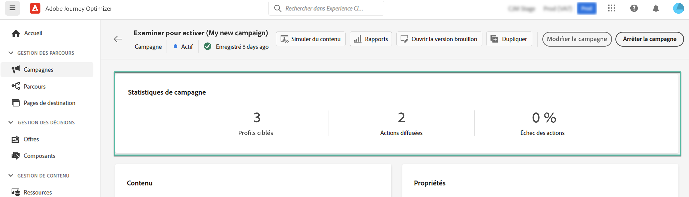

# Créer une campagne {#create-campaign}

>[!NOTE]
>
>Avant de créer une campagne, assurez-vous de disposer d’un canal de surface (c’est-à-dire un préréglage de message) et d’un segment Adobe Experience Platform prêt à l’emploi. En savoir plus dans ces sections :
>
>* [Création de surfaces de canal](../configuration/channel-surfaces.md)
>* [Prise en main des segments](../segment/about-segments.md)

Suivez les étapes de création dʼune campagne décrites ci-après :

1. Accédez au menu **[!UICONTROL Campagnes]**, puis cliquez sur **[!UICONTROL Créer une campagne]**.

   

   >[!NOTE]
   >
   >Vous pouvez également dupliquer une campagne active existante pour en créer une nouvelle. [En savoir plus](modify-stop-campaign.md#duplicate) <!-- check if only live campaigns-->

<!--1. In the **[!UICONTROL Properties]** section, specify when you want to execute the campaign:

    * **[!UICONTROL Scheduled]**: execute the campaign immediately or on a specified date. Scheduled campaigns are aimed at sending **marketing** type messages.
    * **[!UICONTROL API-triggered]**: execute the campaign using an API call. API-triggered campaigns are aimed at sending **transactional** messages, i.e. messages sent out following an action performed by an individual: password reset, card abandonment etc. [Learn how to trigger a campaign using APIs](api-triggered-campaigns.md)-->

1. Dans la section **[!UICONTROL Actions]**, choisissez le canal et la surface de canal à utiliser pour envoyer votre message, puis cliquez sur **[!UICONTROL Créer]**.

   

   Une surface est une configuration définie par un [administrateur système](../start/path/administrator.md). Elle contient tous les paramètres techniques relatifs à l’envoi du message, tels que les paramètres d’en-tête, le sous-domaine, les applications mobiles, etc. [En savoir plus](../configuration/channel-surfaces.md).

   >[!NOTE]
   >
   >Seules les surfaces de canal compatibles avec le type de campagne (marketing ou transactionnel) sont répertoriées dans la liste déroulante.

1. Indiquez un titre et une description pour la campagne.

   <!--To test the content of your message, toggle the **[!UICONTROL Content experiment]** option on. This allows you to test multiple variables of a delivery on populations samples, in order to define which treatment has the biggest impact on the targeted population.[Learn more about content experiment](../campaigns/content-experiment.md).-->

1. Dans la section **[!UICONTROL Actions]**, configurez le message à envoyer avec la campagne :

   1. Cliquez sur le bouton **[!UICONTROL Modifier le contenu]**, puis configurez et concevez le contenu de votre message. [En savoir plus sur les messages](../messages/get-started-content.md).

      Découvrez les étapes détaillées pour créer le contenu de votre message dans la page suivante :

      * [Création d&#39;un e-mail](../messages/create-email.md)
      * [Créer des notification push](../messages/create-push.md)
      * [Créer un SMS](../messages/create-sms.md)
   1. Une fois votre contenu défini, utilisez **[!UICONTROL Simulation du contenu]** pour prévisualiser et tester votre contenu avec des profils de test. [En savoir plus](../design/preview.md).
   1. Cliquez sur la flèche pour revenir à l&#39;écran de création de la campagne.

      

   1. Dans le **[!UICONTROL Suivi des actions]** , indiquez si vous souhaitez suivre la réaction des destinataires à votre diffusion : vous pouvez effectuer le suivi des clics et/ou des ouvertures.

      Les résultats du suivi seront accessibles dans le rapport de la campagne, une fois celle-ci exécutée. [En savoir plus sur les rapports de campagne](../reports/campaign-global-report.md)

1. Définissez l’audience à cibler. Pour ce faire, cliquez sur le bouton **[!UICONTROL Sélectionner l’audience]** pour afficher la liste des segments Adobe Experience Platform disponibles. [En savoir plus sur les segments](../segment/about-segments.md)

   <!-- NOTE For API-triggered campaigns, the audience needs to be set via API call. [Learn more](api-triggered-campaigns.md)-->

   Dans le champ **[!UICONTROL Espace de noms d’identité]**, choisissez l’espace de noms à utiliser pour identifier les personnes à partir du segment sélectionné. [En savoir plus sur les espaces de noms](../event/about-creating.md#select-the-namespace)

   

   >[!NOTE]
   >
   >Les individus appartenant à un segment qui n’a pas l’identité sélectionnée (espace de noms) parmi leurs différentes identités ne seront pas ciblés par la campagne.

1. Configurez le planning de votre campagne dans les champs Dates de début et de fin . Par défaut, les campagnes démarrent une fois qu’elles sont activées manuellement et se terminent dès que le message a été envoyé une seule fois.

1. De plus, vous pouvez indiquer une fréquence d’exécution de l’action paramétrée dans la campagne.

   <!-- NOTE For API-triggered campaigns, scheduling at a specific date and time with recurrence is not available as action is triggered via API. However, start and end date are relevant to ensure that, if an API call is made prior of after the window, then those get errored.-->

   

<!--1. If you are are creating an API-triggered campaign, the **[!UICONTROL cURL request]** section allows you to retrieve the **[!UICONTROL Campaign ID]** to use in the API call. [Learn more](api-triggered-campaigns.md)-->

Une fois votre campagne prête, vous pouvez la réviser et la publier. [En savoir plus](#review-activate);

## Examiner et activer une campagne {#review-activate}

Une fois votre campagne configurée, vous devez passer en revue son paramètre et son contenu avant de l’activer. Pour ce faire, procédez comme suit :

1. Dans l’écran de configuration de la campagne, cliquez sur **[!UICONTROL Examiner pour activer]** pour afficher un résumé de la campagne.

   Le résumé vous permet de modifier votre campagne si nécessaire et de vérifier si un paramètre est incorrect ou manquant.

   >[!IMPORTANT]
   >
   >En cas d&#39;erreur, vous ne pouvez pas activer la campagne. Résolvez les erreurs avant de continuer.

   

1. Vérifiez que votre campagne est correctement configurée, puis cliquez sur **[!UICONTROL Activer]**.

   

1. La campagne est maintenant activée. Son état est : **[!UICONTROL En direct]** ou **[!UICONTROL Planifié]** si vous avez saisi une date de début. [En savoir plus sur les statuts des campagnes](get-started-with-campaigns.md#statuses).

   Le message paramétré dans l&#39;opération est envoyé immédiatement ou à la date indiquée.

   >[!NOTE]
   >
   >Le **[!UICONTROL Terminé]** est automatiquement affecté à une campagne 3 jours après son activation ou à la date de fin de la campagne si son exécution est récurrente.
   >
   >Si aucune date de fin n’a été spécifiée, la campagne conserve la variable **[!UICONTROL En direct]** statut. Pour le modifier, vous devez arrêter manuellement la campagne. [Découvrez comment arrêter une campagne](modify-stop-campaign.md)

1. Une fois qu’une campagne a été activée, vous pouvez vérifier à tout moment ses informations en l’ouvrant. Le résumé vous permet d’obtenir des statistiques sur le nombre de profils ciblés et les actions diffusées et en échec.

   Vous pouvez également obtenir des statistiques supplémentaires dans les rapports dédiés en cliquant sur le bouton **[!UICONTROL Rapports]**. [En savoir plus](../reports/campaign-global-report.md)

   
