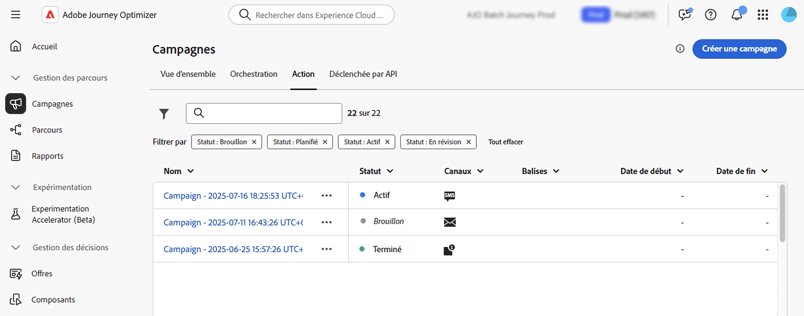
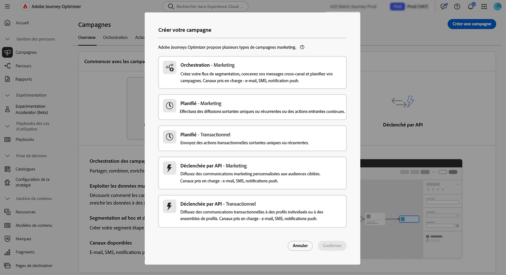

# Commencer avec les campagnes {#get-started-campaigns}

>[!CONTEXTUALHELP]
>id="ajo_campaigns_schedule"
>title="Planning de la campagne"
>abstract="Par défaut, les campagnes démarrent via une activation manuelle et se terminent immédiatement après un seul envoi du message. Vous avez la possibilité de définir une date et une heure spécifiques pour l’envoi du message. De plus, vous pouvez spécifier une date de fin pour les campagnes d’action récurrentes. Dans les déclencheurs d’action, vous pouvez également configurer la fréquence d’envoi des messages en fonction de vos préférences."

>[!CONTEXTUALHELP]
>id="ajo_campaigns_schedule_start"
>title="Début de campagne"
>abstract="Indiquez la date et l’heure auxquelles le message doit être envoyé."

>[!CONTEXTUALHELP]
>id="ajo_campaigns_schedule_end"
>title="Fin de campagne"
>abstract="Indiquez à quel moment une campagne récurrente doit cesser d’être exécutée."

>[!CONTEXTUALHELP]
>id="ajo_campaigns_schedule_triggers"
>title="Déclencheurs d’action de campagne"
>abstract="Vous pouvez définir la fréquence d’envoi du message de la campagne."

>[!CONTEXTUALHELP]
>id="ajo_campaigns_throttling"
>title="Contrôle des taux"
>abstract="Définissez le contrôle des taux pour votre campagne en spécifiant les limites de taux souhaitées. Cette fonctionnalité est particulièrement utile pour éviter la surcharge sur les systèmes en aval, tels que les pages de destination ou les plateformes d’assistance clientèle."

>[!CONTEXTUALHELP]
>id="ajo_homepage_card3"
>title="Créer des campagnes"
>abstract="Utilisez **Adobe Journey Optimizer** pour diffuser du contenu ponctuel sur une audience spécifique à l’aide de divers canaux. Lors de l’utilisation de parcours, les actions sont exécutées à la suite. Avec les campagnes, les actions sont exécutées simultanément, immédiatement ou selon un planning spécifié."

>[!CONTEXTUALHELP]
>id="campaigns_list"
>title="Campagnes"
>abstract="Créez des campagnes pour diffuser du contenu ponctuel à une audience spécifique sur différents canaux. Avant de créer votre campagne, assurez-vous de disposer d’une configuration de canal et d’une audience Adobe Experience Platform prête à l’emploi."

>[!CONTEXTUALHELP]
>id="ajo_campaigns_campaign_type"
>title="Type de campagne"
>abstract="Sélectionnez le type de la campagne. Les canaux disponibles varient en fonction du type sélectionné.  **Campagnes planifiées** (campagnes d’action) : idéales pour les communications par lots, simples et ponctuelles, que vous pouvez planifier pour qu’elles s’exécutent à une heure spécifique. **Campagnes déclenchées par API** : activées par le biais d’un appel API, elles permettent d’envoyer des messages automatisés et basés sur un événement, directement depuis des systèmes externes. **Campagnes orchestrées** : fournissent une zone de travail visuelle par glisser-déposer pour concevoir et automatiser des workflows marketing complexes et à plusieurs étapes, depuis la segmentation d’audience jusqu’à la diffusion de messages personnalisés sur plusieurs canaux."

>[!CONTEXTUALHELP]
>id="ajo_campaigns_create_orchestration"
>title="Campagnes"
>abstract="Créez votre flux de segmentation, concevez vos messages cross-canal et planifiez vos campagnes. Canaux pris en charge : e-mail, SMS, notification push."

>[!CONTEXTUALHELP]
>id="ajo_campaigns_create_scheduled_marketing"
>title="Campagnes"
>abstract="Effectuez des diffusions sortantes uniques ou récurrentes ou des actions entrantes continues."

>[!CONTEXTUALHELP]
>id="ajo_campaigns_create_scheduled_transactional"
>title="Campagnes"
>abstract="Envoyez des actions transactionnelles sortantes uniques ou récurrentes."

>[!CONTEXTUALHELP]
>id="ajo_campaigns_create_api_marketing"
>title="Campagnes"
>abstract="Diffusez des communications marketing personnalisées aux audiences ciblées. Canaux pris en charge : e-mail, SMS, notifications push."

>[!CONTEXTUALHELP]
>id="ajo_campaigns_create_api_transactional"
>title="Campagnes"
>abstract="Diffusez des communications transactionnelles à des profils individuels ou à des ensembles de profils. Canaux pris en charge : e-mail, SMS, notifications push."

Adobe Journey Optimizer vous permet de diffuser du contenu ciblé et unique à des audiences spécifiques sur plusieurs canaux. Grâce aux campagnes, vous pouvez exécuter simultanément des actions marketing coordonnées et envoyer au bon moment à votre audience le message approprié.

Ce guide fournit une feuille de route claire pour vous aider à comprendre les principes de base des campagnes, à choisir le type de campagne approprié à votre cas d’utilisation et à concevoir en toute confiance des campagnes qui offrent des expériences client percutantes.

## Que sont les campagnes ?

Les **campagnes** sont des actions marketing coordonnées qui diffusent du contenu à une audience spécifique sur un ou plusieurs canaux. Contrairement aux parcours où les actions s’exécutent de manière séquentielle, les campagnes exécutent des actions simultanément, immédiatement ou selon un planning défini.

Utilisez [!DNL Journey Optimizer] pour :

* Diffuser du **contenu unique ou récurrent** aux segments ciblés d’audience.
* Exécutez **communications multicanaux coordonnées** par e-mail, notification push, SMS, in-app, web, etc
* Déclencher des **réponses automatisées** via des appels d’API pour une messagerie en temps réel pilotée par les événements
* Conception **workflows marketing complexes** avec des outils d’orchestration visuels

➡️ **Prêt à commencer la création ?** [Créez votre première campagne](create-campaign.md) en quelques minutes.

## Choisir le type de campagne {#campaign-types}

**Avant de commencer la création**, il est important de comprendre quel type de campagne correspond à votre cas d’utilisation. Adobe Journey Optimizer prend en charge trois types de campagnes, chacun conçu pour différents scénarios et mécanismes d’activation :

>[!BEGINTABS]

>[!TAB Campagnes d’action (planifiées)]

**Utilisation :** communications par lots simples et planifiées

Les **campagnes d’action** (également appelées campagnes planifiées) sont idéales pour les communications par lots simples, ponctuelles ou récurrentes qui s’exécutent à un moment spécifique.

**Deux catégories :**

* **Marketing** - Offres promotionnelles, campagnes d’engagement, annonces, informations juridiques ou mises à jour de politiques. Les destinataires doivent être inscrits.
* **Transactionnel** - Perturbations, urgences, annulations. Ne nécessite pas d’opt-in.

**Idéal pour** : newsletters mensuelles destinées aux segments clients, annonces promotionnelles sensibles au facteur temps, campagnes marketing saisonnières, communications de lancement de produit et notifications d’interruption de service.

➡️ [En savoir plus sur les campagnes Action](create-campaign.md)

>[!TAB Campagnes déclenchées par API]

**Utilisation :** messagerie en temps réel pilotée par les événements avec les systèmes externes

**Campagnes déclenchées par API** activez par le biais d’appels d’API, ce qui active la messagerie automatisée directement à partir de systèmes externes. Ces campagnes prennent en charge la personnalisation à l’aide des attributs de profil et des données contextuelles en temps réel de la payload de l’API.

**Deux catégories :**

* **Marketing** - Communications marketing personnalisées destinées à des audiences ciblées
* **Transactionnel** - Messages suivant des actions individuelles (réinitialisations de mot de passe, achats de panier, etc.)

**Parfait pour :** les confirmations de réinitialisation du mot de passe, la récupération de l’abandon de panier, les confirmations de commande et les mises à jour d’expédition, les notifications d’activité de compte et les recommandations personnalisées en temps réel.

➡️ [En savoir plus sur les campagnes déclenchées par API](api-triggered-campaigns.md)

>[!TAB Campagnes orchestrées]

**Utilisation :** workflows marketing complexes et à plusieurs étapes

**Campagnes orchestrées** fournissez une zone de travail visuelle par glisser-déposer pour concevoir et automatiser des workflows marketing sophistiqués. De la segmentation de l’audience à la diffusion personnalisée des messages sur plusieurs canaux, tout se passe dans un environnement intuitif conçu pour la vitesse et le contrôle.

**Idéal pour** programmes d’engagement client à plusieurs étapes, les stratégies de ciblage et de segmentation complexes, l’orchestration de campagnes cross-canal, le marketing à l’échelle initié par la marque et l’automatisation avancée des workflows avec plusieurs points de décision.

➡️ [En savoir plus sur les campagnes orchestrées](../orchestrated/gs-orchestrated-campaigns.md)

>[!ENDTABS]

>[!NOTE]
>
>Vous ne savez pas quel type choisir ? Commencez par les **campagnes d’action** pour les communications par lots planifiées ou les **campagnes déclenchées par l’API** pour la messagerie en temps réel. Elles couvrent la plupart des cas d’utilisation courants.

## Workflow de création de campagne {#workflow}

La création de campagnes réussies suit un processus clair et reproductible. Votre workflow détaillé est le suivant :

**1. Plan** → **2. Configurez** → **3. Conception** → **4. Révision** → **5. Activer** → **6. Surveiller**

### &#x200B;1. Planifier votre campagne {#plan}

Avant de commencer, clarifiez vos objectifs :

* **Quel est l&#39;objectif ?** (par exemple, stimuler les conversions, augmenter l’engagement, avertir les clients)
* **Qui est l&#39;audience ?** (par exemple, créer ou sélectionner à partir de Adobe Experience Platform)
* **Quel type de campagne convient ?** (voir [types de campagne](#campaign-types) ci-dessus)
* **Quels canaux allez-vous utiliser ?** (e-mail, notification push, SMS, in-app, web, etc.) → [Voir les canaux pris en charge par type de campagne](../channels/gs-channels.md#channels)
* **Quand doit-il s’exécuter ?** (immédiat, planifié ou déclenché par API)

### &#x200B;2. Configurer les propriétés de la campagne {#configure}

Configurez les bases de votre campagne :

1. **Nommez et décrivez** votre campagne pour une identification facile.
2. **Sélectionner le type de campagne** (Action, Déclenché par API ou Orchestré)
3. **Choisissez votre audience**
4. **Définir la priorité** si vous utilisez la gestion des conflits
5. **Configurer le planning** (pour les campagnes d’action) ou les détails de l’API (pour les campagnes déclenchées par API)

**Guides spécifiques aux types :** [Propriétés de la campagne d’action](campaign-properties.md) | [Propriétés de campagne déclenchées par API](api-triggered-campaign-properties.md) | [Configuration de campagne orchestrée](../orchestrated/create-orchestrated-campaign.md)

### &#x200B;3. Concevoir le contenu {#design}

Créez des messages attrayants pour votre audience :

* Utiliser le **Designer d’e-mail** pour des expériences d’e-mail riches
* Configuration des **notifications push** avec des images et des liens profonds
* Concevoir des **SMS/MMS** avec personnalisation
* Créer des expériences **in-app** et **web**
* Ajouter **personnalisation** à l’aide des attributs de profil et des données contextuelles

**Guides spécifiques aux types :** [Contenu d’action de campagne](campaign-content.md) | [Contenu de campagne déclenché par API](api-triggered-campaign-content.md) | [ Contenu de campagne orchestré ](../orchestrated/create-orchestrated-campaign.md)

### &#x200B;4. Examen et test {#review}

Examinez toujours votre campagne avant l’activation :

* **Prévisualisation du contenu** avec des profils de test
* **Vérifier le ciblage** pour vous assurer de la bonne audience
* **Vérifier le planning** et les paramètres d’activation
* **Demande d’approbation** si vous utilisez le workflow d’approbation
* **Tester la délivrabilité** avec des listes de contrôle

**Guides spécifiques aux types :** [Consultez les campagnes Action](review-activate-campaign.md) | [Vérification des campagnes déclenchées par l’API](review-activate-api-triggered-campaign.md) | [Vérifier les campagnes orchestrées](../orchestrated/create-orchestrated-campaign.md)

### &#x200B;5. Activer votre campagne {#activate}

Une fois la révision terminée, activez votre campagne :

* **Activation manuelle** - Activer immédiatement ou à l’heure prévue
* **Activation d’API** - Pour les campagnes déclenchées par API, utilisez le point d’entrée d’activation
* **Processus d’approbation** - Si nécessaire, attendez l’approbation des parties prenantes
* Remarque : les campagnes actives ne peuvent pas être modifiées (vous devez les dupliquer pour apporter des modifications)

**Guides spécifiques aux types :** [Activer des campagnes d’action](review-activate-campaign.md) | [Activer des campagnes déclenchées par API](review-activate-api-triggered-campaign.md) | [Activer des campagnes orchestrées](../orchestrated/create-orchestrated-campaign.md)

### &#x200B;6. Surveiller et analyser {#monitor}

Suivez les performances de votre campagne :

* Affichage des rapports et des analyses de campagne
* Surveiller les taux de diffusion et les mesures d’engagement
* Suivi des erreurs et des bounces
* Analyse de la conversion et du retour sur investissement
* Utiliser des informations pour l’optimisation

**Guides spécifiques aux types :** [Rapports de campagne d’action](../reports/campaign-global-report-cja.md) | [Surveillance de campagne déclenchée par API](api-triggered-campaigns.md#monitor) | [Analyse de campagne orchestrée](../orchestrated/create-orchestrated-campaign.md)

➡️ **Prêt à démarrer ?** Choisissez votre type de campagne :
* [Créer un → de campagne d’action](create-campaign.md)
* [Créer des → de campagne déclenchées par API](api-triggered-campaigns.md)
* [Créer des → de campagne orchestrées](../orchestrated/gs-orchestrated-campaigns.md)

## Conditions préalables {#prerequisites}

Avant d’utiliser des campagnes, vérifiez que les éléments suivants sont en place :

### Configuration requise

* **Audiences** - Les audiences doivent être disponibles dans Adobe Experience Platform avant de créer des campagnes. [Prise en main des audiences →](../audience/about-audiences.md)

* **Configurations de canal** - Les configurations de canal (préréglages) doivent être créées et disponibles pour les canaux que vous souhaitez utiliser. [Configurez les configurations de canal →](../configuration/channel-surfaces.md)

* **Autorisations** - Vous avez besoin des autorisations appropriées en fonction du type de campagne. Contactez votre administrateur si vous ne pouvez pas accéder aux fonctionnalités de Campaign. [En savoir plus sur les rôles intégrés →](../administration/ootb-product-profiles.md)

  | Type de campagne | Autorisations |
  |----------------------------|----------------------------------------------------------------------------|
  | **Campagnes d’action** | Administrateur ou administratrice de campagne Approbateur ou approbatrice de campagne Responsable de campagne Observateur ou observatrice de campagne |
  | **Campagnes déclenchées par API** | Administrateur ou administratrice de campagne Approbateur ou approbatrice de campagne Responsable de campagne Observateur ou observatrice de campagne |
  | **Campagnes orchestrées** | Administrateur ou administratrice de campagne orchestrée Approbateur ou approbatrice de campagne orchestrée Responsable de campagne orchestrée Observateur ou observatrice de campagne orchestrée |

+++Attribuer des autorisations de campagne

1. Accédez à l’onglet **[!UICONTROL Rôles]** dans le produit [!DNL Permissions] et sélectionnez l’un des **[!UICONTROL Rôles]** intégrés liés à la campagne.

   1. Dans l’onglet **[!UICONTROL Utilisateurs et utilisatrices]**, cliquez sur **[!UICONTROL Ajouter un utilisateur ou une utilisatrice]**.

   1. Saisissez le nom ou l’adresse e-mail de votre utilisateur ou utilisatrice, ou sélectionnez cette personne dans la liste, puis cliquez sur **[!UICONTROL Enregistrer]**.

   Si le profil de l’utilisateur ou de l’utilisatrice n’a pas été créé auparavant, consultez la [documentation relative à l’ajout d’utilisateurs et d’utilisatrices](https://experienceleague.adobe.com/fr/docs/experience-platform/access-control/ui/users){target="_blank"}.

   La personne doit alors recevoir un e-mail la redirigeant vers votre instance.

   +++

## Fonctionnalités de Campaign {#capabilities}

À mesure que vous vous familiarisez avec les campagnes, explorez ces puissantes fonctionnalités :

:::: landing-cards-container

:::

**Planification et minutage**

Planifiez des campagnes à des dates/heures spécifiques, définissez des diffusions récurrentes et optimisez les heures d’envoi pour un impact maximal. (Campagnes déclenchées par action et API)

[En savoir plus sur la planification](campaign-schedule.md)
:::

:::

**Contrôle de débit**

Limitez le débit des messages pour éviter la surcharge sur les systèmes en aval tels que les pages de destination ou les plateformes d’assistance clientèle. (Campagnes déclenchées par action et API)

[Limites de débit de contrôle](create-campaign.md)
:::

:::

**Ciblage des audiences**

Ciblez des audiences Adobe Experience Platform spécifiques avec précision et gérez les qualifications d’audience de manière dynamique.

[Sélectionner une audience de campagne](campaign-audience.md)
:::

:::

**Workflows d’approbation**

Mettez en œuvre des processus de révision et de validation avant la mise en ligne des campagnes, en garantissant la qualité et la conformité. (Campagnes déclenchées par action et API)

[Vérifier et activer](review-activate-campaign.md)
:::

:::

**Heures calmes**

Respectez les préférences du client en évitant la diffusion de messages pendant les fenêtres temporelles spécifiées. (Campagnes déclenchées par action et API)

[Configuration des heures de silence](quiet-hours.md)
:::

:::

**Optimisation**

Utilisez les règles de ciblage et les expériences de contenu pour diffuser du contenu personnalisé et optimiser l’engagement.

[Optimiser les campagnes](campaigns-message-optimization.md)
:::

::::

## Prise en main des types de campagne {#get-started-types}

Maintenant que vous comprenez les campagnes dans [!DNL Journey Optimizer], choisissez votre type de campagne pour commencer :

<table style="table-layout:fixed"><tr style="border: 0; text-align: center;">
<td> <a href="create-campaign.md">Campagnes d’action</a></td>
<td> <a href="api-triggered-campaigns.md">Campagnes déclenchées par API</a></td>
<td><a href="../orchestrated/gs-orchestrated-campaigns.md">Campagnes orchestrées</a></td>
</tr></table>
