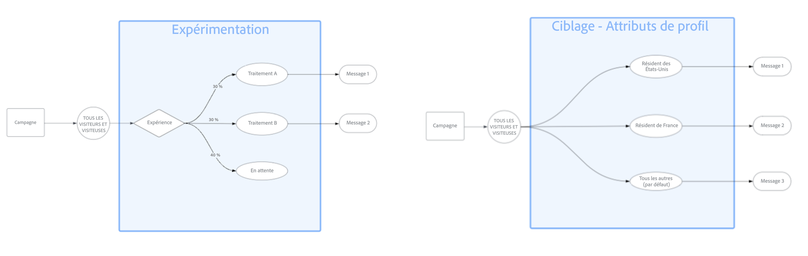

# Prise en main de l’optimisation du contenu {#message-optimization}

>[!CONTEXTUALHELP]
>id="ajo_campaigns_content_optimization"
>title="Optimisation du contenu"
>abstract="L’optimisation du contenu dans Journey Optimizer vous permet de tester différentes versions de votre contenu et de déterminer celle qui fonctionne le mieux. Vous pouvez utiliser le ciblage pour diffuser du contenu personnalisé à des segments spécifiques, procéder à des expériences pour tester plusieurs variations ou combiner les deux approches pour obtenir des stratégies d’optimisation sophistiquées."

L’optimisation du contenu vous fournit les outils nécessaires pour transmettre le message approprié à la bonne audience au bon moment. En associant des informations basées sur les données à de puissantes fonctionnalités de personnalisation, vous pouvez optimiser l’engagement et les conversions dans vos campagnes et parcours.

L’optimisation du contenu est disponible dans les deux parcours [campagnes](../campaigns/create-campaign.md) et [&#128279;](../building-journeys/journey-gs.md), ce qui vous permet d’appliquer les mêmes stratégies d’optimisation à tous les points de contact de vos clients.

➡️ [Découvrez comment exploiter l’optimisation du contenu dans une campagne dans cette vidéo](#video)

## Fonctionnalités d’optimisation {#capabilities}

Grâce à l’optimisation du contenu dans Journey Optimizer, vous pouvez :

* [Utilisez le ciblage](optimization-targeting.md) pour diffuser du contenu personnalisé à des segments d’audience spécifiques en fonction des attributs de profil, des données contextuelles ou de l’appartenance à une audience.

* [Exécutez des expériences](optimization-experimentation.md) pour tester plusieurs variations de contenu et identifier celle qui fonctionne le mieux en fonction de vos mesures de succès.

* [Combinez les deux approches](optimization-combination.md) afin de créer des stratégies d’optimisation sophistiquées, dans lesquelles vous testez différentes variations pour chaque segment ciblé.

## Ciblage et expérimentation {#targeting-vs-experimentation}

Comprendre la différence entre le ciblage et l’expérimentation vous permet de choisir l’approche d’optimisation adaptée à vos objectifs.

Le **ciblage** utilise des règles déterministes pour diffuser du contenu personnalisé à des segments spécifiques en fonction d’attributs de profil connus, du contexte ou de l’appartenance à une audience. Cela permet de s’assurer que le message approprié atteint la bonne audience.

**Expérimentation** utilise l’affectation aléatoire pour tester plusieurs variations de contenu et découvrir celle qui fonctionne le mieux. Il vous permet d’apprendre ce qui résonne le plus avec votre audience par le biais de tests pilotés par les données.

Le tableau ci-dessous résume les principales différences :

| Fonctionnalité | Ciblage | Expérimentation |
|--------|-----------|-----------------|
| **Méthode d&#39;affectation** | Déterministe : basé sur des règles | Aléatoire - en fonction de l’affectation du trafic |
| **Basé sur** | Attributs de profil, contexte, audiences | Distribution aléatoire |
| **Cas d’utilisation** | Diffusion de contenu pertinent vers des segments connus | Identifier le contenu le plus performant |
| **Exemple** | Afficher différentes promotions par emplacement | Testez 2 lignes d’objet pour voir lesquelles obtiennent le plus d’ouvertures. |
| **Idéal pour** | Personalization à grande échelle | Optimisation et apprentissage |

{width="110%" zoomable="yes"}

## Cas d’utilisation courants {#use-cases}

Voici quelques scénarios classiques dans lesquels l’optimisation du contenu peut vous aider à obtenir de meilleurs résultats :

Ciblage :

* **Géociblage** - Envoyez des offres spécifiques à un emplacement en fonction de l’emplacement de vos clients. Par exemple, faites la promotion des manteaux d&#39;hiver dans les régions plus froides et des maillots de bain dans les climats plus chauds.

* **Optimisation de l’appareil** - Diffusez du contenu spécifique à l’appareil, tel que des dispositions optimisées pour les ordinateurs de bureau et des dispositions optimisées pour les appareils mobiles pour les utilisateurs de smartphones.

Expérimentation :

* **Test A/B** - Testez différents objets d’e-mail, boutons call-to-action ou offres promotionnelles pour identifier ceux qui génèrent le plus de conversions.

* **Marketing tout au long du cycle de vie** - Testez différents messages d’intégration pour les nouveaux clients par rapport aux offres de rétention pour les clients existants.

Combinaison :

* **Segmentation avancée** - Ciblez les clients par niveau de fidélité et testez différents messages de récompense au sein de chaque niveau afin d’optimiser l’engagement sur tous les segments.

## Commencer {#get-started}

Pour commencer à optimiser votre contenu :

1. **Création d’une campagne ou d’un parcours** : configurez votre [campagne](../campaigns/create-campaign.md) ou [parcours &#x200B;](../building-journeys/journey-gs.md) et ajoutez au moins une action.

1. **Choisissez votre approche d’optimisation** :
   * [Utilisez le ciblage](optimization-targeting.md) pour personnaliser le contenu pour des segments spécifiques.
   * [Utilisez l’expérimentation](optimization-experimentation.md) pour tester plusieurs variations.
   * [Combinez les deux](optimization-combination.md) pour une optimisation avancée.

1. **Définir votre contenu** : créez les différentes variations de contenu pour votre stratégie d’optimisation.

1. **Activer et surveiller** : lancez votre campagne ou votre parcours optimisé et suivez les performances dans les [rapports](../reports/campaign-global-report-cja.md).

## Fonctionnement {#how-it-works}

Une fois votre parcours ou campagne actif, les profils sont évalués en fonction des critères que vous avez définis. En fonction de ces évaluations, chaque profil reçoit la version de contenu la plus appropriée :

1. **Évaluation des profils** - Lorsqu’un profil rejoint votre campagne ou votre parcours, Journey Optimizer évalue ses attributs et son contexte.

1. **Affectation de contenu** - Selon votre configuration d’optimisation :
   * Pour le **ciblage**, les profils répondant à des critères spécifiques reçoivent le contenu personnalisé correspondant.
   * Pour l’**expérimentation**, les profils sont affectés de manière aléatoire à différentes variations de contenu en fonction de vos paramètres d’affectation du trafic.
   * Pour les **combinaisons**, les profils correspondent d’abord à une règle de ciblage, puis sont attribués de manière aléatoire à l’une des variations d’expérience pour ce segment.

1. **Suivi des performances** - Journey Optimizer effectue automatiquement le suivi des mesures d’engagement et des données de conversion pour vous aider à identifier le contenu qui présente les meilleures performances.

## Vidéo pratique {#video}

Découvrez comment tirer parti de l’optimisation du contenu dans les campagnes déclenchées par l’API ou l’action. Vous découvrirez comment cibler des sous-audiences, créer des variations de messages en fonction de la localisation, activer un contenu de secours et mener plusieurs expériences au sein d’une même campagne. Ce tutoriel explique également comment gérer des campagnes à plusieurs canaux, tout en maintenant la cohérence du message.

>[!VIDEO](https://video.tv.adobe.com/v/3470368?quality=12)

**Rubriques connexes**

* [Créer une campagne](../campaigns/create-campaign.md)
* [Créer un parcours](../building-journeys/journey-gs.md)
* [Expérience de contenu](../content-management/get-started-experiment.md)
