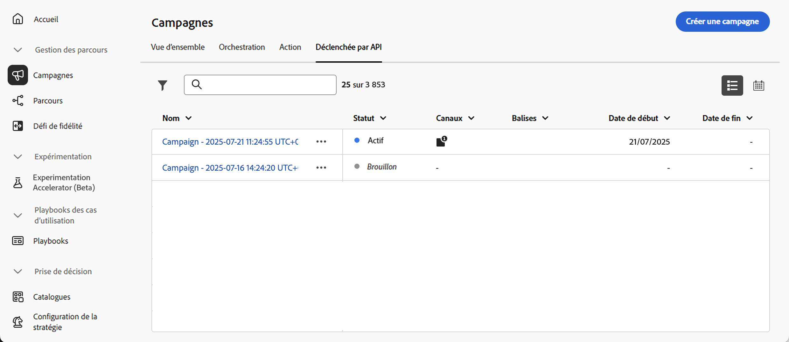
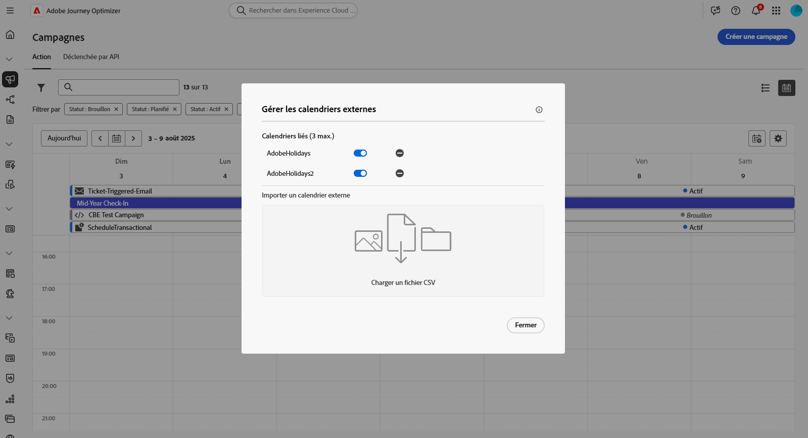
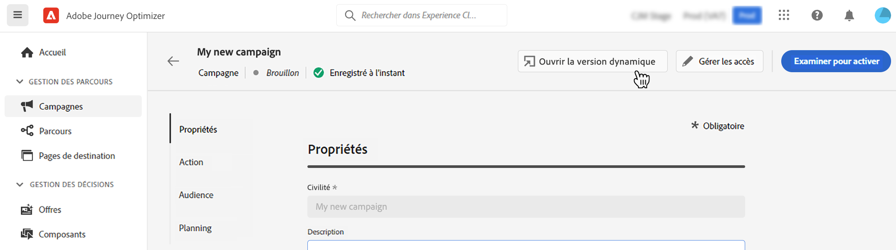
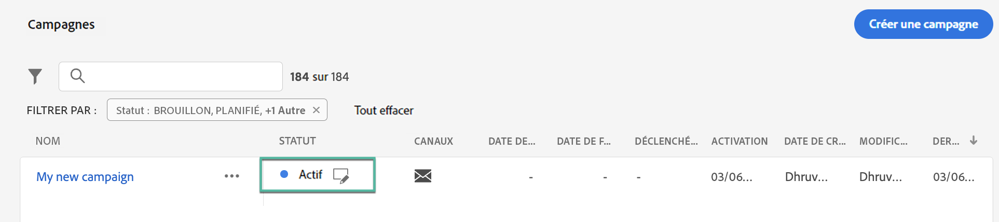

# Accéder aux campagnes et les gérer {#manage-campaigns}

>[!CONTEXTUALHELP]
>id="ajo_targeting_workflow_list"
>title="Inventaire des campagnes orchestrées"
>abstract="Dans cet écran, vous pouvez accéder à la liste complète des campagnes orchestrées, vérifier leur statut actuel, les dates de dernière exécution et de prochaine exécution, et créer une campagne orchestrée."

>[!CONTEXTUALHELP]
>id="ajo_orchestration_campaign_action"
>title="Action"
>abstract="Cette section répertorie toutes les actions utilisées dans la campagne orchestrée."

Les campagnes sont accessibles à partir du menu **[!UICONTROL Campagnes]**. Utilisez les onglets pour parcourir les campagnes par type : campagnes d’**action**, campagnes **déclenchées par API** et campagnes **orchestrées**. En savoir plus sur les [types de campagne](get-started-with-campaigns.md#get-started-campaigns). Les types disponibles dépendent de votre contrat de licence et de vos autorisations.

>[!BEGINTABS]

>[!TAB Campagnes d’action]

Sélectionnez l’onglet **[!UICONTROL Action]** pour accéder à la liste de toutes les campagnes d’action.

Par défaut, toutes les campagnes dont le statut est **[!UICONTROL Brouillon]**, **[!UICONTROL Planifié]** et **[!UICONTROL Actif]** sont répertoriées dans la liste. Pour afficher les campagnes arrêtées, terminées et archivées, vous devez supprimer le filtre.

>[!TAB Campagnes déclenchées par API]

Sélectionnez l’onglet **[!UICONTROL Déclenchement par API]** pour accéder à la liste des campagnes déclenchées par API.

Par défaut, toutes les campagnes dont le statut est **[!UICONTROL Brouillon]**, **[!UICONTROL Planifié]** et **[!UICONTROL Actif]** sont répertoriées dans la liste. Pour afficher les campagnes arrêtées, terminées et archivées, vous devez supprimer le filtre.

>[!TAB Campagnes orchestrées]

Sélectionnez l’onglet **[!UICONTROL Orchestration]** pour accéder à la liste de toutes les campagnes orchestrées.

{zoomable="yes"}{zoomable="yes"}

Chaque campagne orchestrée figurant dans la liste affiche des informations telles que le [statut](#status) actuel de la campagne, le canal et les balises associés ou la dernière fois qu’elle a été modifiée. Vous pouvez personnaliser les colonnes affichées en cliquant sur le bouton .

>[!ENDTABS]

Une barre de recherche et des filtres sont également disponibles pour faciliter la recherche dans la liste. Vous pouvez par exemple filtrer les campagnes afin de n’afficher que celles associées à un canal ou une balise en particulier ou celles créées au cours d’une période spécifique.

Le bouton  dans l’inventaire des campagnes permet d’effectuer les différentes opérations présentées ci-dessous.

* **[!UICONTROL Afficher le rapport complet]**/**[!UICONTROL Afficher le rapport des dernières 24 heures]** : accédez aux rapports pour mesurer et visualiser l’impact et les performances de vos campagnes. En savoir plus sur les [rapports de campagne](../reports/campaign-global-report-cja.md).
* **[!UICONTROL Modifier les balises]** : modifiez les balises associées à la campagne. Découvrez comment [utiliser des balises dans vos campagnes](../start/search-filter-categorize.md#add-tags).
* **[!UICONTROL Dupliquer]** : vous aurez éventuellement besoin de dupliquer une campagne, par exemple pour exécuter une campagne orchestrée qui a été arrêtée. [En savoir plus](#duplicate-a-campaign)
* **[!UICONTROL Supprimer]** : utilisez cette option pour supprimer une campagne. [En savoir plus](#delete-a-campaign)
* **[!UICONTROL Archiver]** : archivez la campagne. Toutes les campagnes archivées sont supprimées selon un nouveau planning progressif 30 jours après la date de leur dernière modification. Cette action est disponible pour toutes les campagnes, à l’exception des **[!UICONTROL brouillons]** de campagnes. En savoir plus sur les [archives de campagne](#archive-a-campaign).

Pour les campagnes déclenchées par une action et par une API, les actions supplémentaires ci-dessous sont disponibles :

* **[!UICONTROL Ajouter au package]** : ajoutez la campagne à un package pour l’exporter vers un autre sandbox. Découvrez comment [exporter des objets vers un autre sandbox](../configuration/copy-objects-to-sandbox.md).
* **[!UICONTROL Ouvrir la version brouillon]** : si une nouvelle version de la campagne a été créée et n’a pas encore été activée, vous pouvez accéder à sa version brouillon à l’aide de cette action.

## Cycle de vie des campagnes {#statuses}

Dans Adobe Journey Optimizer, chaque campagne passe par un cycle de vie reflété par son statut dans l’interface. Les statuts disponibles varient en fonction du type de campagne : Action, Déclenchée par API ou Orchestrée. Utilisez les onglets ci-dessous pour explorer le cycle de vie et les statuts spécifiques à chaque type de campagne.

>[!BEGINTABS]

>[!TAB Campagnes d’action]

* **[!UICONTROL Brouillon]** : la campagne est en cours de modification, elle n’a pas été activée.
* **[!UICONTROL Planifié]** : la campagne a été configurée pour être activée à une date de début spécifique.
* **[!UICONTROL Actif]** : la campagne est active.
* **[!UICONTROL En cours de vérification]** : la campagne a été soumise pour approbation afin d’être publiée. [Découvrir comment utiliser les approbations](../test-approve/gs-approval.md)
* **[!UICONTROL Arrêté]** : la campagne a été arrêtée manuellement. Vous ne pouvez plus l’activer ni la réutiliser. [Découvrez comment arrêter une campagne.](manage-campaigns.md#stop)
* **[!UICONTROL Terminé]** : la campagne est terminée. Ce statut est automatiquement attribué 3 jours après l’activation d’une campagne, ou à la date de fin de la campagne si son exécution est récurrente.
* **[!UICONTROL Échec]** : l’exécution de la campagne a échoué. Vérifiez les journaux pour identifier le problème.
* **[!UICONTROL Archivé]** : la campagne a été archivée. [Découvrez comment archiver des campagnes.](manage-campaigns.md#archive)

>[!NOTE]
>
>L’icône « Ouvrir la version brouillon » en regard d’un statut **[!UICONTROL Actif]** ou **[!UICONTROL Planifié]** indique qu’une nouvelle version de la campagne déclenchée par une action ou une API a été créée et n’a pas encore été activée.

>[!TAB Campagnes déclenchées par API]

* **[!UICONTROL Brouillon]** : la campagne est en cours de modification, elle n’a pas été activée.
* **[!UICONTROL Planifié]** : la campagne a été configurée pour être activée à une date de début spécifique.
* **[!UICONTROL Actif]** : la campagne est active.
* **[!UICONTROL En cours de vérification]** : la campagne a été soumise pour approbation afin d’être publiée. [Découvrir comment utiliser les approbations](../test-approve/gs-approval.md)
* **[!UICONTROL Arrêté]** : la campagne a été arrêtée manuellement. Vous ne pouvez plus l’activer ni la réutiliser. [Découvrez comment arrêter une campagne.](manage-campaigns.md#stop)
* **[!UICONTROL Terminé]** : la campagne est terminée. Ce statut est automatiquement attribué 3 jours après l’activation d’une campagne, ou à la date de fin de la campagne si son exécution est récurrente.
* **[!UICONTROL Échec]** : l’exécution de la campagne a échoué. Vérifiez les journaux pour identifier le problème.
* **[!UICONTROL Archivé]** : la campagne a été archivée. [Découvrez comment archiver des campagnes.](manage-campaigns.md#archive)

>[!NOTE]
>
>L’icône « Ouvrir la version brouillon » en regard d’un statut **[!UICONTROL Actif]** ou **[!UICONTROL Planifié]** indique qu’une nouvelle version de la campagne déclenchée par une action ou une API a été créée et n’a pas encore été activée.

>[!TAB Campagnes orchestrées]

* **[!UICONTROL Brouillon]** : la campagne orchestrée a été créée. Elle n’a pas encore été publiée.
* **[!UICONTROL Publication]** : la campagne orchestrée est en cours de publication.
* **[!UICONTROL Actif]** : la campagne orchestrée a été publiée et est en cours d’exécution.
* **[!UICONTROL Planifié]** : l’exécution de la campagne orchestrée a été planifiée.
* **[!UICONTROL Terminé]** : l’exécution de la campagne orchestrée est terminée. Le statut Terminé est automatiquement attribué jusqu’à 3 jours après qu’une campagne a terminé l’envoi des messages sans erreur.
* **[!UICONTROL Fermé]** : ce statut s’affiche lorsqu’une campagne récurrente a été fermée. La campagne continue de s’exécuter jusqu’à ce que toutes ses activités soient terminées, mais plus aucun profil ne peut entrer dans la campagne.
* **[!UICONTROL Archivé]** : la campagne orchestrée a été archivée. Toutes les campagnes archivées sont supprimées selon un nouveau planning progressif 30 jours après la date de la dernière modification. Si nécessaire, vous pouvez dupliquer une campagne archivée pour continuer à travailler dessus.
* **[!UICONTROL Arrêté]** : l’exécution de la campagne orchestrée a été arrêtée. Pour redémarrer la campagne, vous devez la dupliquer.

>[!ENDTABS]

Lorsqu’une erreur se produit dans l’une de vos campagnes, une icône d’avertissement s’affiche avec le statut de la campagne. Cliquez dessus pour afficher les informations relatives à l’alerte. Ces alertes peuvent se produire dans différentes situations, par exemple lorsque le message de la campagne n’a pas été publié ou si la configuration choisie est incorrecte.

## Calendrier des campagnes {#calendar}

>[!CONTEXTUALHELP]
>id="ajo_campaigns_view"
>title="Vues Liste et Calendrier des campagnes"
>abstract="Outre la liste des campagnes, [!DNL Journey Optimizer] fournit une vue Calendrier de vos campagnes, ce qui apporte une représentation visuelle claire de leurs plannings. Vous pouvez basculer entre les vues Liste et Calendrier à tout moment à l’aide de ces boutons."

Outre la liste des campagnes, [!DNL Journey Optimizer] fournit une vue de calendrier de vos campagnes, ce qui offre une représentation visuelle claire de leur planning.

Représentation des campagnes :

* Par défaut, la grille de calendrier affiche toutes les campagnes actives et planifiées pour la semaine sélectionnée. D’autres options de filtre peuvent afficher les activations complétées, arrêtées et terminées, ou bien les activations d’un certain type ou d’un certain canal.
* Les brouillons de campagne ne s’affichent pas.
* Les campagnes s’étendant sur plusieurs jours s’affichent en haut de la grille du calendrier.
* Si aucune heure de début n’est spécifiée, l’heure d’activation manuelle la plus proche est utilisée pour la positionner dans le calendrier.
* Les campagnes s’affichent sous la forme de périodes d’une heure, mais cela ne reflète pas l’heure d’envoi ou d’achèvement réelle.

Pour naviguer dans le calendrier des campagnes :

1. Cliquez sur l’icône de  pour accéder à votre calendrier des campagnes.

1. Utilisez les boutons fléchés ou le sélecteur de date au-dessus du calendrier pour passer d’une semaine à l’autre.

   Le calendrier affiche toutes les campagnes planifiées pour la semaine en cours.

   

1. Cliquez sur l’icône d’ pour activer ou désactiver l’affichage des éléments qui s’étendent sur plusieurs jours ou plusieurs semaines.

   

1. Cliquez sur l’icône  pour gérer et ajouter jusqu’à trois calendriers externes.

   

1. Effectuez un glisser-déposer de vos fichiers CSV contenant les noms des événements, les dates de début et les dates de fin.

   Les événements chargés s’affichent pour l’ensemble des utilisateurs et utilisatrices de votre organisation et sur les calendriers des parcours et campagnes.

   +++Le format CSV doit être le suivant :

   | Colonne1 | Colonne2 | Colonne3 |
   |-|-|-|
   | Nom de l’événement | Date de début au format mm/jj/aa | Date de fin au format mm/jj/aa |

   +++

1. Si nécessaire, vous pouvez masquer, afficher ou supprimer les calendriers externes ajoutés.

   

1. Pour plus d’informations sur une campagne, cliquez sur son bloc visuel afin d’afficher les détails correspondants. Un volet d’informations s’ouvre avec diverses informations sur la campagne, telles que son type, l’accès aux rapports ou les balises qui ont été affectées.

   

## Modifier et arrêter des campagnes d’action récurrentes {#modify}

### Modifier une campagne d’action

Pour modifier et créer une nouvelle version d’une campagne d’action récurrente, procédez comme suit :

1. Ouvrez la campagne d’action, puis cliquez sur le bouton **[!UICONTROL Modifier la campagne]**.

1. Une nouvelle version de la campagne est créée. Vous pouvez vérifier la version active en cliquant sur **[!UICONTROL Ouvrir la version active]**.

   

   Dans la liste des campagnes, les campagnes activées avec un brouillon en cours s’affichent avec une icône spécifique dans la colonne **[!UICONTROL Statut]**. Cliquez sur cette icône pour ouvrir le brouillon de la campagne.

   

1. Une fois vos modifications prêtes, vous pouvez activer la nouvelle version de la campagne (voir [Vérification et activation d’une campagne](review-activate-campaign.md)).

   >[!IMPORTANT]
   >
   >L’activation du brouillon remplacera la version active de la campagne.

### Arrêter une campagne d’action {#stop}

Pour arrêter une campagne récurrente, ouvrez-la, puis cliquez sur le bouton **[!UICONTROL Arrêter la campagne]**.

>[!IMPORTANT]
>
>L’arrêt d’une campagne n’arrête pas un envoi continu, mais il arrête un envoi planifié ou les occurrences suivantes si l’envoi est déjà en cours.

## Archivage d’une campagne {#archive}

Avec le temps, la liste des campagnes ne cesse d’augmenter et il devient plus difficile de parcourir les campagnes terminées et arrêtées.

Pour éviter cela, vous pouvez archiver les campagnes terminées et arrêtées dont vous n’avez plus besoin. Pour ce faire, cliquez sur le bouton représentant des points de suspension, puis sélectionnez **[!UICONTROL Archiver]**.

Les campagnes archivées peuvent ensuite être récupérées à l’aide du filtre dédié dans la liste.

## Suprimer une campagne {#delete}

Pour supprimer une campagne, cliquez sur le bouton à trois points  puis sélectionnez **[!UICONTROL Supprimer]**.

{width="70%" align="left"}

>[!IMPORTANT]
>
>Cette option est disponible uniquement pour les **[!UICONTROL brouillons]** de campagnes.

## Dupliquer une campagne {#duplicate}

Pour dupliquer une campagne, par exemple si elle a été arrêtée, cliquez sur le bouton à trois points  et sélectionnez **[!UICONTROL Dupliquer]**.

Saisissez le nom de la campagne et confirmez.

La campagne est créée et ajoutée à la liste des campagnes.
