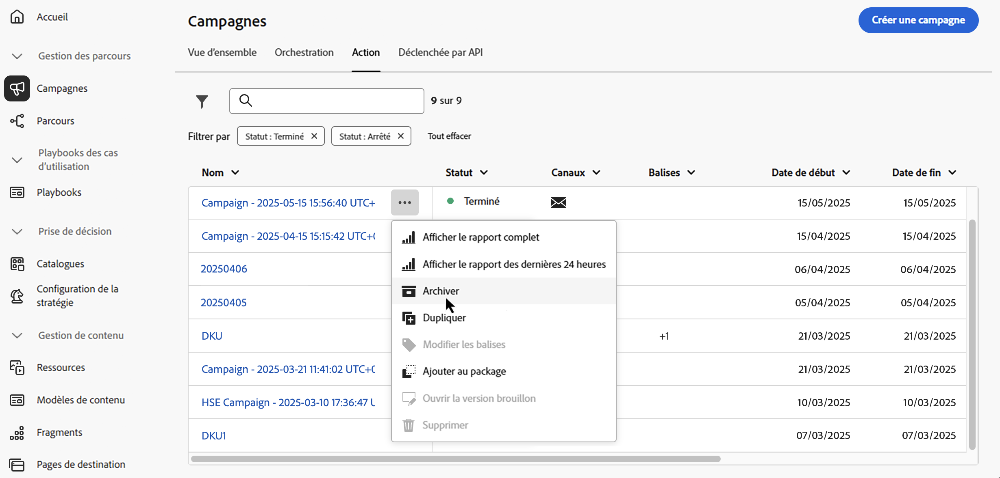

# Accéder aux campagnes et les gérer {#manage-campaigns}

>[!CONTEXTUALHELP]
>id="ajo_targeting_workflow_list"
>title="Inventaire des campagnes orchestrées"
>abstract="Dans cet écran, vous pouvez accéder à la liste complète des campagnes orchestrées, vérifier leur statut actuel, les dates de dernière exécution et de prochaine exécution, et créer une campagne orchestrée."

>[!CONTEXTUALHELP]
>id="ajo_orchestration_campaign_action"
>title="Action"
>abstract="Cette section répertorie toutes les actions utilisées dans la campagne orchestrée."

Découvrez comment accéder à vos campagnes, les organiser et les gérer dans Adobe Journey Optimizer. Ce guide couvre tous les aspects, de la recherche de campagnes à la compréhension des statuts, en passant par l’exécution d’opérations courantes et la maintenance de votre espace de travail Campaign.

>[!BEGINSHADEBOX]

**Accédez directement à ce dont vous avez besoin :**

* **Créer une campagne** - [Choisissez votre type de campagne](get-started-with-campaigns.md#campaign-types) | [Créer une campagne Action](create-campaign.md) | [Créer une campagne déclenchée par l’API](api-triggered-campaigns.md) | [Créer une campagne orchestrée](../orchestrated/gs-orchestrated-campaigns.md)
* **Rechercher des campagnes existantes** - [Rechercher et filtrer](#access)
* **Afficher les performances de la campagne** - [Rapports de campagne](../reports/campaign-global-report-cja.md)
* **Planifier des campagnes** - [Utiliser le calendrier](#calendar)
* **Gestion des conflits** - [Guide de gestion des conflits](../conflict-prioritization/gs-conflict-prioritization.md)

>[!ENDSHADEBOX]

## Accès aux campagnes et navigation dans celles-ci {#access}

Les campagnes sont accessibles à partir du menu **[!UICONTROL Campagnes]**. Utilisez les onglets pour parcourir les campagnes par type : campagnes d’**action**, campagnes **déclenchées par API** et campagnes **orchestrées**. En savoir plus sur les [types de campagne](get-started-with-campaigns.md#campaign-types). Les types disponibles dépendent de votre contrat de licence et de vos autorisations.

>[!BEGINTABS]

>[!TAB Campagnes d’action]

Sélectionnez l’onglet **[!UICONTROL Action]** pour accéder à la liste de toutes les campagnes d’action.

Par défaut, toutes les campagnes dont le statut est **[!UICONTROL Brouillon]**, **[!UICONTROL Planifié]** et **[!UICONTROL Actif]** sont répertoriées dans la liste. Pour afficher les campagnes arrêtées, terminées et archivées, vous devez supprimer le filtre.

>[!TAB Campagnes déclenchées par API]

Sélectionnez l’onglet **[!UICONTROL Déclenchement par API]** pour accéder à la liste des campagnes déclenchées par API.

Par défaut, toutes les campagnes dont le statut est **[!UICONTROL Brouillon]**, **[!UICONTROL Planifié]** et **[!UICONTROL Actif]** sont répertoriées dans la liste. Pour afficher les campagnes arrêtées, terminées et archivées, vous devez supprimer le filtre.

>[!TAB Campagnes orchestrées]

Sélectionnez l’onglet **[!UICONTROL Orchestration]** pour accéder à la liste de toutes les campagnes orchestrées.

{zoomable="yes"}

Chaque campagne orchestrée de la liste affiche des informations telles que le [statut](#statuses) actuel de la campagne, le canal et les balises associés ou la dernière fois qu’elle a été modifiée. Vous pouvez personnaliser les colonnes affichées en cliquant sur le bouton .

>[!ENDTABS]

### Rechercher et filtrer des campagnes {#search-filter}

Une barre de recherche et des filtres sont également disponibles pour faciliter la recherche dans la liste. Vous pouvez par exemple filtrer les campagnes afin de n’afficher que celles associées à un canal ou une balise en particulier ou celles créées au cours d’une période spécifique.

## Opérations de campagne {#operations}

L’image  dans l’inventaire des campagnes vous permet d’effectuer diverses opérations.

### Actions disponibles

**Pour tous les types de campagne :**

* **[!UICONTROL Afficher le rapport complet]**/**[!UICONTROL Afficher le rapport des dernières 24 heures]** : accédez aux rapports pour mesurer et visualiser l’impact et les performances de vos campagnes. [En savoir plus sur les rapports de campagne →](../reports/campaign-global-report-cja.md)
* **[!UICONTROL Modifier les balises]** : modifiez les balises associées à la campagne. [Découvrez comment utiliser les balises →](../start/search-filter-categorize.md#add-tags)
* **[!UICONTROL Dupliquer]** : vous aurez éventuellement besoin de dupliquer une campagne, par exemple pour exécuter une campagne orchestrée qui a été arrêtée. [En savoir plus sur la duplication de →](#duplicate-a-campaign)
* **[!UICONTROL Supprimer]** : utilisez cette option pour supprimer une campagne. [En savoir plus sur la suppression de →](#delete-a-campaign)
* **[!UICONTROL Archiver]** : archivez la campagne. Toutes les campagnes archivées sont supprimées selon un nouveau planning progressif 30 jours après la date de leur dernière modification. Cette action est disponible pour toutes les campagnes, à l’exception des **[!UICONTROL brouillons]** de campagnes. [En savoir plus sur les → d’archivage](#archive-a-campaign)

**Pour les campagnes déclenchées par action et API uniquement :**

* **[!UICONTROL Ajouter au package]** : ajoutez la campagne à un package pour l’exporter vers un autre sandbox. [Découvrez comment exporter des objets →](../configuration/copy-objects-to-sandbox.md)
* **[!UICONTROL Ouvrir la version brouillon]** : si une nouvelle version de la campagne a été créée et n’a pas encore été activée, vous pouvez accéder à sa version brouillon à l’aide de cette action.

**Pour les campagnes orchestrées uniquement :**

* **[!UICONTROL Retour au brouillon]** - Dépubliez et revenez à l’état de brouillon d’une campagne pour la récupération des erreurs. Cette action est disponible lorsqu’une campagne planifiée n’a pas encore démarré ou lorsqu’une campagne active rencontre une erreur avant que les exécutions ne soient terminées. [En savoir plus sur la restauration de campagnes →](../orchestrated/start-monitor-campaigns.md#back-to-draft)

## Comprendre le statut de la campagne {#statuses}

Chaque campagne passe par un cycle de vie qui est reflété par son statut dans l’interface. Comprendre ces statuts vous permet de savoir quelles actions sont disponibles et ce qu’il faut faire ensuite.

| État | Campagnes d’action | Campagnes déclenchées par API | Campagnes orchestrées | Signification | Actions suivantes |
|--------|:----------------:|:-----------------------:|:----------------------:|---------------|--------------|
| **[!UICONTROL Brouillon]** | ✅ | ✅ | ✅ | En cours de modification, non activé | Poursuivre la modification ou [activer la campagne](review-activate-campaign.md) |
| **[!UICONTROL Planifié]** | ✅ | ✅ | ✅ | Configuré pour une date de début spécifique | Attendre le lancement, [modifier si nécessaire](#modify) ou [afficher dans le calendrier](#calendar) |
| **[!UICONTROL En direct]** | ✅ | ✅ | ✅ | Activé et en cours d’exécution | [Surveillance des performances](../reports/campaign-global-report-cja.md), [création d’une nouvelle version](#modify) si nécessaire. Pour les campagnes orchestrées : [revenir au brouillon](../orchestrated/start-monitor-campaigns.md#back-to-draft) pour les campagnes planifiées qui ne sont pas encore lancées ou les campagnes présentant des erreurs d’exécution avant l’envoi des messages |
| **[!UICONTROL En révision]** | ✅ | ✅ | — | Soumis pour approbation | Attendre l’[approbation](../test-approve/gs-approval.md) ou modifier |
| **[!UICONTROL Arrêtée]** | ✅ | ✅ | ✅ | Arrêté manuellement, impossible de réactiver | [Dupliquer pour réutiliser](#duplicate-a-campaign) |
| **[!UICONTROL Terminé]** | ✅ | ✅ | ✅ | Exécution terminée (affectée automatiquement 3 jours après l’activation ou à la date de fin pour la période récurrente) | [Affichage des rapports](../reports/campaign-global-report-cja.md), [archivage](#archive-a-campaign) ou [duplication](#duplicate-a-campaign) |
| **[!UICONTROL Échec]** | ✅ | ✅ | — | Échec de l’exécution | Vérifier les journaux, résoudre les problèmes, [dupliquer pour réessayer](#duplicate-a-campaign) |
| **[!UICONTROL Archivé]** | ✅ | ✅ | ✅ | Archivé (supprimé automatiquement après 30 jours) | [Récupérer à l’aide du filtre](#access) si nécessaire |
| **[!UICONTROL Fermé]** | — | — | ✅ | Campagne récurrente fermée, aucune nouvelle entrée autorisée (se poursuit jusqu&#39;à ce que toutes les activités soient terminées) | Attendre la fin |
| **[!UICONTROL Publication]** | — | — | ✅ | En cours de publication | Attendre la fin de la publication |

>[!NOTE]
>
>Pour les campagnes déclenchées par action et par API, l’icône « Ouvrir le brouillon » en regard d’un statut **[!UICONTROL En ligne]** ou **[!UICONTROL Planifié]** indique qu’une nouvelle version a été créée et n’a pas encore été activée.

### Indicateurs d’erreur

Lorsqu’une erreur se produit dans l’une de vos campagnes, une icône d’avertissement s’affiche avec le statut de la campagne. Cliquez dessus pour afficher les informations relatives à l’alerte. Ces alertes peuvent se produire dans différentes situations, par exemple lorsque le message de la campagne n’a pas été publié ou si la configuration choisie est incorrecte.

>[!NOTE]
>
>Assets/Images sont accessibles dans le contenu diffusé pendant un maximum de 2 ans (730 jours) depuis leur première publication dans un fragment ou un message intégré. Une republication est nécessaire après cette période d’expiration (à tout moment après 730 jours) pour les conserver accessibles pendant 2 ans supplémentaires. Toute republication effectuée dans les 730 jours suivant la première publication n’étendra pas l’expiration des ressources/images aux 730 jours suivants.

## Calendrier des campagnes {#calendar}

>[!CONTEXTUALHELP]
>id="ajo_campaigns_view"
>title="Vues Liste et Calendrier des campagnes"
>abstract="Outre la liste des campagnes, [!DNL Journey Optimizer] fournit une vue Calendrier de vos campagnes, ce qui apporte une représentation visuelle claire de leurs plannings. Vous pouvez basculer entre les vues Liste et Calendrier à tout moment à l’aide de ces boutons."

Outre la liste des campagnes, [!DNL Journey Optimizer] fournit une vue de calendrier de vos campagnes, ce qui offre une représentation visuelle claire de leur planning.

### Fonctionnement du calendrier

Représentation des campagnes :

* Par défaut, la grille de calendrier affiche toutes les campagnes actives et planifiées pour la semaine sélectionnée. D’autres options de filtre peuvent afficher les activations complétées, arrêtées et terminées, ou bien les activations d’un certain type ou d’un certain canal.
* Les brouillons de campagne ne s’affichent pas.
* Les campagnes s’étendant sur plusieurs jours s’affichent en haut de la grille du calendrier.
* Si aucune heure de début n’est spécifiée, l’heure d’activation manuelle la plus proche est utilisée pour la positionner dans le calendrier.
* Les campagnes s’affichent sous la forme de périodes d’une heure, mais cela ne reflète pas l’heure d’envoi ou d’achèvement réelle.

### Parcourir le calendrier

1. Cliquez sur l’icône de  pour accéder à votre calendrier des campagnes.

1. Utilisez les boutons fléchés ou le sélecteur de date au-dessus du calendrier pour passer d’une semaine à l’autre.

   Le calendrier affiche toutes les campagnes planifiées pour la semaine en cours.

   

1. Cliquez sur l’icône d’ pour activer ou désactiver l’affichage des éléments qui s’étendent sur plusieurs jours ou plusieurs semaines.

   

1. Cliquez sur l’icône  pour gérer et ajouter jusqu’à trois calendriers externes.

   

1. Effectuez un glisser-déposer de vos fichiers CSV contenant les noms des événements, les dates de début et les dates de fin.

   Les événements chargés s’affichent pour l’ensemble des utilisateurs et utilisatrices de votre organisation et sur les calendriers des parcours et campagnes.

   +++Le format CSV doit être le suivant :

   | Colonne1 | Colonne2 | Colonne3 |
   |-|-|-|
   | Nom de l’événement | Date de début au format mm/jj/aa | Date de fin au format mm/jj/aa |

   +++

1. Si nécessaire, vous pouvez masquer, afficher ou supprimer les calendriers externes ajoutés.

   

1. Pour plus d’informations sur une campagne, cliquez sur son bloc visuel afin d’afficher les détails correspondants. Un volet d’informations s’ouvre avec diverses informations sur la campagne, telles que son type, l’accès aux rapports ou les balises qui ont été affectées.

   

## Modifier et arrêter des campagnes d’action récurrentes {#modify}

### Modifier une campagne d’action {#modify-an-action-campaign}

Pour modifier et créer une nouvelle version d’une campagne d’action récurrente, procédez comme suit :

1. Ouvrez la campagne d’action, puis cliquez sur le bouton **[!UICONTROL Modifier la campagne]**.

1. Une nouvelle version de la campagne est créée. Vous pouvez vérifier la version active en cliquant sur **[!UICONTROL Ouvrir la version active]**.

   

   Dans la liste des campagnes, les campagnes activées avec un brouillon en cours s’affichent avec une icône spécifique dans la colonne **[!UICONTROL Statut]**. Cliquez sur cette icône pour ouvrir le brouillon de la campagne.

   

1. Une fois vos modifications prêtes, vous pouvez activer la nouvelle version de la campagne (voir [Vérification et activation d’une campagne](review-activate-campaign.md)).

   >[!IMPORTANT]
   >
   >L’activation du brouillon remplacera la version active de la campagne.

**Rubriques connexes :**
* [Propriétés de la campagne](campaign-properties.md)
* [Actions de campagne](campaign-action.md)
* [Contenu de la campagne](campaign-content.md)
* [Audience de la campagne](campaign-audience.md)
* [Planning de la campagne](campaign-schedule.md)

### Arrêter une campagne d’action {#stop}

Pour arrêter une campagne récurrente, ouvrez-la, puis cliquez sur le bouton **[!UICONTROL Arrêter la campagne]**.

>[!IMPORTANT]
>
>L’arrêt d’une campagne n’arrête pas un envoi continu, mais il arrête un envoi planifié ou les occurrences suivantes si l’envoi est déjà en cours.

## Archivage d’une campagne {#archive-a-campaign}

Avec le temps, la liste des campagnes ne cesse d’augmenter et il devient plus difficile de parcourir les campagnes terminées et arrêtées.

Pour éviter cela, vous pouvez archiver les campagnes terminées et arrêtées dont vous n’avez plus besoin. Pour ce faire, cliquez sur le bouton représentant des points de suspension, puis sélectionnez **[!UICONTROL Archiver]**.

Les campagnes archivées peuvent ensuite être récupérées à l’aide du filtre dédié dans la liste.

## Suprimer une campagne {#delete-a-campaign}

Pour supprimer une campagne, utilisez les points de suspension  puis sélectionnez **[!UICONTROL Supprimer]**.

{width="70%" align="left"}

>[!IMPORTANT]
>
>Cette option est disponible uniquement pour les **[!UICONTROL brouillons]** de campagnes.

## Dupliquer une campagne {#duplicate-a-campaign}

Pour dupliquer une campagne, par exemple si elle a été arrêtée, utilisez les points de suspension  et sélectionnez **[!UICONTROL Dupliquer]**.

Saisissez le nom de la campagne et confirmez.

La campagne est créée et ajoutée à la liste des campagnes.

## Ressources supplémentaires

* **Prise en main** - [Prise en main des campagnes](get-started-with-campaigns.md) | [Créer votre première campagne Action](create-campaign.md) | [ Guide des campagnes déclenchées par API ](api-triggered-campaigns.md) | [ Guide des campagnes orchestrées ](../orchestrated/gs-orchestrated-campaigns.md)

* **Configuration de la campagne** - [Propriétés de la campagne](campaign-properties.md) | [Actions et canaux de Campaign](campaign-action.md) | [Conception de contenu Campaign](campaign-content.md) | [Sélection de l’audience de la campagne](campaign-audience.md) | [Planification des campagnes](campaign-schedule.md)

* **Fonctionnalités avancées** - [Workflows d’approbation](../test-approve/gs-approval.md) | [Gestion des conflits et hiérarchisation](../conflict-prioritization/gs-conflict-prioritization.md) | [Capping de la fréquence par canal](../conflict-prioritization/channel-capping.md) | [Scores de priorité](../conflict-prioritization/priority-scores.md) | [Exporter des campagnes vers d’autres sandbox](../configuration/copy-objects-to-sandbox.md)

* **Surveillance et optimisation** - [Rapports de campagne (CJA)](../reports/campaign-global-report-cja.md) | [Configurer des alertes](../reports/alerts.md)

* **Organisation** - [Utilisation des balises](../start/search-filter-categorize.md) | [Gérer les autorisations](../administration/ootb-product-profiles.md)
