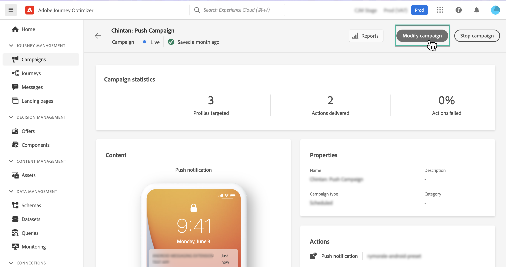

# Modifier ou arrêter une campagne {#modify-stop-campaign}

Une fois qu’une campagne a été activée, vous pouvez la modifier ou l’arrêter à tout moment. Pour ce faire, suivez les étapes ci-après.

## Modifier une campagne activée {#modify}

Pour modifier et créer une version d&#39;une campagne, procédez comme suit :

1. Ouvrez l&#39;opération, puis cliquez sur le bouton **[!UICONTROL Modifier une campagne]** bouton .

   

1. Une nouvelle version de la campagne est créée. Vous pouvez vérifier la version active en cliquant sur **[!UICONTROL Ouvrir la version en direct]**.

   

   Dans la liste des campagnes, les campagnes activées avec une version préliminaire en cours s’affichent avec une icône spécifique dans la variable **[!UICONTROL État]** colonne . Cliquez sur cette icône pour ouvrir le brouillon de la campagne.

   

1. Une fois vos modifications prêtes, vous pouvez activer la nouvelle version de la campagne (voir [Révision et activation d’une campagne](create-campaign.md#review-activate)).

   >[!IMPORTANT]
   >
   >L&#39;activation du brouillon remplacera la version en ligne de la campagne.

   

## Arrêter une campagne {#stop}

Pour arrêter une campagne, ouvrez-la, puis cliquez sur le bouton **[!UICONTROL Arrêter la campagne]** bouton .

>[!IMPORTANT]
>
>Après l’arrêt d’une campagne, elle sera disponible en lecture seule uniquement. Vous ne pourrez plus l’activer ou l’utiliser pour créer une nouvelle campagne.
