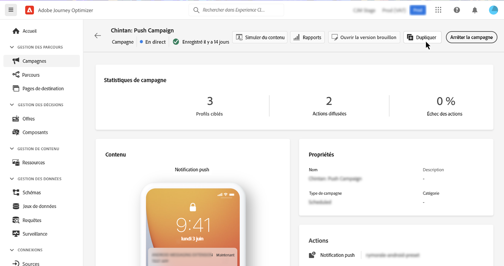

# Gérer des campagnes actives {#modify-stop-campaign}

Une fois qu’une campagne a été activée, vous pouvez la modifier ou l’arrêter à tout moment. Ces opérations sont disponibles pour les campagnes dont l’exécution est récurrente uniquement.

De plus, vous pouvez dupliquer des campagnes actives (exécutées une fois ou avec une exécution récurrente) pour en créer de nouvelles.

## Modifier une campagne récurrente {#modify}

Pour modifier et créer une nouvelle version d’une campagne récurrente, procédez comme suit :

1. Ouvrez la campagne, puis cliquez sur le bouton **[!UICONTROL Modifier la campagne]**.

1. Une nouvelle version de la campagne est créée. Vous pouvez vérifier la version active en cliquant sur **[!UICONTROL Ouvrir la version active]**.

   

   Dans la liste des campagnes, les campagnes activées avec un brouillon en cours s’affichent avec une icône spécifique dans la colonne **[!UICONTROL Statut]**. Cliquez sur cette icône pour ouvrir le brouillon de la campagne.

   

1. Une fois vos modifications prêtes, vous pouvez activer la nouvelle version de la campagne (voir [Examiner et activer une campagne](create-campaign.md#review-activate)).

   >[!IMPORTANT]
   >
   >L’activation du brouillon remplacera la version active de la campagne.

## Arrêter une campagne récurrente {#stop}

Pour arrêter une campagne récurrente, ouvrez-la, puis cliquez sur le bouton **[!UICONTROL Arrêter la campagne]**.

>[!IMPORTANT]
>
>L’arrêt d’une campagne n’arrête pas un envoi continu, mais elle arrête un envoi planifié ou les occurrences suivantes si l’envoi est déjà en cours.

<!-- inbound campaign (inapp): can stop and resume -->

## Dupliquer une campagne {#duplicate}

Vous pouvez dupliquer une campagne active pour en créer une nouvelle. Pour ce faire, ouvrez la campagne, puis cliquez sur **[!UICONTROL Dupliquer]**.

