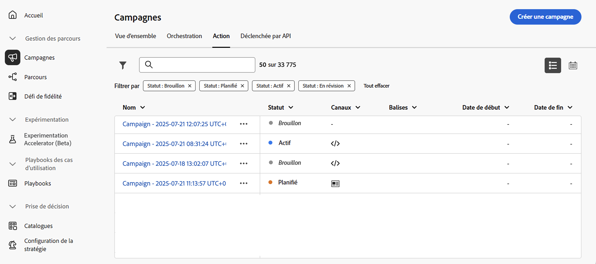
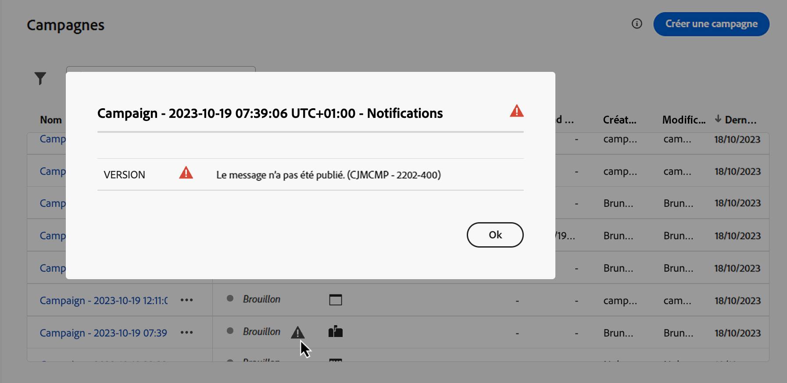
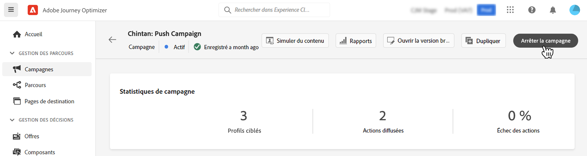

# Gestion des campagnes {#modify-stop-campaign}

Une fois qu’une campagne a été activée, vous pouvez la modifier ou l’arrêter à tout moment. Ces opérations sont disponibles pour les campagnes dont l’exécution est récurrente uniquement.

De plus, vous pouvez dupliquer des campagnes dynamiques (exécutées une fois ou de manière récurrente) pour en créer de nouvelles et archiver les campagnes terminées ou arrêtées.

## Accès aux campagnes {#access}

>[!CONTEXTUALHELP]
>id="ajo_campaigns_view"
>title="Vues Tableau et chronologie des campagnes"
>abstract="Vues Tableau et chronologie des campagnes"

Les campagnes sont accessibles à partir du menu **[!UICONTROL Campagnes]**.

Par défaut, toutes les campagnes dont le statut est **[!UICONTROL Brouillon]**, **[!UICONTROL Planifié]** et **[!UICONTROL Actif]** sont répertoriées. Pour afficher les campagnes arrêtées, terminées et archivées, vous devez supprimer le filtre.

De plus, vous pouvez filtrer la liste en fonction du type et du canal de la campagne, ou des balises qui ont été affectées aux campagnes lors de leur création. [Découvrir comment attribuer des balises à une campagne](create-campaign.md#create)

## Statuts et alertes des campagnes {#statuses}

Les campagnes peuvent avoir plusieurs statuts :

* **[!UICONTROL Brouillon]** : la campagne est en cours de modification et n’est pas active.
* **[!UICONTROL Activation]** : la campagne est en cours d’activation.
* **[!UICONTROL Traitement]** *(campagnes par e-mail uniquement)* : l’export de l’audience est terminé, la campagne est en cours de publication.
* **[!UICONTROL Actif]** : la campagne est active.
* **[!UICONTROL Planifié]** : la campagne a été configurée pour être activée à une date de début spécifique.
* **[!UICONTROL Arrêté]** : la campagne a été arrêtée manuellement. Vous ne pouvez plus l’activer ni la réutiliser. [Découvrez comment arrêter une campagne.](modify-stop-campaign.md#stop)
* **[!UICONTROL Terminé]** : la campagne est terminée. Ce statut est automatiquement attribué 3 jours après l’activation d’une campagne, ou à la date de fin de la campagne si son exécution est récurrente.
* **[!UICONTROL Archivé]** : la campagne a été archivée. [Découvrez comment archiver des campagnes.](modify-stop-campaign.md#archive)

>[!NOTE]
>
>L’icône « Ouvrir le brouillon » en regard d’un statut **[!UICONTROL Actif]** ou **[!UICONTROL Planifié]** indique qu’une nouvelle version de la campagne a été créée et n’a pas encore été activée. [En savoir plus](modify-stop-campaign.md#modify).

Lorsqu’une erreur se produit dans l’une de vos campagnes, une icône d’avertissement s’affiche avec le statut de la campagne. Cliquez dessus pour afficher les informations relatives à l’alerte. Ces alertes peuvent se produire dans différentes situations, par exemple lorsque le message de la campagne n’a pas été publié ou si la configuration choisie est incorrecte.

## Modification d’une campagne récurrente {#modify}

Pour modifier et créer une nouvelle version d’une campagne récurrente, procédez comme suit :

1. Ouvrez la campagne, puis cliquez sur le bouton **[!UICONTROL Modifier la campagne]**.

1. Une nouvelle version de la campagne est créée. Vous pouvez vérifier la version active en cliquant sur **[!UICONTROL Ouvrir la version active]**.

   

   Dans la liste des campagnes, les campagnes activées avec un brouillon en cours s’affichent avec une icône spécifique dans la colonne **[!UICONTROL Statut]**. Cliquez sur cette icône pour ouvrir le brouillon de la campagne.

   

1. Une fois vos modifications prêtes, vous pouvez activer la nouvelle version de la campagne (voir [Vérification et activation d’une campagne](create-campaign.md#review-activate)).

   >[!IMPORTANT]
   >
   >L’activation du brouillon remplacera la version active de la campagne.

## Arrêt d’une campagne récurrente {#stop}

Pour arrêter une campagne récurrente, ouvrez-la, puis cliquez sur le bouton **[!UICONTROL Arrêter la campagne]**.

>[!IMPORTANT]
>
>L’arrêt d’une campagne n’arrête pas un envoi continu, mais elle arrête un envoi planifié ou les occurrences suivantes si l’envoi est déjà en cours.

<!-- inbound campaign (inapp): can stop and resume -->

## Duplication d’une campagne {#duplicate}

Vous pouvez dupliquer une campagne active pour en créer une nouvelle. Pour ce faire, ouvrez la campagne, puis cliquez sur **[!UICONTROL Dupliquer]**.

## Archivage d’une campagne {#archive}

Avec le temps, la liste des campagnes ne cesse d’augmenter et il devient plus difficile de parcourir les campagnes terminées et arrêtées.

Pour éviter cela, vous pouvez archiver les campagnes terminées et arrêtées dont vous n’avez plus besoin. Pour ce faire, cliquez sur le bouton représentant des points de suspension, puis sélectionnez **[!UICONTROL Archiver]**.

Les campagnes archivées peuvent ensuite être récupérées à l’aide du filtre dédié dans la liste. [Découvrez comment accéder à des campagnes](get-started-with-campaigns.md#access)
