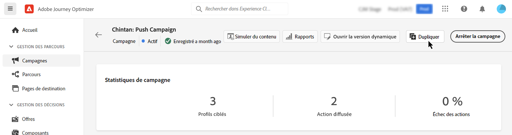

# Gestion des campagnes {#modify-stop-campaign}

Une fois qu&#39;une campagne a été activée, vous pouvez la modifier ou l&#39;arrêter à tout moment. Ces opérations sont disponibles pour les opérations dont l’exécution est récurrente uniquement.

De plus, vous pouvez dupliquer des campagnes actives (exécutées une fois ou avec une exécution récurrente) pour en créer de nouvelles et archiver les campagnes terminées ou arrêtées.

## Accès aux campagnes {#access}

Les campagnes sont accessibles à partir du **[!UICONTROL Campaigns]** .

Par défaut, la liste affiche toutes les campagnes avec la variable **[!UICONTROL Draft]**, **[!UICONTROL Scheduled]**, et **[!UICONTROL Live]** les états.

Pour afficher les campagnes arrêtées, terminées et archivées, vous devez effacer le filtre.

## Statuts des campagnes {#statuses}

Les campagnes peuvent avoir plusieurs états :

* **[!UICONTROL Draft]**: La campagne est en édition, elle n&#39;a pas été activée.
* **[!UICONTROL Activating]**: La campagne est en cours d’activation.
* **[!UICONTROL Live]**: La campagne a été activée.
* **[!UICONTROL Scheduled]**: La campagne est configurée pour être activée à une date de début spécifique.
* **[!UICONTROL Stopped]**: La campagne a été arrêtée manuellement. Vous ne pouvez plus l’activer ni le réutiliser. [Découvrez comment arrêter une campagne](modify-stop-campaign.md#stop)
* **[!UICONTROL Completed]**: La campagne est terminée. Ce statut est automatiquement attribué 3 jours après l&#39;activation d&#39;une campagne, ou à la date de fin de la campagne si son exécution est récurrente.
* **[!UICONTROL Archived]**: La campagne a été archivée. [Découvrez comment archiver des campagnes](modify-stop-campaign.md#archive)

>[!NOTE]
>
>L’icône &quot;Ouvrir la version préliminaire&quot; en regard d’un **[!UICONTROL Live]** ou **[!UICONTROL Scheduled]** Le statut indique qu’une nouvelle version de la campagne a été créée et n’a pas encore été activée. [En savoir plus](modify-stop-campaign.md#modify).

## Modifier une opération récurrente {#modify}

Pour modifier et créer une nouvelle version d&#39;une opération récurrente, procédez comme suit :

1. Ouvrez l&#39;opération, puis cliquez sur le bouton **[!UICONTROL Modify campaign]** bouton .

1. Une nouvelle version de la campagne est créée. Vous pouvez vérifier la version active en cliquant sur **[!UICONTROL Open live version]**.

   

   Dans la liste des campagnes, les campagnes activées avec une version préliminaire en cours s’affichent avec une icône spécifique dans la variable **[!UICONTROL Status]** colonne . Cliquez sur cette icône pour ouvrir le brouillon de la campagne.

   

1. Une fois vos modifications prêtes, vous pouvez activer la nouvelle version de la campagne (voir [Révision et activation d’une campagne](create-campaign.md#review-activate)).

   >[!IMPORTANT]
   >
   >L&#39;activation du brouillon remplacera la version en ligne de la campagne.

## Arrêter une opération récurrente {#stop}

Pour arrêter une opération récurrente, ouvrez-la, puis cliquez sur le bouton **[!UICONTROL Stop campaign]** bouton .

>[!IMPORTANT]
>
>L’arrêt d’une campagne n’arrête pas un envoi en cours, mais elle arrête un envoi planifié ou les occurrences suivantes si l’envoi est déjà en cours.

<!-- inbound campaign (inapp): can stop and resume -->

## Dupliquer une opération {#duplicate}

Vous pouvez dupliquer une campagne active pour en créer une nouvelle. Pour ce faire, ouvrez la campagne, puis cliquez sur **[!UICONTROL Duplicate]**.

## Archivage d’une campagne {#archive}

Avec le temps, la liste des campagnes ne cesse d’augmenter et il devient plus difficile de parcourir les campagnes terminées et arrêtées.

Pour éviter cela, vous pouvez archiver les campagnes terminées et arrêtées dont vous n’avez plus besoin. Pour cela, cliquez sur le bouton représentant des ellipses, puis sélectionnez **[!UICONTROL Archive]**.

Les campagnes archivées peuvent ensuite être récupérées à l’aide du filtre dédié dans la liste. [Découvrez comment accéder aux campagnes](get-started-with-campaigns.md#access)
