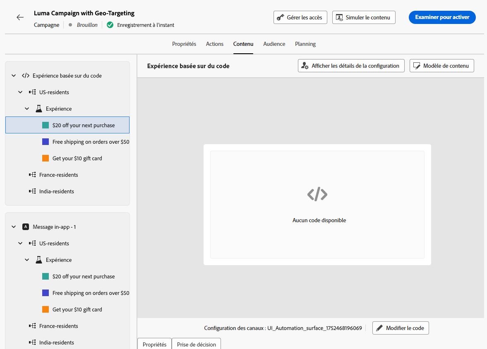

# Combiner ciblage et expérimentation {#combination}

Journey Optimizer permet également de combiner le ciblage et les expériences au sein d’un seul parcours ou d’une seule campagne afin de créer des stratégies plus sophistiquées.

En effet, il est possible d’utiliser le ciblage pour créer plusieurs variantes et, pour chacune d’elles, de recourir à l’expérimentation afin d’optimiser davantage chaque contenu. Cela garantit que les expériences sont propres à chaque règle de ciblage et ne s’étendent pas aux variantes.

Par exemple, il est possible de tester une « promotion -50 % » par rapport à une « carte-cadeau de 50 $ » pour la clientèle américaine, et d’exécuter un test différent pour la clientèle européenne, comme « livraison gratuite pour toute commande supérieure à 50 € » par rapport à « 20 % de réduction sur l’achat suivant ».

Pour combiner le ciblage et les expériences dans un parcours ou une campagne, suivez les étapes ci-dessous.

1. Créez un parcours ou une campagne où plusieurs règles de ciblage sont définies. [Voici comment procéder](optimization-targeting.md)

   {width=85%}

1. Créez une expérience pour la première règle de ciblage.

1. Concevez et configurez votre expérience de contenu selon vos besoins. [Voici comment procéder](../content-management/content-experiment.md)

   {width=85%}

   Une fois l’expérience définie, elle s’applique uniquement à la première règle de ciblage.

1. De retour dans l’onglet **[!UICONTROL Actions]**, sélectionnez **[!UICONTROL Modifier le contenu]**.

1. Pour le groupe défini par la première règle de ciblage, il est possible de définir du contenu spécifique pour chaque variante de l’expérience.

   Si plusieurs actions entrantes sont ajoutées au parcours ou à la campagne, la même combinaison de ciblage et d’expérience s’applique à chaque action. Cependant, un contenu spécifique doit être défini pour chaque variante de chaque action.

   {width=85%}

1. Procédez de la même manière pour les autres règles de ciblage et concevez le contenu correspondant pour chaque variante.

1. Enregistrez vos modifications et [activez](review-activate-campaign.md) votre parcours ou campagne.

Une fois la campagne ou le parcours actif, les utilisateurs et utilisatrices de chaque groupe ciblé se voient attribuer aléatoirement les différentes variations de contenu définies pour leur groupe respectif.

<!--
## Reporting on Message optimization

E.g. explaining how a marketer can look at the report to determine which treatment (e.g. which message content) is performing the best for the targeting audience
-->

