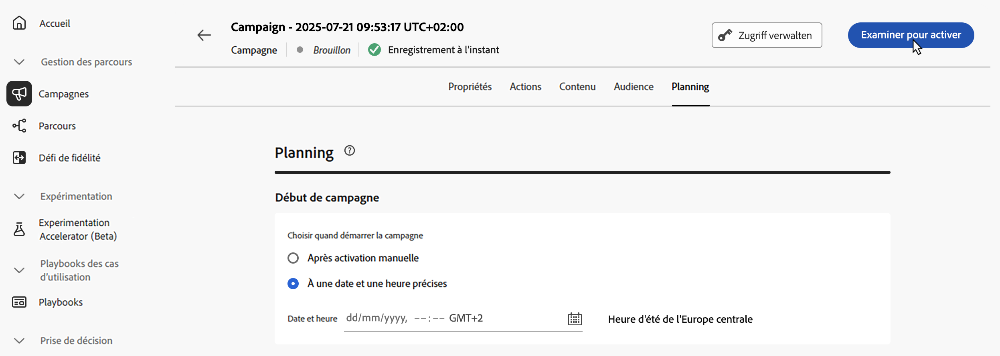

# Examiner et activer la campagne déclenchée par l’API {#api-review}

Une fois votre campagne d’action configurée, vous devez passer en revue son paramètre et son contenu avant de l’activer. Pour ce faire, procédez comme suit :

>[!IMPORTANT]
>
> Si votre campagne est soumise à une politique d’approbation, vous devrez effectuer une demande d’approbation afin de pouvoir l’envoyer. [En savoir plus](../test-approve/gs-approval.md)

1. Dans l’écran de configuration de la campagne, cliquez sur **[!UICONTROL Examiner pour activer]** pour afficher un résumé de la campagne.

   

1. Un résumé de la configuration de la campagne s’affiche, vous permettant de vérifier si un paramètre est incorrect ou manquant et de modifier votre campagne si nécessaire.

   En cas d’erreur, vous ne pouvez pas activer la campagne. Résolvez les erreurs avant de continuer.

   

1. Vérifiez que votre campagne est correctement configurée, puis cliquez sur **[!UICONTROL Activer]**.

1. La campagne est activée. Son statut est **[!UICONTROL Actif]** ou **[!UICONTROL Planifié]** si vous avez saisi une date de début.

   Le statut **[!UICONTROL Terminé]** est automatiquement attribué à la campagne 3 jours après son activation ou à la date de fin de la campagne si son exécution est récurrente. [En savoir plus sur les statuts des campagnes](get-started-with-campaigns.md#statuses).

   Si aucune date de fin n’a été spécifiée, la campagne conserve le statut **[!UICONTROL Actif]**. Pour le modifier, vous devez arrêter manuellement la campagne. [Découvrez comment arrêter une campagne](modify-stop-campaign.md)

1. Une fois qu’une campagne a été activée, vous pouvez vérifier à tout moment ses informations en l’ouvrant. Le résumé vous permet d’obtenir des statistiques sur le nombre de profils ciblés et les actions diffusées et en échec.

   Vous pouvez également obtenir des statistiques supplémentaires dans les rapports dédiés en cliquant sur le bouton **[!UICONTROL Rapports]**. [En savoir plus](../reports/campaign-global-report-cja.md)

   

## Étapes suivantes {#next}

Une fois que la campagne déclenchée par API est prête, vous pouvez déclencher son exécution à l’aide d’API. [En savoir plus](trigger-campaigns.md)
