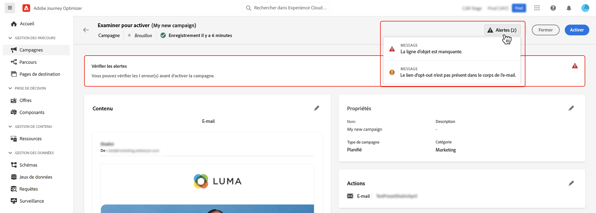

# Vérifier et activer une campagne {#review-activate}

>[!IMPORTANT]
>
>À compter de la version de septembre, une nouvelle expérience d’activation de campagne et de parcours vous permet de gérer l’ensemble du processus d’approbation, en veillant à ce que les campagnes et les parcours soient minutieusement examinés et approuvés par les parties prenantes appropriées avant de passer en ligne. Cette fonctionnalité est disponible en disponibilité limitée. [En savoir plus](../test-approve/gs-approval.md)

Une fois votre campagne configurée, vous devez passer en revue son paramètre et son contenu avant de l’activer. Pour ce faire, procédez comme suit :

1. Dans l’écran de configuration de la campagne, cliquez sur **[!UICONTROL Examiner pour activer]** pour afficher un résumé de la campagne.

   Le résumé vous permet de modifier votre campagne si nécessaire et de vérifier si un paramètre est incorrect ou manquant.

   >[!IMPORTANT]
   >
   >En cas d’erreur, vous ne pouvez pas activer la campagne. Résolvez les erreurs avant de continuer.

   

1. Vérifiez que votre campagne est correctement configurée, puis cliquez sur **[!UICONTROL Activer]**.

1. La campagne est maintenant activée. Son statut est soit **[!UICONTROL Actif]**, soit **[!UICONTROL Planifié]** si vous avez saisi une date de début. [En savoir plus sur les statuts des campagnes](get-started-with-campaigns.md#statuses).

   Le message configuré dans la campagne est envoyé immédiatement ou à la date indiquée.

   >[!NOTE]
   >
   >Le statut **[!UICONTROL Terminé]** est automatiquement affecté à une campagne 3 jours après son activation ou à la date de fin de la campagne si son exécution est récurrente.
   >
   >Si aucune date de fin n’a été spécifiée, la campagne conserve le statut **[!UICONTROL Actif]**. Pour le modifier, vous devez arrêter manuellement la campagne. [Découvrez comment arrêter une campagne](modify-stop-campaign.md)

1. Une fois qu’une campagne a été activée, vous pouvez vérifier à tout moment ses informations en l’ouvrant. Le résumé vous permet d’obtenir des statistiques sur le nombre de profils ciblés et les actions diffusées et en échec.

   Vous pouvez également obtenir des statistiques supplémentaires dans les rapports dédiés en cliquant sur le bouton **[!UICONTROL Rapports]**. [En savoir plus](../reports/campaign-global-report.md)

   
