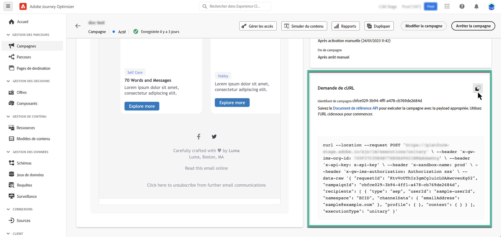

# Exécuter une campagne déclenchée par API {#execute}

Une fois votre campagne activée, vous devez récupérer l’exemple de requête cURL généré et l’utiliser dans l’API pour créer votre payload et déclencher la campagne.

## À lire impérativement {#must-read}

* **Dates de début/de fin de la campagne** : si vous avez configuré une date de début et/ou de fin spécifique lors de la création de la campagne, elle ne sera pas exécutée en dehors de ces dates et les appels API échoueront.

* **Délai d’expiration de l’appel** : le délai d’expiration de l’appel de l’API REST Interactive Message Execution est de 60 secondes. Cependant, de nouvelles tentatives internes d’appel sont implémentées en cas de temporisations inattendues pour garantir la diffusion.

## Déclencher la campagne {#trigger}

1. Ouvrez la campagne, puis copiez-collez la requête de payload depuis la section **[!UICONTROL requête cURL]**. Cette payload inclut toutes les variables de personnalisation (profil et contexte) utilisées dans le message. Elle est disponible une fois la campagne activée.

   

   >[!IMPORTANT]
   >
   >Les points d’entrée de la section cURL diffèrent entre les campagnes standard et [à débit élevé](../campaigns/api-triggered-high-throughput.md).

1. Utilisez cette requête cURL dans les API pour créer votre payload et déclencher la campagne. Pour plus d’informations, consultez la [documentation de l’API Interactive Message Execution](https://developer.adobe.com/journey-optimizer-apis/references/messaging/#tag/execution), où tous les points d’entrée des campagnes standard et à débit élevé sont répertoriés.

   Des exemples d’appels API sont également disponibles sur [cette page](https://developer.adobe.com/journey-optimizer-apis/references/messaging-samples/).

## Résolution des problèmes {#troubleshooting}

### Retards de diffusion des e-mails {#delivery-delays}

Si les délais de diffusion des e-mails dépassent les attentes, recherchez les pannes potentielles ou les problèmes de performances avec les services externes, tels que les fournisseurs d&#39;infrastructure cloud ou les fournisseurs de messagerie électronique. Journey Optimizer enregistre les horodatages de départ des messages, ce qui peut aider à déterminer si des retards se sont produits en aval dans le pipeline de diffusion.

### Erreurs d’authentification Azure Cosmos DB (erreur de serveur interne 500) {#cosmosdb-auth-errors}

Si vous rencontrez des **erreurs de serveur interne 500** lors du déclenchement de campagnes déclenchées par API et que les journaux système affichent une erreur **403 Interdit** provenant d’Azure Cosmos avec un message tel que :

_« L’accès à votre compte est actuellement révoqué, car le service Azure Cosmos DB ne parvient pas à obtenir le jeton d’authentification AAD pour l’identité par défaut du compte »_

Cette erreur se produit généralement lorsque le principal de service Azure requis pour l’authentification de Cosmos DB a été désactivé, supprimé ou mal configuré.

+++Résolution de ce problème

1. **Vérifier votre principal de service Azure** : assurez-vous que votre principal de service Azure ou que votre identité gérée sont activés et n’ont pas été désactivés ou supprimés dans Azure Active Directory.

1. **Vérifier les autorisations** : vérifiez que le principal de service dispose des autorisations nécessaires pour accéder aux ressources Azure Key Vault et Cosmos DB. Le principal de service doit disposer des affectations de rôle appropriées pour s’authentifier auprès d’Azure Cosmos DB.

1. **Vérifier la configuration de la CMK d’Azure Cosmos DB** : si vous utilisez des clés gérées par le client ou la cliente (CMK), consultez le [guide de dépannage de la CMK d’Azure Cosmos DB](https://learn.microsoft.com/fr-fr/azure/cosmos-db/cmk-troubleshooting-guide#azure-active-directory-token-acquisition-error){target="_blank"} pour obtenir des instructions détaillées sur la restauration de l’acquisition des jetons AAD.

1. **Réactiver et tester** : après avoir corrigé la configuration, réactivez le principal de service s’il a été désactivé, puis testez à nouveau vos appels API de campagne transactionnelle pour confirmer que l’authentification réussit et que les messages sont bien diffusés.

>[!NOTE]
>
>Ce problème est généralement dû à une mauvaise configuration ou à une désactivation accidentelle du principal de service Azure requis pour l’authentification de Cosmos DB. Si le principal de service reste activé et correctement configuré, cette erreur ne se reproduira plus.

+++
