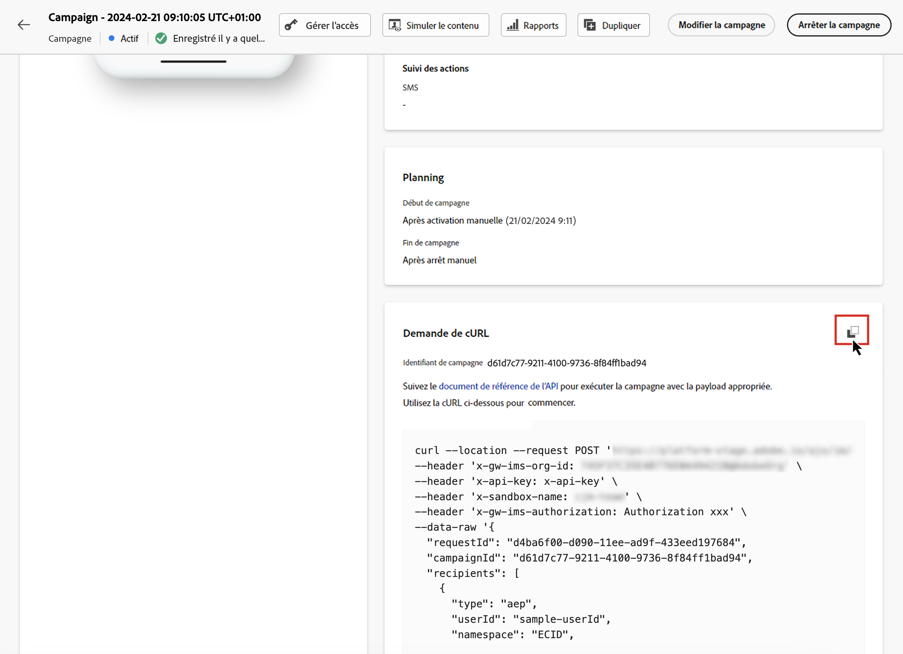

# Exécution d’une campagne déclenchée par API {#execute}

Une fois votre campagne activée, vous devez récupérer l’exemple de requête cURL généré et l’utiliser dans l’API pour créer votre payload et déclencher la campagne.

1. Ouvrez la campagne, puis copiez-collez la requête de payload depuis la section **[!UICONTROL requête cURL]**. Cette payload inclut toutes les variables de personnalisation (profil et contexte) utilisées dans le message. Elle est disponible une fois la campagne activée.

   

1. Utilisez cette requête cURL dans les API pour créer votre payload et déclencher la campagne. Pour plus d’informations, consultez la [documentation de l’API d’exécution de message interactif](https://developer.adobe.com/journey-optimizer-apis/references/messaging/#tag/execution).

   Des exemples d’appels API sont également disponibles sur [cette page](https://developer.adobe.com/journey-optimizer-apis/references/messaging-samples/).

   >[!NOTE]
   >
   >Si vous avez configuré une date de début et/ou de fin spécifique lors de la création de la campagne, elle ne sera pas exécutée en dehors de ces dates et les appels API échoueront.
