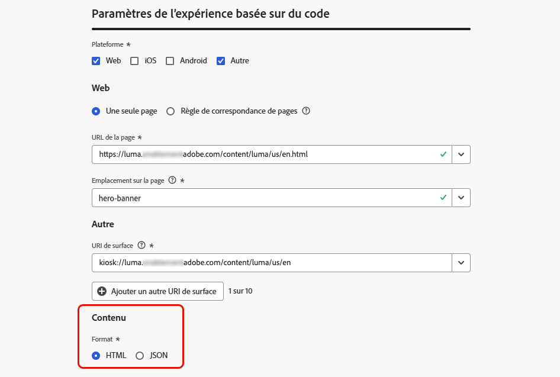
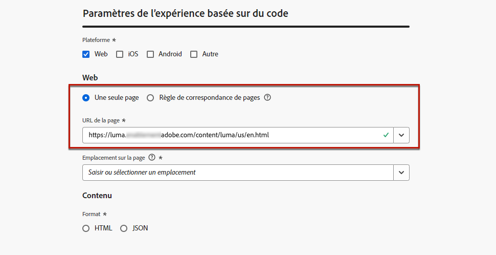
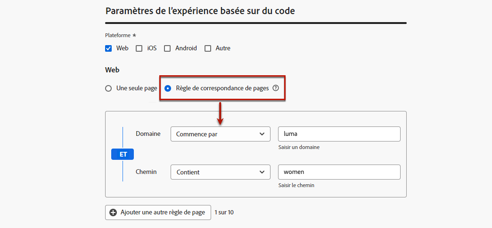
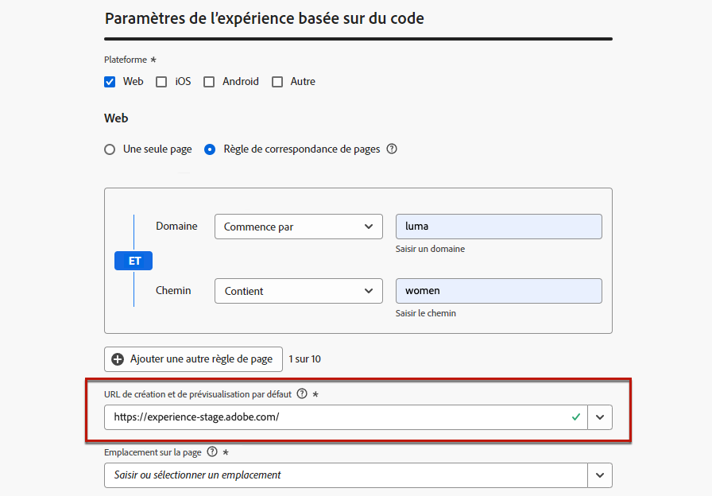
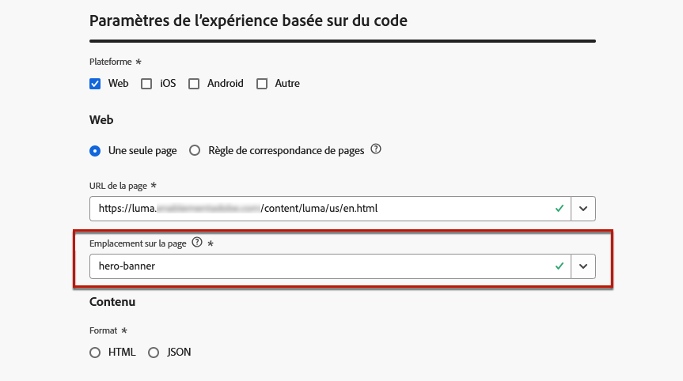
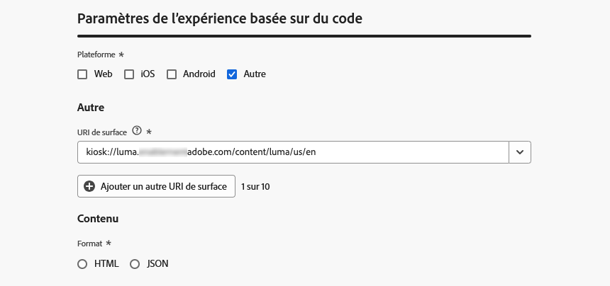

# Configurer votre expérience basée sur le code {#code-based-configuration}

>[!CONTEXTUALHELP]
>id="ajo_code_based_surface"
>title="Définir une configuration d’expérience basée sur le code"
>abstract="Une configuration basée sur le code définit le chemin et l’emplacement dans votre application, identifiés de manière unique par un URI dans la mise en œuvre de l’application, où le contenu sera diffusé et consommé."

Avant de [créer votre expérience](create-code-based.md), vous devez créer une configuration d’expérience basée sur du code dans laquelle vous allez définir où le contenu sera diffusé et utilisé dans votre application.

Une configuration d’expérience basée sur du code doit référencer la surface, qui est essentiellement l’emplacement où vous souhaitez effectuer le rendu de vos modifications. Selon la plateforme sélectionnée, vous devez saisir un emplacement/chemin ou l’URI complet de la surface. [En savoir plus](code-based-surface.md)

>[!NOTE]
>
>Lorsque vous disposez de plusieurs actions d’expérience basées sur le code utilisant la même configuration de canal (et s’exécutant donc sur la même surface), le **[!UICONTROL score de priorité]** de la campagne ou du parcours détermine ce qui est diffusé à l’utilisateur final s’il remplit les critères de plusieurs actions. [En savoir plus sur les scores de priorité](../conflict-prioritization/priority-scores.md)

## Création d’une configuration d’expérience basée sur du code {#create-code-based-configuration}

>[!CONTEXTUALHELP]
>id="ajo_admin_location"
>title="Indiquez l’emplacement spécifique dans votre page ou application."
>abstract="Ce champ indique la destination exacte dans la page ou dans l’application à laquelle les personnes doivent accéder. Il peut s’agir d’une section spécifique dans une page web ou d’une page au plus profond de la structure de navigation de l’application."

>[!CONTEXTUALHELP]
>id="ajo_admin_default_mobile_url"
>title="Définir une URL pour la création et la prévisualisation de contenu"
>abstract="Ce champ garantit que les pages générées ou mises en correspondance par la règle ont une URL désignée, essentielle pour la création et la prévisualisation efficaces du contenu."

Pour créer une configuration de canal d’expérience basée sur du code, procédez comme suit :

1. Accédez au menu **[!UICONTROL Canaux]** > **[!UICONTROL Paramètres généraux]** > **[!UICONTROL Configurations des canaux]**, puis cliquez sur **[!UICONTROL Créer une configuration des canaux]**.

   

1. Saisissez un nom et une description (facultatif) pour la configuration.

   >[!NOTE]
   >
   > Les noms doivent commencer par une lettre (A-Z). Ils ne peuvent contenir que des caractères alphanumériques. Vous pouvez également utiliser le trait de soulignement `_`, le point`.` et le trait d&#39;union `-`.

1. Pour attribuer des libellés d’utilisation des données personnalisés ou de base à la configuration, vous pouvez sélectionner **[!UICONTROL Gérer l’accès]**. [En savoir plus sur le contrôle d’accès au niveau de l’objet (OLAC)](../administration/object-based-access.md)

1. Sélectionnez une **[!UICONTROL Action marketing]** ou plusieurs pour associer des politiques de consentement aux messages utilisant cette configuration. Toutes les politiques de consentement associées à cette action marketing sont utilisées afin de respecter les préférences de vos clientes et clients. [En savoir plus](../action/consent.md#surface-marketing-actions)

1. Sélectionnez le canal **Expérience basée sur du code**.

   

1. Sélectionnez la plateforme pour laquelle l’expérience basée sur du code sera appliquée :

   * [Web](#web)
   * [iOS et/ou Android](#mobile)
   * [Autre](#other)

   >[!NOTE]
   >
   >Vous pouvez sélectionner plusieurs plateformes. Lorsque vous sélectionnez plusieurs plateformes, le contenu est diffusé sur toutes les pages ou applications sélectionnées.

1. Sélectionnez le format attendu par l’application à cet emplacement spécifique. Cela sera utilisé lors de la création de l’expérience basée du code dans les campagnes et les parcours.

   

1. Cliquez sur **[!UICONTROL Envoyer]** pour enregistrer vos modifications.

Vous pouvez maintenant sélectionner cette configuration lors de la [création d’une expérience basée sur du code](create-code-based.md) dans vos campagnes et vos parcours.

>[!NOTE]
>
>Votre équipe d’implémentation d’application est chargée d’effectuer des appels d’API ou de SDK explicites pour récupérer du contenu pour les surfaces définies dans la configuration d’expérience basée sur du code sélectionnée. En savoir plus sur les différentes mises en œuvre des clientes et clients dans [cette section](code-based-implementation-samples.md).

### Plateformes web {#web}

>[!CONTEXTUALHELP]
>id="ajo_admin_default_web_url"
>title="Définir une URL pour la création et la prévisualisation de contenu"
>abstract="Ce champ garantit que les pages générées ou mises en correspondance par la règle ont une URL désignée, essentielle pour la création et la prévisualisation efficaces du contenu."

Pour définir les paramètres de configuration de l’expérience basée sur du code pour les plateformes web, procédez comme suit.

1. Sélectionnez l’une des options suivantes :

   * **[!UICONTROL Page unique]** - Si vous souhaitez appliquer les modifications exclusivement à une seule page, saisissez une **[!UICONTROL URL de page]**.

     

   * **[!UICONTROL Règle de correspondance de pages]** - Pour cibler plusieurs URL correspondant à la même règle, créez une ou plusieurs règles. [En savoir plus](../web/web-configuration.md#web-page-matching-rule)

     <!--This could be used to apply changes universally across a website, such as updating a hero banner across all pages or adding a top image to display on every product page.-->

     Par exemple, si vous souhaitez modifier des éléments qui s’affichent sur toutes les pages de produits pour femmes de votre site web Luma, sélectionnez **[!UICONTROL Domaine]** > **[!UICONTROL Commence par]** > `luma` et **[!UICONTROL Page]** > **[!UICONTROL Contient]** > `women`.

     

1. Les conditions suivantes s’appliquent à l’URL de prévisualisation :

   * Si une URL de page unique est saisie, cette URL sera utilisée pour la prévisualisation. Il n’y a pas besoin de saisir une autre URL.
   * Si une [règle de correspondance de pages](../web/web-configuration.md#web-page-matching-rule) est sélectionnée, vous devez saisir une **[!UICONTROL URL de création et de prévisualisation par défaut]** qui sera utilisée pour prévisualiser l’expérience dans un navigateur. [En savoir plus](test-code-based.md#preview-on-device)

     

1. Le champ **[!UICONTROL Emplacement sur la page]** spécifie la destination exacte à l’intérieur de la page à laquelle vous souhaitez que les personnes accèdent. Il peut s’agir d’une section spécifique sur une page dans la structure de navigation du site, telle que « bannière-produit » ou « rail-produit ».

   >[!CAUTION]
   >
   >La chaîne saisie ou le chemin saisi dans ce champ doit correspondre à l’élément déclaré dans votre implémentation d’application ou de page. Cela garantit que le contenu est diffusé à l’emplacement souhaité dans l’application ou la page spécifiée. [En savoir plus](code-based-surface.md#uri-composition)

   

### Plateformes mobiles (iOS et Android) {#mobile}

>[!CONTEXTUALHELP]
>id="ajo_admin_app_id"
>title="Saisir votre ID d’application"
>abstract="Indiquez l’ID d’application pour une identification et une configuration précises au sein de l’environnement opérationnel de l’application, ce qui garantit une intégration et des fonctionnalités transparentes."

>[!CONTEXTUALHELP]
>id="ajo_admin_mobile_url_preview"
>title="Saisir l’URL de prévisualisation du contenu"
>abstract="Ce champ est essentiel pour activer la simulation et la prévisualisation de votre contenu directement sur votre appareil au sein de votre application."

Pour définir les paramètres de configuration d’expérience basée sur du code pour les plateformes mobiles, procédez comme suit.

1. Saisissez votre **[!UICONTROL ID d’application]**. Cela permet une identification et une configuration précises dans l’environnement opérationnel de l’application et garantit une intégration et une fonctionnalité transparentes.

1. Indiquez l’**[!UICONTROL emplacement ou le chemin d’accès dans l’application]**. Ce champ indique la destination exacte dans l’application à laquelle les personnes doivent accéder. Il peut s’agir d’une section spécifique sur une page dans la structure de navigation de l’application, telle que « bannière-produit » ou « rail-produit ».

   

1. Renseignez le champ **[!UICONTROL URL de prévisualisation]** pour activer les prévisualisations sur l’appareil. Cette URL informe le service de prévisualisation de l’URL spécifique à utiliser lors du déclenchement d’une prévisualisation sur un appareil. [En savoir plus](test-code-based.md#preview-on-device)

   L’URL de prévisualisation est un lien profond configuré par le développeur ou la développeuse dans votre application. Cela garantit que toutes les URL correspondant au modèle de lien profond s’ouvriront dans l’application plutôt que dans un navigateur web mobile. Contactez le développeur ou la développeuse pour obtenir le schéma de lien profond configuré pour votre application.

+++  Les ressources suivantes peuvent vous aider à configurer des liens profonds pour l’implémentation de votre application.

   * Pour Android :

      * [Créer des liens profonds vers le contexte de l’application](https://developer.android.com/training/app-links/deep-linking)

   * Pour iOS :

      * [Définir un schéma d’URL personnalisé pour votre application](https://developer.apple.com/documentation/xcode/defining-a-custom-url-scheme-for-your-app)

      * [Prendre en charge des liens universels dans votre application](https://developer.apple.com/documentation/xcode/supporting-universal-links-in-your-app)

+++

   >[!NOTE]
   >
   >Si vous rencontrez des problèmes lors de la prévisualisation de l’expérience, reportez-vous à [cette documentation](https://experienceleague.adobe.com/fr/docs/experience-platform/assurance/troubleshooting#app-does-not-open-link).

### Autres plateformes {#other}

Pour définir les paramètres de configuration d’expérience basée sur du code pour d’autres plateformes (telles que les consoles vidéo, les appareils connectés à la télévision, les téléviseurs intelligents, les kiosques, les distributeurs automatiques de billets, les assistants vocaux, les appareils IoT, etc.), procédez comme suit.

1. Sélectionnez **[!UICONTROL Autre]** comme plateforme si votre implémentation n’est pas destinée au Web, à iOS ou à Android, ou si vous devez cibler des URI spécifiques.

1. Saisissez l’**[!UICONTROL URI de surface]**. Un URI de surface est un identifiant unique correspondant à l’entité dans laquelle vous souhaitez diffuser votre expérience. [En savoir plus](code-based-surface.md#surface-uri)

   

   >[!CAUTION]
   >
   >Veillez à saisir un URI de surface correspondant à celui utilisé dans votre propre mise en œuvre. Sinon, les modifications ne sont pas diffusées. [En savoir plus](code-based-surface.md#uri-composition)

1. **[!UICONTROL Ajoutez un autre URI de surface]** si nécessaire. Vous pouvez ajouter jusqu’à 10 URI.

   >[!NOTE]
   >
   >Lors de l’ajout de plusieurs URI, le contenu est diffusé vers tous les composants répertoriés.
