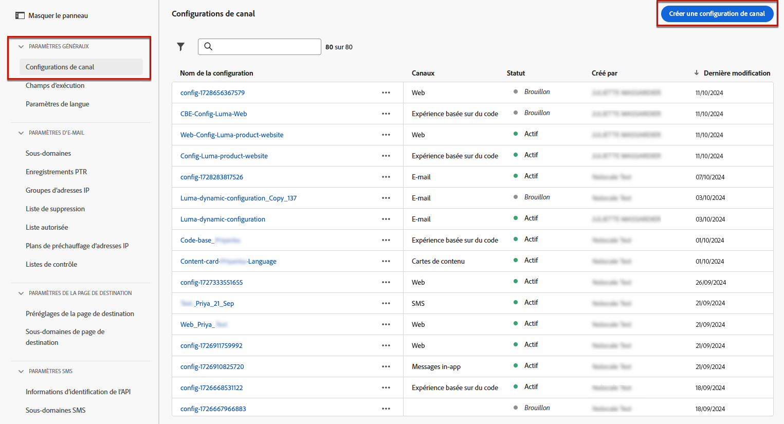
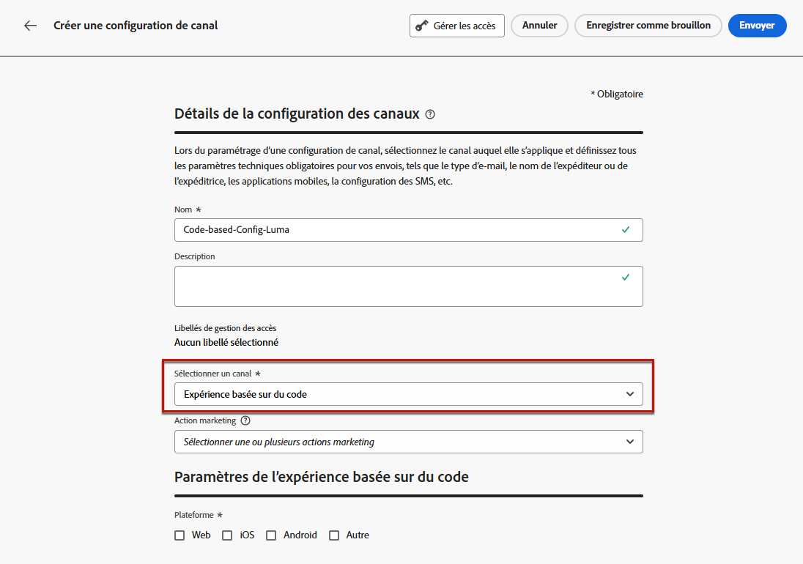
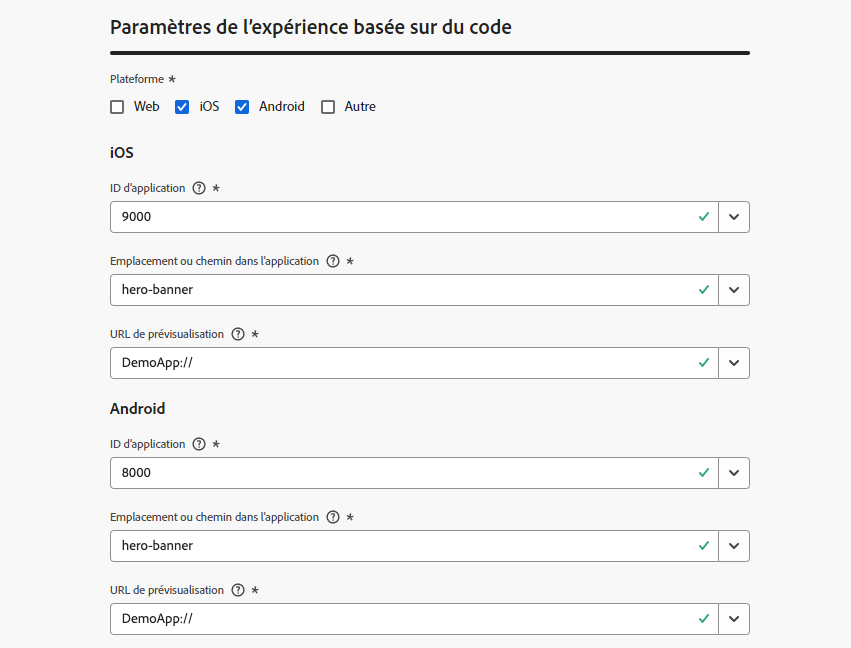

# Configurer votre expérience basée sur le code {#code-based-configuration}

>[!CONTEXTUALHELP]
>id="ajo_admin_app_id"
>title="ID d’application"
>abstract="Indiquez l’ID d’application pour une identification et une configuration précises au sein de l’environnement opérationnel de l’application, ce qui garantit une intégration et des fonctionnalités transparentes."

>[!CONTEXTUALHELP]
>id="ajo_admin_location"
>title="Emplacement sur la page"
>abstract="L’emplacement ou le chemin d’accès dans le champ de l’application spécifie la destination exacte à laquelle les utilisateurs et les utilisatrices doivent accéder dans l’application. Il peut s’agir d’une section ou d’une page spécifique au cœur de la structure de navigation de l’application."

>[!CONTEXTUALHELP]
>id="ajo_admin_surface_uri"
>title="URI de surface"
>abstract="Un URI de surface sert d’identifiant précis orientant vers des éléments ou des composants de l’interface d’utilisation distincts au sein d’une application."

>[!CONTEXTUALHELP]
>id="ajo_admin_default_mobile_url"
>title="URL de création et de prévisualisation par défaut"
>abstract="Ce champ garantit que les pages générées ou mises en correspondance par la règle ont une URL désignée, essentielle pour la création et la prévisualisation efficaces du contenu."

>[!CONTEXTUALHELP]
>id="ajo_admin_default_web_url"
>title="URL de création et de prévisualisation par défaut"
>abstract="Ce champ garantit que les pages générées ou mises en correspondance par la règle ont une URL désignée, essentielle pour la création et la prévisualisation efficaces du contenu."

>[!CONTEXTUALHELP]
>id="ajo_admin_mobile_url_preview"
>title="URL de prévisualisation"
>abstract="Ce champ est essentiel pour activer la simulation et la prévisualisation de votre contenu directement sur votre appareil au sein de votre application."

## Créer une configuration des canaux {#reatte-code-based-configuration}

Pour créer une configuration des canaux, procédez comme suit :

1. Accédez au menu **[!UICONTROL Canaux]** > **[!UICONTROL Paramètres généraux]** > **[!UICONTROL Configurations des canaux]**, puis cliquez sur **[!UICONTROL Créer une configuration des canaux]**.

   

1. Saisissez un nom et une description (facultatif) pour la configuration.

   >[!NOTE]
   >
   > Les noms doivent commencer par une lettre (A-Z). Ils ne peuvent contenir que des caractères alphanumériques. Vous pouvez également utiliser le trait de soulignement `_`, le point`.` et le trait d&#39;union `-`.

1. Pour attribuer des libellés d’utilisation des données personnalisés ou de base à la configuration, vous pouvez sélectionner **[!UICONTROL Gérer l’accès]**. [En savoir plus sur le contrôle d’accès au niveau de l’objet (OLAC)](../administration/object-based-access.md).

1. Sélectionnez une **[!UICONTROL Action marketing]** ou plusieurspour associer des politiques de consentement aux messages utilisant cette configuration. Toutes les politiques de consentement associées à cette action marketing sont utilisées afin de respecter les préférences de vos clientes et clients. [En savoir plus](../action/consent.md#surface-marketing-actions)

1. Sélectionnez le canal **Expérience basée sur le code**.

   

1. Sélectionnez la plateforme pour laquelle l’expérience basée sur le code sera appliquée.

1. Pour le web :

   * Spécifiez une **[!UICONTROL URL de page]** pour appliquer les modifications à une seule page uniquement.

   * Ou créez une **[!UICONTROL règle de correspondance de pages]** pour cibler plusieurs URL qui correspondent à la règle spécifiée. Par exemple, cette capacité peut être exploitée pour diffuser des modifications globales, telles que le rafraîchissement de la bannière principale sur chaque page ou l’insertion d’une image principale sur chaque page produit. [En savoir plus](../web/web-configuration.md)

1. Pour iOS et Android :

   * Saisissez votre **[!UICONTROL ID d’application]** et **[!UICONTROL Emplacement ou chemin dans l’application]**.

     {width="500"}

1. Sélectionnez « Autre » comme plateforme si votre implémentation n’est pas destinée au web, à iOS ou à Android, ou si vous devez cibler des URI spécifiques. Lors du choix de plusieurs plateformes ou de l’ajout de plusieurs URI, le contenu est diffusé sur toutes les pages ou applications sélectionnées.

   * Saisissez l’**[!UICONTROL URI de surface]**.

   >[!CAUTION]
   >
   >Assurez-vous que l’URI de surface utilisé dans votre campagne basée sur le code correspond à celui utilisé dans votre propre mise en œuvre. Sinon, les modifications ne seront pas diffusées.

1. Renseignez le champ **[!UICONTROL URL de prévisualisation]** pour activer les prévisualisations sur l’appareil. Cette URL informe le service de prévisualisation de l’URL spécifique à utiliser lors du déclenchement d’une prévisualisation.

   * Pour le web :

      * Si une URL de page unique est saisie, cette URL sera utilisée pour la prévisualisation.
      * Si une règle de correspondance de page est sélectionnée, vous devez saisir une URL de prévisualisation par défaut qui sera utilisée pour prévisualiser l’expérience dans le navigateur.

   * Pour les plateformes mobiles (iOS/Android) :

      * L’URL de prévisualisation est un lien profond configuré par le développeur ou la développeuse de l’application dans votre application. Cela garantit que toutes les URL correspondant au modèle de lien profond s’ouvriront dans l’application plutôt que dans un navigateur web mobile. Contactez le développeur ou la développeuse de votre application pour obtenir le schéma de lien profond configuré pour votre application.

+++  Les ressources suivantes peuvent vous aider à configurer des liens profonds pour l’implémentation de votre application.

      * Pour Android :

         * [Créer des liens profonds vers le contexte de l’application](https://developer.android.com/training/app-links/deep-linking)

      * Pour iOS :

         * [Définir un schéma d’URL personnalisé pour votre application](https://developer.apple.com/documentation/xcode/defining-a-custom-url-scheme-for-your-app)

         * [Prendre en charge des liens universels dans votre application](https://developer.apple.com/documentation/xcode/supporting-universal-links-in-your-app)

+++

   >[!NOTE]
   >
   >Si vous rencontrez des problèmes lors de la prévisualisation de l’expérience, reportez-vous à [cette documentation](https://experienceleague.adobe.com/fr/docs/experience-platform/assurance/troubleshooting#app-does-not-open-link).

1. Sélectionnez le format attendu par l’application à cet emplacement spécifique. Cela sera utilisé lors de la création de l’expérience basée sur le code dans les campagnes et les parcours.

1. Soumettez vos modifications.

Vous pouvez désormais sélectionner votre configuration lors de la création de votre expérience basée sur le code.

## Qu’est-ce qu’une surface ? {#surface-definition}

>[!CONTEXTUALHELP]
>id="ajo_code_based_surface"
>title="Définir une configuration d’expérience basée sur le code"
>abstract="Une configuration basée sur le code définit le chemin et l’emplacement dans votre application, identifiés de manière unique par un URI dans la mise en œuvre de l’application, où le contenu sera diffusé et consommé."

Une **surface d’expérience basée sur le code** est toute entité conçue pour l’interaction de la personne ou du système, qui est identifiée de manière unique par un URI. La surface est spécifiée dans l’implémentation de l’application et doit correspondre à celle composée dans la configuration du canal d’expérience basée sur le code.

Lors de la création d’une configuration de canal d’expérience basée sur le code pour les plateformes web, iOS et Android, vous devez saisir un chemin et un emplacement pour composer la surface, tandis que si la plateforme est « Autre », vous devez saisir l’URI complet, comme dans les exemples ci-dessous.

Autrement dit, une surface peut être considérée comme un conteneur à n’importe quel niveau de hiérarchie ayant une entité (touchpoint) qui existe.<!--good idea to illustrate how it can be seen, but to clarify-->

* Il peut s’agir d’une page web, d’une application mobile, d’une appli de bureau, d’un emplacement de contenu spécifique au sein d’une entité plus grande (par exemple, une `div`) ou d’un modèle d’affichage non standard (par exemple, un kiosque ou une bannière d’application de bureau).<!--In retail, a kiosk is a digital display or small structure that businesses often place in high-traffic areas to engage customers.-->

* Elle peut également s’étendre à des éléments spécifiques de conteneurs de contenu à des fins de non-affichage ou d’affichage abstrait (par exemple, des objets blob JSON fournis à des services).

* Il peut également s’agir d’une surface de caractères génériques qui correspond à diverses définitions de surface client (par exemple, un emplacement d’image principale sur chaque page de votre site web peut se traduire en un URI de surface comme : web://mondomaine.com/*#image_principale).

Fondamentalement, un URI de surface est composé de plusieurs sections :
1. **Type** : web, application mobile, ATM, kiosque, tvcd, service, etc.
1. **Propriété** : URL de page ou bundle d’applications.
1. **Conteneur** : emplacement sur l’activité page/application.

Les tableaux ci-dessous répertorient quelques exemples de définition d’URI de surface pour divers appareils.

**Web et mobile**

| Type | URI | Description |
| --------- | ----------- | ------- | 
| Web | `web://domain.com/path/page.html#element` | Représente un élément individuel dans une page spécifique d’un domaine spécifique, où un élément peut être un libellé comme dans les exemples suivants : hero_banner, top_nav, menu, pied de page, etc. |
| Application iOS | `mobileapp://com.vendor.bundle/activity#element` | Représente un élément spécifique dans une activité application native, tel qu’un bouton ou un autre élément de vue. |
| Application Android | `mobileapp://com.vendor.bundle/#element` | Représente un élément spécifique dans une application native. |

**Autres types d’appareils**

| Type | URI | Description |
| --------- | ----------- | ------- | 
| Bureau | `desktop://com.vendor.bundle/#element` | Représente un élément spécifique dans une application, tel qu’un bouton, un menu, une bannière principale, etc. |
| Application TV | `tvcd://com.vendor.bundle/#element` | Représente un élément spécifique dans un identifiant de bundle spécifique à l’application d’un appareil connecté à la télévision ou à la télévision intelligente. |
| Service | `service://servicename/#element` | Représente un processus côté serveur ou une autre entité manuelle. |
| Kiosque | `kiosk://location/screen#element` | Exemple de types de surfaces supplémentaires potentiels pouvant être ajoutés facilement. |
| ATM | `atm://location/screen#element` | Exemple de types de surfaces supplémentaires potentiels pouvant être ajoutés facilement. |

**Surfaces de caractères génériques**

| Type | URI | Description |
| --------- | ----------- | ------- | 
| Caractère générique web | `wildcard:web://domain.com/*#element` | Surface de caractères génériques : représente un élément individuel dans chacune des pages sous un domaine spécifique. |
| Caractère générique web | `wildcard:web://*domain.com/*#element` | Surface de caractères génériques : représente un élément individuel dans chacune des pages sous tous les domaines se terminant par « domain.com ». |
