# Utiliser des champs de formulaire modifiables dans des expériences basées sur du code {#code-based-form-fields}

Pour plus de flexibilité et de contrôle sur les expériences basées sur du code, [!DNL Journey Optimizer] permet à votre équipe de développement de créer des modèles de contenu JSON ou HTML contenant des champs modifiables prédéfinis spécifiques.

Lors de la création d’une expérience basée sur du code, les spécialistes du marketing qui ne possèdent pas de compétences techniques peuvent directement modifier ces champs dans l’interface, sans avoir besoin d’ouvrir l’éditeur de personnalisation ou de toucher à tout autre élément de code dans leur parcours ou leur campagne.

Cette fonctionnalité offre une expérience simplifiée aux utilisateurs et aux utilisatrices marketing, tout en permettant aux développeurs et aux développeuses de mieux contrôler le contenu du code, ce qui réduit le risque d’erreurs.

## Comprendre la syntaxe des champs de formulaire {#form-field-syntax}

Pour rendre modifiables des parties d’une payload de code HTML ou JSON, vous devez utiliser une syntaxe spécifique dans l’éditeur d’expression. Cela implique de déclarer une **variable** avec une valeur par défaut que les utilisateurs et les utilisatrices peuvent remplacer après avoir appliqué le modèle de contenu à leur expérience basée sur du code.

Supposons, par exemple, que vous souhaitiez créer un modèle de contenu à appliquer à vos expériences basées sur du code et permettre aux utilisateurs et aux utilisatrices de personnaliser une couleur spécifique utilisée à différents emplacements, tels que les couleurs d’arrière-plan des cadres ou des boutons.

Lors de la création de votre modèle de contenu, vous devez déclarer une variable avec un **ID unique**, par exemple « *color* », puis l’appeler aux emplacements souhaités dans le contenu où vous souhaitez appliquer cette couleur.

Lors de l’application du modèle de contenu à leur contenu, les utilisateurs et les utilisatrices peuvent personnaliser la couleur utilisée partout où la variable est référencée.

## Ajouter des champs modifiables aux modèles de contenu HTML ou JSON {#add-editable-fields}

>[!CONTEXTUALHELP]
>id="ajo_cbe_preview_form_fields"
>title="Vérifier le rendu de vos champs de formulaire"
>abstract="Dans les modèles de contenu JSON ou HTML, vous pouvez définir des champs modifiables spécifiques qui permettent aux utilisateurs et aux utilisatrices non spécialistes de modifier facilement le contenu dans les expériences basées sur du code sans avoir à manipuler le code. Créez ces champs à l’aide de la syntaxe dédiée et prévisualisez-les à l’aide de ce bouton."

Pour rendre une partie de votre code JSON ou HTML modifiable, commencez par créer un [modèle de contenu](../content-management/content-templates.md) d’expérience basée sur du code dans lequel vous pouvez définir des champs de formulaire spécifiques.

>[!NOTE]
>
>Cette étape est généralement effectuée par une persona de développeur ou développeuse.

➡️ [Découvrez comment ajouter des champs modifiables aux modèles d’expérience basés sur du code dans cette vidéo.](#video)

1. Créez un modèle de contenu et sélectionnez le canal **[!UICONTROL Expérience basée sur du code]**. [Découvrez comment créer des modèles.](../content-management/create-content-templates.md)

1. Sélectionnez le mode de création : HTML ou JSON.

   >[!CAUTION]
   >
   >La modification du mode de création entraînera la perte de tout votre code actuel. Les expériences basées sur du code basées sur ce modèle doivent utiliser le même mode de création.

1. Ouvrez l’[éditeur de personnalisation](../personalization/personalization-build-expressions.md) pour modifier le contenu de votre code.

1. Pour définir un champ de formulaire modifiable<!--To declare the variable you want users to edit-->, accédez au menu **[!UICONTROL Fonctions d’assistance]** dans le volet de navigation de gauche, puis ajoutez l’attribut **inline**. La syntaxe pour déclarer et appeler la variable est automatiquement ajoutée à votre contenu.

   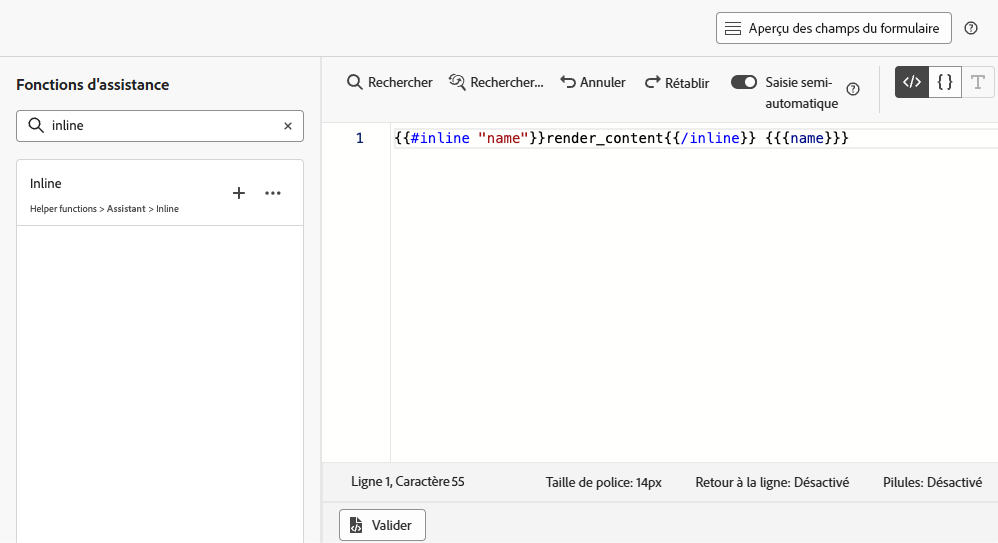{width="85%"}

1. Remplacez `"name"` par un ID unique pour identifier le champ modifiable. Par exemple, saisissez « imgURL ».

   >[!NOTE]
   >
   >L’identifiant du champ doit être unique et ne doit pas comporter d’espaces. Cet ID doit être utilisé partout dans le contenu où vous souhaitez afficher la valeur de la variable.

1. Adaptez la syntaxe à vos besoins en ajoutant les paramètres présentés dans le tableau ci-dessous :

   | Action | Paramètre | Exemple |
   | ------- | ------- | ------- |
   | Déclarez un champ modifiable avec une **valeur par défaut**. Lorsque vous ajoutez le modèle à votre contenu, cette valeur par défaut est utilisée si vous ne la personnalisez pas. | Ajoutez la valeur par défaut entre les balises intégrées. | `{{#inline "editableFieldID"}}default_value{{/inline}}` |
   | Définissez un **libellé** pour le champ modifiable. Ce libellé s’affiche dans l’éditeur de code lors de la modification des champs du modèle. | `name="title"` | `{{#inline "editableFieldID" name="title"}}default_value{{/inline}}` |

   <!--
    | Action | Parameter| Example |
    | ------- | ------- | ------- |
    |Declare an editable field containing an **image source** that needs to be published.|`assetType="image"`|`{{#inline "editableFieldID" assetType="image"}}default_value{{/inline}}`|
    |Declare an editable field containing an **URL** that needs to be tracked.br/>Note that out-of-the-box "Mirror page URL" and "Unsubscribe link" predefined blocks cannot become editable fields.>|`assetType="url"`|`{{#inline "editableFieldID" assetType="url"}}default_value{{/inline}}`|
    -->

1. Cliquez sur **[!UICONTROL Prévisualiser les champs de formulaire]** pour vérifier la façon dont les champs de formulaire modifiables s’afficheront dans les expériences basées sur du code qui utilisent ce modèle.

   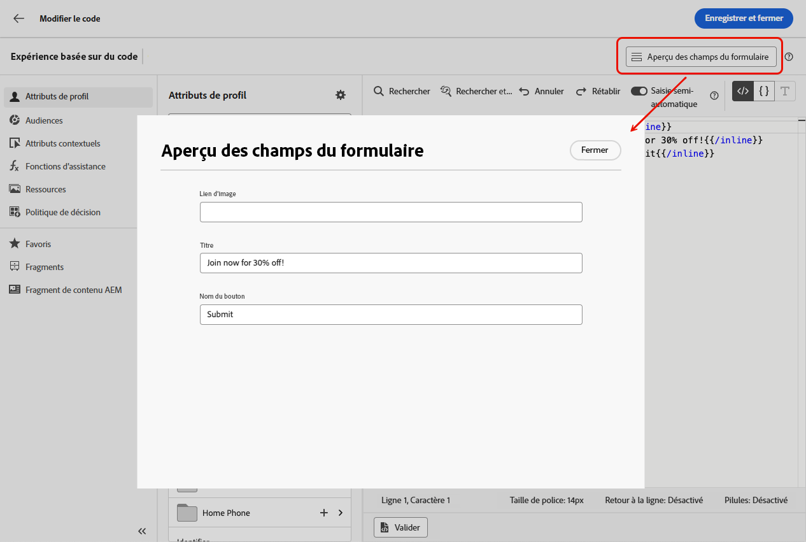{width="85%"}

1. Utilisez la syntaxe `{{{name}}}` dans votre code à tous les endroits où vous souhaitez afficher la valeur du champ modifiable. Remplacez `name` par l’ID unique du champ défini précédemment.

   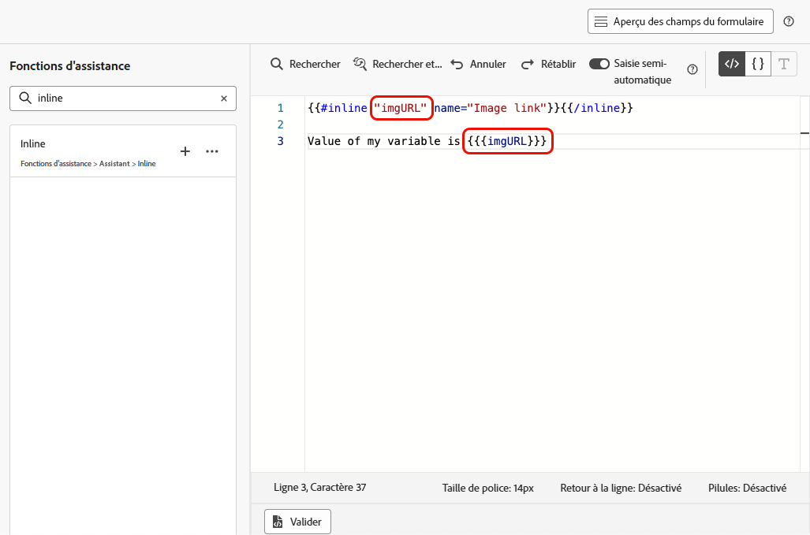{width="85%"}

1. Procédez de la même manière pour ajouter d’autres champs modifiables, en encapsulant chacun d’eux avec les balises `{{#inline}}` et `{{/inline}}`.

1. Modifiez le reste de votre code selon vos besoins, y compris les identifiants correspondant aux champs modifiables que vous avez définis. [Voici comment procéder](create-code-based.md#edit-code)

   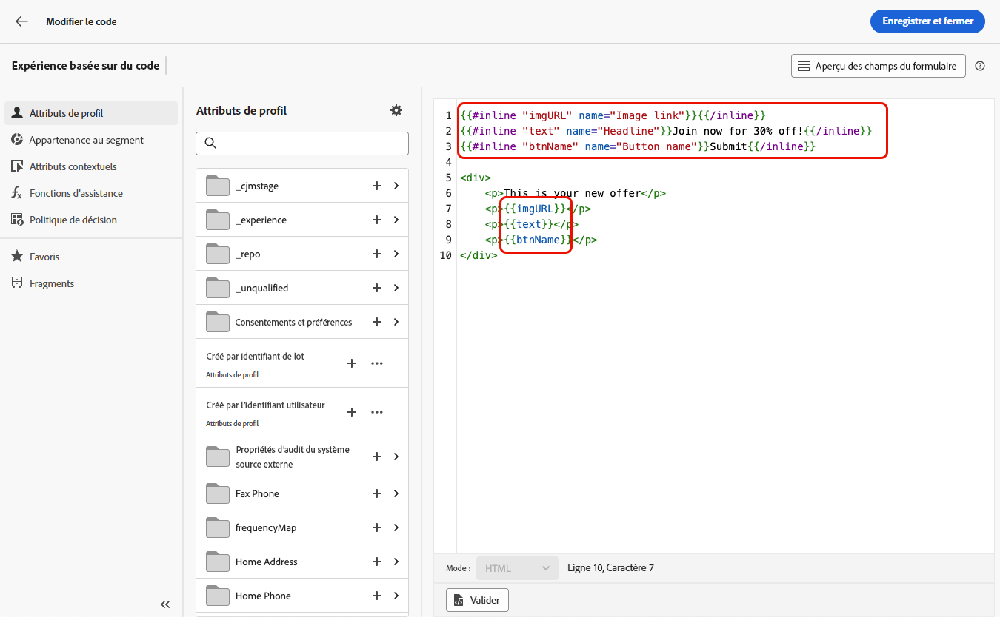

1. Enregistrez votre modèle.

### Utiliser des politiques de décision dans des champs de formulaire modifiables {#decision-policy-in-form-fields}

Lors de la création d’un modèle de contenu d’expérience basée sur du code, vous pouvez utiliser une politique de décision pour exploiter les offres dans vos champs de formulaire modifiables.

1. Créez un modèle d’expérience basée sur du code comme décrit [ci-dessus](#add-editable-fields).

1. Cliquez sur **[!UICONTROL Ajouter une politique de décision]** soit à l’aide de l’icône **[!UICONTROL Afficher la prise de décision]** située dans le rail droit de l’écran d’édition, soit en utilisant l’éditeur d’expression de la section **[!UICONTROL Politique de décision]** dans le menu de gauche.

   Découvrez comment créer une politique de décision dans [cette section](../experience-decisioning/create-decision.md#create-decision).

1. Cliquez sur le bouton **[!UICONTROL Insérer une politique]**. Le code correspondant à la politique de décision est ajouté.

   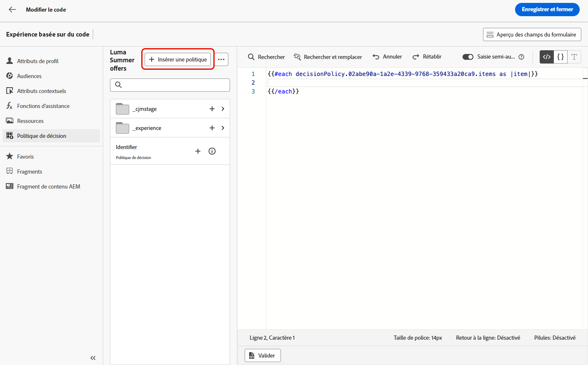

1. Après la balise `{{#each}}`, insérez le code correspondant aux champs de formulaire modifiables à ajouter, en utilisant la syntaxe **inline** décrite [ci-dessus](#add-editable-fields). Remplacez `"name"` par un ID unique pour identifier votre champ modifiable. Dans cet exemple, utilisez « title ».

   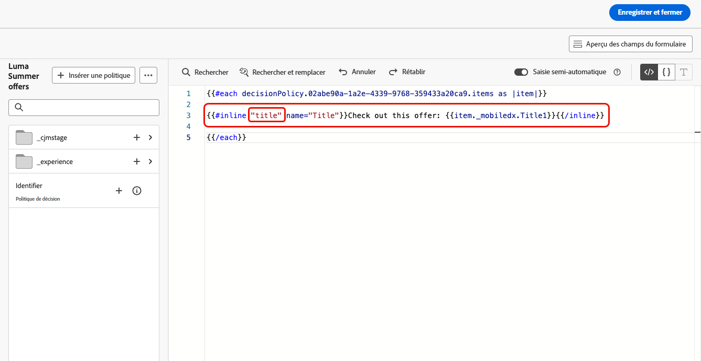{width="90%"}

1. Cliquez sur **[!UICONTROL Prévisualiser les champs de formulaire]** pour vérifier la façon dont les champs de formulaire modifiables s’afficheront dans les expériences basées sur du code qui utilisent ce modèle.

   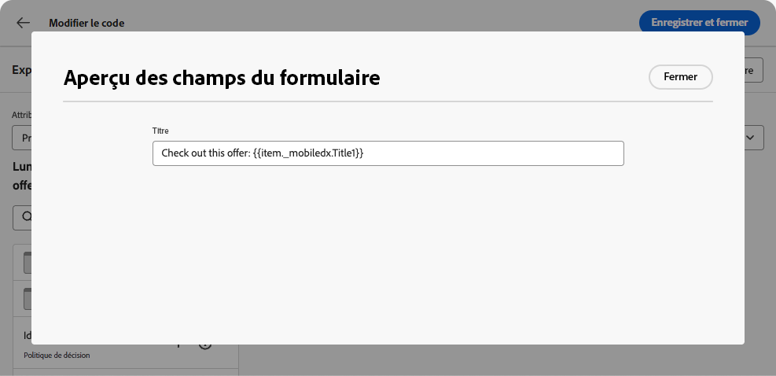{width="70%"}

1. Insérez le reste de votre code au-dessus de la balise `{{/each}}`. Utilisez la syntaxe `{{{name}}}` dans votre code à tous les emplacements où vous souhaitez afficher la valeur du champ modifiable. Dans cet exemple, remplacez `name` par « title ».

   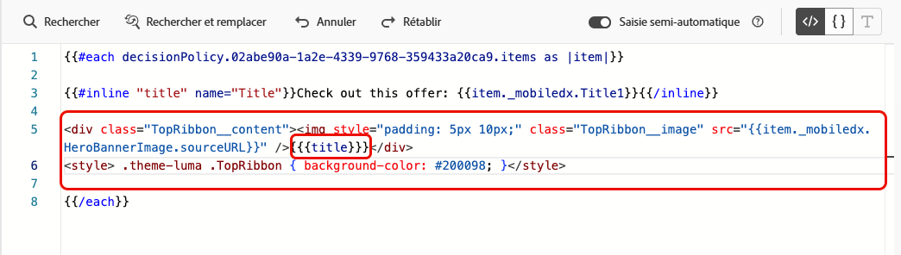{width="85%"}

1. Enregistrez votre modèle.

### Exemples de code {#code-examples}

Vous trouverez ci-dessous quelques exemples de modèles JSON et HTML, dont certains incluent des politiques de décision.

**Modèle JSON :**

```
{{#inline "title" name="Title"}}Best gear for winter is here for you!{{/inline}} 
{{#inline "description" name="Description"}}Add description{{/inline}} 
{{#inline "imgURL" name="Image Link"}}Add link{{/inline}} 
{{#inline "number_of_items" name="Number of items"}}23{{/inline}}

{
  "title": "{{{title}}}",
  "description": "{{{description}}}",
  "imageUrl": "{{{imgURL}}}",
  "number_of_items": {{{number_of_items}}}, 
  "code": "DEFAULT"
}
```

>[!NOTE]
>
>Lors du référencement des champs intégrés dans la payload JSON :
>
>* Les champs de type chaîne doivent être placés entre des guillemets doubles.
>* Les entiers et les valeurs booléennes NE doivent PAS être placés entre des guillemets doubles. (Voir le champ `number_of_items` dans l’exemple ci-dessus.)

**Modèle JSON avec prise de décision :**

```
{ 
"offer": [ 
{{#each decisionPolicy.fff709b7-7fef-4e4e-83d7-594fbcf196c1.items as |item|}} 
{{#inline "title" name="Title"}}{{item._mobiledx.Title1}}{{/inline}} {{#inline "description" name="Description"}}{{item._mobiledx.Title2}}{{/inline}} {{#inline "imgURL" name="Image Link"}}https://luma.enablementadobe.com/content/luma/us/en/experience/warming-up/_jcr_content/root/hero_image.coreimg.jpeg{{/inline}} 

{ 
"title": "{{{title}}}", 
"description": "{{{description}}}", 
"imageUrl": "{{{imgURL}}}", 
"link": "https://lumaenablement.adobe.com/web/luma/home", "code": "DEFAULT" 
}, 
{{/each}}
] 
}
```

>[!NOTE]
>
>Les champs intégrés pour lesquels vous souhaitez utiliser des éléments de prise de décision doivent être placés dans le bloc de politique de décision, entre les balises `{{#each}}` et `{{/each}}`.

**Modèle HTML :**

```
{{#inline "title" name="Title"}}Please enter title here{{/inline}} 
{{#inline "imgSrc" name="Image link"}}{{/inline}} 

<div class="TopRibbon__content">{{{title}}}</div> 
<style> .theme-luma .TopRibbon { background-color: #200098; }</style>
```

**Modèle HTML avec prise de décision :**

```
{{#each decisionPolicy.f112884a-5654-43ad-9d6d-dbd32ae23ee6.items as |item|}} 
{{#inline "title" name="Title"}}Title is: {{item._mobiledx.Title1}}{{/inline}} 

<div class="TopRibbon__content">{{{title}}}</div> 
<style> .theme-luma .TopRibbon { background-color: #200098; }</style> 

{{/each}}
```

## Modifier les champs de formulaire dans une expérience basée sur du code {#edit-form-fields}

>[!CONTEXTUALHELP]
>id="ajo_code_based_form_fields"
>title="Que sont les champs de formulaire ?"
>abstract="Cette expérience basée sur du code contient des champs de formulaire que vous pouvez facilement modifier sans avoir à manipuler le code dans l’éditeur de personnalisation."

Maintenant que le modèle de contenu comportant les champs de formulaire modifiables prédéfinis est créé, vous pouvez créer une expérience basée sur du code en utilisant ce modèle de contenu.

Vous pourrez facilement modifier les champs de formulaire d’un parcours ou d’une campagne d’expérience basée sur du code, sans ouvrir l’éditeur de personnalisation.

>[!NOTE]
>
>Cette étape est généralement effectuée par une persona de spécialiste marketing.

1. À partir de l’activité de parcours ou de l’écran de modification de la campagne, sélectionnez le modèle de contenu contenant les champs de formulaires modifiables. [Découvrez comment utiliser les modèles de contenu.](../content-management/use-content-templates.md)

   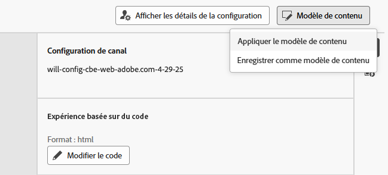{width="60%"}

   >[!CAUTION]
   >
   >Les modèles disponibles à la sélection sont définis sur HTML ou JSON en fonction de la configuration de canal choisie précédemment. Seuls les modèles compatibles sont affichés.

1. Les champs prédéfinis dans le modèle de contenu sélectionné sont disponibles dans le volet de droite. <!--The code preview is displayed with the rest of the code.-->

   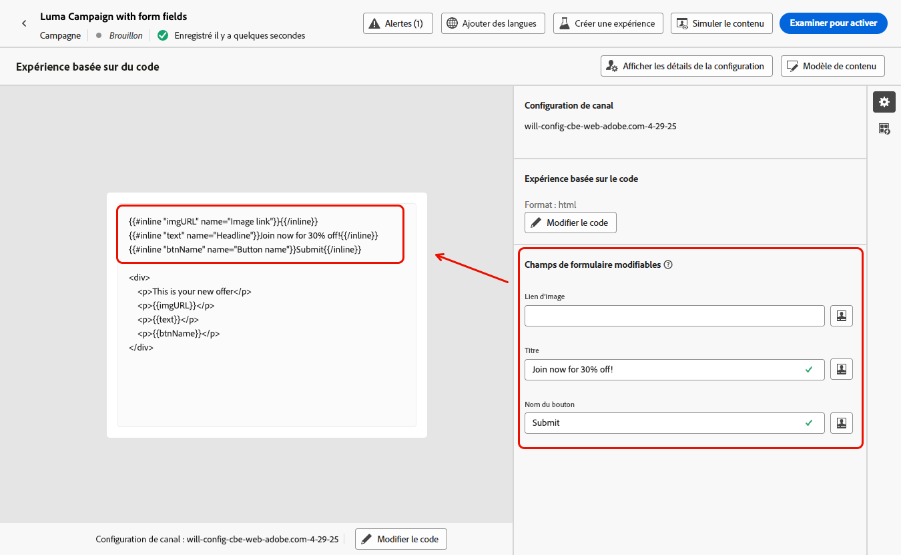

1. Dans la section **[!UICONTROL Champs de formulaire modifiables]** vous pouvez effectuer les opérations suivantes :

   * Modifier chaque valeur directement dans les champs modifiables, sans ouvrir l’éditeur de code

   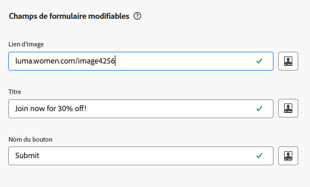{width="60%"}

   * Cliquer sur l’icône de personnalisation pour modifier chaque champ à l’aide de l’[éditeur de code](../personalization/personalization-build-expressions.md)

   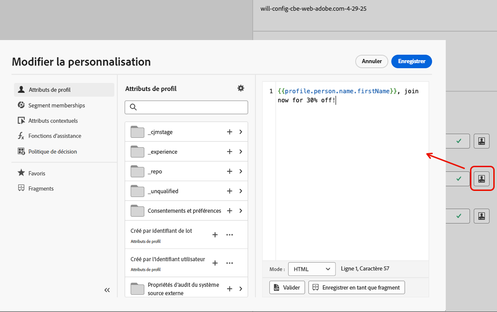{width="70%"}

   >[!NOTE]
   >
   >Dans les deux cas, vous ne pouvez modifier qu’un seul champ à la fois et vous ne pouvez pas modifier le reste du contenu de l’expérience basée sur du code.

1. Si une [politique de décision est ajoutée](#decision-policy-in-form-fields) au modèle de contenu, elle inclut tous les attributs disponibles dans le [schéma de catalogue des offres](../experience-decisioning/catalogs.md). Vous pouvez modifier l’élément de décision directement dans l’interface ou à l’aide de l’éditeur d’expression.

1. Pour modifier le reste du code, cliquez sur le bouton **[!UICONTROL Modifier le code]** et mettez à jour l’intégralité du contenu de votre expérience basée sur du code, y compris les champs de formulaire modifiables. [En savoir plus](create-code-based.md#edit-code)

## Vidéo pratique {#video}

Découvrez comment ajouter des champs modifiables aux modèles de contenu de canal d’expérience basée sur du code.

>[!VIDEO](https://video.tv.adobe.com/v/3463990/?learn=on&#x26;enablevpops)
