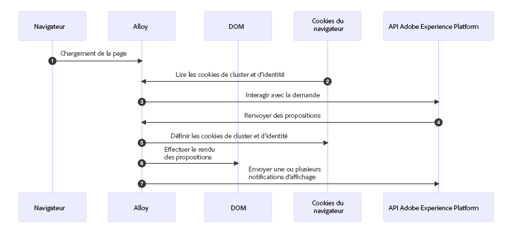
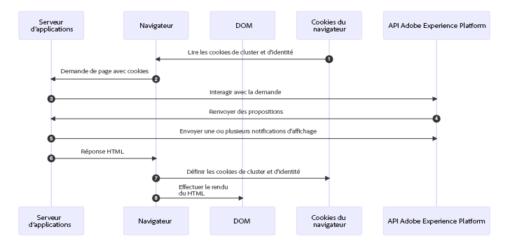

# Exemples de méthodes de mise en œuvre basées sur le code {#implementation-samples}

L’expérience basée sur le code est compatible avec n’importe quelle mise en œuvre du client ou de la cliente. Sur cette page, vous trouverez des exemples pour chaque méthode de mise en œuvre :

* [Côté client](#client-side-implementation)
* [Côté serveur](#server-side-implementation)
* [Hybride](#hybrid-implementation)

>[!IMPORTANT]
>
>Suivez [ce lien](https://github.com/adobe/alloy-samples/tree/main/ajo){target="_blank"} pour trouver des exemples de mise en oeuvre pour différents cas d’utilisation de personnalisation et d’expérimentation. Consultez-les et exécutez-les afin de mieux comprendre les étapes de mise en œuvre nécessaires et le fonctionnement du flux de personnalisation de bout en bout.

## Mise en œuvre côté client {#client-side-implementation}

Si vous disposez d’une mise en œuvre côté client, vous pouvez utiliser l’un des SDK AEP client : SDK AEP Web ou SDK AEP Mobile. Les étapes ci-dessous décrivent le processus de récupération du contenu publié en périphérie par les campagnes d’expérience basées sur le code dans un exemple de mise en œuvre du SDK Web et l’affichage du contenu personnalisé.

### Fonctionnement

1. Le [SDK Web](https://experienceleague.adobe.com/docs/experience-platform/edge/home.html?lang=fr){target="_blank"} est inclus dans la page.

1. Vous devez utiliser la commande `sendEvent` et spécifier l’URI de surface pour récupérer le contenu de personnalisation.

   ```javascript
   alloy("sendEvent", {
   renderDecisions: true,
   personalization: {
       surfaces: ["#sample-json-content"],
   },
   }).then(applyPersonalization("#sample-json-content"));
   ```

1. Les éléments d’expérience basés sur le code doivent être appliqués manuellement par le code de mise en œuvre (à l’aide de la méthode [`applyPersonalization`](https://github.com/adobe/alloy-samples/blob/ac83b6927d007dc456caad2c6ce0b324c99c26c9/ajo/personalization-client-side/public/script.js){target="_blank"}) pour mettre à jour le modèle DOM en fonction de la décision.

1. Pour les campagnes d’expériences basées sur le code, les événements d’affichage doivent être envoyés manuellement pour indiquer le moment où le contenu a été affiché. Cela s’effectue via la commande `sendEvent`.

```javascript
function sendDisplayEvent(decision) {
  const { id, scope, scopeDetails = {} } = decision;

  alloy("sendEvent", {

    xdm: {
      eventType: "decisioning.propositionDisplay",
      _experience: {
        decisioning: {
          propositions: [
            {
              id: id,
              scope: scope,
              scopeDetails: scopeDetails,
            },
          ],
        },
      },
    },
  });
}
```

1. Pour les campagnes d’expérience basées sur du code, les événements d’interaction doivent être envoyés manuellement pour indiquer quand un utilisateur a interagi avec le contenu. Cela s’effectue via la commande `sendEvent`.

```javascript
function sendInteractEvent(label, proposition) {
  const { id, scope, scopeDetails = {} } = proposition;

  alloy("sendEvent", {
    
    xdm: {
      eventType: "decisioning.propositionInteract",
      _experience: {
        decisioning: {
          propositions: [
            {
              id: id,
              scope: scope,
              scopeDetails: scopeDetails,
            },
          ],
          propositionEventType: {
            interact: 1
          },
          propositionAction: {
            label: label
          },
        },
      },
    },
  });
}
```

### Principales observations

**Cookies**

Les cookies sont utilisés pour conserver l’identité de l’utilisateur ou de l’utilisatrice et les informations de cluster. Lors de l’utilisation d’une mise en œuvre côté client, le SDK Web gère le stockage et l’envoi automatiques de ces cookies pendant le cycle de vie des requêtes.

| Cookie | Rôle | Stocké par | Envoyé par |
| ------------------------ | -------------------------------------------------------------------------- | --------- | ------- |
| kndctr_AdobeOrg_identity | Contient des détails de l’identité de l’utilisateur ou de l’utilisatrice | SDK Web | SDK Web |
| kndctr_AdobeOrg_cluster | Indique quel cluster Edge d’expérience doit être utilisé pour répondre aux requêtes | SDK Web | SDK Web |

**Demander l’emplacement**

Les requêtes envoyées à l’API Adobe Experience Platform sont nécessaires pour obtenir des propositions et envoyer une notification d’affichage. Lors de l’utilisation d’une mise en œuvre côté client, le SDK Web effectue ces requêtes lorsque la commande `sendEvent` est utilisée.

| Requête | Créée par |
| ---------------------------------------------- | ----------------------------------- |
| requête d’interaction pour obtenir des propositions | SDK Web utilisant la commande sendEvent |
| requête d’interaction pour envoyer des notifications d’affichage | SDK Web utilisant la commande sendEvent |

**Diagramme de flux**



## Mise en œuvre côté serveur {#server-side-implementation}

Si vous disposez d’une mise en œuvre côté serveur, vous pouvez utiliser l’une des API AEP Edge Network. Les étapes ci-dessous décrivent le processus de récupération du contenu publié en périphérie par les campagnes d’expérience basées sur le code dans un exemple de mise en œuvre de l’API Edge Network pour une page web et l’affichage du contenu personnalisé.

### Fonctionnement

1. La page web est demandée et tous les cookies précédemment stockés par le navigateur, précédés du préfixe `kndctr_`, sont inclus.
1. Lorsque la page est demandée auprès du serveur d’applications, un événement est envoyé au [point d’entrée de la collecte de données interactive](https://experienceleague.adobe.com/docs/experience-platform/edge-network-server-api/data-collection/interactive-data-collection.html?lang=fr) pour récupérer du contenu de personnalisation. Cet exemple d’application utilise des méthodes d’assistance pour simplifier la création et l’envoi de requêtes à l’API (voir [aepEdgeClient.js](https://github.com/adobe/alloy-samples/blob/ac83b6927d007dc456caad2c6ce0b324c99c26c9/common/aepEdgeClient.js){target="_blank"}). Mais la requête est simplement un `POST` avec une payload contenant un événement et une requête. Les cookies (s’ils sont disponibles) de l’étape précédente sont inclus avec la requête dans le tableau `meta>state>entries`.

   ```javascript
   fetch(
     "https://edge.adobedc.net/ee/v2/interact?dataStreamId=abc&requestId=123",
     {
       headers: {
         accept: "*/*",
         "accept-language": "en-US,en;q=0.9",
         "cache-control": "no-cache",
         "content-type": "text/plain; charset=UTF-8",
         pragma: "no-cache",
         "sec-fetch-dest": "empty",
         "sec-fetch-mode": "cors",
         "sec-fetch-site": "cross-site",
         "sec-gpc": "1",
         "Referrer-Policy": "strict-origin-when-cross-origin",
         Referer: "https://localhost/",
       },
       body: JSON.stringify({
         event: {
           xdm: {
             eventType: "decisioning.propositionFetch",
             web: {
               webPageDetails: {
                 URL: "https://localhost/",
               },
               webReferrer: {
                 URL: "",
               },
             },
             identityMap: {
               FPID: [
                 {
                   id: "xyz",
                   authenticatedState: "ambiguous",
                   primary: true,
                 },
               ],
             },
             timestamp: "2022-06-23T22:21:00.878Z",
           },
           data: {},
         },
         query: {
           identity: {
             fetch: ["ECID"],
           },
           personalization: {
             schemas: [
               "https://ns.adobe.com/personalization/default-content-item",
               "https://ns.adobe.com/personalization/html-content-item",
               "https://ns.adobe.com/personalization/json-content-item",
               "https://ns.adobe.com/personalization/redirect-item",
               "https://ns.adobe.com/personalization/dom-action",
             ],
             surfaces: ["web://localhost/","web://localhost/#sample-json-content"],
           },
         },
         meta: {
           state: {
             domain: "localhost",
             cookiesEnabled: true,
             entries: [
               {
                 key: "kndctr_XXX_AdobeOrg_identity",
                 value: "abc123",
               },
               {
                 key: "kndctr_XXX_AdobeOrg_cluster",
                 value: "or2",
               },
             ],
           },
         },
       }),
       method: "POST",
     }
   ).then((res) => res.json());
   ```

1. L’expérience JSON de la campagne d’expérience basée sur le code est lue à partir de la réponse et utilisée lors de la production de la réponse HTML.
1. Pour les campagnes d’expérience basées sur le code, les événements d’affichage doivent être envoyés manuellement dans la mise en œuvre pour indiquer le moment où le contenu de la campagne a été affiché. Dans cet exemple, la notification est envoyée côté serveur, pendant le cycle de vie de la requête.

   ```javascript
   function sendDisplayEvent(aepEdgeClient, req, propositions, cookieEntries) {
     const address = getAddress(req);
   
     aepEdgeClient.interact(
       {
         event: {
           xdm: {
             web: {
               webPageDetails: { URL: address },
               webReferrer: { URL: "" },
             },
             timestamp: new Date().toISOString(),
             eventType: "decisioning.propositionDisplay",
             _experience: {
               decisioning: {
                 propositions: propositions.map((proposition) => {
                   const { id, scope, scopeDetails } = proposition;
   
                   return {
                     id,
                     scope,
                     scopeDetails,
                   };
                 }),
               },
             },
           },
         },
         query: { identity: { fetch: ["ECID"] } },
         meta: {
           state: {
             domain: "",
             cookiesEnabled: true,
             entries: [...cookieEntries],
           },
         },
       },
       {
         Referer: address,
       }
     );
   }
   ```

1. Lorsque la réponse HTML est renvoyée, les cookies d’identité et de cluster sont définis sur la réponse par le serveur d’applications.

### Principales observations

**Cookies**

Les cookies sont utilisés pour conserver l’identité de l’utilisateur ou de l’utilisatrice et les informations de cluster. Lors de l’utilisation d’une mise en œuvre côté serveur, le serveur d’applications doit gérer le stockage et l’envoi de ces cookies pendant le cycle de vie des requêtes.

| Cookie | Rôle | Stocké par | Envoyé par |
| ------------------------ | -------------------------------------------------------------------------- | ------------------ | ------------------ |
| kndctr_AdobeOrg_identity | Contient des détails de l’identité de l’utilisateur ou de l’utilisatrice | serveur d’applications | serveur d’applications |
| kndctr_AdobeOrg_cluster | Indique quel cluster Edge d’expérience doit être utilisé pour répondre aux requêtes | serveur d’applications | serveur d’applications |

**Emplacement de la requête**

Les requêtes envoyées à l’API Adobe Experience Platform sont nécessaires pour obtenir des propositions et envoyer une notification d’affichage. Lors de l’utilisation d’une mise en œuvre côté client, le SDK Web effectue ces requêtes lorsque la commande `sendEvent` est utilisée.

| Requête | Créée par |
| ---------------------------------------------- | ------------------------------------------------------------ |
| requête d’interaction pour obtenir des propositions | serveur d’applications appelant l’API Adobe Experience Platform |
| requête d’interaction pour envoyer des notifications d’affichage | serveur d’applications appelant l’API Adobe Experience Platform |

**Diagramme de flux**



## Implémentation hybride {#hybrid-implementation}

Si vous disposez d’une mise en œuvre hybride, consultez les liens ci-dessous.

* Blog sur les technologies Adobe : [Personnalisation hybride dans le SDK Web d’Adobe Experience Platform](https://blog.developer.adobe.com/hybrid-personalization-in-the-adobe-experience-platform-web-sdk-6a1bb674bf41){target="_blank"}
* Documentation SDK : [Personnalisation hybride à l’aide du SDK Web et de l’API Edge Network Server](https://experienceleague.adobe.com/docs/experience-platform/edge/personalization/hybrid-personalization.html?lang=fr){target="_blank"}
