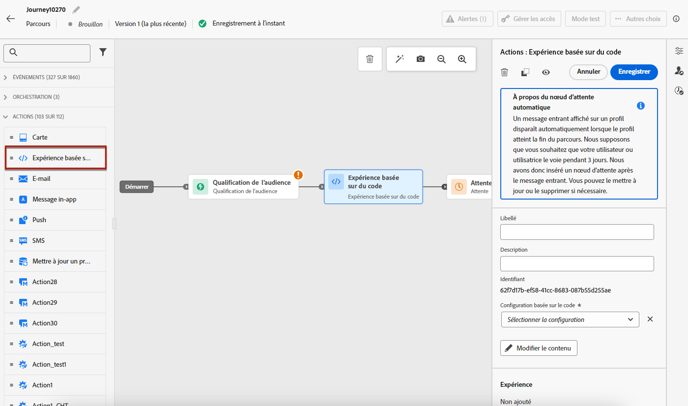
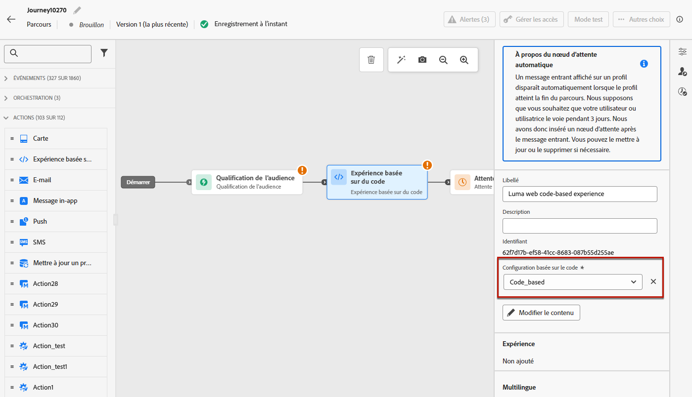
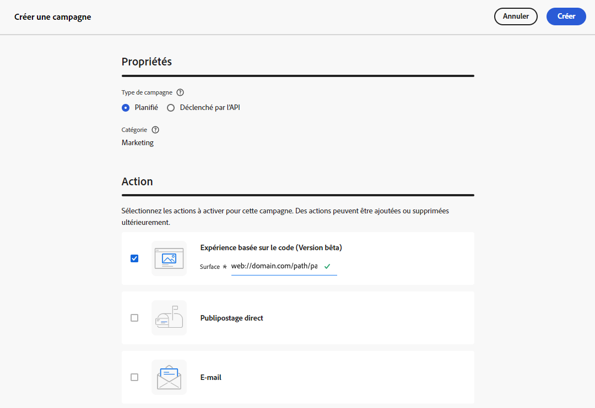
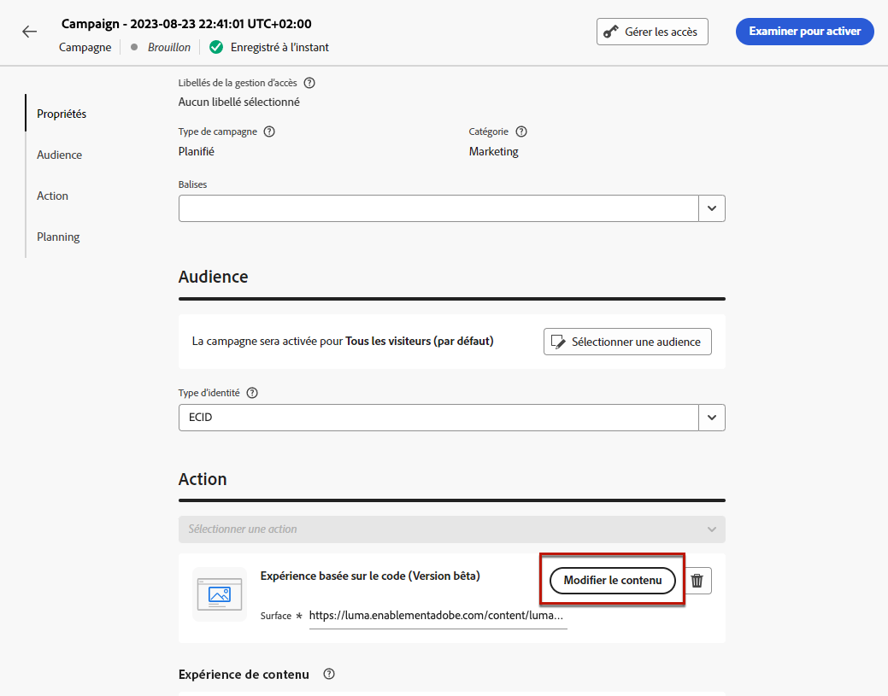
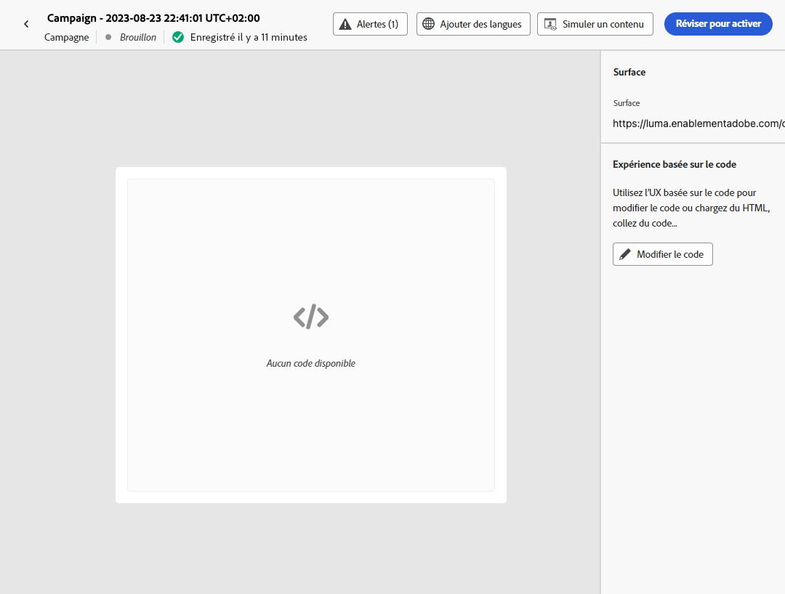
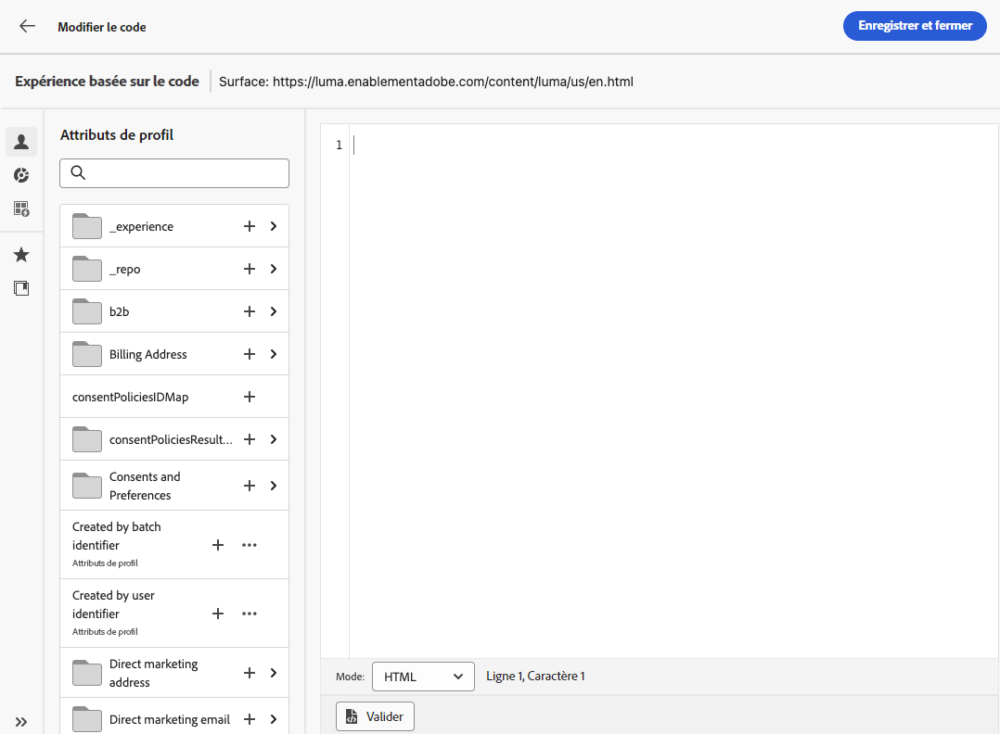
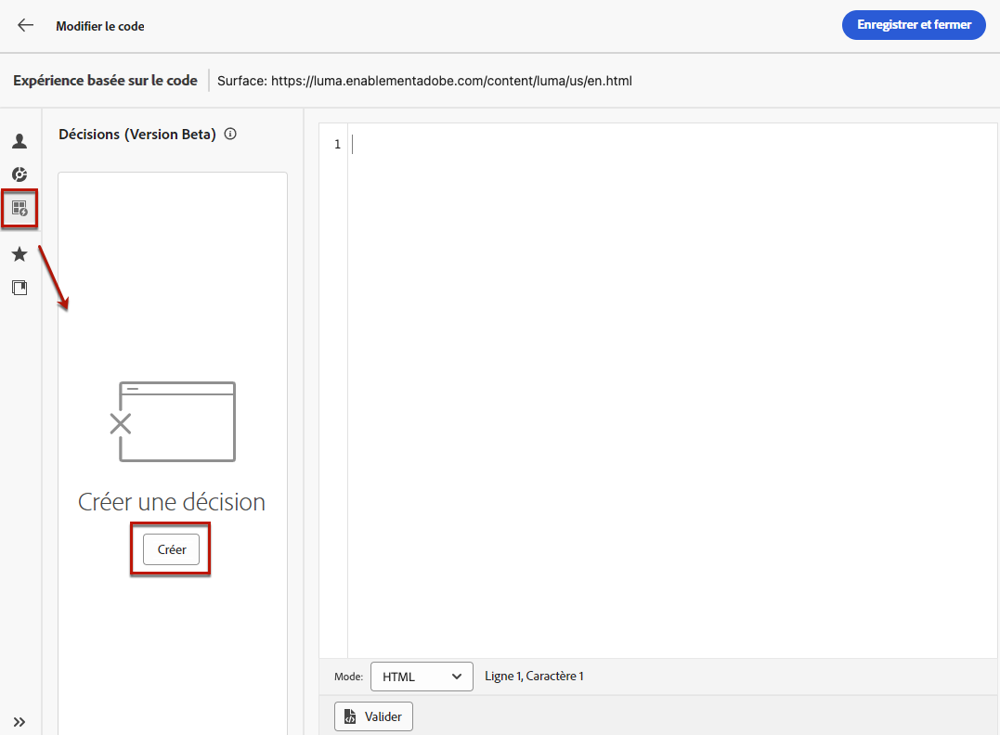
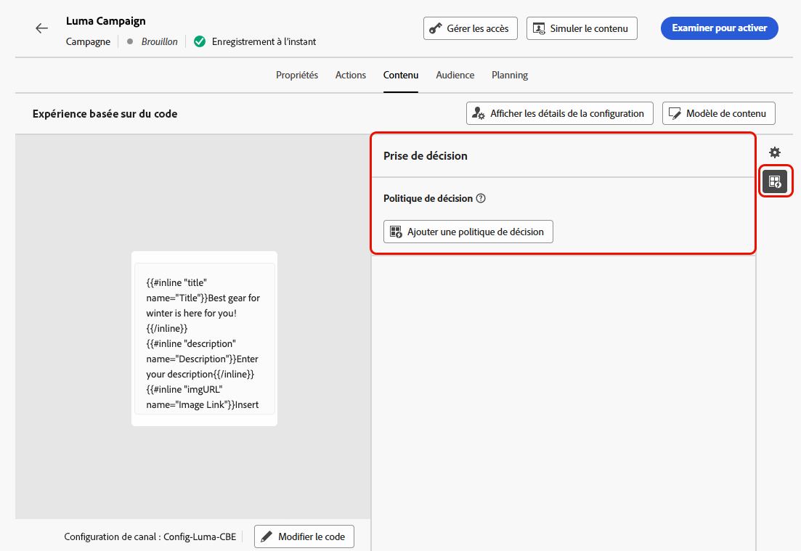

# Créer des expériences basées sur du code {#create-code-based}

Dans [!DNL Journey Optimizer], vous pouvez créer des expériences basées sur du code dans un parcours ou une campagne.

## Ajouter une expérience basée sur du code par le biais d’un parcours ou d’une campagne {#create-code-based-experience}

Pour commencer à créer votre expérience basée sur du code par le biais d’un parcours ou d’une campagne, suivez les étapes ci-dessous.

>[!BEGINTABS]

>[!TAB Ajouter une expérience basée sur du code à un parcours]

Pour ajouter une activité **expérience basée sur du code** à un parcours, procédez comme suit :

1. [Créez un parcours](../building-journeys/journey-gs.md).

1. Débutez votre parcours avec une activité [Événement](../building-journeys/general-events.md) ou [Lecture d’audience](../building-journeys/read-audience.md).

1. Effectuez un glisser-déposer d&#39;une activité **[!UICONTROL Action]** depuis la section **[!UICONTROL Actions]** de la palette. En savoir plus sur l’activité [Action](../building-journeys/journey-action.md).

   >[!IMPORTANT]
   >
   >Tous les canaux natifs étant désormais accessibles par le biais de l’activité Action , les activités de canal natives héritées seront abandonnées avec la version de mars. Les parcours existants qui incluent des actions héritées continueront à fonctionner en l’état. Aucune migration n’est requise.

1. Sélectionnez **[!UICONTROL Expérience basée sur du code]** comme type d’action.

   

   >[!NOTE]
   >
   >Comme l’activité **Expérience basée sur du code** est une activité d’expérience entrante, elle est accompagnée d’une activité **Attente** de 3 jours. [En savoir plus](../building-journeys/wait-activity.md#auto-wait-node)

1. Saisissez un **[!UICONTROL Libellé]** pour identifier votre action dans la zone de travail du parcours.

1. Cliquez sur le bouton **[!UICONTROL Configurer l’action]**.

1. Vous accédez à l’onglet **[!UICONTROL Actions]**. À partir de là, sélectionnez ou créez la configuration d’expérience basée sur le code à utiliser. [En savoir plus](code-based-configuration.md)

   

   >[!NOTE]
   >
   >Lorsque plusieurs actions d’expérience basée sur du code utilisent la même configuration des canaux, le **[!UICONTROL score de priorité]** du parcours détermine ce qui est diffusé à l’utilisateur ou à l’utilisatrice s’ils sont qualifiés pour plusieurs actions. [Découvrir les scores de priorité](../conflict-prioritization/priority-scores.md)

1. Sélectionnez le bouton **[!UICONTROL Modifier le contenu]** et modifiez votre contenu selon vos besoins à l’aide de l’éditeur de personnalisation. [En savoir plus](#edit-code)

   Vous pouvez également utiliser un modèle de contenu existant comme base pour le contenu de votre code. Notez que les modèles disponibles pouvant être choisis sont définis sur HTML ou JSON en fonction de la configuration de canal choisie précédemment. [Découvrez comment utiliser les modèles de contenu.](../content-management/use-content-templates.md)

1. Vous pouvez ajouter une ou plusieurs actions entrantes à votre expérience basée sur du code en cliquant sur le bouton **[!UICONTROL Ajouter une action]**. [En savoir plus](../building-journeys/journey-action.md#multi-action)

1. Revenez à la zone de travail parcours. Si nécessaire, complétez votre flux de parcours en faisant glisser et en déposant des actions ou des événements supplémentaires. [En savoir plus](../building-journeys/about-journey-activities.md)

Pour plus d’informations sur la création, la configuration et la publication d’un parcours, consultez [cette page](../building-journeys/journey-gs.md).

>[!TAB Créer une expérience de campagne basée sur le code]

Pour commencer à créer votre **expérience basée sur du code** par le biais d’une campagne, suivez les étapes ci-dessous.

1. Création d’une campagne. [En savoir plus](../campaigns/create-campaign.md)

1. Sélectionnez le type de campagne **Planifié - Marketing**.

1. Suivez les étapes de création d’une campagne, telles que les propriétés de la campagne, l’[audience](../audience/about-audiences.md) et le [planning](../campaigns/create-campaign.md#schedule). Pour plus d’informations sur la configuration d’une campagne, consultez cette [page](../campaigns/get-started-with-campaigns.md).

1. Sélectionnez l’action **[!UICONTROL Expérience basée sur le code]**.

1. Sélectionnez ou créez la configuration d’expérience basée sur du code à utiliser. [En savoir plus](code-based-configuration.md)

   

   >[!NOTE]
   >
   >Lorsque plusieurs actions d’expérience basée sur du code utilisent sur la même configuration des canaux, le **[!UICONTROL score de priorité]** de la campagne détermine ce qui est diffusé à l’utilisateur ou à l’utilisatrice s’ils sont qualifiés pour plusieurs actions. [Découvrir les scores de priorité](../conflict-prioritization/priority-scores.md)

1. Modifiez le contenu selon vos besoins à l’aide de l’éditeur de personnalisation. [En savoir plus](#edit-code)

   Vous pouvez également utiliser un modèle de contenu existant comme base pour le contenu de votre code. Notez que les modèles disponibles pouvant être choisis sont définis sur HTML ou JSON en fonction de la configuration de canal choisie précédemment. [Découvrez comment utiliser les modèles de contenu.](../content-management/use-content-templates.md)

   <!---->

Pour plus d’informations sur la création, la configuration et l’activation d’une campagne, consultez [cette page](../campaigns/get-started-with-campaigns.md).

➡️ [Découvrez comment créer une campagne d’expérience basée sur du code dans cette vidéo.](#video)

>[!ENDTABS]

## Modifier le contenu du code {#edit-code}

>[!CONTEXTUALHELP]
>id="ajo_code_based_experience"
>title="Utiliser l’éditeur de personnalisation"
>abstract="Insérez et modifiez le code que vous souhaitez diffuser dans le cadre de cette action d’expérience basée sur le code."
>additional-url="https://experienceleague.adobe.com/fr/docs/journey-optimizer/using/content-management/personalization/personalization-build-expressions" text="Utiliser l’éditeur de personnalisation"

Pour modifier le contenu de l’expérience basée sur du code, suivez les étapes ci-après.

1. Dans l’écran de modification de la campagne ou d’activité du parcours, sélectionnez **[!UICONTROL Modifier le code]**.

   

   >[!NOTE]
   >
   >Si vous utilisez un modèle de contenu d’expérience basée sur du code avec des champs de formulaire modifiables prédéfinis, vous pouvez gérer le contenu de ces champs sans ouvrir l’éditeur de personnalisation. [En savoir plus](code-based-form-fields.md)

1. L’[éditeur de personnalisation](../personalization/personalization-build-expressions.md) s’ouvre. Il s’agit d’une interface de création d’expérience non visuelle qui vous permet de créer votre code.

1. Vous pouvez passer du mode de création HTML au mode JSON, et inversement.

   

   >[!CAUTION]
   >
   >Si vous changez de mode de création, vous perdrez l’ensemble de votre code actuel. Veillez donc à changer de mode avant de commencer la création.

1. Saisissez votre code selon vos besoins. Vous pouvez utiliser l’éditeur de personnalisation de [!DNL Journey Optimizer] et toutes ses fonctionnalités de personnalisation et de création. [En savoir plus](../personalization/personalization-build-expressions.md)

1. Si nécessaire, vous pouvez ajouter des fragments d’expression HTML ou JSON. [Voici comment procéder](../personalization/use-expression-fragments.md)

   Vous pouvez également enregistrer une partie de votre contenu de code en tant que fragment. [Voici comment procéder](../content-management/fragments.md#visual-expression)

1. Dans les expériences basées sur du code, vous pouvez utiliser la fonctionnalité de prise de décision. Sélectionnez l’icône **[!UICONTROL Politique de décision]** dans la barre de gauche, puis cliquez sur **[!UICONTROL Ajouter une politique de décision]**. [En savoir plus](../experience-decisioning/create-decision.md#create-decision)

   

   <!---->

   Dans l’écran de modification du parcours ou de la campagne, vous pouvez également ajouter directement une politique de décision sans ouvrir l’éditeur de personnalisation. Utilisez l’icône dédiée dans le rail de droite pour afficher la section **[!UICONTROL Prise de décision]**.

   <!---->

   Les étapes détaillées pour créer une politique de décision sont présentées dans [cette section](../experience-decisioning/create-decision.md#create-decision).

1. Cliquez sur **[!UICONTROL Enregistrer et fermer]** pour confirmer vos modifications.

Désormais, dès que votre développeur ou développeuse lance un appel d’API ou de SDK pour récupérer du contenu pour la surface définie dans votre configuration de canal, les modifications sont appliquées à votre page web ou votre application.

## Vidéo pratique{#video}

La vidéo ci-dessous montre comment créer une campagne par expérience basée sur du code, configurer ses propriétés, la tester et la publier.

>[!VIDEO](https://video.tv.adobe.com/v/3428868/?quality=12&learn=on)
