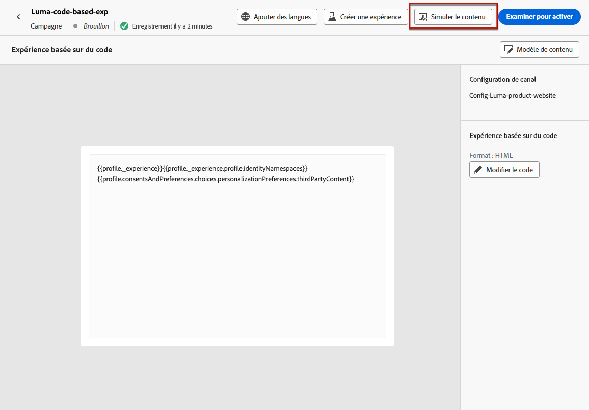

# Créer des expériences basées sur le code {#create-code-based}

Dans [!DNL Journey Optimizer], vous ne pouvez actuellement créer des expériences basées sur le code que dans des **campagnes**.

Des mécanismes de sécurisation et recommandations spécifiques pour les expériences basées sur le code sont détaillés dans [cette page](code-based-prerequisites.md).

## Créer une campagne basée sur le code {#create-code-based-campaign}

Pour commencer à créer votre expérience basée sur le code par le biais d’une campagne, suivez les étapes ci-dessous.

1. Accédez au menu **[!UICONTROL Campagnes]**, puis cliquez sur **[!UICONTROL Créer une campagne]**. [En savoir plus](../campaigns/create-campaign.md)

1. Sélectionner le type de campagne que vous souhaitez exécuter.

   * **Scheduled - Marketing** : permet d’exécuter la campagne immédiatement ou à une date spécifiée. Les campagnes planifiées visent à envoyer des messages marketing. Elles sont configurées et exécutées à partir de l’interface d’utilisation.

   * **API-triggered - Marketing/Transactional** : permet d’exécuter la campagne à l’aide d’un appel API. Les campagnes déclenchées par API sont destinées à envoyer des messages marketing, ou transactionnels, c’est-à-dire des messages envoyés suite à une action effectuée par une personne : réinitialisation du mot de passe, abandon de panier, etc.

1. Suivez les étapes de création d’une campagne, telles que les propriétés de la campagne, l’[audience](../audience/about-audiences.md) et le [planning](../campaigns/create-campaign.md#schedule). Pour plus d’informations sur la configuration d’une campagne, consultez cette [page](../campaigns/get-started-with-campaigns.md).

1. Sélectionnez l’action **[!UICONTROL Expérience basée sur le code]**.

1. Sélectionnez ou créez la configuration d’expérience basée sur le code. [En savoir plus](code-based-configuration.md)

   

1. Modifiez le contenu selon vos besoins à l’aide de l’éditeur de personnalisation. [En savoir plus](#edit-code)

   

## Modifier le contenu du code {#edit-code}

>[!CONTEXTUALHELP]
>id="ajo_code_based_experience"
>title="Utiliser l’éditeur de personnalisation"
>abstract="Insérez et modifiez le code que vous souhaitez diffuser dans le cadre de cette action d’expérience basée sur le code."
>additional-url="https://experienceleague.adobe.com/docs/journey-optimizer/using/content-management/personalization/expression-editor/personalization-build-expressions.html?lang=fr" text="Commencer avec l’éditeur de personnalisation"

1. Dans l’écran de modification de la campagne, sélectionnez **[!UICONTROL Modifier le code]**.

   

1. L’[éditeur de personnalisation](../personalization/personalization-build-expressions.md) s’ouvre. Il s’agit d’une interface de création d’expérience non visuelle qui vous permet de créer votre code.

1. Vous pouvez passer du mode de création HTML au mode JSON, et inversement.

   

   >[!CAUTION]
   >
   >Si vous changez de mode de création, vous perdrez l’ensemble de votre code actuel. Veillez donc à changer de mode avant de commencer la création.

1. Saisissez votre code selon vos besoins. Vous pouvez utiliser l’éditeur de personnalisation de [!DNL Journey Optimizer] et toutes ses fonctionnalités de personnalisation et de création. [En savoir plus](../personalization/personalization-build-expressions.md)

1. Si nécessaire, vous pouvez ajouter des fragments d’expression HTML ou JSON. [Voici comment procéder](../personalization/use-expression-fragments.md)

   Vous pouvez également enregistrer une partie de votre contenu de code en tant que fragment. [Voici comment procéder](../content-management/fragments.md#save-as-expression-fragment)

1. Dans les campagnes basées sur le code, vous pouvez utiliser la fonctionnalité de décision d’expérience. Sélectionnez l’icône **[!UICONTROL Décisions]** dans la barre de gauche, puis cliquez sur **[!UICONTROL Créer une décision]**. [En savoir plus](../experience-decisioning/create-decision.md)

   

   >[!NOTE]
   >
   >Ces décisions pour les expériences ne sont actuellement disponibles que pour un ensemble d’organisations (disponibilité limitée). Pour en bénéficier, contactez votre représentant ou représentante Adobe.

1. Cliquez sur **[!UICONTROL Enregistrer et fermer]** pour confirmer vos modifications.

Désormais, dès que votre développeur ou développeuse lance un appel d’API ou de SDK pour récupérer du contenu pour la surface définie dans votre configuration de canal, les modifications sont appliquées à votre page web ou votre application.

## Tester la campagne basée sur le code {#test-code-based-campaign}

>[!CONTEXTUALHELP]
>id="ajo_code_based_preview"
>title="Prévisualiser votre expérience basée sur le code"
>abstract="Effectuez une simulation de ce à quoi ressemblera votre expérience basée sur le code."

Pour afficher un aperçu de votre expérience basée sur le code qui a été modifiée, suivez les étapes ci-dessous. Vous trouverez des informations détaillées sur la sélection des profils de test et la prévisualisation de votre contenu dans la [page Prévisualiser et tester votre contenu](../content-management/preview-test.md).

>[!CAUTION]
>
>Vous devez disposer de profils de test pour simuler les offres qui leur seront diffusées. Découvrez comment [créer des profils de test](../audience/creating-test-profiles.md).

1. Sur l’écran de modification du contenu ou sur l’écran de l’éditeur de personnalisation, sélectionnez **[!UICONTROL Simuler le contenu]**.

   

1. Cliquez sur **[!UICONTROL Gérer les profils de test]** pour sélectionner un ou plusieurs profils de test.

1. Un aperçu de votre expérience basée sur le code qui a été modifiée s’affiche.

<!--
    

    You can also open it in the default browser, or copy the test URI to paste it in any browser. This allows you to share the link with your team and stakeholders who will be able to preview the new web experience in any browser before the campaign goes live.

    When copying the test URI, the content displayed is the one personalized for the test profile used when the content simulation was generated in [!DNL Journey Optimizer].-->

## Activer la campagne basée sur le code {#activate-code-based-campaign}

Une fois que vous avez défini votre campagne basée sur le code et modifié votre contenu selon vos besoins à l’aide de l’[éditeur basé sur le code](#edit-code), vous pouvez la vérifier et l’activer. Suivez les étapes ci-dessous.

>[!NOTE]
>
>Vous pouvez également prévisualiser le contenu de votre campagne avant de l’activer. [En savoir plus](#test-code-based-campaign)

1. Dans votre campagne basée sur le code, sélectionnez **[!UICONTROL Examiner pour activer]**.

   

1. Vérifiez et modifiez si nécessaire le contenu, les propriétés, la configuration, l’audience et le planning.

1. Sélectionnez **[!UICONTROL Activer]**.

   

   >[!NOTE]
   >
   >Lorsque vous cliquez sur **[!UICONTROL Activer]**, les modifications des campagnes basées sur le code peuvent prendre jusqu’à 1 minute pour être prises en compte à votre emplacement.

Votre campagne basée sur le code passe au statut **[!UICONTROL Actif]** et est maintenant visible pour l’audience sélectionnée. Chaque destinataire de votre campagne peut voir vos modifications.

>[!NOTE]
>
>Si vous avez défini un planning pour votre campagne basée sur le code, celle-ci conserve le statut **[!UICONTROL Planifié]** jusqu’à ce que la date et l’heure de début soient atteintes.
>
>Si vous activez une campagne basée sur le code ayant un impact sur les mêmes emplacements qu’une autre campagne déjà active, toutes les modifications seront appliquées à vos emplacements.

En savoir plus sur l’activation des campagnes dans [cette section](../campaigns/review-activate-campaign.md).

## Arrêter une campagne basée sur le code {#stop-code-based-campaign}

Lorsqu’une campagne basée sur le code est active, vous pouvez l’arrêter afin d’empêcher votre audience de voir vos modifications. Suivez les étapes ci-dessous.

1. Sélectionnez une campagne active dans la liste.

1. Dans le menu supérieur, sélectionnez **[!UICONTROL Arrêter la campagne]**.

   

1. Les modifications que vous avez ajoutées ne seront plus visibles pour l’audience que vous avez définie.

>[!NOTE]
>
>Une fois une campagne basée sur le code arrêtée, vous ne pouvez plus la modifier ni l’activer. Vous pouvez uniquement la dupliquer et activer la campagne dupliquée.

## Rapports de campagne basée sur le code

Vous pouvez accéder aux rapports de campagne basée sur le code à partir de l’écran récapitulatif de la campagne.

Les rapports globaux portent sur les événements qui se sont produits il y a au moins deux heures et couvrent les événements sur une période sélectionnée. En comparaison, les rapports dynamiques portent sur les événements qui se sont produits au cours des dernières 24 heures, avec un intervalle de temps minimal de deux minutes à compter de l’occurrence de l’événement.

### Rapport dynamique basé sur le code {#live-report-code-based}

Dans votre **[!UICONTROL rapport dynamique]** de campagne, l’onglet **[!UICONTROL Expérience basée sur le code]** présente les informations principales relatives à vos applications et à vos pages web. [En savoir plus sur les rapports dynamiques](../reports/campaign-live-report.md)

+++En savoir plus sur les différents widgets et mesures disponibles pour le rapport d’expérience basée sur le code.

Les KPI de **[!UICONTROL performances d’expérience basée sur le code]** détaillent les informations principales relatives à l’engagement de vos visiteurs et visiteuses avec vos expériences basées sur le code, telles que :

* **[!UICONTROL Impressions]** : nombre total d’expériences diffusées à tous les utilisateurs et utilisatrices.

* **[!UICONTROL Interactions]** : nombre total d’engagements en lien avec votre application ou page web. Cela inclut toutes les actions entreprises par les personnes, telles que les clics ou toute autre interaction.

Le graphe **[!UICONTROL Résumé de l’expérience basée sur le code]** présente l’évolution de vos expériences web (impressions, impressions et interactions uniques) pour les dernières 24 heures.

<!--The **[!UICONTROL Interactions by element]** table details the main information relative to your visitors' engagement with the various elements on your app/pages.-->
+++

### Rapport global basé sur le code {#global-report-code-based}

Pour accéder directement au rapport global de campagne basée sur le code à partir de votre campagne, cliquez sur le bouton **[!UICONTROL Afficher le rapport]**. [En savoir plus sur le rapport global](../reports/campaign-global-report.md)

Depuis votre **[!UICONTROL rapport global]** de campagne, l’onglet **[!UICONTROL Expérience basée sur le code]** présente les informations principales relatives à vos applications ou vos pages web.

<!--image-->

+++En savoir plus sur les différents widgets et mesures disponibles pour le rapport d’expérience basée sur le code.

Les KPI de **[!UICONTROL performances d’expérience basée sur le code]** détaillent les informations principales relatives à l’engagement de vos visiteurs et visiteuses avec vos expériences, telles que :

* **[!UICONTROL Impressions uniques]** : nombre d’utilisateurs et d’utilisatrices uniques auxquels l’expérience a été diffusée.

* **[!UICONTROL Impressions]** : nombre total d’expériences diffusées à tous les utilisateurs et utilisatrices.

* **[!UICONTROL Interactions]** : pourcentage d’engagements avec votre application/page. Cela inclut toutes les actions entreprises par les personnes, telles que les clics ou toute autre interaction.

Le graphe **[!UICONTROL Résumé de l’expérience basée sur le code]** présente l’évolution de vos expériences web (impressions uniques, impressions et interactions) pour la période concernée.

<!--The **[!UICONTROL Interactions by element]** table details the main information relative to your visitors' engagement with the various elements on your apps/pages.-->
+++

<!--
## How-to video{#video}

The video below shows how to create a code-based campaign, configure its properties, review, and publish it.

>[!VIDEO]()

-->
