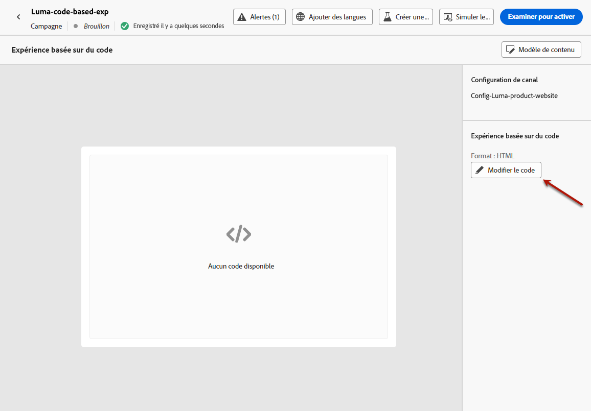
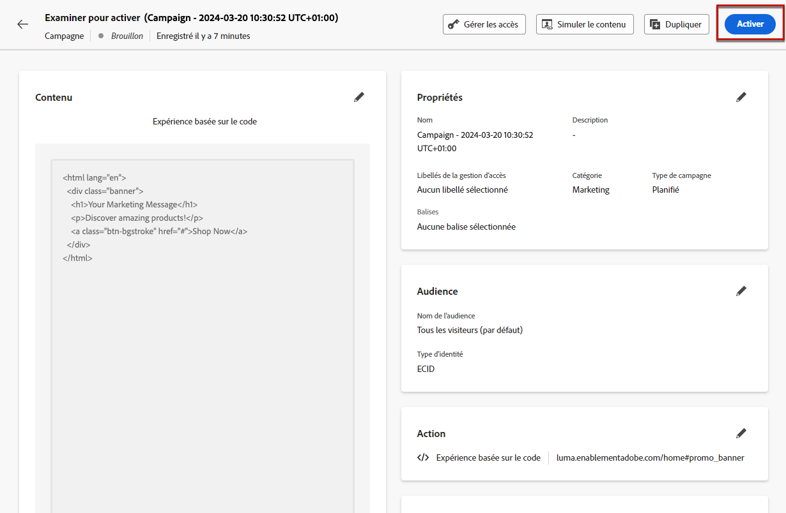

# Création d’expériences basées sur du code {#create-code-based}

>[!BEGINSHADEBOX]

Ce guide vous apportera la documentation suivante :

* [Prise en main du canal basé sur le code](get-started-code-based.md)
* [Conditions préalables basées sur le code](code-based-prerequisites.md)
* [Exemples de mise en oeuvre basés sur le code](code-based-implementation-samples.md)
* **[Création d’expériences basées sur du code](create-code-based.md)**

>[!ENDSHADEBOX]

>[!AVAILABILITY]
>
>Le canal d’expérience basé sur le code est actuellement disponible en version bêta pour sélectionner uniquement les utilisateurs. Pour rejoindre le programme Beta, contactez l’assistance clientèle d’Adobe.

## Création d’une campagne basée sur du code {#create-code-based-campaign}

Pour commencer à créer votre expérience basée sur du code par le biais d’une campagne, procédez comme suit.

>[!CAUTION]
>
>Actuellement dans [!DNL Journey Optimizer] vous pouvez uniquement créer des expériences basées sur du code en utilisant **campagnes**.

1. Création d’une campagne. [En savoir plus](../campaigns/create-campaign.md)

1. Sélectionnez la variable **[!UICONTROL Expérience basée sur le code (bêta)]** action.

1. Saisissez la surface de l’expérience basée sur le code. [En savoir plus](#surface-definition)

   

   >[!CAUTION]
   >
   >Assurez-vous que l’URI de surface utilisé dans votre campagne basée sur le code correspond à celui utilisé dans votre propre mise en oeuvre. Sinon, les modifications ne seront pas diffusées.

1. Sélectionnez **[!UICONTROL Créer]**.

1. Suivez les étapes de création d’une campagne , telles que les propriétés de la campagne, l’[audience](../audience/about-audiences.md) et le [planning](../campaigns/create-campaign.md#schedule).

   >[!NOTE]
   >
   >Pour plus d’informations sur la configuration d’une campagne, consultez cette [page](../campaigns/get-started-with-campaigns.md).

1. Modifiez votre contenu selon vos besoins à l’aide de la fonction [éditeur basé sur le code](#edit-code).

   

## Modifier le contenu du code {#edit-code}

>[!CONTEXTUALHELP]
>id="ajo_code_based_experience"
>title="Utilisation de l’éditeur d’expression"
>abstract="Insérez et modifiez le code que vous souhaitez diffuser dans le cadre de cette action d’expérience basée sur le code."
>additional-url="https://experienceleague.adobe.com/docs/journey-optimizer/using/content-management/personalization/expression-editor/personalization-build-expressions.html" text="Commencer avec l’éditeur d’expression"

1. Dans l&#39;écran d&#39;édition de campagne, sélectionnez **[!UICONTROL Modifier le code]**.

   

1. La variable [Editeur d&#39;expression](../personalization/personalization-build-expressions.md) s’ouvre. Il s’agit d’une interface de création d’expérience non visuelle qui vous permet de créer votre code.

1. Vous pouvez passer du mode de création HTML au mode JSON, et inversement.

   >[!CAUTION]
   >
   >Si vous changez de mode de création, vous perdrez l’ensemble de votre code actuel. Veillez donc à changer de mode avant de commencer la création.

1. Saisissez votre code selon vos besoins. Vous pouvez utiliser la variable [!DNL Journey Optimizer] Editeur d&#39;expression avec toutes ses fonctionnalités de personnalisation et de création. [En savoir plus](../personalization/personalization-build-expressions.md)

   

1. Dans les campagnes basées sur du code, vous pouvez utiliser la fonction de prise de décision d’expérience. Sélectionnez la variable **[!UICONTROL Décisions]** dans la barre de gauche, puis cliquez sur **[!UICONTROL Créer une décision]**. [En savoir plus](../experience-decisioning/create-decision.md)

   

   >[!NOTE]
   >
   >La fonction de prise de décision relative aux expériences est actuellement disponible en version bêta pour sélectionner uniquement les utilisateurs.

1. Cliquez sur **[!UICONTROL Enregistrer et fermer]** pour confirmer vos modifications.

Désormais, dès que votre développeur lance un appel d’API ou de SDK pour récupérer du contenu pour la surface sélectionnée, les modifications sont appliquées à votre page web ou application.

## Tester la campagne basée sur du code {#test-code-based-campaign}

>[!CONTEXTUALHELP]
>id="ajo_code_based_preview"
>title="Aperçu de votre expérience basée sur du code"
>abstract="Effectuez une simulation de l’apparence de votre expérience basée sur le code."

Pour afficher un aperçu de votre expérience modifiée basée sur le code, procédez comme suit.

>[!CAUTION]
>
>Vous devez disposer de profils de test pour simuler les offres qui leur seront diffusées. Découvrez comment [créer des profils de test](../audience/creating-test-profiles.md).

1. Dans l’écran Editeur d’expression ou Modifier le contenu, sélectionnez **[!UICONTROL Simulation du contenu]**.

   

1. Cliquez sur **[!UICONTROL Gérer les profils de test]** pour sélectionner un ou plusieurs profils de test.

1. Un aperçu de votre expérience modifiée basée sur le code s’affiche.

<!--
    

    You can also open it in the default browser, or copy the test URI to paste it in any browser. This allows you to share the link with your team and stakeholders who will be able to preview the new web experience in any browser before the campaign goes live.

    When copying the test URI, the content displayed is the one personalized for the test profile used when the content simulation was generated in [!DNL Journey Optimizer].-->

## Activation de la campagne basée sur le code {#activate-code-based-campaign}

Une fois que vous avez défini votre campagne basée sur du code et modifié votre contenu selon vos besoins à l’aide de la variable [éditeur basé sur le code](#edit-code), vous pouvez la vérifier et l’activer. Suivez les étapes ci-dessous.

>[!NOTE]
>
>Vous pouvez également prévisualiser le contenu de votre campagne avant de l’activer. [En savoir plus](#test-code-based-campaign)

1. Dans votre campagne basée sur du code, sélectionnez **[!UICONTROL Réviser pour activer]**.

   

1. Vérifiez et modifiez si nécessaire le contenu, les propriétés, la surface, l’audience et le planning.

1. Sélectionnez **[!UICONTROL Activer]**.

   

   >[!NOTE]
   >
   >Cliquez ensuite sur **[!UICONTROL Activer]**, les modifications des campagnes basées sur le code peuvent prendre jusqu’à 1 minute pour être disponibles en direct sur votre emplacement.

Votre campagne basée sur du code utilise la variable **[!UICONTROL En direct]** et est maintenant visible pour l’audience sélectionnée. Chaque destinataire de votre campagne peut voir vos modifications.

>[!NOTE]
>
>Si vous avez défini une planification pour votre campagne basée sur du code, elle comporte la variable **[!UICONTROL Planifié]** jusqu’à ce que la date et l’heure de début soient atteintes.
>
>Si vous activez une campagne basée sur du code qui a un impact sur les mêmes emplacements qu’une autre campagne déjà active, toutes les modifications seront appliquées à vos emplacements.

En savoir plus sur l’activation des campagnes dans [cette section](../campaigns/review-activate-campaign.md).

## Arrêter une campagne basée sur du code {#stop-code-based-campaign}

Lorsqu’une campagne basée sur du code est active, vous pouvez l’arrêter afin d’empêcher votre audience de voir vos modifications. Suivez les étapes ci-dessous.

1. Sélectionnez une campagne active dans la liste.

1. Dans le menu supérieur, sélectionnez **[!UICONTROL Arrêter la campagne]**.

   

1. Les modifications que vous avez ajoutées ne seront plus visibles pour l’audience que vous avez définie.

>[!NOTE]
>
>Une fois qu’une campagne basée sur du code est arrêtée, vous ne pouvez plus la modifier ni l’activer. Vous pouvez uniquement la dupliquer et activer la campagne dupliquée.

## Rapports de campagne basés sur le code

Vous pouvez accéder aux rapports de campagne basés sur du code à partir de l’écran récapitulatif de la campagne.

Les rapports globaux affichent les événements qui se sont produits il y a au moins deux heures et couvrent les événements sur une période sélectionnée. En comparaison, les rapports dynamiques portent sur les événements qui se sont produits au cours des dernières 24 heures, avec un intervalle de temps minimal de deux minutes à compter de l’occurrence de l’événement.

### Rapport en direct basé sur le code {#live-report-code-based}

À partir de la campagne **[!UICONTROL Rapport en direct]**, la variable **[!UICONTROL Expérience basée sur le code]** Cet onglet présente les informations principales relatives à vos applications ou pages web. [En savoir plus sur les rapports en direct](../reports/campaign-live-report.md)

+++En savoir plus sur les différents widgets et mesures disponibles pour le rapport d’expérience basé sur le code.

La variable **[!UICONTROL Performances de l’expérience basée sur le code]** Les indicateurs de performance clés détaillent les informations principales relatives à l’engagement de vos visiteurs avec vos expériences basées sur du code, telles que :

* **[!UICONTROL Impressions]** : nombre total d’expériences diffusées à tous les utilisateurs et utilisatrices.

* **[!UICONTROL Interactions]**: nombre total d’engagements avec votre application/page. Cela inclut toutes les actions entreprises par les personnes, telles que les clics ou toute autre interaction.

La variable **[!UICONTROL Résumé de l’expérience basé sur le code]** Le graphique montre l’évolution de vos expériences (impressions, impressions et interactions uniques) au cours des dernières 24 heures.

<!--The **[!UICONTROL Interactions by element]** table details the main information relative to your visitors' engagement with the various elements on your app/pages.-->
+++

### Rapport global basé sur le code {#global-report-code-based}

Le rapport global de campagne basé sur le code est accessible directement depuis votre campagne à l’aide de la variable **[!UICONTROL Afficher le rapport]** bouton . [En savoir plus sur le rapport global](../reports/campaign-global-report.md)

Depuis votre campagne **[!UICONTROL Rapport global]**, la variable **[!UICONTROL Expérience basée sur le code]** Cet onglet présente les informations principales relatives à vos applications ou pages web.

<!--image-->

+++En savoir plus sur les différents widgets et mesures disponibles pour le rapport d’expérience basé sur le code.

La variable **[!UICONTROL Performances de l’expérience basée sur le code]** Les indicateurs de performance clés détaillent les informations principales relatives à l’engagement de vos visiteurs avec vos expériences, telles que :

* **[!UICONTROL Impressions uniques]** : nombre d’utilisateurs uniques auxquels l’expérience a été diffusée.

* **[!UICONTROL Impressions]** : nombre total d’expériences diffusées à tous les utilisateurs et utilisatrices.

* **[!UICONTROL Interactions]**: pourcentage d’engagements avec votre application/page. Cela inclut toutes les actions entreprises par les personnes, telles que les clics ou toute autre interaction.

La variable **[!UICONTROL Résumé de l’expérience basé sur le code]** Le graphique montre l’évolution de vos expériences (impressions, impressions et interactions uniques) pendant la période concernée.

<!--The **[!UICONTROL Interactions by element]** table details the main information relative to your visitors' engagement with the various elements on your apps/pages.-->
+++

<!--
## How-to video{#video}

The video below shows how to create a code-based campaign, configure its properties, review, and publish it.

>[!VIDEO]()

-->