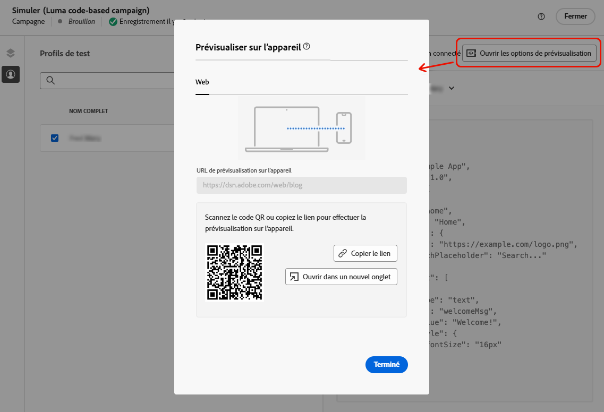
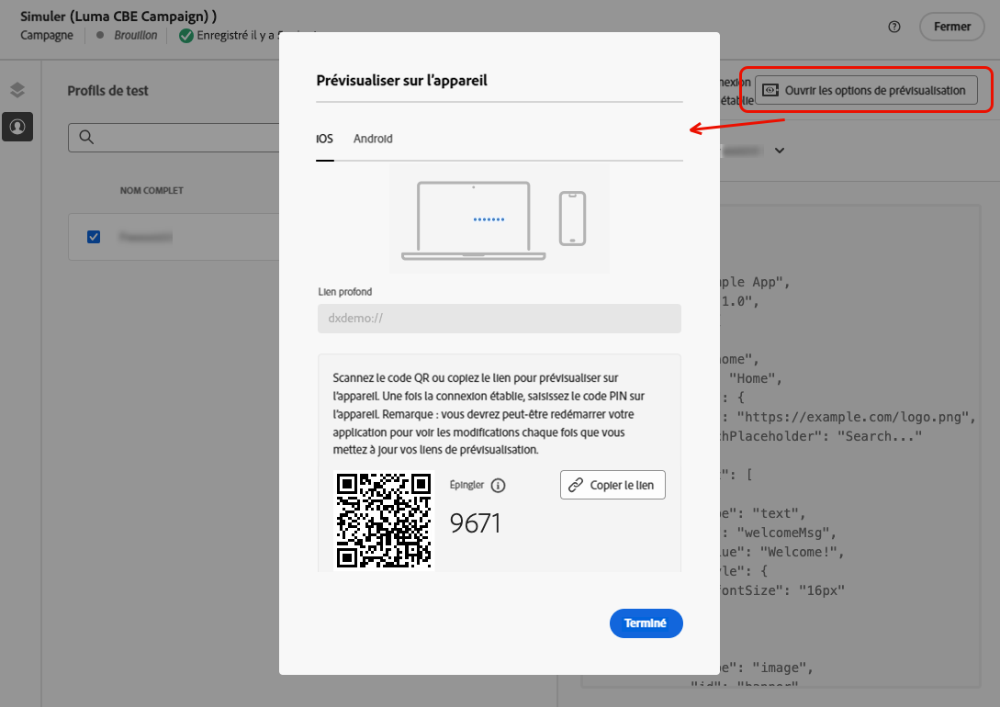
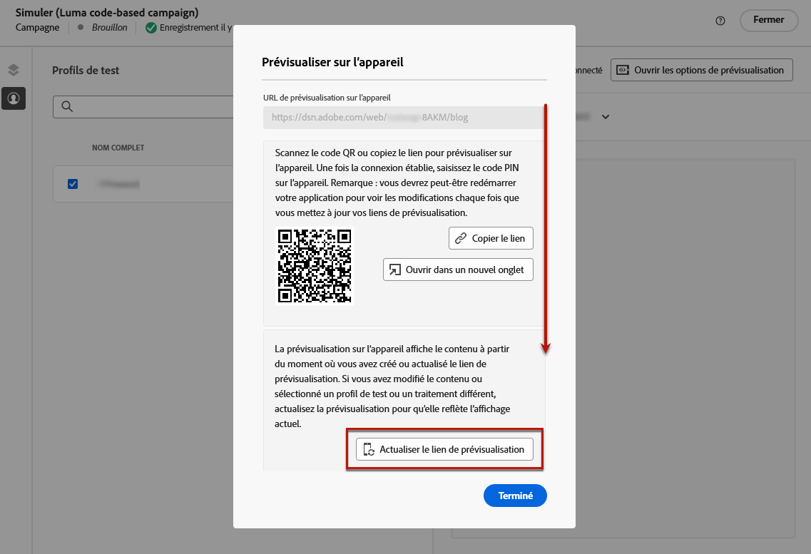
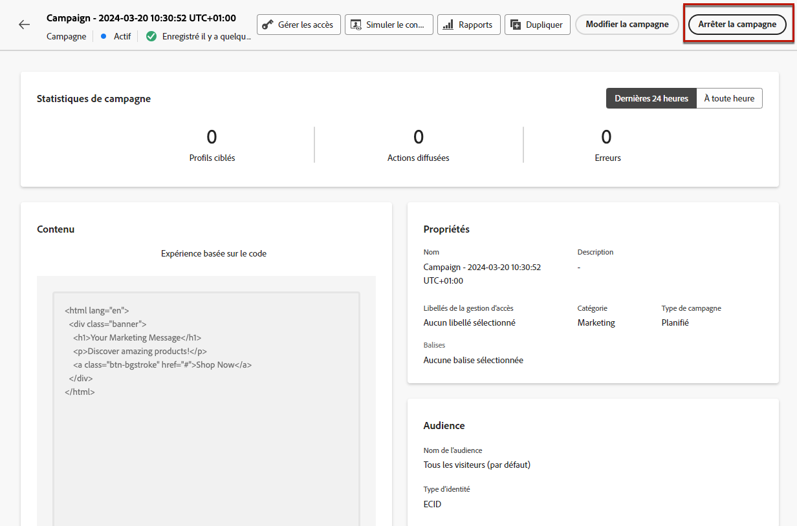

# Créer des expériences basées sur le code {#create-code-based}

Dans [!DNL Journey Optimizer], vous pouvez créer des expériences basées sur du code dans un parcours ou une campagne.

Des mécanismes de sécurisation et recommandations spécifiques pour les expériences basées sur le code sont détaillés dans [cette page](code-based-prerequisites.md).

## Ajouter une expérience basée sur du code par le biais d’un parcours ou d’une campagne {#create-code-based-experience}

Pour commencer à créer votre expérience basée sur du code par le biais d’un parcours ou d’une campagne, suivez les étapes ci-dessous.

>[!BEGINTABS]

>[!TAB Ajouter une expérience basée sur du code à un parcours]

Pour ajouter une activité **expérience basée sur du code** à un parcours, procédez comme suit :

1. [Créez un parcours](../building-journeys/journey-gs.md).

1. Débutez votre parcours avec une activité [Événement](../building-journeys/general-events.md) ou [Lecture d’audience](../building-journeys/read-audience.md).

1. Faites glisser et déposez une activité **[!UICONTROL Expérience basée sur du code]** depuis la section **[!UICONTROL Actions]** de la palette.

   

   >[!NOTE]
   >
   >Comme l’activité **Expérience basée sur du code** est une activité de message entrant, elle est accompagnée d’une activité **Attente** de 3 jours. [En savoir plus](../building-journeys/wait-activity.md#auto-wait-node)

1. Saisissez un **[!UICONTROL libellé]** et une **[!UICONTROL description]** pour votre message.

1. Sélectionnez ou créez la [configuration d’expérience basée sur du code](code-based-configuration.md) à utiliser.

   

1. Sélectionnez le bouton **[!UICONTROL Modifier le contenu]** et modifiez votre contenu selon vos besoins à l’aide de l’éditeur de personnalisation. [En savoir plus](#edit-code)

   Vous pouvez également utiliser un modèle de contenu existant comme base pour le contenu de votre code. Notez que les modèles disponibles pour le choix sont définis sur HTML ou JSON en fonction de la configuration de canal choisie précédemment. [Découvrez comment utiliser les modèles de contenu](../content-management/use-content-templates.md)

1. Si nécessaire, complétez votre flux de parcours en faisant glisser et en déposant des actions ou des événements supplémentaires. [En savoir plus](../building-journeys/about-journey-activities.md).

1. Une fois votre expérience basée sur du code prête, finalisez la configuration et publiez votre parcours pour l’activer. [En savoir plus](../building-journeys/publishing-the-journey.md)

Pour plus d’informations sur la configuration de votre parcours, consultez [cette page](../building-journeys/journey-gs.md).

>[!TAB Créer une expérience de campagne basée sur le code]

Pour commencer à créer votre **expérience basée sur du code** par le biais d’une campagne, suivez les étapes ci-dessous.

1. Création d’une campagne. [En savoir plus](../campaigns/create-campaign.md)

1. Sélectionner le type de campagne que vous souhaitez exécuter.

   * **[!UICONTROL Scheduled - Marketing]** : permet d’exécuter la campagne immédiatement ou à une date spécifiée. Les campagnes planifiées visent à envoyer des messages de **marketing**. Elles sont configurées et exécutées à partir de l’interface d’utilisation.

   * **[!UICONTROL API-triggered - Marketing/Transactional]** : permet d’exécuter la campagne à l’aide d’un appel API. Les campagnes déclenchées par API sont destinées à envoyer des messages **marketing**, ou **transactionnels**, c’est-à-dire des messages envoyés suite à une action effectuée par une personne : réinitialisation du mot de passe, abandon de panier, etc. [Découvrez comment déclencher une campagne à l’aide d’API](../campaigns/api-triggered-campaigns.md)

1. Suivez les étapes de création d’une campagne, telles que les propriétés de la campagne, l’[audience](../audience/about-audiences.md) et le [planning](../campaigns/create-campaign.md#schedule). Pour plus d’informations sur la configuration d’une campagne, consultez cette [page](../campaigns/get-started-with-campaigns.md).

1. Sélectionnez l’action **[!UICONTROL Expérience basée sur le code]**.

1. Sélectionnez ou créez la configuration d’expérience basée sur le code. [En savoir plus](code-based-configuration.md)

   

1. Modifiez le contenu selon vos besoins à l’aide de l’éditeur de personnalisation. [En savoir plus](#edit-code)

   Vous pouvez également utiliser un modèle de contenu existant comme base pour le contenu de votre code. Notez que les modèles disponibles pour le choix sont définis sur HTML ou JSON en fonction de la configuration de canal choisie précédemment. [Découvrez comment utiliser les modèles de contenu](../content-management/use-content-templates.md)

   <!---->

Pour plus d’informations sur la configuration d’une campagne, consultez cette [page](../campaigns/get-started-with-campaigns.md).

>[!ENDTABS]

## Modifier le contenu du code {#edit-code}

>[!CONTEXTUALHELP]
>id="ajo_code_based_experience"
>title="Utiliser l’éditeur de personnalisation"
>abstract="Insérez et modifiez le code que vous souhaitez diffuser dans le cadre de cette action d’expérience basée sur le code."
>additional-url="https://experienceleague.adobe.com/docs/journey-optimizer/using/content-management/personalization/expression-editor/personalization-build-expressions.html?lang=fr" text="Commencer avec l’éditeur de personnalisation"

1. Dans l’écran de modification de la campagne ou d’activité du parcours, sélectionnez **[!UICONTROL Modifier le code]**.

   

1. L’[éditeur de personnalisation](../personalization/personalization-build-expressions.md) s’ouvre. Il s’agit d’une interface de création d’expérience non visuelle qui vous permet de créer votre code.

1. Vous pouvez passer du mode de création HTML au mode JSON, et inversement.

   

   >[!CAUTION]
   >
   >Si vous changez de mode de création, vous perdrez l’ensemble de votre code actuel. Veillez donc à changer de mode avant de commencer la création.

1. Saisissez votre code selon vos besoins. Vous pouvez utiliser l’éditeur de personnalisation de [!DNL Journey Optimizer] et toutes ses fonctionnalités de personnalisation et de création. [En savoir plus](../personalization/personalization-build-expressions.md)

1. Si nécessaire, vous pouvez ajouter des fragments d’expression HTML ou JSON. [Voici comment procéder](../personalization/use-expression-fragments.md)

   Vous pouvez également enregistrer une partie de votre contenu de code en tant que fragment. [Voici comment procéder](../content-management/fragments.md#save-as-expression-fragment)

1. Avec les expériences basées sur du code, vous pouvez utiliser la fonction de prise de décision. Sélectionnez l’icône **[!UICONTROL Politique de décision]** dans la barre de gauche, puis cliquez sur **[!UICONTROL Ajouter une politique de décision]**. [En savoir plus](../experience-decisioning/create-decision.md)

   

1. Cliquez sur **[!UICONTROL Enregistrer et fermer]** pour confirmer vos modifications.

Désormais, dès que votre développeur ou développeuse lance un appel d’API ou de SDK pour récupérer du contenu pour la surface définie dans votre configuration de canal, les modifications sont appliquées à votre page web ou votre application.

## Tester l’expérience basée sur du code {#test-code-based-experience}

>[!CONTEXTUALHELP]
>id="ajo_code_based_preview"
>title="Prévisualiser votre expérience basée sur le code"
>abstract="Effectuez une simulation de ce à quoi ressemblera votre expérience basée sur le code."

Pour afficher un aperçu de votre expérience basée sur le code qui a été modifiée, suivez les étapes ci-dessous.

>[!CAUTION]
>
>Vous devez disposer de profils de test pour simuler les offres qui leur seront diffusées. Découvrez comment [créer des profils de test](../audience/creating-test-profiles.md).

1. Dans le parcours ou la campagne, sur l’écran de modification du contenu ou sur l’écran de l’éditeur de personnalisation, sélectionnez **[!UICONTROL Simuler le contenu]**.

   

1. Cliquez sur **[!UICONTROL Gérer les profils de test]** pour sélectionner un ou plusieurs profils de test.

1. Un aperçu de votre expérience basée sur le code qui a été modifiée s’affiche.

Vous trouverez des informations détaillées sur la sélection des profils de test et la prévisualisation de votre contenu dans [cette section](../content-management/preview.md).

### Prévisualiser sur l’appareil {#preview-on-device}

>[!CONTEXTUALHELP]
>id="ajo_code_based_preview_device"
>title="Prévisualiser votre expérience basée sur du code sur un appareil réel"
>abstract="Obtenez une prévisualisation de vos expériences personnalisées directement sur votre navigateur ou vos appareils mobiles, afin de voir à quoi elles ressemblent sur des appareils réels."

>[!CONTEXTUALHELP]
>id="ajo_code_based_preview_device_web"
>title="Prévisualiser votre expérience web basée sur du code sur un appareil"
>abstract="Scannez le code QR ou copiez le lien pour effectuer la prévisualisation sur l’appareil."

>[!CONTEXTUALHELP]
>id="ajo_code_based_preview_device_mobile"
>title="Prévisualiser sur un appareil votre expérience mobile basée sur du code"
>abstract="Scannez le code QR ou copiez le lien pour effectuer la prévisualisation sur l’appareil. Une fois la connexion établie, saisissez le code PIN sur l’appareil. Vous devrez peut-être redémarrer votre application pour afficher les modifications chaque fois que vous mettez à jour vos liens de prévisualisation."

>[!CONTEXTUALHELP]
>id="ajo_code_based_preview_device_refresh"
>title="Actualiser le lien de prévisualisation pour refléter la vue actuelle"
>abstract="La prévisualisation sur appareil affiche le contenu à partir du moment où vous avez créé ou actualisé le lien de prévisualisation. Si vous avez modifié le contenu ou sélectionné un autre profil de test ou traitement, actualisez la prévisualisation pour qu’elle reflète la vue actuelle."

Lors de la création d’expériences basées sur du code pour des pages web ou des applications mobiles, vous pouvez prévisualiser vos expériences personnalisées directement sur votre navigateur ou sur vos appareils mobiles, afin de voir à quoi ressemblent ces expériences sur des appareils réels.

>[!WARNING]
>
>La prévisualisation sur l’appareil n’est pas disponible lors de l’utilisation des [politiques de décision](../experience-decisioning/create-decision.md) ou des attributs contextuels de [personnalisation](../personalization/personalization-build-expressions.md).

1. Dans l’écran **[!UICONTROL Simuler]**, cliquez sur le bouton **[!UICONTROL Ouvrir les options de prévisualisation]**. Les options de prévisualisation dépendent de la plateforme sélectionnée dans votre [configuration basée sur le code](code-based-configuration.md#create-code-based-configuration).

1. Si vous utilisez une [plateforme web](code-based-configuration.md#web) dans votre configuration basée sur le code, le champ **[!UICONTROL URL de prévisualisation sur l’appareil]** en lecture seule est prérempli avec l’URL saisie pour la configuration de canal actuelle.

   

   Vous pouvez effectuer l’une des actions suivantes :

   * Sélectionnez le bouton **[!UICONTROL Copier le lien]** et collez le lien dans un onglet de navigateur. Vous pouvez également partager le lien avec votre équipe et les parties prenantes, qui peuvent prévisualiser la nouvelle expérience dans n’importe quel navigateur avant que les modifications ne soient mises en ligne.

   * Cliquez sur **[!UICONTROL Ouvrir dans un nouvel onglet]** pour ouvrir le lien dans votre navigateur actuel.

   * Analysez le code QR avec votre appareil mobile pour ouvrir le lien de prévisualisation sur un navigateur mobile.

1. Si vous utilisez des [plateformes mobiles](code-based-configuration.md#mobile) (iOS/Android) dans votre configuration basée sur le code, le champ **[!UICONTROL Lien profond]** en lecture seule est prérempli avec la valeur **[!UICONTROL URL de prévisualisation]** saisie dans la configuration de canal pour la plateforme sélectionnée.

   Basculez entre les onglets **[!UICONTROL iOS]** et **[!DNL Android]** pour prévisualiser votre expérience pour la plateforme de votre choix.

   

   Vous pouvez effectuer l’une des actions suivantes :

   * Sélectionnez le bouton **[!UICONTROL Copier le lien]** et partagez le lien avec votre équipe et les parties prenantes, qui peuvent prévisualiser la nouvelle expérience dans n’importe quel navigateur mobile avant que les modifications ne soient mises en ligne.

   * Analysez le code QR avec votre appareil mobile pour ouvrir le lien de prévisualisation directement dans l’application mobile. Vous devez saisir le code PIN sur votre appareil pour établir la session [Assurance](https://experienceleague.adobe.com/fr/docs/experience-platform/assurance/tutorials/implement-assurance){target="_blank"}.

     >[!NOTE]
     >
     >**Adobe Experience Platform Assurance** est un produit d’Adobe Experience Cloud qui vous aide à inspecter, à tester, à simuler et à valider la manière dont vous collectez des données ou diffusez des expériences dans votre application mobile. [En savoir plus](https://experienceleague.adobe.com/fr/docs/experience-platform/assurance/home){target="_blank"}

1. Les liens de prévisualisation sont générés pour le profil de test sélectionné et, si vous utilisez [Expérience de contenu](../content-management/content-experiment.md) dans votre parcours ou campagne, pour le traitement sélectionné.

   <!--If you have modified the content or selected a different treatment or test profile, scroll down to the bottom of the **[!UICONTROL Preview on device]** pop-up and click **[!UICONTROL Refresh preview link]** to reflect the current state.

   -->

   <!--When creating a content experiment, you need to select a given treatment and click the **[!UICONTROL Simulate content]** button to obtain the link corresponding to that treatment, then select another treatment, click the **[!UICONTROL Simulate content]** button to obtain a new preview link, and so on.-->

   Lors de la mise à jour du contenu ou de la sélection d’un autre profil ou traitement de test, le lien de prévisualisation est automatiquement actualisé. Vous pouvez copier le lien dans différents onglets du navigateur et comparer les expériences.

## Mettre en ligne votre expérience basée sur du code {#code-based-experience-live}

>[!IMPORTANT]
>
> Si votre campagne est soumise à une politique d’approbation, vous devrez demander son approbation afin de pouvoir activer vos expériences basées sur du code. [En savoir plus](../test-approve/gs-approval.md)

Une fois que vous avez défini votre expérience basée sur du code et modifié votre contenu comme vous le souhaitez à l’aide de l’[éditeur basé sur du code](#edit-code), vous pouvez activer votre parcours ou votre campagne pour rendre vos modifications visibles à votre audience.

Vous pouvez également prévisualiser le contenu de votre expérience basée sur du code avant de le mettre en ligne. [En savoir plus](#test-code-based-experience)

>[!NOTE]
>
>Si vous activez une campagne ou un parcours basé sur le code ayant un impact sur les mêmes pages qu’une autre campagne ou qu’un autre parcours déjà en ligne, toutes les modifications seront appliquées à votre contrenu.
>
>Si plusieurs parcours ou campagnes basés sur du code mettent à jour le ou les mêmes éléments de votre contenu, le parcours ou la campagne avec la priorité la plus élevée prévaut.

Une fois votre parcours ou campagne basé sur du code actif, votre équipe de mise en oeuvre d’application est chargée d’effectuer des appels d’API ou de SDK explicites pour récupérer du contenu pour les surfaces définies dans la [configuration d’expérience basée sur le code](code-based-configuration.md) sélectionnée. Pour en savoir plus sur les différentes mises en œuvre des clientes et clients, consultez [cette section](code-based-implementation-samples.md).

### Publier un parcours basé sur du code {#publish-code-based-journey}

Pour mettre en ligne votre expérience basée sur du code à partir d’un parcours, procédez comme suit.

1. Vérifiez que votre parcours est valide et qu’il n’y a aucune erreur. [En savoir plus](../building-journeys/troubleshooting.md#checking-for-errors-before-testing)

1. Depuis le parcours, sélectionnez l’option **[!UICONTROL Publier]** située dans le menu déroulant qui se trouve en haut à droite.

   

   >[!NOTE]
   >
   >Découvrez la publication des parcours dans [cette section](../building-journeys/publishing-the-journey.md).

Le statut de votre parcours basé sur du code passe à **[!UICONTROL Actif]** et l’audience sélectionnée peut voir votre parcours. Chaque destinataire de votre campagne peut voir vos modifications.

>[!NOTE]
>
>Après avoir cliqué sur **[!UICONTROL Publier]**, les modifications peuvent prendre jusqu’à 15 minutes avant d’être mises en ligne.

### Activer une campagne basée sur du code {#activate-code-based-campaign}

1. Dans votre campagne basée sur le code, sélectionnez **[!UICONTROL Examiner pour activer]**.

   

1. Vérifiez et modifiez si nécessaire le contenu, les propriétés, la configuration, l’audience et le planning.

1. Sélectionnez **[!UICONTROL Activer]**.

   

   >[!NOTE]
   >
   >En savoir plus sur l’activation des campagnes dans [cette section](../campaigns/review-activate-campaign.md).

Votre campagne basée sur le code passe au statut **[!UICONTROL Actif]** et est maintenant visible pour l’audience sélectionnée. Chaque destinataire de votre campagne peut voir les modifications que vous avez ajoutées à votre contenu.

>[!NOTE]
>
>Après avoir cliqué sur **[!UICONTROL Activer]**, les modifications peuvent prendre jusqu’à 15 minutes avant d’être mises en ligne.
>
>Si vous avez défini un planning pour votre campagne basée sur le code, celle-ci conserve le statut **[!UICONTROL Planifié]** jusqu’à ce que la date et l’heure de début soient atteintes.

## Arrêter un parcours basé sur du code ou une campagne basée sur du code {#stop-code-based-experience}

Lorsqu’une expérience basée sur du code est active, vous pouvez l’arrêter afin d’empêcher votre audience de voir vos modifications. Suivez les étapes ci-dessous.

1. Sélectionnez une campagne active ou un parcours actif dans la liste correspondante.

1. Effectuez l’action appropriée en fonction de votre cas :

   * Dans le menu supérieur de la campagne, sélectionnez **[!UICONTROL Arrêter la campagne]**.

     

   * Dans le menu supérieur du parcours, cliquez sur le bouton **[!UICONTROL Plus]** et sélectionnez **[!UICONTROL Arrêter]**.

     

1. Les modifications que vous avez ajoutées ne seront plus visibles pour l’audience que vous avez définie.

>[!NOTE]
>
>Après l’arrêt d’une campagne basée sur du code ou d’un parcours basé sur du code, vous ne pouvez plus y apporter des modifications ni l’activer. Vous pouvez uniquement dupliquer la campagne ou le parcours et activer l’élément dupliqué.

<!--Reporting TBC

## Check the code-based experience reports {#check-code-based-reports}

Once your code-based experience is live, you can check the **[!UICONTROL Code-based]** tab of the  [Journey report](../reports/journey-global-report-cja.md#web-cja) and [Campaign report](../reports/campaign-global-report-cja.md#web) to compare elements such as the number of experiences delivered to your audience, and the number of engagements with your content.-->

<!--## Code-based reports

You can access code-based journey or campaign reports from the summary screen.

Global reports display events that occurred at least two hours ago and cover events over a selected time period. In comparison, Live reports focus on events that took place within the past 24 hours, with a minimum time interval of two minutes from the event occurrence.

### Code-based live report {#live-report-code-based}

From your campaign **[!UICONTROL Live report]**, the **[!UICONTROL Code-based experience]** tab details the main information relative to your apps or web pages. [Learn more on live report](../reports/campaign-live-report.md)

+++Learn more on the different metrics and widgets available for the Code-based experience report.

The **[!UICONTROL Code-based experience performance]** KPIs detail the main information relative to your visitors' engagement with your code-based experiences, such as:

* **[!UICONTROL Impressions]**: total number of experiences delivered to all users.

* **[!UICONTROL Interactions]**:  total number of engagements with your app/page. This includes any actions taken by the users, such as clicks or any other interactions.

The **[!UICONTROL Code-based experience summary]** graph shows the evolution of your experiences (impressions, unique impressions and interactions) for the last 24 hours.

TBC: The **[!UICONTROL Interactions by element]** table details the main information relative to your visitors' engagement with the various elements on your app/pages.
+++

### Code-based global report {#global-report-code-based}

Code-based campaign global report can be accessed directly from your journey or campaign with the **[!UICONTROL View report]** button. [Learn more on global report](../reports/campaign-global-report-cja.md)

From your Campaign **[!UICONTROL Global report]**, the **[!UICONTROL Code-based experience]** tab details the main information relative to your apps or web pages.

Add image TBC

+++Learn more on the different metrics and widgets available for the Code-based experience report.

The **[!UICONTROL Code-based experience performance]** KPIs detail the main information relative to your visitors' engagement with your experiences, such as:

* **[!UICONTROL Unique impressions]**: number of unique users to whom the experience was delivered.

* **[!UICONTROL Impressions]**: total number of experiences delivered to all users.

* **[!UICONTROL Interactions]**: percentage of engagements with your app/page. This includes any actions taken by the users, such as clicks or any other interactions.

The **[!UICONTROL Code-based experience summary]** graph shows the evolution of your experiences (unique impressions, impressions and interactions) for the concerned period.

TBC: The **[!UICONTROL Interactions by element]** table details the main information relative to your visitors' engagement with the various elements on your apps/pages.
+++

TBC video if existing

## How-to video{#video}

The video below shows how to create a code-based campaign, configure its properties, review, and publish it.

>[!VIDEO]()

-->
