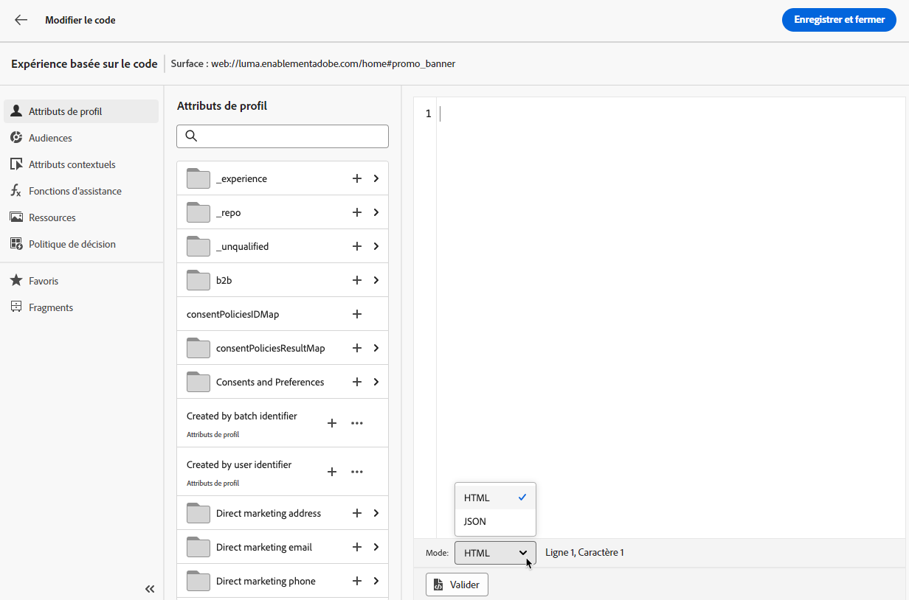
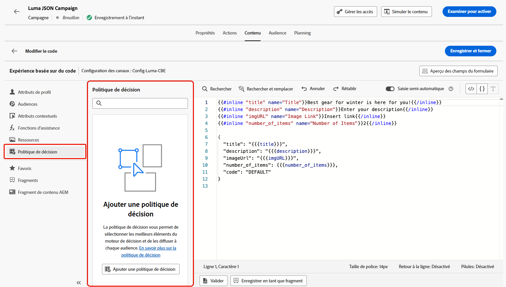
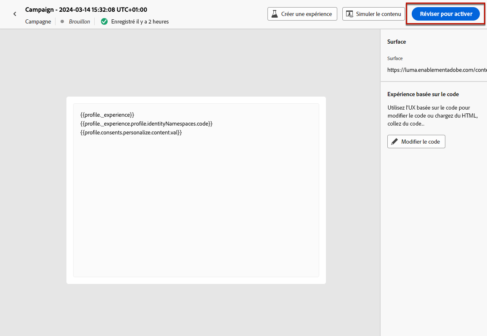
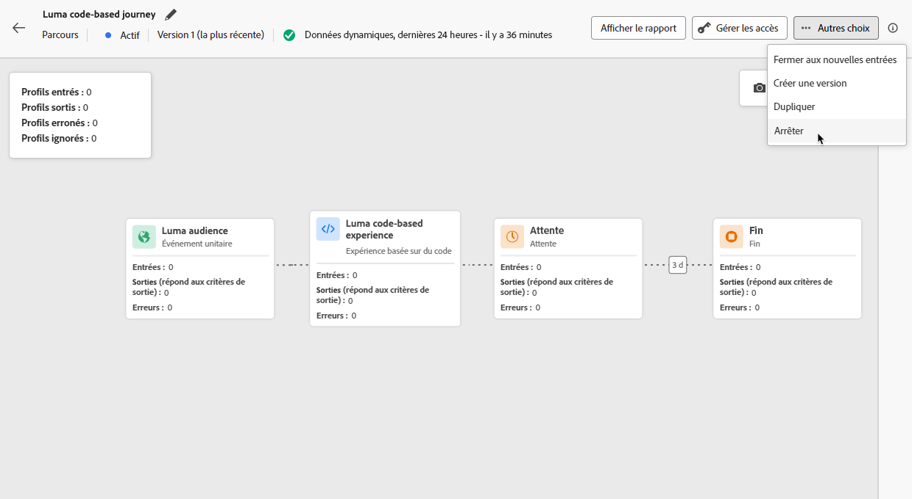

# Créer des expériences basées sur le code {#create-code-based}

Dans [!DNL Journey Optimizer], vous pouvez créer des expériences basées sur du code dans un parcours ou une campagne.

Des mécanismes de sécurisation et recommandations spécifiques pour les expériences basées sur le code sont détaillés dans [cette page](code-based-prerequisites.md).

## Ajout d’une expérience basée sur du code par le biais d’un parcours ou d’une campagne {#create-code-based-experience}

Pour commencer à créer votre expérience basée sur du code par le biais d’un parcours ou d’une campagne, procédez comme suit.

>[!BEGINTABS]

>[!TAB Ajouter une expérience basée sur le code à un parcours]

Pour ajouter une activité **expérience basée sur le code** à un parcours, procédez comme suit :

1. [Créez un parcours](../building-journeys/journey-gs.md).

1. Débutez votre parcours avec une activité [Événement](../building-journeys/general-events.md) ou [Lecture d’audience](../building-journeys/read-audience.md).

1. Faites glisser et déposez une activité **[!UICONTROL Expérience basée sur le code]** depuis la section **[!UICONTROL Actions]** de la palette.

   

   >[!NOTE]
   >
   >Comme **Expérience basée sur le code** est une activité de message entrant, elle est fournie avec une activité **Attente** de 3 jours. [En savoir plus](../building-journeys/wait-activity.md#auto-wait-node)

1. Saisissez un **[!UICONTROL libellé]** et une **[!UICONTROL description]** pour votre message.

1. Sélectionnez ou créez la [configuration d’expérience basée sur le code](code-based-configuration.md) à utiliser.

   

1. Sélectionnez le bouton **[!UICONTROL Editer le contenu]** et modifiez votre contenu selon vos besoins à l&#39;aide de l&#39;éditeur de personnalisation. [En savoir plus](#edit-code)

1. Si nécessaire, complétez votre flux de parcours en faisant glisser et en déposant des actions ou des événements supplémentaires. [En savoir plus](../building-journeys/about-journey-activities.md).

1. Une fois votre expérience basée sur le code prête, finalisez la configuration et publiez votre parcours pour l’activer. [En savoir plus](../building-journeys/publishing-the-journey.md)

Pour plus d’informations sur la configuration de votre parcours, consultez cette [page](../building-journeys/journey-gs.md).

>[!TAB Créer une expérience de campagne basée sur le code]

Pour commencer à créer votre **expérience basée sur du code** par le biais d’une campagne, procédez comme suit.

1. Création d’une campagne. [En savoir plus](../campaigns/create-campaign.md)

1. Sélectionner le type de campagne que vous souhaitez exécuter.

   * **[!UICONTROL Scheduled - Marketing]** : permet d’exécuter la campagne immédiatement ou à une date spécifiée. Les campagnes planifiées visent à envoyer des messages de **marketing**. Elles sont configurées et exécutées à partir de l’interface d’utilisation.

   * **[!UICONTROL API-triggered - Marketing/Transactional]** : permet d’exécuter la campagne à l’aide d’un appel API. Les campagnes déclenchées par API sont destinées à envoyer des messages **marketing**, ou **transactionnels**, c’est-à-dire des messages envoyés suite à une action effectuée par une personne : réinitialisation du mot de passe, abandon de panier, etc. [Découvrez comment déclencher une campagne à l’aide d’API](../campaigns/api-triggered-campaigns.md)

1. Suivez les étapes de création d’une campagne, telles que les propriétés de la campagne, l’[audience](../audience/about-audiences.md) et le [planning](../campaigns/create-campaign.md#schedule). Pour plus d’informations sur la configuration d’une campagne, consultez cette [page](../campaigns/get-started-with-campaigns.md).

1. Sélectionnez l’action **[!UICONTROL Expérience basée sur le code]**.

1. Sélectionnez ou créez la configuration d’expérience basée sur le code. [En savoir plus](code-based-configuration.md)

   

1. Modifiez le contenu selon vos besoins à l’aide de l’éditeur de personnalisation. [En savoir plus](#edit-code)

   <!---->

Pour plus d’informations sur la configuration d’une campagne, consultez cette [page](../campaigns/get-started-with-campaigns.md).

>[!ENDTABS]

## Modifier le contenu du code {#edit-code}

>[!CONTEXTUALHELP]
>id="ajo_code_based_experience"
>title="Utiliser l’éditeur de personnalisation"
>abstract="Insérez et modifiez le code que vous souhaitez diffuser dans le cadre de cette action d’expérience basée sur le code."
>additional-url="https://experienceleague.adobe.com/docs/journey-optimizer/using/content-management/personalization/expression-editor/personalization-build-expressions.html?lang=fr" text="Commencer avec l’éditeur de personnalisation"

1. Dans l&#39;écran d&#39;édition de campagne ou d&#39;activité de parcours, sélectionnez **[!UICONTROL Modifier le code]**.

   

1. L’[éditeur de personnalisation](../personalization/personalization-build-expressions.md) s’ouvre. Il s’agit d’une interface de création d’expérience non visuelle qui vous permet de créer votre code.

1. Vous pouvez passer du mode de création HTML au mode JSON, et inversement.

   

   >[!CAUTION]
   >
   >Si vous changez de mode de création, vous perdrez l’ensemble de votre code actuel. Veillez donc à changer de mode avant de commencer la création.

1. Saisissez votre code selon vos besoins. Vous pouvez utiliser l’éditeur de personnalisation de [!DNL Journey Optimizer] et toutes ses fonctionnalités de personnalisation et de création. [En savoir plus](../personalization/personalization-build-expressions.md)

1. Si nécessaire, vous pouvez ajouter des fragments d’expression HTML ou JSON. [Voici comment procéder](../personalization/use-expression-fragments.md)

   Vous pouvez également enregistrer une partie de votre contenu de code en tant que fragment. [Voici comment procéder](../content-management/fragments.md#save-as-expression-fragment)

1. Grâce aux expériences basées sur du code, vous pouvez utiliser la fonction de prise de décision relative aux expériences. Sélectionnez l’icône **[!UICONTROL Stratégie de décision]** dans la barre de gauche et cliquez sur **[!UICONTROL Ajouter une stratégie de décision]**. [En savoir plus](../experience-decisioning/create-decision.md) <!--UI labels TBC + TBC for journeys (visible in UI so probably confirmed) -->

   

   >[!NOTE]
   >
   >Ces décisions pour les expériences ne sont actuellement disponibles que pour un ensemble d’organisations (disponibilité limitée). Pour en bénéficier, contactez votre représentant ou représentante Adobe.

1. Cliquez sur **[!UICONTROL Enregistrer et fermer]** pour confirmer vos modifications.

Désormais, dès que votre développeur ou développeuse lance un appel d’API ou de SDK pour récupérer du contenu pour la surface définie dans votre configuration de canal, les modifications sont appliquées à votre page web ou votre application.

## Test de l’expérience basée sur le code {#test-code-based-experience}

>[!CONTEXTUALHELP]
>id="ajo_code_based_preview"
>title="Prévisualiser votre expérience basée sur le code"
>abstract="Effectuez une simulation de ce à quoi ressemblera votre expérience basée sur le code."

Pour afficher un aperçu de votre expérience basée sur le code qui a été modifiée, suivez les étapes ci-dessous. Vous trouverez des informations détaillées sur la sélection des profils de test et la prévisualisation de votre contenu dans la [page Prévisualiser et tester votre contenu](../content-management/preview-test.md).

>[!CAUTION]
>
>Vous devez disposer de profils de test pour simuler les offres qui leur seront diffusées. Découvrez comment [créer des profils de test](../audience/creating-test-profiles.md).

1. Dans le parcours ou la campagne, dans l&#39;écran de personnalisation ou d&#39;édition de contenu, sélectionnez **[!UICONTROL Simuler le contenu]**.

   

1. Cliquez sur **[!UICONTROL Gérer les profils de test]** pour sélectionner un ou plusieurs profils de test.

1. Un aperçu de votre expérience basée sur le code qui a été modifiée s’affiche.

<!--
    

    You can also open it in the default browser, or copy the test URI to paste it in any browser. This allows you to share the link with your team and stakeholders who will be able to preview the new web experience in any browser before the campaign goes live.

    When copying the test URI, the content displayed is the one personalized for the test profile used when the content simulation was generated in [!DNL Journey Optimizer].-->

## Mettre en ligne votre expérience basée sur le code {#code-based-experience-live}

>[!IMPORTANT]
>
>À compter de la version de septembre, une nouvelle expérience d’activation de campagne et de parcours vous permet de gérer l’ensemble du processus d’approbation, en veillant à ce que les campagnes et les parcours soient minutieusement examinés et approuvés par les parties prenantes appropriées avant de passer en ligne. Cette fonctionnalité est disponible en disponibilité limitée. [En savoir plus](../test-approve/gs-approval.md)

Une fois que vous avez défini votre expérience basée sur du code et modifié votre contenu comme vous le souhaitez à l’aide de l’[éditeur basé sur le code](#edit-code), vous pouvez activer votre parcours ou campagne pour rendre vos modifications visibles à votre audience.

Vous pouvez également prévisualiser le contenu de votre expérience basé sur le code avant de le rendre actif. [En savoir plus](#test-code-based-experience)

>[!NOTE]
>
>Si vous activez un parcours/campagne basé sur du code qui impacte les mêmes pages qu’un autre parcours ou campagne déjà actif, toutes les modifications seront appliquées à votre contenu.
>
>Si plusieurs parcours ou campagnes basés sur du code mettent à jour le ou les mêmes éléments de votre contenu, le parcours/la campagne de priorité la plus élevée est prioritaire.

### Publish d’un parcours basé sur le code {#publish-code-based-journey}

Pour rendre votre expérience basée sur le code en direct à partir d’un parcours, procédez comme suit.

1. Vérifiez que votre parcours est valide et qu’il n’y a aucune erreur. [En savoir plus](../building-journeys/troubleshooting.md#checking-for-errors-before-testing)

1. Dans le parcours, sélectionnez l’option **[!UICONTROL Publish]** située dans le menu déroulant supérieur droit.

   

   >[!NOTE]
   >
   >En savoir plus sur la publication de parcours dans [cette section](../building-journeys/publishing-the-journey.md).

Votre parcours basé sur le code prend l’état **[!UICONTROL Live]** et est désormais visible pour l’audience sélectionnée. Chaque destinataire de votre parcours peut voir vos modifications.

>[!NOTE]
>
>Une fois que vous avez cliqué sur **[!UICONTROL Publish]**, la disponibilité des modifications peut prendre jusqu’à 15 minutes.

### Activation d’une campagne basée sur du code {#activate-code-based-campaign}

1. Dans votre campagne basée sur le code, sélectionnez **[!UICONTROL Examiner pour activer]**.

   

1. Vérifiez et modifiez si nécessaire le contenu, les propriétés, la configuration, l’audience et le planning.

1. Sélectionnez **[!UICONTROL Activer]**.

   

   >[!NOTE]
   >
   >En savoir plus sur l’activation des campagnes dans [cette section](../campaigns/review-activate-campaign.md).

Votre campagne basée sur le code passe au statut **[!UICONTROL Actif]** et est maintenant visible pour l’audience sélectionnée. Chaque destinataire de votre campagne peut voir les modifications que vous avez ajoutées à votre contenu.

>[!NOTE]
>
>Une fois que vous avez cliqué sur **[!UICONTROL Activer]**, la disponibilité de vos modifications peut prendre jusqu’à 15 minutes.
>
>Si vous avez défini un planning pour votre campagne basée sur le code, celle-ci conserve le statut **[!UICONTROL Planifié]** jusqu’à ce que la date et l’heure de début soient atteintes.

## Arrêter un parcours ou une campagne basé sur du code {#stop-code-based-experience}

Lorsqu’une expérience basée sur du code est active, vous pouvez l’arrêter afin d’empêcher votre audience de voir vos modifications. Suivez les étapes ci-dessous.

1. Sélectionnez un parcours ou une campagne actif dans la liste correspondante.

1. Effectuez l’action appropriée en fonction de votre cas :

   * Dans le menu supérieur de la campagne, sélectionnez **[!UICONTROL Arrêter la campagne]**.

     

   * Dans le menu supérieur parcours, cliquez sur le bouton **[!UICONTROL Plus]** et sélectionnez **[!UICONTROL Arrêter]**.

     

1. Les modifications que vous avez ajoutées ne seront plus visibles pour l’audience que vous avez définie.

>[!NOTE]
>
>Une fois qu’un parcours ou une campagne basé sur du code est arrêté, vous ne pouvez plus le modifier ni l’activer. Vous pouvez uniquement le dupliquer et activer le parcours/la campagne dupliqué.

<!--Reporting TBC

## Check the code-based experience reports {#check-code-based-reports}

Once your code-based experience is live, you can check the **[!UICONTROL Code-based]** tab of the  [Journey report](../reports/journey-global-report-cja.md#web-cja) and [Campaign report](../reports/campaign-global-report-cja.md#web) to compare elements such as the number of experiences delivered to your audience, and the number of engagements with your content.-->

<!--## Code-based reports

You can access code-based journey or campaign reports from the summary screen.

Global reports display events that occurred at least two hours ago and cover events over a selected time period. In comparison, Live reports focus on events that took place within the past 24 hours, with a minimum time interval of two minutes from the event occurrence.

### Code-based live report {#live-report-code-based}

From your campaign **[!UICONTROL Live report]**, the **[!UICONTROL Code-based experience]** tab details the main information relative to your apps or web pages. [Learn more on live report](../reports/campaign-live-report.md)

+++Learn more on the different metrics and widgets available for the Code-based experience report.

The **[!UICONTROL Code-based experience performance]** KPIs detail the main information relative to your visitors' engagement with your code-based experiences, such as:

* **[!UICONTROL Impressions]**: total number of experiences delivered to all users.

* **[!UICONTROL Interactions]**:  total number of engagements with your app/page. This includes any actions taken by the users, such as clicks or any other interactions.

The **[!UICONTROL Code-based experience summary]** graph shows the evolution of your experiences (impressions, unique impressions and interactions) for the last 24 hours.

TBC: The **[!UICONTROL Interactions by element]** table details the main information relative to your visitors' engagement with the various elements on your app/pages.
+++

### Code-based global report {#global-report-code-based}

Code-based campaign global report can be accessed directly from your journey or campaign with the **[!UICONTROL View report]** button. [Learn more on global report](../reports/campaign-global-report.md)

From your Campaign **[!UICONTROL Global report]**, the **[!UICONTROL Code-based experience]** tab details the main information relative to your apps or web pages.

Add image TBC

+++Learn more on the different metrics and widgets available for the Code-based experience report.

The **[!UICONTROL Code-based experience performance]** KPIs detail the main information relative to your visitors' engagement with your experiences, such as:

* **[!UICONTROL Unique impressions]**: number of unique users to whom the experience was delivered.

* **[!UICONTROL Impressions]**: total number of experiences delivered to all users.

* **[!UICONTROL Interactions]**: percentage of engagements with your app/page. This includes any actions taken by the users, such as clicks or any other interactions.

The **[!UICONTROL Code-based experience summary]** graph shows the evolution of your experiences (unique impressions, impressions and interactions) for the concerned period.

TBC: The **[!UICONTROL Interactions by element]** table details the main information relative to your visitors' engagement with the various elements on your apps/pages.
+++

TBC video if existing

## How-to video{#video}

The video below shows how to create a code-based campaign, configure its properties, review, and publish it.

>[!VIDEO]()

-->
