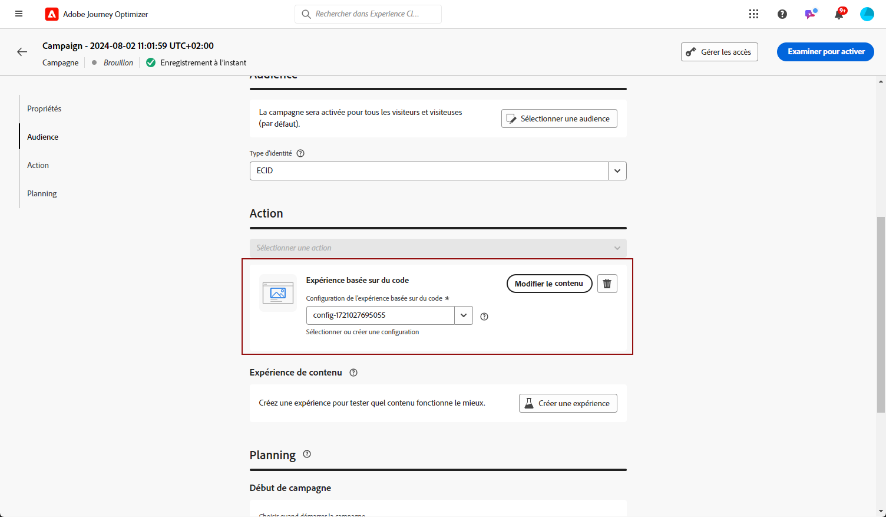

# Créer des expériences basées sur le code {#create-code-based}

Dans [!DNL Journey Optimizer], vous pouvez créer des expériences basées sur du code dans un parcours ou une campagne.

Des mécanismes de sécurisation et recommandations spécifiques pour les expériences basées sur le code sont détaillés dans [cette page](code-based-prerequisites.md).

## Ajouter une expérience basée sur du code par le biais d’un parcours ou d’une campagne {#create-code-based-experience}

Pour commencer à créer votre expérience basée sur du code par le biais d’un parcours ou d’une campagne, suivez les étapes ci-dessous.

>[!BEGINTABS]

>[!TAB Ajouter une expérience basée sur du code à un parcours]

Pour ajouter une activité **expérience basée sur du code** à un parcours, procédez comme suit :

1. [Créez un parcours](../building-journeys/journey-gs.md).

1. Débutez votre parcours avec une activité [Événement](../building-journeys/general-events.md) ou [Lecture d’audience](../building-journeys/read-audience.md).

1. Faites glisser et déposez une activité **[!UICONTROL Expérience basée sur du code]** depuis la section **[!UICONTROL Actions]** de la palette.

   

   >[!NOTE]
   >
   >Comme l’activité **Expérience basée sur du code** est une activité de message entrant, elle est accompagnée d’une activité **Attente** de 3 jours. [En savoir plus](../building-journeys/wait-activity.md#auto-wait-node)

1. Saisissez un **[!UICONTROL libellé]** et une **[!UICONTROL description]** pour votre message.

1. Sélectionnez ou créez la [configuration d’expérience basée sur du code](code-based-configuration.md) à utiliser.

   

1. Sélectionnez le bouton **[!UICONTROL Modifier le contenu]** et modifiez votre contenu selon vos besoins à l’aide de l’éditeur de personnalisation. [En savoir plus](#edit-code)

   Vous pouvez également utiliser un modèle de contenu existant comme base pour le contenu de votre code. Notez que les modèles disponibles pouvant être choisis sont définis sur HTML ou JSON en fonction de la configuration de canal choisie précédemment. [Découvrir comment utiliser les modèles de contenu](../content-management/use-content-templates.md)

1. Si nécessaire, complétez votre flux de parcours en faisant glisser et en déposant des actions ou des événements supplémentaires. [En savoir plus](../building-journeys/about-journey-activities.md).

1. Une fois votre expérience basée sur du code prête, finalisez la configuration et publiez votre parcours pour l’activer. [En savoir plus](../building-journeys/publishing-the-journey.md)

Pour plus d’informations sur la configuration de votre parcours, consultez [cette page](../building-journeys/journey-gs.md).

>[!TAB Créer une expérience de campagne basée sur le code]

Pour commencer à créer votre **expérience basée sur du code** par le biais d’une campagne, suivez les étapes ci-dessous.

1. Création d’une campagne. [En savoir plus](../campaigns/create-campaign.md)

1. Sélectionner le type de campagne que vous souhaitez exécuter.

   * **[!UICONTROL Scheduled - Marketing]** : permet d’exécuter la campagne immédiatement ou à une date spécifiée. Les campagnes planifiées visent à envoyer des messages de **marketing**. Elles sont configurées et exécutées à partir de l’interface d’utilisation.

   * **[!UICONTROL API-triggered - Marketing/Transactional]** : permet d’exécuter la campagne à l’aide d’un appel API. Les campagnes déclenchées par API sont destinées à envoyer des messages **marketing**, ou **transactionnels**, c’est-à-dire des messages envoyés suite à une action effectuée par une personne : réinitialisation du mot de passe, abandon de panier, etc. [Découvrez comment déclencher une campagne à l’aide d’API](../campaigns/api-triggered-campaigns.md)

1. Suivez les étapes de création d’une campagne, telles que les propriétés de la campagne, l’[audience](../audience/about-audiences.md) et le [planning](../campaigns/create-campaign.md#schedule). Pour plus d’informations sur la configuration d’une campagne, consultez cette [page](../campaigns/get-started-with-campaigns.md).

1. Sélectionnez l’action **[!UICONTROL Expérience basée sur le code]**.

1. Sélectionnez ou créez la configuration d’expérience basée sur le code. [En savoir plus](code-based-configuration.md)

   

1. Modifiez le contenu selon vos besoins à l’aide de l’éditeur de personnalisation. [En savoir plus](#edit-code)

   Vous pouvez également utiliser un modèle de contenu existant comme base pour le contenu de votre code. Notez que les modèles disponibles pouvant être choisis sont définis sur HTML ou JSON en fonction de la configuration de canal choisie précédemment. [Découvrir comment utiliser les modèles de contenu](../content-management/use-content-templates.md)

   <!---->

Pour plus d’informations sur la configuration d’une campagne, consultez cette [page](../campaigns/get-started-with-campaigns.md).

➡️ [Découvrir comment créer une campagne par expérience basée sur du code dans cette vidéo](#video)

>[!ENDTABS]

## Modifier le contenu du code {#edit-code}

>[!CONTEXTUALHELP]
>id="ajo_code_based_experience"
>title="Utiliser l’éditeur de personnalisation"
>abstract="Insérez et modifiez le code que vous souhaitez diffuser dans le cadre de cette action d’expérience basée sur le code."
>additional-url="https://experienceleague.adobe.com/docs/journey-optimizer/using/content-management/personalization/expression-editor/personalization-build-expressions.html?lang=fr" text="Commencer avec l’éditeur de personnalisation"

1. Dans l’écran de modification de la campagne ou d’activité du parcours, sélectionnez **[!UICONTROL Modifier le code]**.

   

1. L’[éditeur de personnalisation](../personalization/personalization-build-expressions.md) s’ouvre. Il s’agit d’une interface de création d’expérience non visuelle qui vous permet de créer votre code.

1. Vous pouvez passer du mode de création HTML au mode JSON, et inversement.

   

   >[!CAUTION]
   >
   >Si vous changez de mode de création, vous perdrez l’ensemble de votre code actuel. Veillez donc à changer de mode avant de commencer la création.

1. Saisissez votre code selon vos besoins. Vous pouvez utiliser l’éditeur de personnalisation de [!DNL Journey Optimizer] et toutes ses fonctionnalités de personnalisation et de création. [En savoir plus](../personalization/personalization-build-expressions.md)

1. Si nécessaire, vous pouvez ajouter des fragments d’expression HTML ou JSON. [Voici comment procéder](../personalization/use-expression-fragments.md)

   Vous pouvez également enregistrer une partie de votre contenu de code en tant que fragment. [Voici comment procéder](../content-management/fragments.md#save-as-expression-fragment)

1. Dans les expériences basées sur du code, vous pouvez utiliser la fonctionnalité de prise de décision. Sélectionnez l’icône **[!UICONTROL Politique de décision]** dans la barre de gauche, puis cliquez sur **[!UICONTROL Ajouter une politique de décision]**. [En savoir plus](../experience-decisioning/create-decision.md)

   

1. Cliquez sur **[!UICONTROL Enregistrer et fermer]** pour confirmer vos modifications.

Désormais, dès que votre développeur ou développeuse lance un appel d’API ou de SDK pour récupérer du contenu pour la surface définie dans votre configuration de canal, les modifications sont appliquées à votre page web ou votre application.

## Vidéo pratique{#video}

La vidéo ci-dessous montre comment créer une campagne par expérience basée sur du code, configurer ses propriétés, la tester et la publier.

>[!VIDEO](https://video.tv.adobe.com/v/3428868/?quality=12&learn=on)
