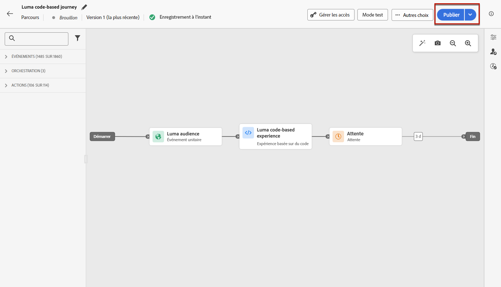
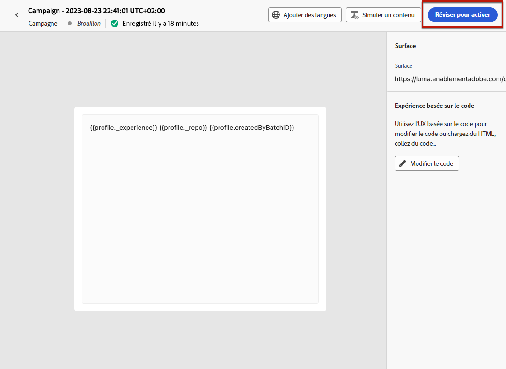
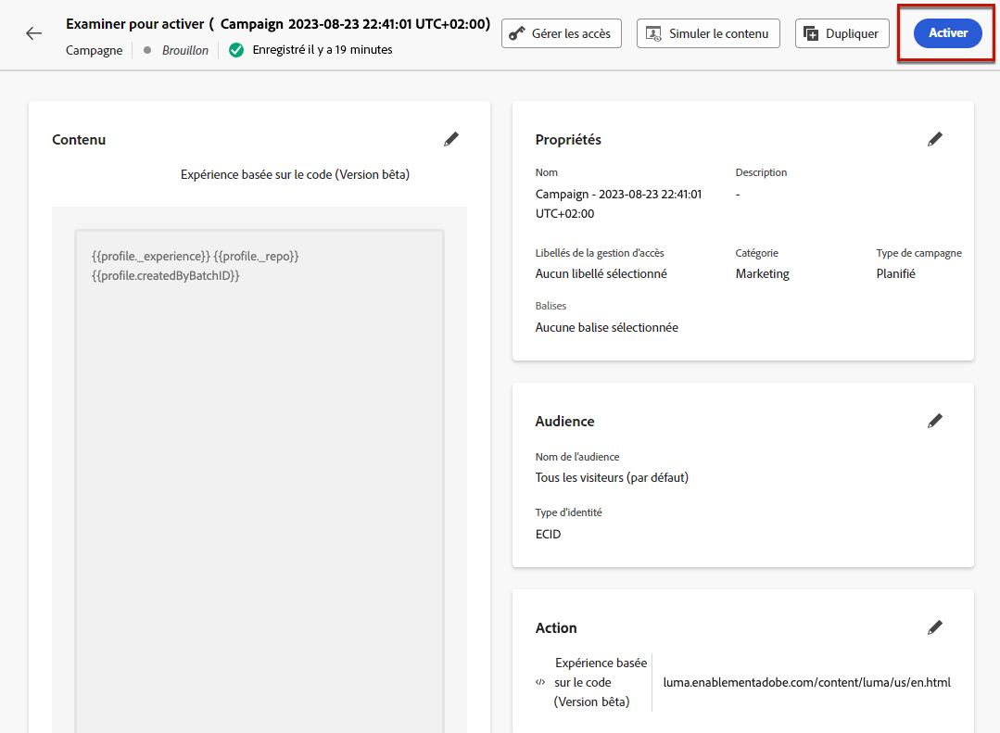
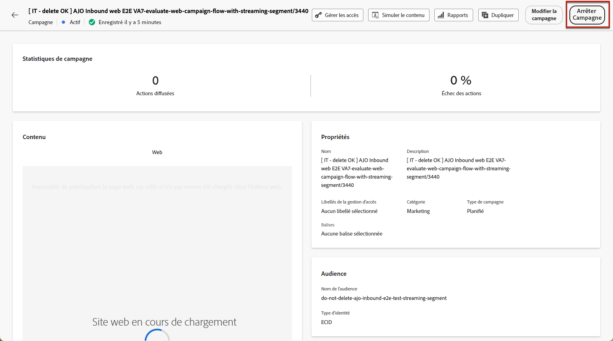
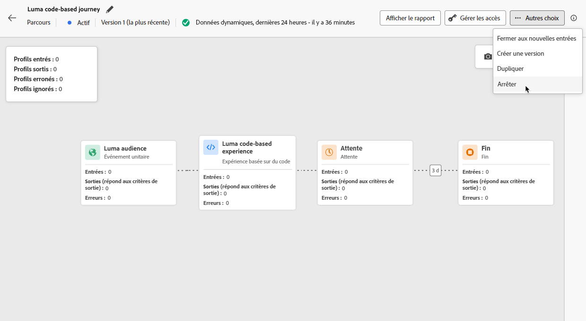
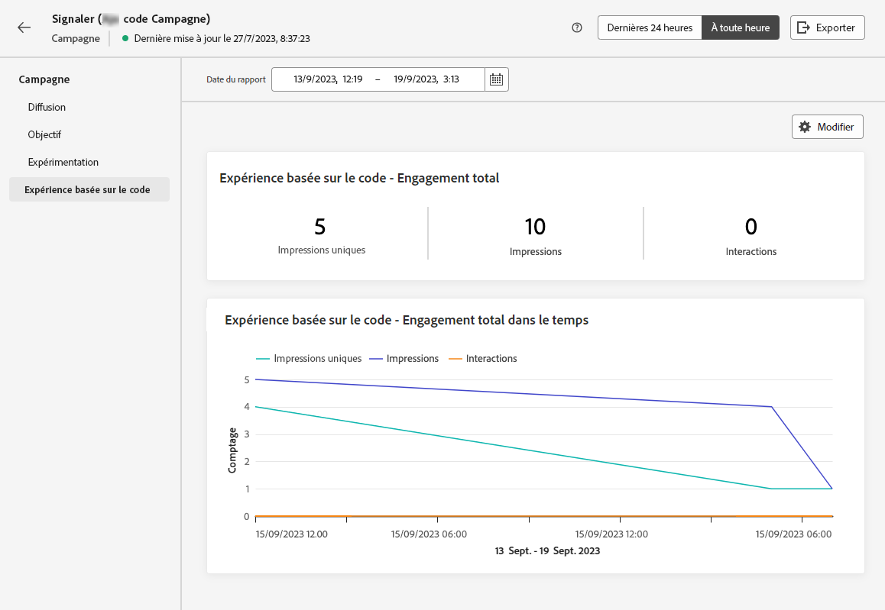

# Gérer des expériences basées sur du code {#publish-code-based}

## Mettre en ligne votre expérience basée sur du code {#code-based-experience-live}

>[!IMPORTANT]
>
> Si votre campagne est soumise à une politique d’approbation, vous devrez demander son approbation afin de pouvoir activer vos expériences basées sur du code. [En savoir plus](../test-approve/gs-approval.md)

Une fois que vous avez défini votre expérience basée sur du code et modifié votre contenu comme vous le souhaitez à l’aide de l’[éditeur basé sur du code](create-code-based.md#edit-code), vous pouvez activer votre parcours ou votre campagne pour rendre vos modifications visibles à votre audience.

Vous pouvez également prévisualiser le contenu de votre expérience basée sur du code avant de le mettre en ligne. [En savoir plus](test-code-based.md)

>[!NOTE]
>
>Si vous activez une campagne ou un parcours basé sur le code ayant un impact sur les mêmes pages qu’une autre campagne ou qu’un autre parcours déjà en ligne, toutes les modifications seront appliquées à votre contrenu.
>
>Si plusieurs parcours ou campagnes basés sur du code mettent à jour le ou les mêmes éléments de votre contenu, le parcours ou la campagne avec la priorité la plus élevée prévaut. [Découvrir les scores de priorité](../conflict-prioritization/priority-scores.md)

Une fois votre parcours ou campagne basé sur du code actif, votre équipe de mise en œuvre d’application est chargée d’effectuer des appels d’API ou de SDK explicites pour récupérer du contenu pour les surfaces définies dans la [configuration d’expérience basée sur du code](code-based-configuration.md) sélectionnée. En savoir plus sur les différentes mises en œuvre des clientes et clients dans [cette section](code-based-implementation-samples.md).

### Publier un parcours basé sur du code {#publish-code-based-journey}

Pour mettre en ligne votre expérience basée sur du code à partir d’un parcours, procédez comme suit.

1. Vérifiez que votre parcours est valide et qu’il n’y a aucune erreur. [En savoir plus](../building-journeys/troubleshooting.md#activity-errors)

1. Depuis le parcours, sélectionnez l’option **[!UICONTROL Publier]** située dans le menu déroulant qui se trouve en haut à droite.

   

   >[!NOTE]
   >
   >En savoir plus sur la publication des parcours dans [cette section](../building-journeys/publish-journey.md).

Le statut de votre parcours basé sur du code passe à **[!UICONTROL Actif]** et l’audience sélectionnée peut voir votre parcours. Chaque destinataire de votre campagne peut voir vos modifications.

>[!NOTE]
>
>Après avoir cliqué sur **[!UICONTROL Publier]**, les modifications peuvent prendre jusqu’à 15 minutes avant d’être mises en ligne.

### Activer une campagne basée sur du code {#activate-code-based-campaign}

1. Dans votre campagne basée sur le code, sélectionnez **[!UICONTROL Examiner pour activer]**.

   

1. Vérifiez et modifiez si nécessaire le contenu, les propriétés, la configuration, l’audience et le planning.

1. Sélectionnez **[!UICONTROL Activer]**.

   

   >[!NOTE]
   >
   >En savoir plus sur l’activation des campagnes dans [cette section](../campaigns/review-activate-campaign.md).

Votre campagne basée sur le code adopte le statut **[!UICONTROL Actif]** [&#128279;](../campaigns/manage-campaigns.md#statuses) et est maintenant visible pour l’audience sélectionnée. Chaque destinataire de votre campagne peut voir les modifications que vous avez ajoutées à votre contenu.

>[!NOTE]
>
>Après avoir cliqué sur **[!UICONTROL Activer]**, les modifications peuvent prendre jusqu’à 15 minutes avant d’être mises en ligne.
>
>Si vous avez défini un planning pour votre campagne basée sur du code, celle-ci conserve le statut **[!UICONTROL Planifié]** [Statut](../campaigns/manage-campaigns.md#statuses) jusqu’à ce que la date et l’heure de début soient atteintes.

## Arrêter un parcours basé sur du code ou une campagne basée sur du code {#stop-code-based-experience}

Lorsqu’une expérience basée sur du code est active, vous pouvez l’arrêter afin d’empêcher votre audience de voir vos modifications. Suivez les étapes ci-dessous.

1. Sélectionnez une campagne active ou un parcours actif dans la liste correspondante.

1. Effectuez l’action appropriée en fonction de votre cas :

   * Dans le menu supérieur de la campagne, sélectionnez **[!UICONTROL Arrêter la campagne]**.

     

   * Dans le menu supérieur du parcours, cliquez sur le bouton **[!UICONTROL Plus]** et sélectionnez **[!UICONTROL Arrêter]**.

     

1. Les modifications que vous avez ajoutées ne seront plus visibles pour l’audience que vous avez définie.

>[!NOTE]
>
>Après l’arrêt d’une campagne basée sur du code ou d’un parcours basé sur du code, vous ne pouvez plus y apporter des modifications ni l’activer. Vous pouvez uniquement dupliquer la campagne ou le parcours et activer l’élément dupliqué.

<!--Reporting TBC

## Check the code-based experience reports {#check-code-based-reports}

Once your code-based experience is live, you can check the **[!UICONTROL Code-based]** tab of the  [Journey report](../reports/journey-global-report-cja.md#web-cja) and [Campaign report](../reports/campaign-global-report-cja.md#web) to compare elements such as the number of experiences delivered to your audience, and the number of engagements with your content.-->

<!--## Code-based reports

You can access code-based journey or campaign reports from the summary screen.

Global reports display events that occurred at least two hours ago and cover events over a selected time period. In comparison, Live reports focus on events that took place within the past 24 hours, with a minimum time interval of two minutes from the event occurrence.

### Code-based live report {#live-report-code-based}

From your campaign **[!UICONTROL Live report]**, the **[!UICONTROL Code-based experience]** tab details the main information relative to your apps or web pages. [Learn more about live report](../reports/campaign-live-report.md)

+++Learn more about the different metrics and widgets available for the Code-based experience report.

The **[!UICONTROL Code-based experience performance]** KPIs detail the main information relative to your visitors' engagement with your code-based experiences, such as:

* **[!UICONTROL Impressions]**: total number of experiences delivered to all users.

* **[!UICONTROL Interactions]**:  total number of engagements with your app/page. This includes any actions taken by the users, such as clicks or any other interactions.

The **[!UICONTROL Code-based experience summary]** graph shows the evolution of your experiences (impressions, unique impressions and interactions) for the last 24 hours.

TBC: The **[!UICONTROL Interactions by element]** table details the main information relative to your visitors' engagement with the various elements on your app/pages.
+++

### Code-based global report {#global-report-code-based}

Code-based campaign global report can be accessed directly from your journey or campaign with the **[!UICONTROL View report]** button. [Learn more about global report](../reports/campaign-global-report-cja.md)

From your Campaign **[!UICONTROL Global report]**, the **[!UICONTROL Code-based experience]** tab details the main information relative to your apps or web pages.

Add image TBC

+++Learn more about the different metrics and widgets available for the Code-based experience report.

The **[!UICONTROL Code-based experience performance]** KPIs detail the main information relative to your visitors' engagement with your experiences, such as:

* **[!UICONTROL Unique impressions]**: number of unique users to whom the experience was delivered.

* **[!UICONTROL Impressions]**: total number of experiences delivered to all users.

* **[!UICONTROL Interactions]**: percentage of engagements with your app/page. This includes any actions taken by the users, such as clicks or any other interactions.

The **[!UICONTROL Code-based experience summary]** graph shows the evolution of your experiences (unique impressions, impressions and interactions) for the concerned period.

TBC: The **[!UICONTROL Interactions by element]** table details the main information relative to your visitors' engagement with the various elements on your apps/pages.
+++

-->
