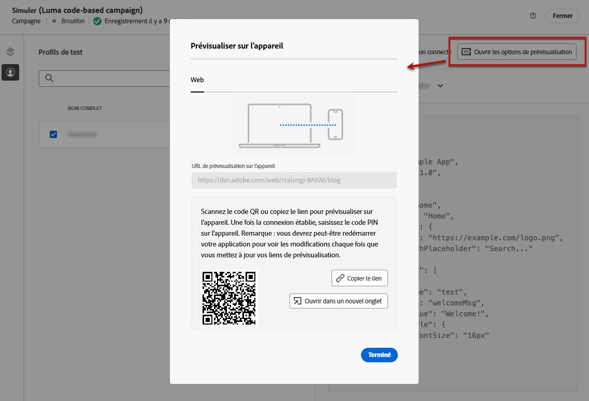
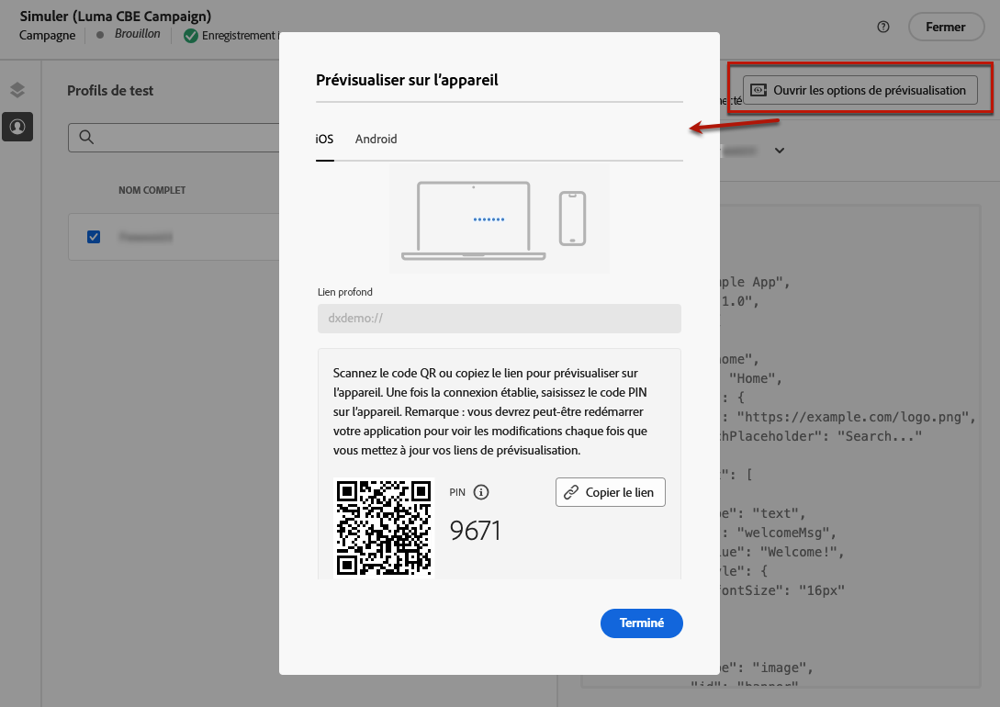
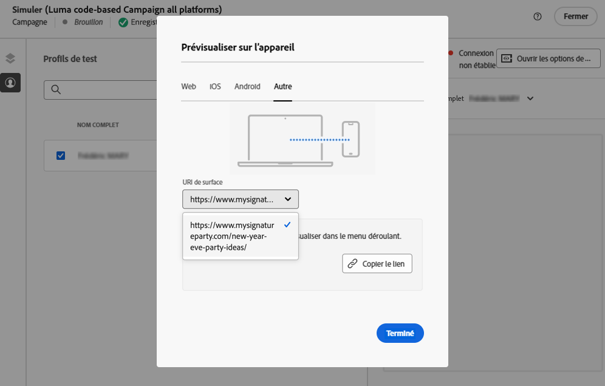
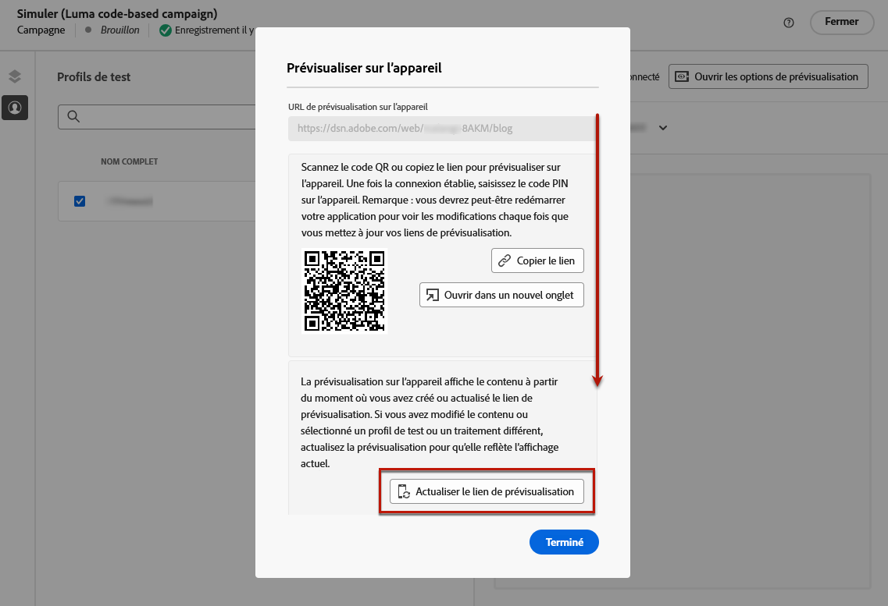

# Tester des expériences basées sur du code {#test-code-based}

## Prévisualiser votre expérience basée sur du code {#preview-code-based}

>[!CONTEXTUALHELP]
>id="ajo_code_based_preview"
>title="Prévisualiser votre expérience basée sur du code"
>abstract="Effectuez une simulation de ce à quoi ressemblera votre expérience basée sur le code."

Pour afficher un aperçu de votre expérience basée sur le code qui a été modifiée, suivez les étapes ci-dessous.

>[!CAUTION]
>
>Vous devez disposer de profils de test pour simuler les offres qui leur seront diffusées. Découvrez comment [créer des profils de test](../audience/creating-test-profiles.md).

1. Dans le parcours ou la campagne, sur l’écran de modification du contenu ou sur l’écran de l’éditeur de personnalisation, sélectionnez **[!UICONTROL Simuler le contenu]**.

   

1. Cliquez sur **[!UICONTROL Gérer les profils de test]** pour sélectionner un ou plusieurs profils de test.

1. Un aperçu de votre expérience basée sur le code qui a été modifiée s’affiche.

Vous trouverez des informations détaillées sur la sélection des profils de test et la prévisualisation de votre contenu dans [cette section](../content-management/preview.md).

>[!NOTE]
>
>Actuellement, vous ne pouvez pas simuler le contenu de l’interface d’utilisation dans une campagne ou un parcours d’expérience basée sur du code à l’aide de la [prise de décisions](../experience-decisioning/gs-experience-decisioning.md). Une solution de contournement est proposée dans [cette section](../experience-decisioning/create-decision.md#test-and-publish).

## Prévisualiser sur l’appareil {#preview-on-device}

>[!CONTEXTUALHELP]
>id="ajo_code_based_preview_device"
>title="Prévisualiser votre expérience basée sur du code sur un appareil réel"
>abstract="Obtenez une prévisualisation de vos expériences personnalisées directement sur votre navigateur ou vos appareils mobiles, afin de voir à quoi elles ressemblent sur des appareils réels."

>[!CONTEXTUALHELP]
>id="ajo_code_based_preview_device_web"
>title="Prévisualiser votre expérience web basée sur du code sur un appareil"
>abstract="Scannez le code QR ou copiez le lien pour effectuer la prévisualisation sur l’appareil."

>[!CONTEXTUALHELP]
>id="ajo_code_based_preview_device_mobile"
>title="Prévisualiser sur un appareil votre expérience mobile basée sur du code"
>abstract="Scannez le code QR ou copiez le lien pour effectuer la prévisualisation sur l’appareil. Une fois la connexion établie, saisissez le code PIN sur l’appareil. Vous devrez peut-être redémarrer votre application pour afficher les modifications chaque fois que vous mettez à jour vos liens de prévisualisation."

>[!CONTEXTUALHELP]
>id="ajo_code_based_preview_device_refresh"
>title="Actualiser le lien de prévisualisation pour refléter la vue actuelle"
>abstract="La prévisualisation sur appareil affiche le contenu à partir du moment où vous avez créé ou actualisé le lien de prévisualisation. Si vous avez modifié le contenu ou sélectionné un autre profil de test ou traitement, actualisez la prévisualisation pour qu’elle reflète la vue actuelle."

Lors de la création d’expériences basées sur du code pour des pages web ou des applications mobiles, vous pouvez prévisualiser vos expériences personnalisées directement sur votre navigateur ou sur vos appareils mobiles, afin de voir à quoi ressemblent ces expériences sur des appareils réels.

>[!WARNING]
>
>La prévisualisation sur l’appareil n’est pas disponible lors de l’utilisation des [politiques de décision](../experience-decisioning/create-decision.md) ou des attributs contextuels de [personnalisation](../personalization/personalization-build-expressions.md).

1. Dans l’écran **[!UICONTROL Simuler]**, cliquez sur le bouton **[!UICONTROL Ouvrir les options de prévisualisation]**. Les options de prévisualisation dépendent de la plateforme sélectionnée dans votre [configuration basée sur le code](code-based-configuration.md#create-code-based-configuration).

1. Si vous utilisez une [plateforme web](code-based-configuration.md#web) dans votre configuration basée sur le code, le champ **[!UICONTROL URL de prévisualisation sur l’appareil]** en lecture seule est prérempli avec l’URL saisie pour la configuration de canal actuelle.

   

   Vous pouvez effectuer l’une des actions suivantes :

   * Sélectionnez le bouton **[!UICONTROL Copier le lien]** et collez le lien dans un onglet de navigateur. Vous pouvez également partager le lien avec votre équipe et les parties prenantes, qui peuvent prévisualiser la nouvelle expérience dans n’importe quel navigateur avant que les modifications ne soient mises en ligne.

   * Cliquez sur **[!UICONTROL Ouvrir dans un nouvel onglet]** pour ouvrir le lien dans votre navigateur actuel.

   * Analysez le code QR avec votre appareil mobile pour ouvrir le lien de prévisualisation sur un navigateur mobile.

1. Si vous utilisez des [plateformes mobiles](code-based-configuration.md#mobile) (iOS/Android) dans votre configuration basée sur le code, le champ **[!UICONTROL Lien profond]** en lecture seule est prérempli avec la valeur **[!UICONTROL URL de prévisualisation]** saisie dans la configuration de canal pour la plateforme sélectionnée.

   Basculez entre les onglets **[!UICONTROL iOS]** et **[!DNL Android]** pour prévisualiser votre expérience pour la plateforme de votre choix.

   

   Vous pouvez effectuer l’une des actions suivantes :

   * Sélectionnez le bouton **[!UICONTROL Copier le lien]** et partagez le lien avec votre équipe et les parties prenantes, qui peuvent prévisualiser la nouvelle expérience dans n’importe quel navigateur mobile avant que les modifications ne soient mises en ligne.

   * Analysez le code QR avec votre appareil mobile pour ouvrir le lien de prévisualisation directement dans l’application mobile. Vous devez saisir le code PIN sur votre appareil pour établir la session [Assurance](https://experienceleague.adobe.com/fr/docs/experience-platform/assurance/tutorials/implement-assurance){target="_blank"}.

     >[!NOTE]
     >
     >**Adobe Experience Platform Assurance** est un produit d’Adobe Experience Cloud qui vous aide à inspecter, à tester, à simuler et à valider la manière dont vous collectez des données ou diffusez des expériences dans votre application mobile. [En savoir plus](https://experienceleague.adobe.com/fr/docs/experience-platform/assurance/home){target="_blank"}

1. Si vous utilisez une [autre plateforme](code-based-configuration.md#other) dans votre configuration basée sur le code, choisissez l’[URI de surface](code-based-surface.md#surface-uri) à prévisualiser dans la liste déroulante.

   

   * Sélectionnez le bouton **[!UICONTROL Copier le lien]** pour coller le lien dans un onglet du navigateur ou le partager avec votre équipe et les parties prenantes.

   * Si vous avez ajouté plusieurs URI à votre configuration (jusqu’à 10), vous pouvez sélectionner n’importe lequel pour la prévisualisation.

1. Les liens de prévisualisation sont générés pour le profil de test sélectionné et, si vous utilisez [Expérience de contenu](../content-management/content-experiment.md) dans votre parcours ou campagne, pour le traitement sélectionné.

   <!--If you have modified the content or selected a different treatment or test profile, scroll down to the bottom of the **[!UICONTROL Preview on device]** pop-up and click **[!UICONTROL Refresh preview link]** to reflect the current state.

   -->

   <!--When creating a content experiment, you need to select a given treatment and click the **[!UICONTROL Simulate content]** button to obtain the link corresponding to that treatment, then select another treatment, click the **[!UICONTROL Simulate content]** button to obtain a new preview link, and so on.-->

   Lors de la mise à jour du contenu ou de la sélection d’un autre profil ou traitement de test, le lien de prévisualisation est automatiquement actualisé. Vous pouvez copier le lien dans différents onglets du navigateur et comparer les expériences.
