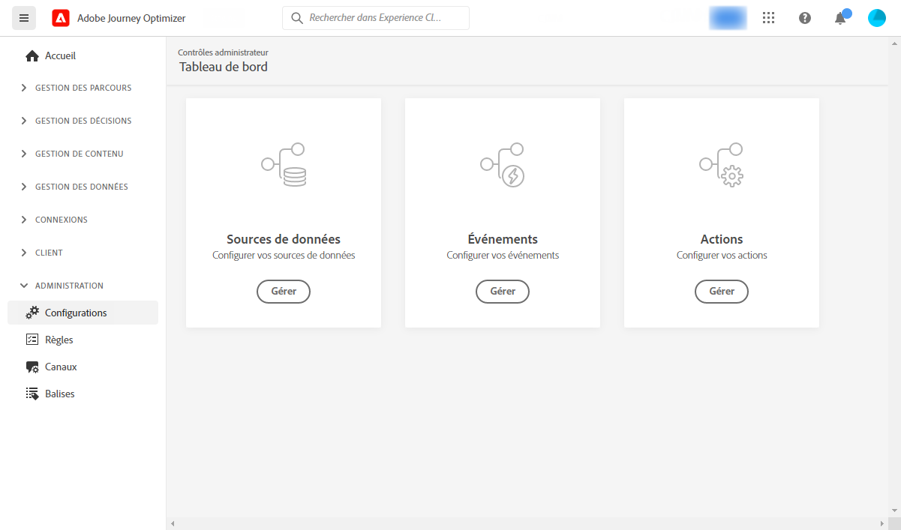
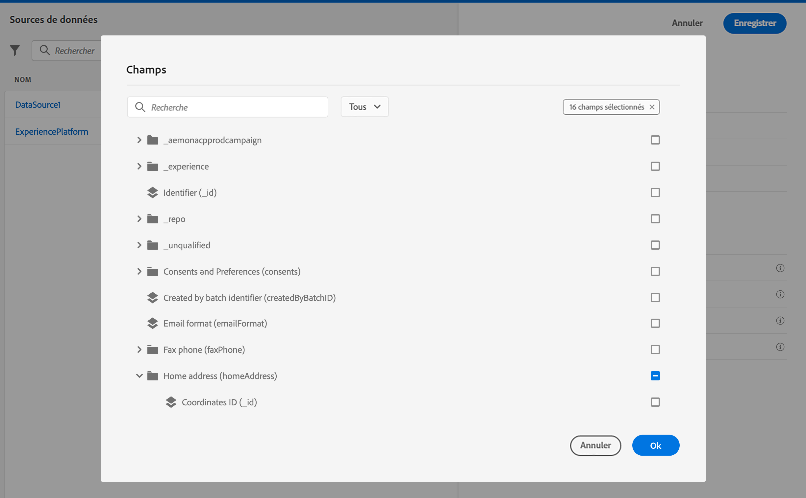

# Prise en main de la configuration de parcours {#configure-journeys}

>[!CONTEXTUALHELP]
>id="ajo_journey_configuration_dashboard"
>title="À propos de la configuration de parcours"
>abstract="Pour envoyer des messages avec des parcours, il est nécessaire de configurer les sources de données, les événements et les actions. Les sources de données vous permettent d’établir une connexion à un système afin de récupérer des informations supplémentaires qui seront utilisées dans vos parcours, par exemple dans des conditions. Les événements permettent le déclenchement de vos parcours lorsqu’un événement est reçu. Les actions personnalisées facilitent la connexion à un système tiers pour envoyer vos messages. Si vous utilisez les fonctionnalités de messagerie intégrées de Journey Optimizer, il n’est pas nécessaire de configurer une action."

Pour envoyer des messages avec des parcours, il est nécessaire de configurer **[!UICONTROL Sources de données]**, **[!UICONTROL Événements]** et **[!UICONTROL Actions]**. Les sources de données vous permettent d’établir une connexion à un système afin de récupérer des informations supplémentaires qui seront utilisées dans vos parcours, par exemple dans des conditions. Les événements permettent le déclenchement de vos parcours lorsqu’un événement est reçu. Les actions personnalisées facilitent la connexion à un système tiers pour envoyer vos messages. Si vous utilisez les fonctionnalités de messagerie intégrées de Journey Optimizer, il n’est pas nécessaire de configurer une action.

Vous pouvez également configurer des connexions à des systèmes externes par le biais de sources de données et d’actions personnalisées. Vous pouvez ainsi, par exemple, enrichir vos parcours de données provenant d’un système de réservation externe ou envoyer des messages à l’aide d&#39;un système tiers tel qu’Epsilon ou Facebook. Découvrez comment [intégrer Journey Optimizer à des systèmes externes](external-systems.md).

## Sources de données {#data-sources}

La configuration des sources de données vous permet de définir une connexion à un système afin de récupérer des informations supplémentaires qui seront utilisées dans vos parcours. [En savoir plus](../../using/datasource/about-data-sources.md)

## Événements {#events}

Les événements vous permettent de déclencher vos parcours de manière unitaire pour envoyer des messages, en temps réel, à l&#39;individu progressant dans le parcours.

Dans la configuration des événements, vous configurez les événements attendus dans les parcours. Les données des événements entrants sont normalisées conformément au modèle de données d’expérience Adobe (XDM). Les événements authentifiés et non authentifiés proviennent des API d’ingestion en flux continu (notamment ceux issus du kit de développement Adobe Mobile SDK). [En savoir plus](../../using/event/about-events.md)

## Actions {#actions}

Les fonctionnalités de message Journey Optimizer sont intégrées : il vous suffit d’ajouter une activité d’action de canal à votre parcours. Si vous utilisez un système tiers pour envoyer vos messages, vous pouvez créer une action personnalisée. [En savoir plus](../../using/action/action.md)

## Parcourir à travers les champs Adobe Experience Platform {#friendly-names-display}

Lors de la définition de la [payload d&#39;événement](../event/about-creating.md#define-the-payload-fields), de la [payload du groupe de champs](../datasource/configure-data-sources.md#define-field-groups) et de la sélection de champs dans l&#39;[éditeur d&#39;expression](../building-journeys/expression/expressionadvanced.md), le nom d&#39;affichage s&#39;affiche en plus du nom du champ. Ces informations sont récupérées à partir de la définition du schéma dans le modèle de données d&#39;expérience.

Si des descripteurs tels que « xdm:alternateDisplayInfo » sont fournis lors de la configuration des schémas, les noms conviviaux remplacent les noms d&#39;affichage. Cela est particulièrement utile lorsque vous utilisez des « eVars » et des champs génériques. Vous pouvez configurer des descripteurs de noms conviviaux via un appel API. Pour plus d&#39;informations, consultez le [guide sur le registre de schéma destiné aux développeurs](https://experienceleague.adobe.com/docs/experience-platform/xdm/api/getting-started.html?lang=fr){target="_blank"}.

Si un nom convivial est disponible, le champ s&#39;affiche sous la forme `<friendly-name>(<name>)`. Si aucun nom convivial n&#39;est disponible, le nom d&#39;affichage s&#39;affiche, par exemple `<display-name>(<name>)`. Si aucun d&#39;eux n&#39;est défini, seul le nom technique du champ s&#39;affiche `<name>`.

>[!NOTE]
>
>Les noms conviviaux ne sont pas récupérés lorsque vous sélectionnez des champs dans une union de schémas.
