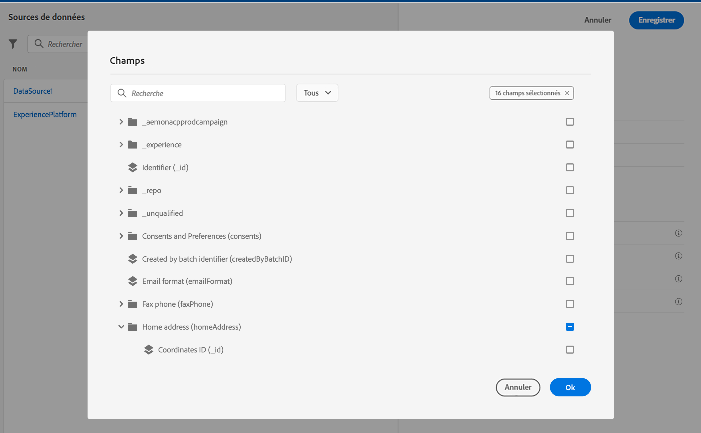

# Configuration de parcours

Pour envoyer des messages avec des parcours, vous devez configurer les **[!UICONTROL Sources de données]**, les **[!UICONTROL Événements]** et les **[!UICONTROL Actions]**.

## Sources de données

La configuration des sources de données vous permet de définir une connexion à un système afin de récupérer des informations supplémentaires qui seront utilisées dans vos parcours. [En savoir plus](../../using/datasource/about-data-sources.md)

## Événements

Les événements vous permettent de déclencher vos parcours de manière unitaire pour envoyer des messages, en temps réel, à l&#39;individu progressant dans le parcours.

Dans la configuration des événements, vous configurez les événements attendus dans les parcours. Les données des événements entrants sont normalisées conformément au modèle de données Adobe Experience (XDM). Les événements authentifiés et non authentifiés proviennent des API d&#39;ingestion en flux continu (notamment ceux issus du kit de développement Adobe Mobile SDK). [En savoir plus](../../using/event/about-events.md)

## Actions

Les fonctionnalités de message Journey Optimizer sont intégrées : il vous suffit de concevoir votre contenu et de publier votre message. Si vous utilisez un système tiers pour envoyer vos messages, vous pouvez créer une action personnalisée. [En savoir plus](../../using/action/action.md)

## Parcourir à travers les champs Adobe Experience Platform {#friendly-names-display}

Lors de la définition de la [payload de l’événement](../event/about-creating.md#define-the-payload-fields), de la [payload du groupe de champs](../datasource/configure-data-sources.md#define-field-groups) et de la sélection de champs dans l’ [éditeur d’expression](https://experienceleague.adobe.com/docs/journeys/using/building-advanced-conditions-journeys/expressionadvanced.html?lang=fr){target=&quot;_blank&quot;}, le nom d’affichage s’affiche en plus du nom du champ. Ces informations sont récupérées à partir de la définition du schéma dans le modèle de données d&#39;expérience.

Si des descripteurs tels que « xdm:alternateDisplayInfo » sont fournis lors de la configuration des schémas, les noms conviviaux remplacent les noms d&#39;affichage. Ceci est particulièrement utile lorsque vous utilisez des &quot;eVars&quot; et des champs génériques. Vous pouvez configurer des descripteurs de noms conviviaux via un appel d&#39;API. Pour plus d’informations, consultez le [guide de développement du registre des schémas](https://experienceleague.adobe.com/docs/experience-platform/xdm/api/getting-started.html?lang=fr){target=&quot;_blank&quot;}.

Si un nom convivial est disponible, le champ s&#39;affiche sous la forme `<friendly-name>(<name>)`. Si aucun nom convivial n&#39;est disponible, le nom d&#39;affichage s&#39;affiche, par exemple `<display-name>(<name>)`. Si aucun d&#39;eux n&#39;est défini, seul le nom technique du champ s&#39;affiche `<name>`.

>[!NOTE]
>
>Les noms conviviaux ne sont pas récupérés lorsque vous sélectionnez des champs dans une union de schémas.