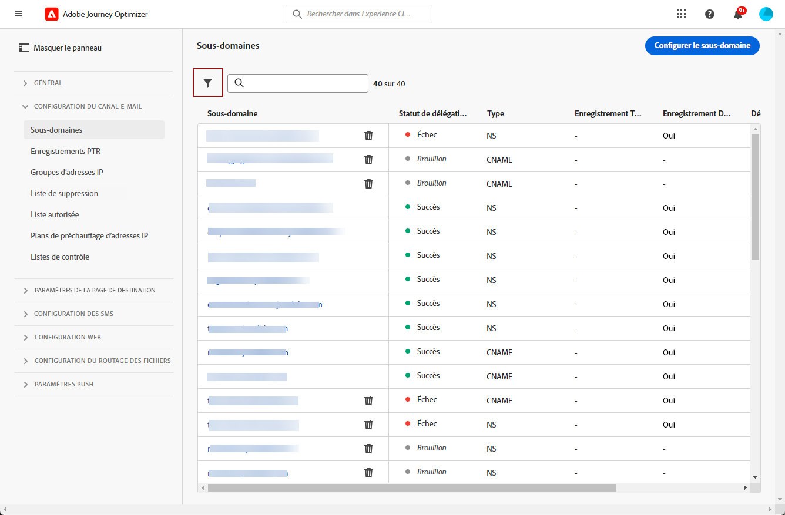

# Délégation de sous-domaines dans [!DNL Journey Optimizer] {#subdomain-delegation}

>[!CONTEXTUALHELP]
>id="ajo_admin_delegated_subdomains"
>title="Vos sous-domaines délégués s’affichent ici."
>abstract="Déléguez votre premier sous-domaine. Une fois la délégation terminée, les enregistrements PTR sont créés et les canaux d’email seront activés."

La création d’un sous-domaine pour les campagnes par e-mail permet aux marques d’isoler différents types de trafic (marketing ou entreprise, par exemple) dans des pools d’adresses IP spécifiques et avec des domaines spécifiques, ce qui accélère le processus de préparation des adresses IP et améliore globalement la délivrabilité.

Si vous partagez un domaine et qu&#39;il est bloqué ou ajouté à la liste bloquée, il peut y avoir un impact sur la diffusion des e-mails de votre entreprise. Les problèmes de réputation ou les blocages d&#39;un domaine particulier de vos communications marketing par e-mail auront un impact spécifique sur ce flux de messagerie. L’utilisation de votre domaine principal comme adresse d’expéditeur pour différents flux d’e-mails peut également interrompre l’authentification par e-mail, ce qui bloque ou place vos messages dans le dossier des courriers indésirables.

>[!NOTE]
>
>Vous ne pouvez pas utiliser le même domaine d’envoi pour envoyer des messages depuis [!DNL Adobe Journey Optimizer] et à partir d’un autre produit, tel que [!DNL Adobe Campaign] ou [!DNL Adobe Marketo Engage].

## Pourquoi configurer des sous-domaines ? {#why-set-up-subdomains}

Un sous-domaine est une division de votre domaine qui peut être utilisée pour isoler vos marques ou divers types de trafics (par ex. messages transactionnels et communications marketing).

Prenons l&#39;exemple du domaine « mybrand.com », utilisé pour envoyer des communications transactionnelles et marketing. Dans ce cas, vous pouvez décider de configurer deux sous-domaines :

* le sous-domaine « info.mybrand.com » pour vos communications transactionnelles (confirmation des achats, réinitialisation de mots de passe, etc.),
* et le sous-domaine « marketing.mybrand.com » pour vos emails de prospection.

Ce faisant, vous contribuerez à préserver la réputation de votre domaine et des autres sous-domaines. Par exemple, si les sous-domaines « marketing.mybrand.com » se retrouvaient ajoutés à la liste bloquée par les fournisseurs de services Internet en raison d&#39;une mauvaise délivrabilité, cela empêcherait le domaine « mybrand.com » entier et le sous-domaine « info.mybrand.com » d&#39;être ajoutés à la liste bloquée.

Lors de la mise en œuvre d&#39;une solution, des exigences doivent être satisfaites pour les composants orientés vers l&#39;extérieur : par exemple, configurer les liens et les pages web à suivre, afficher les pages miroir, etc.

Bien que ces exigences soient gérées au moyen de composants hébergés à la fois par Adobe et le client, elles incluent des URL visibles par les destinataires des emails. Afin d&#39;éviter que des URL indiquant la solution technique sous-jacente ou le fournisseur d&#39;hébergement ne soient installées, il est possible de configurer des sous-domaines pour rendre cette opération transparente pour les destinataires des emails.

**En savoir plus**

* Découvrez comment [déléguer vos sous-domaines](delegate-subdomain.md) directement à partir de l&#39;interface.
* Découvrez comment [ajouter des enregistrements Google TXT](google-txt.md) à vos sous-domaines pour réussir la diffusion des e-mails aux adresses Gmail.
* Découvrez comment [accéder aux enregistrements PTR](ptr-records.md) générés pour vos sous-domaines, ce qui permet aux serveurs de messagerie de les vérifier.

## Méthodes de configuration de sous-domaine {#subdomain-delegation-methods}

La configuration de sous-domaines vous permet de configurer une sous-section de votre domaine (techniquement, une « zone DNS ») à utiliser avec Adobe Campaign. Les méthodes de configuration disponibles sont les suivantes :

* **Délégation complète de sous-domaine à Adobe** (recommandée) : le sous-domaine est entièrement délégué à Adobe. Adobe assure le contrôle et la gestion de tous les aspects du DNS nécessaires à la diffusion, au rendu et au suivi des messages. [En savoir plus sur la délégation complète de sous-domaine](delegate-subdomain.md#full-subdomain-delegation)

* **Utilisation de CNAME** : créez un sous-domaine et utilisez des CNAME pour pointer vers des enregistrements spécifiques à Adobe. Avec cette configuration, vous partagez avec Adobe la responsabilité de la maintenance du DNS. [En savoir plus sur la délégation de sous-domaine CNAME](delegate-subdomain.md#cname-subdomain-delegation)

>[!CAUTION]
>
>* La délégation complète de sous-domaine est la méthode préconisée.
>
>* La méthode CNAME est recommandée si les politiques de votre organisation interdisent la méthode de délégation complète de sous-domaine. En conséquence, vous devrez assumer la mise à jour et la gestion des enregistrements DNS. Adobe ne pourra pas vous aider à modifier, tenir à jour ou gérer le DNS dʼun sous-domaine configuré par la méthode CNAME.

Le tableau ci-dessous résume le fonctionnement de ces méthodes, ainsi que le niveau d’effort impliqué :

| Méthode de configuration | Fonctionnement | Niveau d&#39;effort |
|---|---|---|
| **Délégation complète** | Créez l’enregistrement du sous-domaine et de l’espace de noms. Adobe configurera alors tous les enregistrements DNS nécessaires à Adobe Campaign.  Dans cette configuration, Adobe est entièrement responsable de la gestion du sous-domaine et de tous les enregistrements DNS. | Faible |
| **CNAME, méthode personnalisée** | Créez l’enregistrement du sous-domaine et de l’espace de noms. Adobe fournira alors les enregistrements à placer sur vos serveurs DNS et configurera les valeurs correspondantes sur les serveurs DNS Adobe Campaign.  Dans cette configuration, vous partagez avec Adobe la responsabilité de la maintenance du DNS. | Élevé |

Des informations supplémentaires sur la configuration de domaine sont disponibles dans [cette documentation](https://experienceleague.adobe.com/docs/deliverability-learn/deliverability-best-practice-guide/additional-resources/product-specific-resources/campaign/ac-domain-name-setup.html?lang=fr).

Si vous avez des questions concernant les méthodes de configuration de sous-domaine, contactez Adobe ou éventuellement l’assistance clientèle pour obtenir des conseils sur la délivrabilité.

## Accéder aux sous-domaines délégués {#access-delegated-subdomains}

Tous les sous-domaines délégués s’affichent dans le menu **[!UICONTROL Administration]** > **[!UICONTROL Canaux]** > **[!UICONTROL Sous-domaines]**. Des filtres sont disponibles pour vous aider à affiner la liste (date de délégation, utilisateur ou statut).

La colonne **[!UICONTROL Statut]** fournit des informations sur le processus de délégation de sous-domaine :

* **[!UICONTROL Brouillon]** : la délégation de sous-domaine a été enregistrée en tant que brouillon. Cliquez sur le nom du sous-domaine pour reprendre le processus de délégation,
* **[!UICONTROL Traitement]** : le sous-domaine fait l&#39;objet de plusieurs contrôles de configuration avant de pouvoir être utilisé,
* **[!UICONTROL Succès]** : le sous-domaine a passé les contrôles avec succès et peut être utilisé pour diffuser des messages,
* **[!UICONTROL Échec]** : un ou plusieurs contrôles ont échoué après l&#39;envoi de la délégation de sous-domaine.

Pour accéder à des informations détaillées sur un sous-domaine avec le statut **[!UICONTROL Succès]**, ouvrez-le depuis la liste.

Vous pouvez :

* Récupérer le nom du sous-domaine (lecture seule) configuré pendant le processus de délégation, ainsi que les URL générées (ressources, pages miroir, URL de tracking),

* Ajouter un enregistrement TXT de vérification de site Google à votre sous-domaine pour vous assurer qu&#39;il est vérifié (voir [Ajout d&#39;un enregistrement TXT Google à un sous-domaine](google-txt.md)).

>[!CAUTION]
>
>La configuration de sous-domaines est commune à tous les environnements. Par conséquent, toute modification apportée à un sous-domaine aura également un impact sur les sandbox de production.
