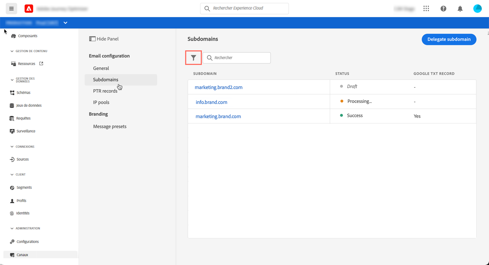

# Accès aux sous-domaines délégués

Tous les sous-domaines délégués s’affichent dans le menu **[!UICONTROL Configuration du message]** / **[!UICONTROL Délégation de sous-domaine]**.

Plusieurs filtres sont disponibles pour vous aider à affiner la liste (date de délégation, utilisateur ou état).

La colonne État fournit des informations sur le processus de délégation de sous-domaines :

* **[!UICONTROL Version préliminaire]** : la délégation de sous-domaine a été enregistrée en tant que brouillon. Cliquez sur la ligne pour reprendre la délégation du sous-domaine.

* **[!UICONTROL Traitement]** : le sous-domaine fait l&#39;objet de plusieurs vérifications de configuration avant de pouvoir être utilisé.

* **[!UICONTROL Succès]** (! !ou vérifié ?): le sous-domaine a passé les contrôles avec succès et peut être utilisé pour diffuser des messages.

* **[!UICONTROL Échec]** : une ou plusieurs vérifications ont échoué après l&#39;envoi de la délégation de sous-domaine.
