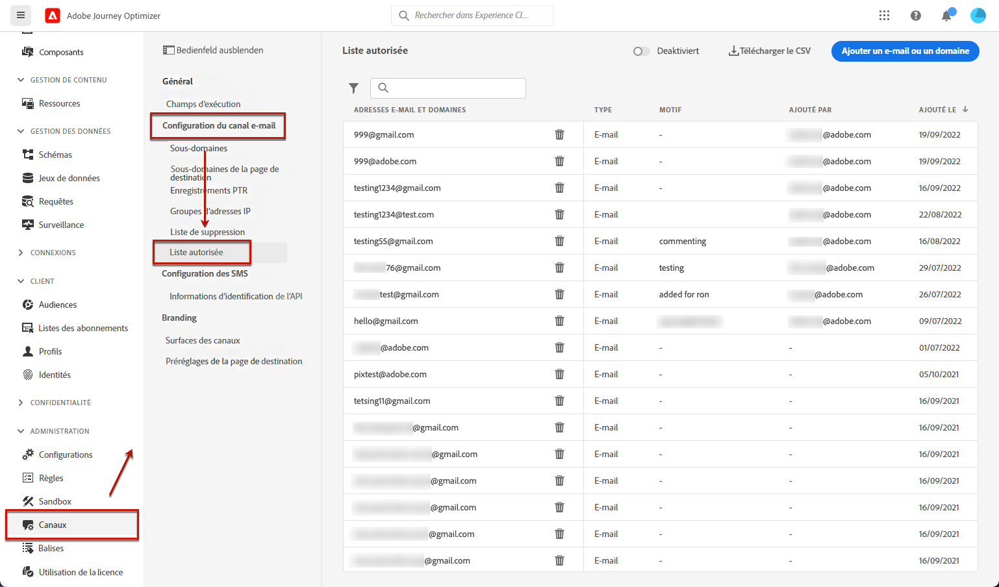
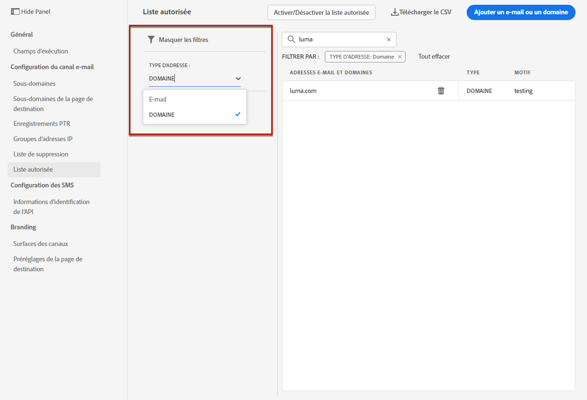
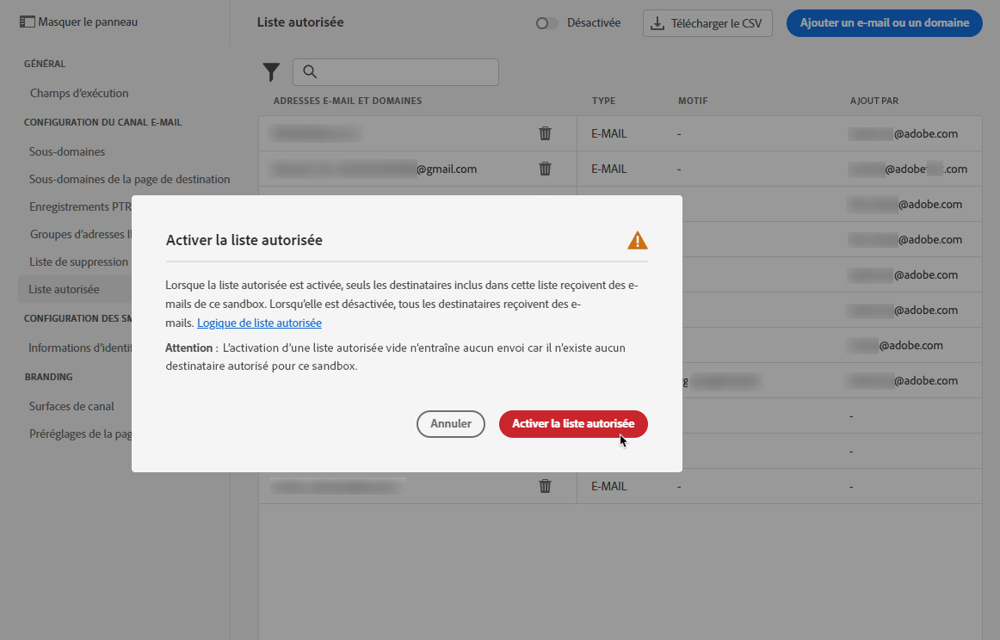
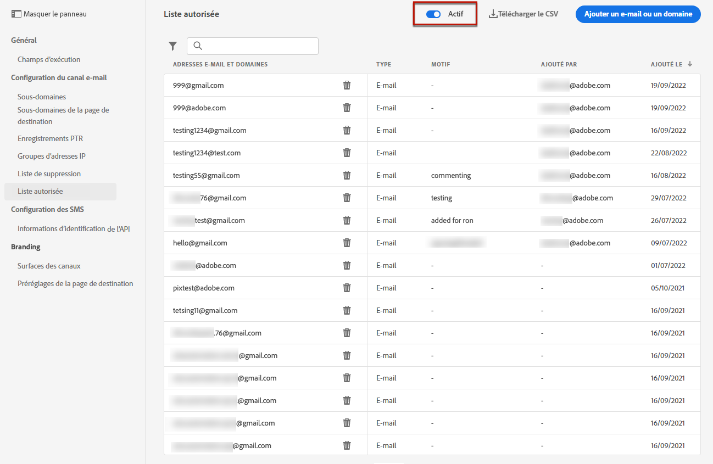
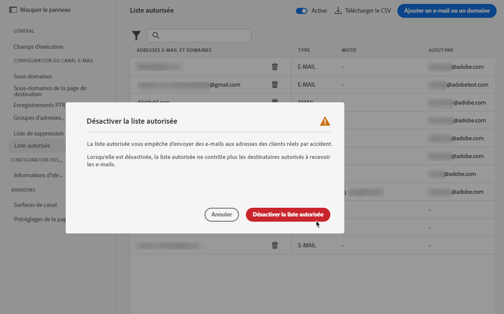
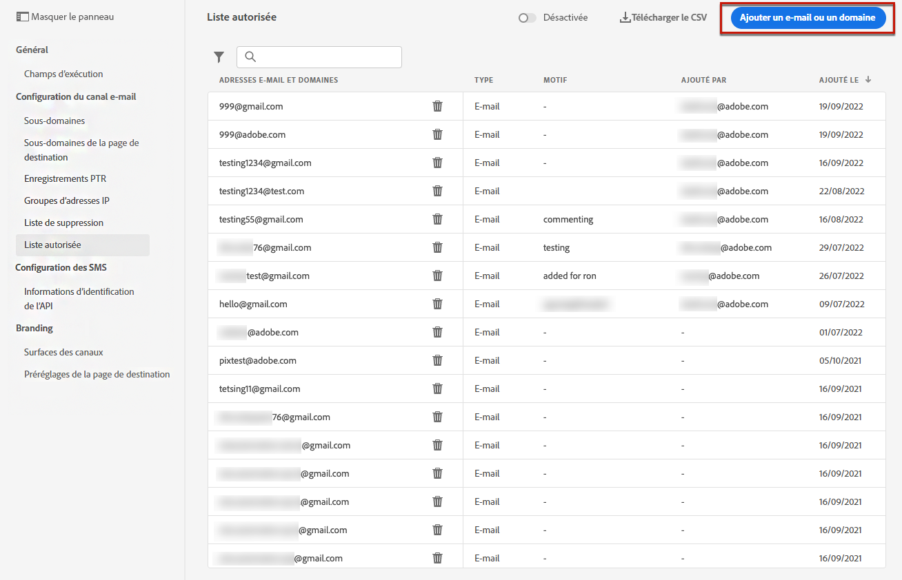
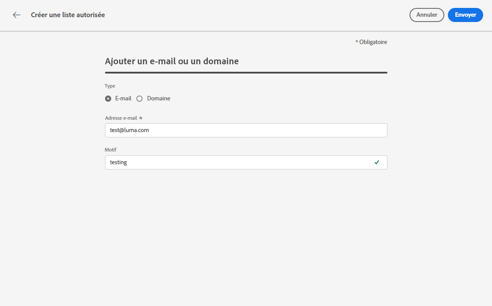
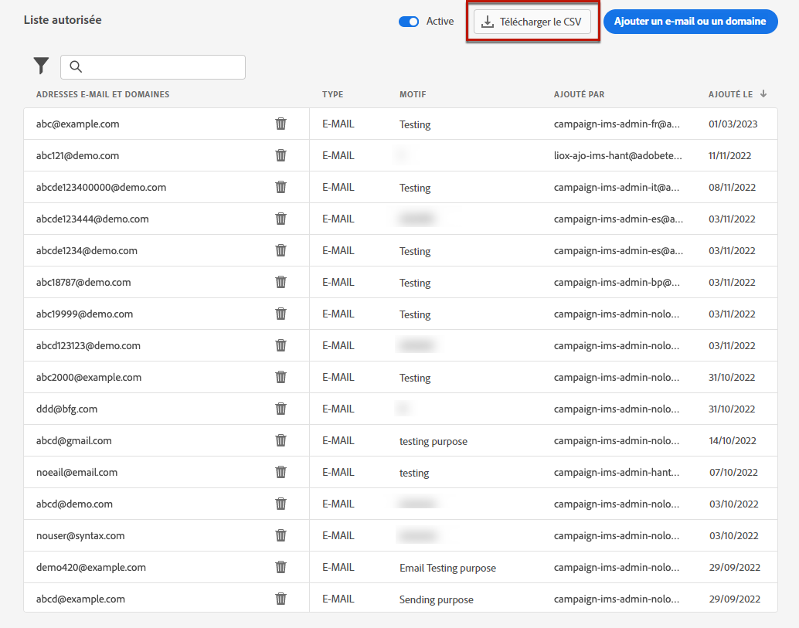
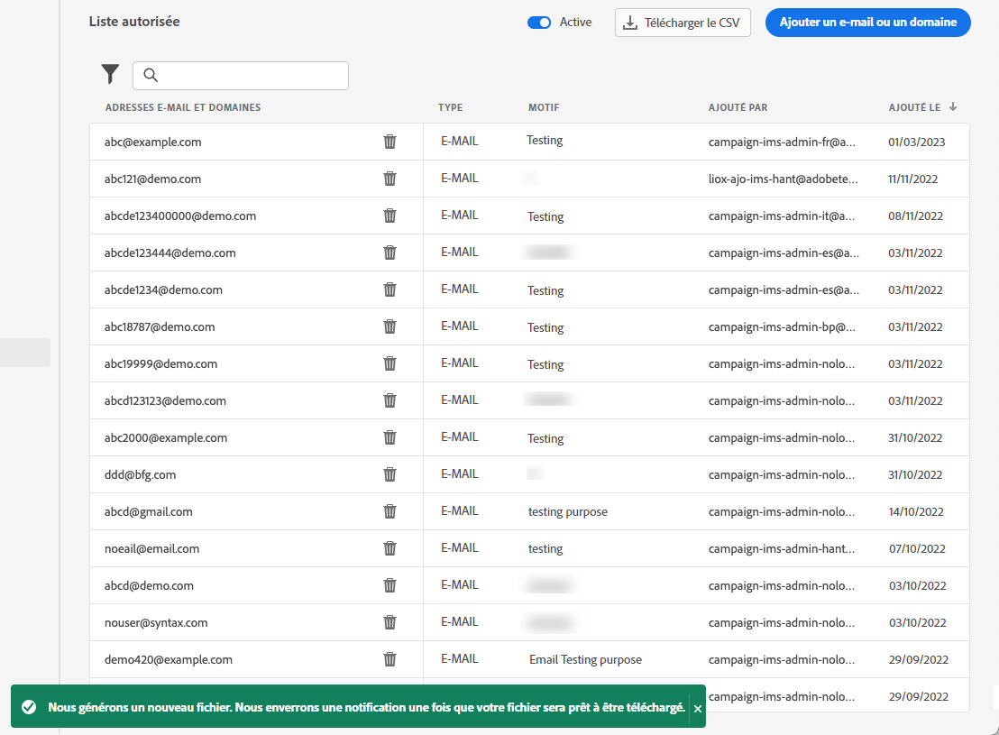
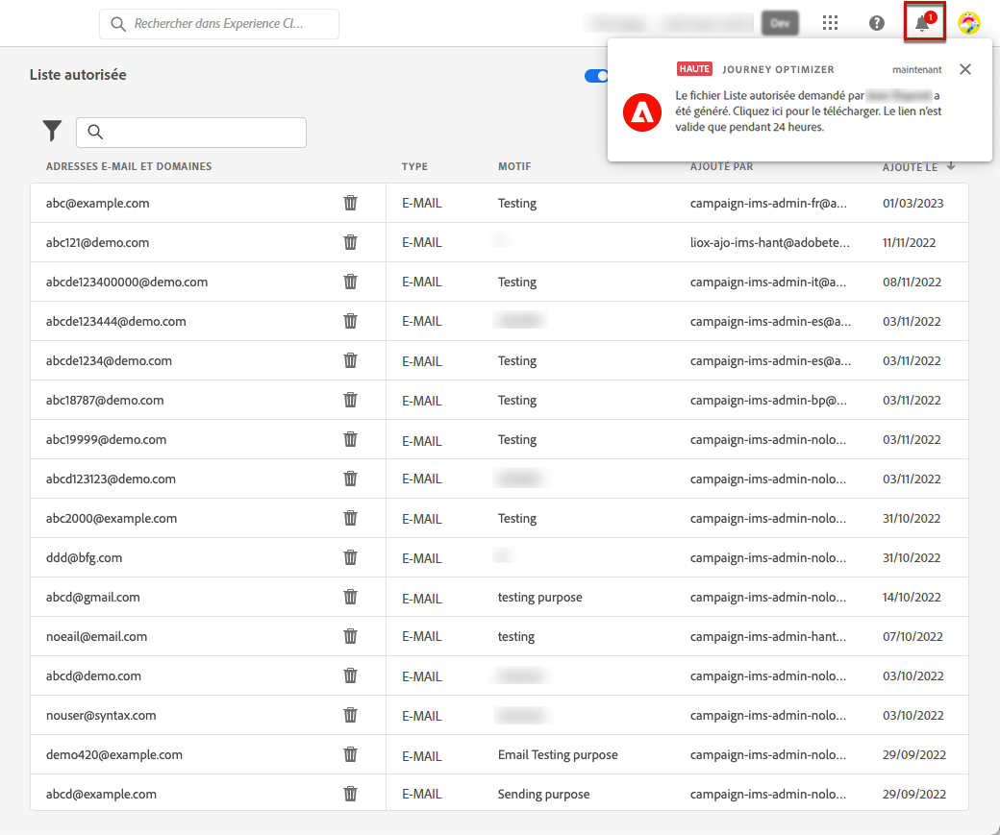

# Configurer une liste autorisée {#allow-list}

Il est possible de définir une liste de sécurité d’envoi spécifique au niveau du [sandbox](../administration/sandboxes.md).

La liste autorisée vous permet de spécifier des adresses e-mail ou des domaines individuels qui seront les seuls destinataires ou domaines autorisés à recevoir les e-mails que vous envoyez à partir d’un sandbox spécifique.

>[!CAUTION]
>
>Cette fonctionnalité s’applique uniquement au canal e-mail. Elle est disponible sur les sandbox de production et hors production.

Par exemple, sur une instance hors production, où des erreurs peuvent se produire, la liste autorisée garantit que vous ne risquez pas d’envoyer des messages indésirables à de vraies adresses client et fournit donc un environnement sécurisé à des fins de test.

De plus, lorsque la liste autorisée est active mais vide, aucun e-mail ne sera envoyé. Par conséquent, si vous rencontrez un problème majeur, vous pouvez utiliser cette fonctionnalité pour arrêter toutes les communications sortantes depuis [!DNL Journey Optimizer] jusqu’à ce que vous résolviez le problème. En savoir plus sur la [logique de liste autorisée](#logic).

En outre, vous pouvez tirer parti de l’**API REST de suppression** Journey Optimizer pour contrôler vos messages sortants à l’aide des listes de suppression et des listes autorisées. [Découvrez comment utiliser l’API REST de suppression.](https://developer.adobe.com/journey-optimizer-apis/references/suppression/){target="_blank"}

## Accéder à la liste autorisée {#access-allowed-list}

Pour accéder à la liste détaillée des adresses e-mail et domaines autorisés, accédez à **[!UICONTROL Administration]** > **[!UICONTROL Canaux]** > **[!UICONTROL Paramètres des e-mails]**, puis sélectionnez **[!UICONTROL Liste autorisée]**.



>[!CAUTION]
>
>Les autorisations d’affichage, d’export et de gestion de la liste autorisée sont limitées aux [Administrateurs et administratrices de Journey](../administration/ootb-product-profiles.md#journey-administrator). Pour en savoir plus sur la gestion des droits d’accès des utilisateurs et des utilisatrices [!DNL Journey Optimizer], consultez [cette section](../administration/permissions-overview.md).

Pour exporter la liste autorisée au format CSV, cliquez sur le bouton **[!UICONTROL Télécharger CSV]**.

Utilisez le bouton **[!UICONTROL Supprimer]** pour supprimer définitivement une entrée.

Vous pouvez effectuer des recherches sur les adresses e-mail ou domaines, puis filtrer selon le **[!UICONTROL Type d’adresse]**. Une fois sélectionné, vous pouvez effacer le filtre affiché en haut de la liste.



## Activer la liste autorisée {#enable-allow-list}

Pour activer la liste autorisée, procédez comme suit.

1. Accédez au menu **[!UICONTROL Canaux]** > **[!UICONTROL Configuration des e-mails]** > **[!UICONTROL Liste autorisée]**.

1. Sélectionnez le bouton bascule.

   

1. Sélectionnez **[!UICONTROL Activer la liste autorisée]**. La liste autorisée est maintenant active.

   

   >[!NOTE]
   >
   >Une fois la liste autorisée activée, elle prend effet dans vos parcours et campagnes après un délai de 10 minutes. De même, la mise à jour de la liste autorisée et de la liste de suppression peut prendre jusqu’à 10 minutes.

La logique de liste autorisée s’applique lorsque la fonctionnalité est active. En savoir plus dans [cette section](#logic).

>[!NOTE]
>
>Lorsqu’elle est activée, la fonctionnalité de liste autorisée est respectée lors de l’exécution des parcours, mais également lors du test des messages avec des [BAT](../content-management/proofs.md) et du test des parcours à l’aide du [mode test](../building-journeys/testing-the-journey.md).

## Désactiver la liste autorisée {#deactivate-allow-list}

Pour désactiver la liste autorisée, procédez comme suit.

1. Accédez au menu **[!UICONTROL Canaux]** > **[!UICONTROL Configuration des e-mails]** > **[!UICONTROL Liste autorisée]**.

1. Sélectionnez le bouton bascule.

   

1. Sélectionnez **[!UICONTROL Désactiver la liste autorisée]**. La liste autorisée n’est plus active.

   

   >[!NOTE]
   >
   >Une fois la liste autorisée désactivée, elle prend effet dans vos parcours et campagnes après un délai de 10 minutes. De même, la mise à jour de la liste autorisée et de la liste de suppression peut prendre jusqu’à 10 minutes.

La logique de liste autorisée ne s’applique pas lorsque la fonction est désactivée. En savoir plus dans [cette section](#logic).

## Ajout d&#39;entités à la liste autorisée {#add-entities}

Pour ajouter des adresses e-mail ou des domaines à la liste autorisée pour un sandbox spécifique, vous pouvez [renseigner manuellement la liste](#manually-populate-list) ou utiliser un [appel API](#api-call-allowed-list).

>[!NOTE]
>
>La liste autorisée peut contenir jusqu&#39;à 1 000 entrées.

### Remplissage manuel de la liste autorisée {#manually-populate-list}

>[!CONTEXTUALHELP]
>id="ajo_admin_allowed_list_add_header"
>title="Ajouter des adresses ou des domaines à la liste autorisée"
>abstract="Vous pouvez ajouter manuellement des adresses e-mail ou des domaines à la liste autorisée en les sélectionnant un par un."

>[!CONTEXTUALHELP]
>id="ajo_admin_allowed_list_add"
>title="Ajouter des adresses ou des domaines à la liste autorisée"
>abstract="Vous pouvez ajouter manuellement des adresses e-mail ou des domaines à la liste autorisée en les sélectionnant un par un."

Vous avez la possibilité de renseigner manuellement la liste autorisée [!DNL Journey Optimizer] en ajoutant une adresse e-mail ou un domaine par le biais de l’interface utilisateur.

>[!NOTE]
>
>Vous ne pouvez ajouter qu’une seule adresse e-mail ou seul domaine à la fois.

Pour ce faire, suivez les étapes ci-après.

1. Sélectionnez le bouton **[!UICONTROL Ajouter un e-mail ou un domaine]**.

   

1. Choisissez le type d&#39;adresse : **[!UICONTROL Adresse e-mail]** ou **[!UICONTROL Adresse de domaine]**.

1. Saisissez l’adresse e-mail ou le domaine vers lesquels vous souhaitez envoyer des e-mails.

   >[!NOTE]
   >
   >Veillez à saisir une adresse e-mail (par exemple abc@company) ou un domaine valide (par exemple abc.company.com).

1. Indiquez un motif si nécessaire.

   

   >[!NOTE]
   >
   >Tous les caractères ASCII compris entre 32 et 126 sont autorisés dans le champ **[!UICONTROL Motif]**. La liste complète se trouve sur [cette page](https://en.wikipedia.org/wiki/ASCII#Printable_characters){target="_blank"} par exemple.

1. Cliquez sur **[!UICONTROL Envoyer]**.

### Ajout d’entités à l’aide d’un appel API {#api-call-allowed-list}

Pour renseigner la liste autorisée, vous pouvez également appeler l’API de suppression avec la valeur `ALLOWED` pour l’attribut `listType`. Par exemple :


Vous pouvez effectuer les opérations **Ajouter**, **Supprimer** et **Obtenir**.

En savoir plus sur les appels API dans la documentation de référence [Adobe Experience Platform API](https://experienceleague.adobe.com/docs/experience-platform/landing/platform-apis/api-guide.html?lang=fr){target="_blank"}.

## Télécharger la liste autorisée {#download-allowed-list}

Pour exporter la liste autorisée au format CSV, suivez les étapes ci-dessous :

1. Sélectionnez le bouton **[!UICONTROL Téléchargement le CSV]**.

   

1. Patientez jusqu’à ce que le fichier soit généré.

   

   >[!NOTE]
   >
   >Le temps de téléchargement dépend de la taille du fichier, c’est-à-dire du nombre d’adresses qui se trouvent sur la liste autorisée.
   >
   >Une seule demande de téléchargement peut être traitée à la fois pour un sandbox donnée.

1. Une fois le fichier généré, vous recevez une notification. Cliquez sur l’icône représentant une cloche en haut à droite de l’écran pour l’afficher.

1. Cliquez sur la notification elle-même pour télécharger le fichier.

   

   >[!NOTE]
   >
   >Le lien est valide pendant 24 heures.

## Logique de liste autorisée {#logic}

>[!CONTEXTUALHELP]
>id="ajo_admin_allowed_list_logic"
>title="Gérer la liste autorisée"
>abstract="Lorsque la liste autorisée est activée, seuls les destinataires inclus dans cette liste reçoivent des e-mails de ce sandbox. Lorsqu’elle est désactivée, tous les destinataires reçoivent des e-mails."

Lorsque la liste autorisée est [active](#enable-allow-list), la logique suivante s’applique :

* Si la liste autorisée est **vide**, aucun e-mail ne sera envoyé.

* Si une entité est **sur la liste autorisée** et non sur la liste de suppression, l’e-mail peut être envoyé au(x) destinataire(s) correspondant(s). Cependant, si l&#39;entité figure également sur la [liste de suppression](../reports/suppression-list.md), le destinataire correspondant ne recevra pas l’e-mail, la raison étant **[!UICONTROL Supprimé]**.

* Si une entité **n’est pas sur la liste autorisée** (et pas sur la liste de suppression), le destinataire correspondant ne recevra pas l’e-mail, la raison étant **[!UICONTROL Non autorisé]**.

>[!NOTE]
>
>Les profils avec le statut **[!UICONTROL Non autorisé]** sont exclus pendant le processus d’envoi du message. Par conséquent, bien que les **rapports de parcours** indiquent que ces profils ont traversé le parcours ([Lecture d’audience](../building-journeys/read-audience.md) et [activités de message](../building-journeys/journey-action.md)), les **rapports d’e-mails** ne les incluront pas dans les mesures **[!UICONTROL Envoyé]** étant donné qu’ils sont filtrés avant l’envoi des e-mails.
>
>En savoir plus sur le [rapport dynamique](../reports/live-report.md) et le [rapport Customer Journey Analytics](../reports/report-gs-cja.md).

Lorsque la liste autorisée est [désactivée](#deactivate-allow-list), tous les e-mails que vous envoyez à partir du sandbox actuel sont envoyés à tous les destinataires (à condition qu’ils ne figurent pas dans la liste de suppression), y compris les adresses réelles des clients.

## Rapport d’exclusion {#reporting}

Lorsque la liste autorisée est active, vous pouvez récupérer les adresses e-mail ou les domaines qui ont été exclus d’un envoi, car ils ne figuraient pas sur la liste autorisée. Pour ce faire, vous pouvez utiliser le [service de requête Adobe Experience Platform](https://experienceleague.adobe.com/docs/experience-platform/query/api/getting-started.html?lang=fr){target="_blank"} pour effectuer les appels API ci-dessous.

Pour obtenir le **nombre d’e-mails** qui n’ont pas été envoyés car les destinataires n’étaient pas sur la liste autorisée, utilisez la requête suivante :

```sql
SELECT count(distinct _id) from cjm_message_feedback_event_dataset WHERE
_experience.customerJourneyManagement.messageExecution.messageExecutionID = '<MESSAGE_EXECUTION_ID>' AND
_experience.customerJourneyManagement.messageDeliveryfeedback.feedbackStatus = 'exclude' AND
_experience.customerJourneyManagement.messageDeliveryfeedback.messageExclusion.reason = 'EmailNotAllowed'
```

Pour obtenir la **liste des adresses e-mail** qui n’ont pas été envoyées car les destinataires n’étaient pas sur la liste autorisée, utilisez la requête suivante :

```sql
SELECT distinct(_experience.customerJourneyManagement.emailChannelContext.address) from cjm_message_feedback_event_dataset WHERE
_experience.customerJourneyManagement.messageExecution.messageExecutionID IS NOT NULL AND
_experience.customerJourneyManagement.messageDeliveryfeedback.feedbackStatus = 'exclude' AND
_experience.customerJourneyManagement.messageDeliveryfeedback.messageExclusion.reason = 'EmailNotAllowed'
```
