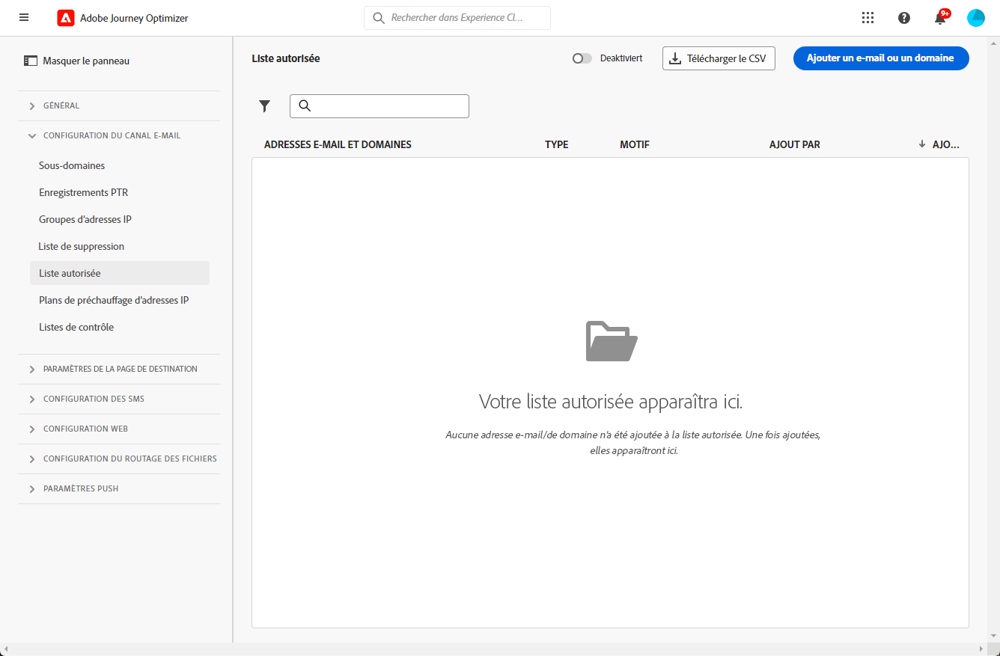
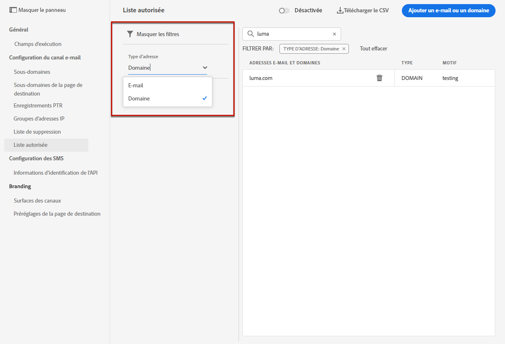

# Liste autorisée {#allow-list}

Il est possible de définir une liste de sécurité d’envoi spécifique à l’adresse [sandbox](../administration/sandboxes.md) niveau.

Cette liste autorisée vous permet de spécifier des adresses électroniques ou des domaines individuels qui seront les seuls destinataires ou domaines autorisés à recevoir les courriers électroniques que vous envoyez à partir d’un environnement de test spécifique.

>[!NOTE]
>
>Cette fonctionnalité est disponible sur les environnements de test de production et hors production.

Par exemple, sur une instance hors production, où des erreurs peuvent se produire, la liste autorisée vous garantit que vous n’avez aucun risque d’envoyer des messages indésirables à des adresses client réelles et fournit donc un environnement sécurisé à des fins de test.

En outre, lorsque la liste autorisée est active mais vide, aucun courrier ne sera envoyé. Par conséquent, si vous rencontrez un problème majeur, vous pouvez utiliser cette fonctionnalité pour arrêter toutes les communications sortantes depuis [!DNL Journey Optimizer] jusqu&#39;à ce que vous résolviez le problème. En savoir plus sur la [logique de liste autorisée](#logic).

>[!CAUTION]
>
>Cette fonctionnalité s’applique uniquement au canal email.

## Accéder à la liste autorisée {#access-allowed-list}

Pour accéder à la liste détaillée des adresses email et domaines autorisés, accédez à **[!UICONTROL Administration]** > **[!UICONTROL Channels]** > **[!UICONTROL Email configuration]**, puis sélectionnez **[!UICONTROL Allowed list]**.



>[!CAUTION]
>
>Les autorisations d’affichage, d’exportation et de gestion de la liste autorisée sont limitées à [Administrateurs de parcours](../administration/ootb-product-profiles.md#journey-administrator). En savoir plus sur la gestion [!DNL Journey Optimizer] droits d’accès des utilisateurs dans [cette section](../administration/permissions-overview.md).

Pour exporter la liste autorisée au format CSV, sélectionnez la variable **[!UICONTROL Download CSV]** bouton .

Utilisez la variable **[!UICONTROL Delete]** pour supprimer définitivement une entrée.

Vous pouvez effectuer des recherches sur les adresses ou domaines de courriel, puis filtrer selon le **[!UICONTROL Address type]**. Une fois sélectionné, vous pouvez effacer le filtre affiché en haut de la liste.



## Activation de la liste autorisée {#enable-allow-list}

Pour activer la liste autorisée, procédez comme suit.

1. Accédez au  **[!UICONTROL Channels]** > **[!UICONTROL Email configuration]** > **[!UICONTROL Allow list]** .

1. Sélectionnez le bouton de basculement.

   

1. Sélectionner **[!UICONTROL Activate allowed list]**. La liste autorisée est désormais active.

   

   >[!NOTE]
   >
   >Une fois la liste autorisée activée, une latence de 5 minutes s’applique pour qu’elle prenne effet dans vos parcours et campagnes.

La logique de liste autorisée s’applique lorsque la fonction est active. En savoir plus dans [cette section](#logic).

>[!NOTE]
>
>Lorsqu’elle est activée, la fonction de liste autorisée est respectée lors de l’exécution des parcours, mais également lors du test des messages avec [proofs](../email/preview.md#send-proofs) et tester les parcours à l’aide de la fonction [mode test](../building-journeys/testing-the-journey.md).

## Désactivation de la liste autorisée {#deactivate-allow-list}

Pour désactiver la liste autorisée, procédez comme suit.

1. Accédez au  **[!UICONTROL Channels]** > **[!UICONTROL Email configuration]** > **[!UICONTROL Allow list]** .

1. Sélectionnez le bouton de basculement.

   

1. Sélectionner **[!UICONTROL Deactivate allowed list]**. La liste autorisée n’est plus active.

   

   >[!NOTE]
   >
   >Une fois la liste autorisée désactivée, une latence de 5 minutes s’applique pour qu’elle prenne effet dans vos parcours et campagnes.

La logique de liste autorisée ne s’applique pas lorsque la fonction est désactivée. En savoir plus dans [cette section](#logic).

## Ajouter des entités à la liste autorisée {#add-entities}

Pour ajouter de nouvelles adresses électroniques ou de nouveaux domaines à la liste autorisée pour un environnement de test spécifique, vous pouvez : [renseigner manuellement la liste](#manually-populate-list), ou utilisez un [appel API](#api-call-allowed-list).

>[!NOTE]
>
>La liste autorisée peut contenir jusqu’à 1 000 entrées.

### Remplissage manuel de la liste autorisée {#manually-populate-list}

>[!CONTEXTUALHELP]
>id="ajo_admin_allowed_list_add_header"
>title="Ajouter des adresses ou des domaines à la liste autorisée"
>abstract="Vous pouvez ajouter manuellement de nouvelles adresses ou domaines de messagerie à la liste autorisée en les sélectionnant une par une."

>[!CONTEXTUALHELP]
>id="ajo_admin_allowed_list_add"
>title="Ajouter des adresses ou des domaines à la liste autorisée"
>abstract="Vous pouvez ajouter manuellement de nouvelles adresses ou domaines de messagerie à la liste autorisée en les sélectionnant une par une."

Vous pouvez renseigner manuellement la variable [!DNL Journey Optimizer] liste autorisée en ajoutant une adresse électronique ou un domaine via l’interface utilisateur.

>[!NOTE]
>
>Vous ne pouvez ajouter qu’une seule adresse électronique ou domaine à la fois.

Pour ce faire, procédez comme suit.

1. Sélectionnez la **[!UICONTROL Add email or domain]** bouton .

   

1. Choisissez le type d&#39;adresse : **[!UICONTROL Email address]** ou **[!UICONTROL Domain address]**.

1. Saisissez l&#39;adresse email ou le domaine vers lequel vous souhaitez envoyer des emails.

   >[!NOTE]
   >
   >Veillez à saisir une adresse électronique (abc@company.com, par exemple) ou un domaine (abc.company.com, par exemple) valide.

1. Indiquez un motif si nécessaire.

   

   >[!NOTE]
   >
   >Tous les caractères ASCII compris entre 32 et 126 sont autorisés dans la variable **[!UICONTROL Reason]** champ . La liste complète se trouve sur [cette page](https://en.wikipedia.org/wiki/Wikipedia:ASCII#ASCII_printable_characters){target=&quot;_blank&quot;} par exemple.

1. Cliquez sur **[!UICONTROL Submit]**.

### Ajout d’entités à l’aide d’un appel API {#api-call-allowed-list}

Pour remplir la liste autorisée, vous pouvez également appeler l’API de suppression avec l’événement `ALLOWED` de la variable `listType` attribut. Par exemple :


Vous pouvez effectuer les opérations suivantes : **Ajouter**, **Supprimer** et **Get** opérations.

En savoir plus sur l’émission d’appels API dans [API Adobe Experience Platform](https://experienceleague.adobe.com/docs/experience-platform/landing/platform-apis/api-guide.html)Documentation de référence {target=&quot;_blank&quot;}.

## Logique de liste autorisée {#logic}

>[!CONTEXTUALHELP]
>id="ajo_admin_allowed_list_logic"
>title="Gestion de la liste autorisée"
>abstract="Lorsque la liste autorisée est activée, seuls les destinataires inclus dans la liste autorisée recevront des messages électroniques de cet environnement de test. Lorsque cette option est désactivée, tous les destinataires reçoivent des emails."

Lorsque la liste autorisée est [active](#enable-allow-list), la logique suivante s’applique :

* Si la liste autorisée est **empty**, aucun email ne sera envoyé.

* Si une entité est **sur la liste autorisée**, et non sur la liste de suppression, l’email est envoyé au ou aux destinataires correspondants. Cependant, si l’entité figure également sur la variable [liste de suppression](../reports/suppression-list.md), le ou les destinataires correspondants ne recevront pas l&#39;email, la raison étant **[!UICONTROL Suppressed]**.

* Si une entité est **ne figure pas dans la liste autorisée** (et non sur la liste de suppression), le ou les destinataires correspondants ne recevront pas l&#39;email, la raison étant **[!UICONTROL Not allowed]**.

>[!NOTE]
>
>Les profils avec **[!UICONTROL Not allowed]** sont exclus pendant le processus d’envoi des messages. Par conséquent, si la variable **Rapports de parcours** affiche ces profils comme ayant traversé le parcours ([Lecture de segment](../building-journeys/read-segment.md) et [activités de message](../building-journeys/journeys-message.md)), la variable **Rapports par courriel** ne les inclut pas dans la variable **[!UICONTROL Sent]** les mesures telles qu’elles sont filtrées avant l’envoi des emails.
>
>En savoir plus sur la [Rapport en direct](../reports/live-report.md) et [Rapport global](../reports/global-report.md).

Lorsque la liste autorisée est [désactivé](#deactivate-allow-list), tous les emails que vous envoyez à partir de l’environnement de test actuel sont envoyés à tous les destinataires (à condition qu’ils ne figurent pas dans la liste de suppression), y compris les adresses réelles des clients.

## Rapport d’exclusion {#reporting}

Lorsque la liste autorisée est active, vous pouvez récupérer les adresses électroniques ou les domaines qui ont été exclus d’un envoi car ils ne figuraient pas dans la liste autorisée. Pour ce faire, vous pouvez utiliser la variable [Adobe Experience Platform Query Service](https://experienceleague.adobe.com/docs/experience-platform/query/api/getting-started.html){target=&quot;_blank&quot;} pour effectuer les appels API ci-dessous.

Pour obtenir le **nombre d&#39;emails** qui n’ont pas été envoyés car les destinataires ne se trouvaient pas dans la liste autorisée, utilisez la requête suivante :

```sql
SELECT count(distinct _id) from cjm_message_feedback_event_dataset WHERE
_experience.customerJourneyManagement.messageExecution.messageExecutionID = '<MESSAGE_EXECUTION_ID>' AND
_experience.customerJourneyManagement.messageDeliveryfeedback.feedbackStatus = 'exclude' AND
_experience.customerJourneyManagement.messageDeliveryfeedback.messageExclusion.reason = 'EmailNotAllowed'
```

Pour obtenir le **liste des adresses email** qui n’ont pas été envoyés car les destinataires ne se trouvaient pas dans la liste autorisée, utilisez la requête suivante :

```sql
SELECT distinct(_experience.customerJourneyManagement.emailChannelContext.address) from cjm_message_feedback_event_dataset WHERE
_experience.customerJourneyManagement.messageExecution.messageExecutionID IS NOT NULL AND
_experience.customerJourneyManagement.messageDeliveryfeedback.feedbackStatus = 'exclude' AND
_experience.customerJourneyManagement.messageDeliveryfeedback.messageExclusion.reason = 'EmailNotAllowed'
```
