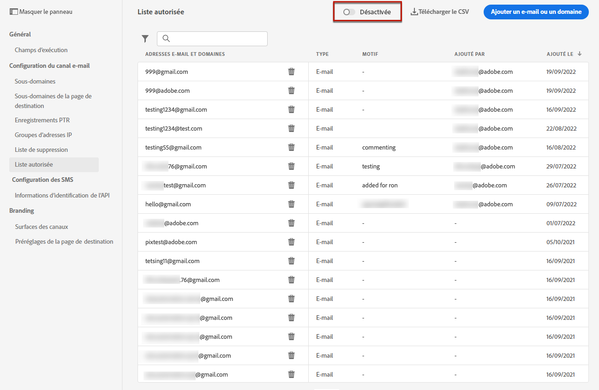

# Liste autorisée {#allow-list}

Il est possible de définir une liste de sécurité d’envoi spécifique à l’adresse [sandbox](../administration/sandboxes.md) pour disposer d’un environnement sécurisé à des fins de test.

Par exemple, sur une instance hors production, où des erreurs peuvent se produire, la liste autorisée garantit que vous n&#39;avez aucun risque d&#39;envoyer des messages indésirables à vos clients.

>[!NOTE]
>
>Cette fonctionnalité est disponible sur les environnements de test de production et hors production.

La liste autorisée vous permet de spécifier des adresses e-mail ou des domaines individuels qui seront les seuls destinataires ou domaines autorisés à recevoir les e-mails que vous envoyez à partir d&#39;un environnement Sandbox spécifique. Cela peut vous empêcher d&#39;envoyer accidentellement des e-mails à des adresses client réelles lorsque vous vous trouvez dans un environnement de test.

>[!CAUTION]
>
>Cette fonctionnalité s&#39;applique uniquement au canal e-mail.

## Accès à la liste autorisée {#access-allowed-list}

Pour accéder à la liste détaillée des adresses email et domaines autorisés, accédez à **[!UICONTROL Administration]** > **[!UICONTROL Canaux]** > **[!UICONTROL Configuration des emails]**, puis sélectionnez **[!UICONTROL Liste autorisée]**.


>[!CAUTION]
>
>Les autorisations d’affichage, d’exportation et de gestion de la liste autorisée sont limitées à [Administrateurs de parcours](../administration/ootb-product-profiles.md#journey-administrator). Pour en savoir plus sur la gestion des droits d’accès des utilisateurs [!DNL Journey Optimizer], consultez [cette section](../administration/permissions-overview.md).

Pour exporter la liste autorisée au format CSV, sélectionnez la variable **[!UICONTROL Téléchargement de fichier CSV]** bouton .

Utilisez la variable **[!UICONTROL Supprimer]** pour supprimer définitivement une entrée.

Vous pouvez effectuer des recherches sur les adresses ou domaines de courriel, puis filtrer selon le **[!UICONTROL Type d’adresse]**. Une fois sélectionné, vous pouvez effacer le filtre affiché en haut de la liste.


## Activation de la liste autorisée {#enable-allow-list}

Pour activer la liste autorisée, procédez comme suit.

1. Accédez au menu **[!UICONTROL Canaux]** > **[!UICONTROL Configuration des e-mails]** > **[!UICONTROL Liste autorisée]**.

1. Cliquez sur **[!UICONTROL Activer/Désactiver la liste autorisée]**.

   

1. Sélectionnez **[!UICONTROL Activer la liste autorisée]**.

   

1. Cliquez sur **[!UICONTROL Enregistrer]**. La liste autorisée est activée.

La logique de liste autorisée s’applique lorsque la fonction est activée. En savoir plus dans [cette section](#logic).

>[!NOTE]
>
>Lorsqu&#39;elle est activée, la fonctionnalité de liste autorisée est respectée lors de l&#39;exécution des parcours, mais également lors du test des messages avec des [bons à tirer](../design/preview.md#send-proofs) et du test des parcours à l&#39;aide du [mode test](../building-journeys/testing-the-journey.md).

## Ajout d&#39;entités à la liste autorisée {#add-entities}

Pour ajouter de nouvelles adresses électroniques ou de nouveaux domaines à la liste autorisée pour un environnement de test spécifique, vous pouvez : [renseigner manuellement la liste](#manually-populate-list), ou utilisez un [appel API](#api-call-allowed-list).

>[!NOTE]
>
>La liste autorisée peut contenir jusqu&#39;à 1 000 entrées.

### Remplissage manuel de la liste autorisée {#manually-populate-list}

>[!CONTEXTUALHELP]
>id="ajo_admin_allowed_list_add"
>title="Ajout d’adresses ou de domaines à la liste autorisée"
>abstract="Vous pouvez ajouter manuellement de nouvelles adresses ou domaines de messagerie à la liste autorisée en les sélectionnant une par une."

Vous pouvez renseigner manuellement la variable [!DNL Journey Optimizer] liste autorisée en ajoutant une adresse électronique ou un domaine par le biais de l’interface utilisateur.

>[!NOTE]
>
>Vous ne pouvez ajouter qu’une seule adresse électronique ou domaine à la fois.

Pour ce faire, suivez les étapes ci-après.

1. Sélectionnez la **[!UICONTROL Ajout d’un courrier électronique ou d’un domaine]** bouton .

   

1. Choisissez le type d&#39;adresse : **[!UICONTROL Adresse e-mail]** ou **[!UICONTROL Adresse de domaine]**.

1. Saisissez l&#39;adresse email ou le domaine vers lequel vous souhaitez envoyer des emails.

   >[!NOTE]
   >
   >Veillez à saisir une adresse électronique valide (par exemple abc@company.com) ou un domaine (par exemple abc.company.com).

1. Indiquez un motif si nécessaire.

   

   >[!NOTE]
   >
   >Tous les caractères ASCII compris entre 32 et 126 sont autorisés dans le champ **[!UICONTROL Motif]**. La liste complète se trouve sur [cette page](https://en.wikipedia.org/wiki/Wikipedia:ASCII#ASCII_printable_characters){target=&quot;_blank&quot;} par exemple.

1. Cliquez sur **[!UICONTROL Envoyer]**.

### Ajout d’entités à l’aide d’un appel API {#api-call-allowed-list}

Pour renseigner la liste autorisée, vous pouvez également appeler l’API de suppression avec la variable `ALLOWED` de la variable `listType` attribut. Par exemple :


Vous pouvez effectuer les opérations **Ajouter**, **Supprimer** et **Obtenir**.

Pour en savoir plus sur l’émission d’appels d’API, consultez la documentation de référence [API Adobe Experience Platform](https://experienceleague.adobe.com/docs/experience-platform/landing/platform-apis/api-guide.html?lang=fr){target=&quot;_blank&quot;}.

## Logique de liste autorisée {#logic}

Lorsque la liste autorisée est [enabled](#enable-allow-list), la logique suivante s’applique :

* Si la liste autorisée est **empty**, aucun email ne sera envoyé.

* Si une entité est **sur la liste autorisée**, et non sur la liste de suppression, l&#39;email peut être envoyé au ou aux destinataires correspondants. Cependant, si l’entité figure également sur la variable [liste de suppression](../reports/suppression-list.md), le ou les destinataires correspondants ne recevront pas l&#39;email, la raison étant **[!UICONTROL Supprimé]**.

* Si une entité est **non sur la liste autorisée** (et non sur la liste de suppression), le ou les destinataires correspondants ne recevront pas l&#39;email, la raison étant **[!UICONTROL Non autorisé]**.

>[!NOTE]
>
>Les profils avec le statut **[!UICONTROL Non autorisé]** sont exclus pendant le processus d’envoi du message. Par conséquent, si la variable **Rapports sur les parcours** affiche ces profils comme ayant traversé le parcours ([Lecture de segment](../building-journeys/read-segment.md) et [activités de message](../building-journeys/journeys-message.md)), la variable **Rapports par courriel** ne les inclut pas dans la variable **[!UICONTROL Envoyé]** les mesures telles qu’elles sont filtrées avant l’envoi des emails.
>
>En savoir plus sur le [Rapport dynamique](../reports/live-report.md) et le [Rapport global](../reports/global-report.md).

## Rapport d’exclusion {#reporting}

Lorsque cette fonction est activée sur un environnement Sandbox hors production, vous pouvez récupérer les adresses électroniques ou les domaines qui ont été exclus d’un envoi car ils ne se trouvaient pas sur la liste autorisée. Pour ce faire, vous pouvez utiliser le [service de requête d’Adobe Experience Platform](https://experienceleague.adobe.com/docs/experience-platform/query/api/getting-started.html?lang=fr){target=&quot;_blank&quot;} pour effectuer les appels API ci-dessous.

Pour obtenir le **nombre d’e-mails** qui n’ont pas été envoyés car les destinataires n’étaient pas sur la liste autorisée, utilisez la requête suivante :

```sql
SELECT count(distinct _id) from cjm_message_feedback_event_dataset WHERE
_experience.customerJourneyManagement.messageExecution.messageExecutionID = '<MESSAGE_EXECUTION_ID>' AND
_experience.customerJourneyManagement.messageDeliveryfeedback.feedbackStatus = 'exclude' AND
_experience.customerJourneyManagement.messageDeliveryfeedback.messageExclusion.reason = 'EmailNotAllowed'
```

Pour obtenir la **liste des adresses e-mail** qui n’ont pas été envoyées car les destinataires n’étaient pas sur la liste autorisée, utilisez la requête suivante :

```sql
SELECT distinct(_experience.customerJourneyManagement.emailChannelContext.address) from cjm_message_feedback_event_dataset WHERE
_experience.customerJourneyManagement.messageExecution.messageExecutionID IS NOT NULL AND
_experience.customerJourneyManagement.messageDeliveryfeedback.feedbackStatus = 'exclude' AND
_experience.customerJourneyManagement.messageDeliveryfeedback.messageExclusion.reason = 'EmailNotAllowed'
```
