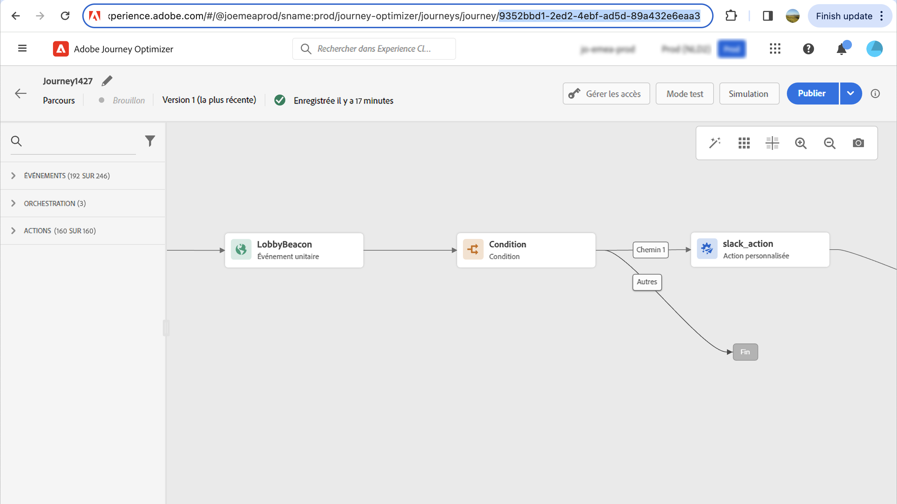

# Prise en charge de l’archivage {#archiving-support}

## Comment archiver des messages {#about-archiving}

Des réglementations telles que la loi HIPAA exigent que [!DNL Journey Optimizer] fournisse un moyen d’archiver les messages envoyés aux individus. En effet, si vos clients soumettent une réclamation, ils devraient avoir la possibilité d&#39;obtenir une copie du message envoyé à des fins de vérification.

* Pour le canal e-mail, [!DNL Journey Optimizer] fournit une fonctionnalité de messagerie en Cci intégrée. [En savoir plus](#bcc-email)

* De plus, pour tous les canaux, vous pouvez utiliser le champ &quot;Modèle&quot; dans le **Jeu de données d’entité**, qui contient les détails des modèles de messages non personnalisés. Exportez le jeu de données avec ce champ pour enregistrer des métadonnées telles que : qui a envoyé le message, à qui et quand. Notez que les données personnalisées ne sont pas exportées : seul le modèle (format et structure du message) est pris en compte. [En savoir plus](../data/datasets-query-examples.md#entity-dataset)

>[!NOTE]
>
>[!DNL Journey Optimizer] ne possède pas la prise en charge des exigences d’archivage des SMS. Pour une prise en charge dédiée de l’archivage, collaborez avec votre fournisseur SMS (Sinch, Infobip ou Twilio).

## Utilisation de la fonctionnalité Cci pour les e-mails {#bcc-email}

>[!CONTEXTUALHELP]
>id="ajo_admin_preset_bcc"
>title="Définition d’une adresse e-mail en Cci"
>abstract="Vous pouvez conserver une copie des e-mails envoyés en les envoyant à une boîte de réception en Cci. Saisissez l&#39;adresse e-mail de votre choix afin que chaque e-mail envoyé soit copié de façon invisible vers cette adresse Cci. Notez que le domaine de l’adresse en copie (Cci) doit être différent de celui d’un sous-domaine délégué à Adobe. Cette fonctionnalité est facultative."

Vous pouvez envoyer une copie carbone invisible (Cci) d’un e-mail envoyé par [!DNL Journey Optimizer] à une adresse Cci dédiée. Cette fonctionnalité facultative vous permet de conserver des copies des communications par e-mail que vous envoyez à vos utilisateurs et à vos utilisatrices à des fins de conformité et/ou d’archivage. L’adresse en Cci n’est pas visible par les autres personnes destinataires du message.

### Activer les e-mails en Cci {#enable-bcc}

Pour activer l’option **[!UICONTROL E-mail Cci]**, saisissez l’adresse e-mail de votre choix dans le champ dédié de la [configuration de canal](channel-surfaces.md) (c’est-à-dire le paramètre prédéfini de message). Vous pouvez spécifier n’importe quelle adresse externe au format correct, à l’exception d’une adresse e-mail définie sur un sous-domaine délégué à Adobe. Par exemple, si vous avez délégué le sous-domaine *marketing.luma.com* à Adobe, toute adresse comme *abc@marketing.luma.com* est interdite.

>[!CAUTION]
>
>Vous ne pouvez définir qu&#39;une seule adresse e-mail en Cci. Assurez-vous que l’adresse en Cci dispose d’une capacité de réception suffisante pour stocker tous les e-mails envoyés à l’aide de la configuration de canal actuelle.
>
>D’autres recommandations sont répertoriées dans [cette section](#bcc-recommendations-limitations).

>[!NOTE]
>
>Si vous avez acheté l’offre de module complémentaire Healthcare Shield, vous devez vous assurer que le FAI de votre adresse en Cci prend en charge le protocole TLS 1.2.


Une fois la configuration terminée, tous les e-mails basés sur cette configuration sont envoyés en copie carbone invisible (Cci) vers l’adresse e-mail que vous avez saisie. De là, ils peuvent être traités et archivés à l’aide d’un système externe.

>[!CAUTION]
>
>Votre utilisation de la fonctionnalité Cci est décomptée en fonction du nombre de messages pour lesquels vous disposez d’une licence. Par conséquent, activez-la uniquement dans les configurations utilisées pour les communications critiques que vous souhaitez archiver. Vérifiez votre contrat pour les volumes sous licence.

Le paramètre d’adresse e-mail en Cci est immédiatement enregistré et traité au niveau de la configuration. Lorsque vous créez un message avec cette configuration, l’adresse e-mail en Cci s’affiche automatiquement.


Cependant, l’adresse en Cci est sélectionnée pour l’envoi de communications en suivant la logique décrite [ici](../email/email-settings.md).

### Recommandations et limitations {#bcc-recommendations-limitations}

* Afin d’assurer le respect de la confidentialité, les e-mails en Cci doivent être traités dans un système d’archivage capable de stocker en toute sécurité les informations d’identification personnelle (PII).

* Comme les messages peuvent contenir des données sensibles ou privées, telles que des informations d’identification personnelle (PII), vérifiez que l’adresse en Cci est correcte et sécurisez l’accès aux messages.

* Votre boîte de réception utilisée pour la fonctionnalité Cci doit être correctement gérée pour l’espace et la diffusion. Si la boîte de réception renvoie des rebonds, il se peut que certains e-mails n’aient pas été reçus et ils ne seront donc pas archivés.

* Les messages peuvent être envoyés à l’adresse e-mail en Cci avant les destinataires cibles. Les messages en Cci peuvent également être envoyés même si les messages d’origine peuvent avoir fait l’objet de [rebonds](../reports/suppression-list.md#delivery-failures).

  <!--OR: Only successfully sent emails are taken in account. [Bounces](../reports/suppression-list.md#delivery-failures) are not. TO CHECK -->

* N’ouvrez pas et ne cliquez pas sur les e-mails envoyés à l’adresse en Cci, car cela est pris en compte dans le nombre total d’ouvertures et de clics de l’analyse d’envoi, ce qui peut entraîner des erreurs de calcul dans les [rapports](../reports/report-gs-cja.md).

* Ne marquez pas les messages comme spam dans la boîte de réception en Cci, car cela aura un impact sur tous les autres e-mails envoyés à cette adresse.

>[!CAUTION]
>
>Ne cliquez pas sur le lien de désabonnement dans les e-mails envoyés à l’adresse en Cci, car vous désabonnez immédiatement les destinataires correspondants.

### Conformité au RGPD {#gdpr-compliance}

Les réglementations telles que le RGPD stipulent que les titulaires de données doivent pouvoir modifier leur consentement à tout moment. Comme les e-mails en Cci que vous envoyez avec Journey Optimizer contiennent des informations d’identification personnelles (PII) en toute sécurité, vous devez modifier la variable **[!UICONTROL Schéma d’événement de retour en Cci d’e-mail CJM]** pour être en mesure de gérer ces informations d’identification personnelle conformément au RGPD et aux règlements similaires.

Pour ce faire, suivez les étapes ci-après.

1. Accédez à **[!UICONTROL Gestion des données]** > **[!UICONTROL Schémas]** > **[!UICONTROL Parcourir]** et sélectionnez **[!UICONTROL Schéma d’événement de retour en Cci d’e-mail CJM]**.

   

1. Cliquez pour développer **[!UICONTROL _experience]**, **[!UICONTROL customerJourneyManagement]** puis **[!UICONTROL secondaryRecipientDetail]**.

1. Sélectionnez **[!UICONTROL originalRecipientAddress]**.

1. Dans les **[!UICONTROL Propriétés du champ]** à droite, faites défiler l’écran jusqu’à la case à cocher **[!UICONTROL Identité]**.

1. Sélectionnez-la et sélectionnez également **[!UICONTROL Identité principale]**.

1. Sélectionnez un espace de noms dans la liste déroulante.

   

1. Cliquez sur **[!UICONTROL Appliquer]**.

>[!NOTE]
>
>Pour en savoir plus sur la gestion de la confidentialité et les réglementations applicables, consultez la [documentation Experience Platform](https://experienceleague.adobe.com/docs/experience-platform/privacy/home.html?lang=fr){target="_blank"}.

### Données de reporting en Cci {#bcc-reporting}

Le reporting en tant que tel en Cci n&#39;est pas disponible dans les rapports de message et parcours. Toutefois, les informations sont stockées dans un jeu de données système appelé **[!UICONTROL Jeu de données d’événement de retour AJO Cci]**. Vous pouvez exécuter des requêtes sur ce jeu de données pour trouver des informations utiles à des fins de débogage, par exemple.

Pour accéder à ce jeu de données par le biais de l’interface d’utilisation, sélectionnez **[!UICONTROL Gestion des données]** > **[!UICONTROL Jeux de données]** > **[!UICONTROL Parcourir]**. En savoir plus sur l’accès aux jeux de données dans [cette section](../data/get-started-datasets.md#access-datasets).

<!---->

Pour exécuter des requêtes sur ce jeu de données, vous pouvez utiliser le requêteur fourni par le [service de requête Adobe Experience Platform](https://experienceleague.adobe.com/docs/experience-platform/query/api/getting-started.html?lang=fr){target="_blank"}. Pour y accéder, sélectionnez **[!UICONTROL Gestion des données]** > **[!UICONTROL Requêtes]** et cliquez sur **[!UICONTROL Créer une requête]**. [En savoir plus](../data/get-started-queries.md)


Selon les informations que vous recherchez, vous pouvez exécuter les requêtes suivantes.

1. Pour toutes les autres requêtes ci-dessous, vous aurez besoin de l’ID d’action de parcours. Exécutez cette requête pour récupérer tous les identifiants d’action associés à un identifiant de version de parcours spécifique au cours des 2 derniers jours :

   ```
   SELECT
   DISTINCT
   CAST(TIMESTAMP AS DATE) AS EventTime,
   _experience.journeyOrchestration.stepEvents.journeyVersionID,
   _experience.journeyOrchestration.stepEvents.actionName, 
   _experience.journeyOrchestration.stepEvents.actionID 
   FROM journey_step_events 
   WHERE 
   _experience.journeyOrchestration.stepEvents.journeyVersionID = '<journey version id>' AND 
   _experience.journeyOrchestration.stepEvents.actionID is not NULL AND 
   TIMESTAMP > NOW() - INTERVAL '2' DAY 
   ORDER BY EventTime DESC;
   ```

   >[!NOTE]
   >
   >Pour obtenir le paramètre `<journey version id>`, sélectionnez la version de parcours correspondante à partir du menu **[!UICONTROL Gestion des Parcours]** > **[!UICONTROL Parcours]**. L’ID de version du parcours s’affiche à la fin de l’URL affichée dans votre navigateur web. [En savoir plus sur les versions de parcours &#x200B;](../building-journeys/publish-journey.md#journey-versions)
   >
   >

1. Exécutez cette requête pour récupérer tous les événements de retour de message (en particulier l’état des retours) générés pour un message spécifique ciblé sur un utilisateur spécifique au cours des 2 derniers jours :

   ```
   SELECT  
   _experience.customerJourneyManagement.messageExecution.journeyVersionID AS JourneyVersionID, 
   _experience.customerJourneyManagement.messageExecution.journeyActionID AS JourneyActionID, 
   timestamp AS EventTime, 
   _experience.customerJourneyManagement.emailChannelContext.address AS RecipientAddress, 
   _experience.customerjourneymanagement.messagedeliveryfeedback.feedbackStatus AS FeedbackStatus,
   CASE _experience.customerjourneymanagement.messagedeliveryfeedback.feedbackStatus
       WHEN 'sent' THEN 'Sent'
       WHEN 'delay' THEN 'Retry'
       WHEN 'out_of_band' THEN 'Bounce' 
       WHEN 'bounce' THEN 'Bounce'
   END AS FeedbackStatusCategory
   FROM cjm_message_feedback_event_dataset 
   WHERE  
       timestamp > now() - INTERVAL '2' day  AND
       _experience.customerJourneyManagement.messageExecution.journeyVersionID = '<journey version id>' AND 
       _experience.customerJourneyManagement.messageExecution.journeyActionID = '<journey action id>' AND  
       _experience.customerJourneyManagement.emailChannelContext.address = '<recipient email address>'
       ORDER BY EventTime DESC;
   ```

   >[!NOTE]
   >
   >Pour obtenir le paramètre `<journey action id>`, exécutez la première requête décrite ci-dessus à l’aide de l’identifiant de version de parcours. Le paramètre `<recipient email address>` est l’adresse e-mail du destinataire ciblé ou réel.

1. Exécutez cette requête pour récupérer tous les événements de retour de message en Cci générés pour un message spécifique ciblé sur un utilisateur spécifique au cours des 2 derniers jours :

   ```
   SELECT   
   _experience.customerJourneyManagement.messageExecution.journeyVersionID AS JourneyVersionID, 
   _experience.customerJourneyManagement.messageExecution.journeyActionID AS JourneyActionID, 
   _experience.customerJourneyManagement.emailChannelContext.address AS BccEmailAddress,
   timestamp AS EventTime, 
   _experience.customerJourneyManagement.secondaryRecipientDetail.originalRecipientAddress AS RecipientAddress, 
   _experience.customerjourneymanagement.messagedeliveryfeedback.feedbackStatus AS FeedbackStatus,
   CASE _experience.customerjourneymanagement.messagedeliveryfeedback.feedbackStatus
               WHEN 'sent' THEN 'Sent'
               WHEN 'delay' THEN 'Retry'
               WHEN 'out_of_band' THEN 'Bounce' 
               WHEN 'bounce' THEN 'Bounce'
           END AS FeedbackStatusCategory 
   FROM ajo_bcc_feedback_event_dataset  
   WHERE  
   timestamp > now() - INTERVAL '2' day  AND
   _experience.customerJourneyManagement.messageExecution.journeyVersionID = '<journey version id>' AND 
   _experience.customerJourneyManagement.messageExecution.journeyActionID = '<journeyaction id>' AND 
   _experience.customerJourneyManagement.secondaryRecipientDetail.originalRecipientAddress = '<recipient email address>'
   ORDER BY EventTime DESC;
   ```

1. Exécutez cette requête pour récupérer toutes les adresses des destinataires qui n&#39;ont pas reçu le message alors que son entrée en Cci existe au cours des 30 derniers jours :

   ```
    SELECT
        DISTINCT 
    bcc._experience.customerJourneyManagement.secondaryRecipientDetail.originalRecipientAddress AS RecipientAddressesNotRecievedMessage
    FROM ajo_bcc_feedback_event_dataset bcc
    LEFT JOIN cjm_message_feedback_event_dataset mfe
    ON 
   bcc._experience.customerJourneyManagement.messageExecution.journeyVersionID =
            mfe._experience.customerJourneyManagement.messageExecution.journeyVersionID AND    bcc._experience.customerJourneyManagement.messageExecution.journeyActionID = mfe._experience.customerJourneyManagement.messageExecution.journeyActionID AND 
   bcc._experience.customerJourneyManagement.secondaryRecipientDetail.originalRecipientAddress = mfe._experience.customerJourneyManagement.emailChannelContext.address AND
   mfe._experience.customerJourneyManagement.messageExecution.journeyVersionID = '<journey version id>' AND 
   mfe._experience.customerJourneyManagement.messageExecution.journeyActionID = '<journey action id>' AND
   mfe.timestamp > now() - INTERVAL '30' DAY AND
   mfe._experience.customerjourneymanagement.messagedeliveryfeedback.feedbackstatus IN ('bounce', 'out_of_band') 
    WHERE bcc.timestamp > now() - INTERVAL '30' DAY;
   ```

### Utiliser l’en-tête de message pour réconcilier la copie en Cci et les informations d’e-mail envoyées {#bcc-header}

Lorsque vos copies d’e-mails en Cci sont archivées sur un système externe, par exemple, vous pouvez récupérer les informations sur les e-mails envoyés correspondants à l’aide d’un en-tête inclus dans le message.

Chaque e-mail contient désormais un en-tête appelé `x-message-profile-id`. La valeur de cet en-tête est différente pour chaque profil : elle est propre à chaque e-mail envoyé et à sa copie d’e-mail en Cci correspondante.

L’en-tête `x-message-profile-id` est également stocké dans les jeux de données système suivants : [Jeu de données d’événement de retour de message AJO](../data/datasets-query-examples.md#message-feedback-event-dataset) (e-mails envoyés) et [Jeu de données d’événement de retour en Cci AJO](#bcc-reporting) (copies en Cci). Vous pouvez interroger ces jeux de données pour réconcilier la copie en Cci et l’e-mail réel correspondant.

* Pour accéder à ces jeux de données par le biais de l’interface d’utilisation, sélectionnez **[!UICONTROL Gestion des données]** > **[!UICONTROL Jeux de données]** > **[!UICONTROL Parcourir]**. En savoir plus sur l’accès aux jeux de données dans [cette section](../data/get-started-datasets.md#access-datasets).

* Utilisez le requêteur fourni par le [service de requête Adobe Experience Platform](https://experienceleague.adobe.com/docs/experience-platform/query/api/getting-started.html?lang=fr){target="_blank"}. Pour y accéder, sélectionnez **[!UICONTROL Gestion des données]** > **[!UICONTROL Requêtes]** et cliquez sur **[!UICONTROL Créer une requête]**. [En savoir plus](../data/get-started-queries.md)

Vous trouverez ci-dessous quelques exemples de requêtes que vous pouvez exécuter pour récupérer des informations correspondant à vos copies en Cci.

**Requête 1**

Pour associer l’événement Cci à l’événement de retour correspondant à l’e-mail réel avec les détails de l’action de campagne, procédez comme suit :

```
SELECT
  mfe.timestamp AS OriginalRecipientFeedbackEventTime,
  mfe._experience.customerJourneyManagement.emailChannelContext.address AS OriginalRecipientEmailAddress,
  bcc._experience.customerJourneyManagement.emailChannelContext.address AS BCCEmailAddress,
  mfe._experience.customerjourneymanagement.messagedeliveryfeedback.feedbackstatus AS OriginalRecipientMessageFeedbackStatus,
  mfe._experience.customerJourneyManagement.messageExecution.campaignID AS CampaignID,
  mfe._experience.customerJourneyManagement.messageExecution.campaignActionID AS CampaignActionID,
  mfe._experience.customerJourneyManagement.messageExecution.batchInstanceID AS BatchInstanceID,
  mfe._experience.customerJourneyManagement.messageExecution.messageID AS MessageID
FROM ajo_bcc_feedback_event_dataset bcc
LEFT JOIN ajo_message_feedback_event_dataset mfe
ON bcc._experience.customerJourneyManagement.messageProfile.messageProfileID =
    mfe._experience.customerJourneyManagement.messageProfile.messageProfileID AND 
    mfe.timestamp > now() - INTERVAL '30' day
WHERE 
  bcc.timestamp > now() - INTERVAL '30' DAY AND 
  bcc._experience.customerJourneyManagement.messageProfile.messageProfileID = '<x-message-profile-id>'
ORDER BY mfe.timestamp DESC;
```

**Requête 2**

Pour associer l’événement Cci à l’événement de retour correspondant à l’e-mail réel avec les détails de l’action de parcours, procédez comme suit :

```
SELECT
  mfe.timestamp AS OriginalRecipientFeedbackEventTime,
  mfe._experience.customerJourneyManagement.emailChannelContext.address AS OriginalRecipientEmailAddress,
  bcc._experience.customerJourneyManagement.emailChannelContext.address AS BCCEmailAddress,
  mfe._experience.customerjourneymanagement.messagedeliveryfeedback.feedbackstatus AS OriginalRecipientMessageFeedbackStatus,
  mfe._experience.customerJourneyManagement.messageExecution.journeyActionID AS journeyActionID,
  mfe._experience.customerJourneyManagement.messageExecution.journeyVersionID AS JourneyVersionID,
  mfe._experience.customerJourneyManagement.messageExecution.journeyVersionInstanceID AS JourneyVersionInstanceID,
  mfe._experience.customerJourneyManagement.messageExecution.batchInstanceID AS BatchInstanceID,
  mfe._experience.customerJourneyManagement.messageExecution.messageID AS MessageID
FROM ajo_bcc_feedback_event_dataset bcc
LEFT JOIN ajo_message_feedback_event_dataset mfe
ON bcc._experience.customerJourneyManagement.messageProfile.messageProfileID =
    mfe._experience.customerJourneyManagement.messageProfile.messageProfileID AND 
    mfe.timestamp > now() - INTERVAL '30' day
WHERE 
  bcc.timestamp > now() - INTERVAL '30' DAY AND 
  bcc._experience.customerJourneyManagement.messageProfile.messageProfileID = '<x-message-profile-id>'
ORDER BY mfe.timestamp DESC;
```
