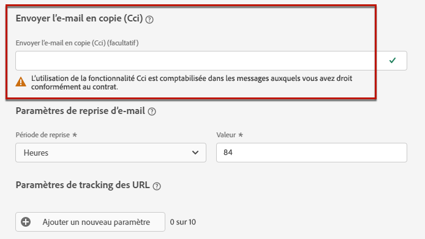
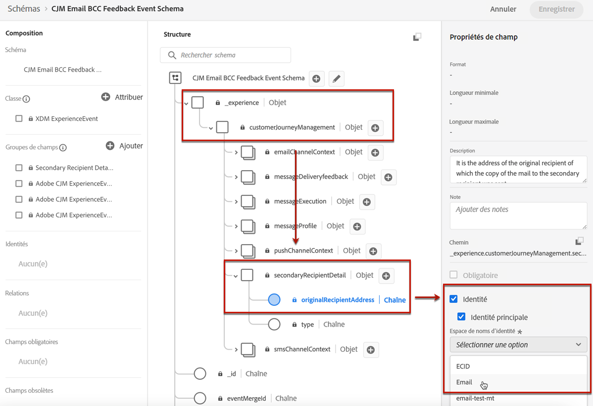

# Utiliser l&#39;email Cci {#bcc-email}

>[!CONTEXTUALHELP]
>id="ajo_admin_preset_bcc"
>title="Définition d’une adresse e-mail en Cci"
>abstract="Vous pouvez conserver une copie des e-mails envoyés en les envoyant à une boîte de réception en Cci. Saisissez l&#39;adresse e-mail de votre choix afin que chaque e-mail envoyé soit copié de façon invisible vers cette adresse Cci. Cette fonctionnalité est facultative."

Vous pouvez envoyer une copie identique (ou copie carbone invisible) d’un e-mail envoyé par [!DNL Journey Optimizer] vers une boîte de réception Cci. Cette fonctionnalité facultative vous permet de conserver des copies des communications par e-mail que vous envoyez à vos utilisateurs à des fins de conformité et/ou d’archivage. Cela sera invisible pour les destinataires de la diffusion.

## Activer les e-mails en Cci {#enable-bcc}

Pour activer l’option **[!UICONTROL E-mail Cci]**, saisissez l&#39;adresse e-mail de votre choix dans le champ dédié. Vous pouvez spécifier n&#39;importe quelle adresse externe au format correct, à l&#39;exception d&#39;une adresse e-mail définie sur le sous-domaine délégué. Par exemple, si le sous-domaine délégué est *marketing.luma.com*, toute adresse telle que *abc@marketing.luma.com* est interdite.

>[!NOTE]
>
>Vous ne pouvez définir qu&#39;une seule adresse e-mail en Cci. Assurez-vous que l&#39;adresse en Cci dispose d&#39;une capacité de réception suffisante pour stocker tous les e-mails envoyés à l&#39;aide du préréglage actuel.
>
>D’autres recommandations sont répertoriées dans la section [cette section](#bcc-recommendations-limitations).



Tous les e-mails utilisant ce préréglage seront copiés de façon invisible vers l’adresse e-mail en Cci que vous avez saisie. De là, ils peuvent être traités et archivés à l’aide d’un système externe.

>[!CAUTION]
>
>Votre utilisation de la fonctionnalité Cci sera décomptée en fonction du nombre de messages pour lesquels vous disposez d’une licence. Par conséquent, activez-la uniquement dans les préréglages utilisés pour les communications critiques que vous souhaitez archiver. Vérifiez votre contrat pour les volumes sous licence.

Le paramètre d’adresse e-mail en Cci est immédiatement enregistré et traité au niveau du préréglage. Lorsque vous [créez un message](../messages/get-started-content.md#create-new-message) avec ce préréglage, l&#39;adresse email en Cci s&#39;affiche automatiquement.


Cependant, l’adresse en Cci est sélectionnée pour l’envoi de communications en suivant la logique ci-dessous :

* Pour les parcours de lot et de rafale, cela ne s’applique pas à l’exécution par lots ou en rafale qui avait déjà démarré avant que le paramètre Cci ne soit défini. La modification sera récupérée lors de la prochaine périodicité ou de la nouvelle exécution.

* Pour les messages transactionnels, la modification est immédiatement récupérée pour la communication suivante (délai d’une minute maximum).

>[!NOTE]
>
>Vous n’avez pas besoin de republier un message ou un parcours pour que le paramètre Cci soit sélectionné.

## Recommandations et limitations {#bcc-recommendations-limitations}

* Pour garantir la conformité de vos informations personnelles, les emails en Cci doivent être traités par un système d’archivage capable de stocker en toute sécurité des informations d’identification personnelles (PII).

* Comme les messages peuvent contenir des données sensibles ou privées, telles que des informations d’identification personnelle (PII), vérifiez que l’adresse en Cci est correcte et sécurisez l’accès aux messages.

* Votre boîte de réception utilisée pour la fonctionnalité Cci doit être correctement gérée pour l’espace et la diffusion. Si la boîte de réception renvoie des bounces, certains e-mails peuvent ne pas être reçus et ne seront donc pas archivés.

* Les messages peuvent être envoyés à l&#39;adresse email en Cci avant les destinataires cibles. Les messages en Cci peuvent également être envoyés même si les messages originaux peuvent avoir [bounce](../reports/suppression-list.md#delivery-failures).

   <!--OR: Only successfully sent emails are taken in account. [Bounces](../reports/suppression-list.md#delivery-failures) are not. TO CHECK -->

* Ne pas ouvrir ni cliquer sur les emails envoyés à l&#39;adresse en Cci, car cela est pris en compte dans le nombre total d&#39;ouvertures et de clics de l&#39;analyse d&#39;envoi, ce qui peut entraîner des erreurs de calcul dans [rapports](../reports/message-monitoring.md).

* Ne marquez pas les messages comme spam dans la boîte de réception en Cci, car cela aura un impact sur tous les autres emails envoyés à cette adresse.


>[!CAUTION]
>
>Ne cliquez pas sur le lien de désabonnement dans les emails envoyés à l&#39;adresse en Cci, car vous désabonnerez immédiatement les destinataires correspondants.

## Conformité au RGPD {#gdpr-compliance}

Les réglementations telles que le RGPD stipulent que les titulaires de données doivent pouvoir modifier leur consentement à tout moment. Comme les e-mails en Cci que vous envoyez avec Journey Optimizer contiennent des informations d’identification personnelles (PII) en toute sécurité, vous devez modifier la variable **[!UICONTROL Schéma d’événement de retour en Cci d’e-mail CJM]** pour être en mesure de gérer ces informations d’identification personnelle conformément au RGPD et aux règlements similaires.

Pour ce faire, suivez les étapes ci-après.

1. Accédez à **[!UICONTROL Gestion des données]** > **[!UICONTROL Schémas]** > **[!UICONTROL Parcourir]** et sélectionnez **[!UICONTROL Schéma d’événement de retour en Cci d’e-mail CJM]**.

   

1. Cliquez pour développer **[!UICONTROL _experience]**, **[!UICONTROL customerJourneyManagement]** puis **[!UICONTROL secondaryRecipientDetail]**.

1. Sélectionnez **[!UICONTROL originalRecipientAddress]**.

1. Dans les **[!UICONTROL Propriétés du champ]** à droite, faites défiler l’écran jusqu’à la case à cocher **[!UICONTROL Identité]**.

1. Sélectionnez-la et sélectionnez également **[!UICONTROL Identité principale]**.

1. Sélectionnez un espace de noms dans la liste déroulante.

   

1. Cliquez sur **[!UICONTROL Appliquer]**.

>[!NOTE]
>
>Pour en savoir plus sur la gestion de la confidentialité et les réglementations applicables, consultez la [documentation Experience Platform](https://experienceleague.adobe.com/docs/experience-platform/privacy/home.html?lang=fr){target=&quot;_blank&quot;}.

## Données de reporting en Cci {#bcc-reporting}

Le reporting en tant que tel en Cci n&#39;est pas disponible dans les rapports de message et parcours. Toutefois, les informations sont stockées dans un jeu de données système appelé **[!UICONTROL Jeu de données d’événement de retour AJO Cci]**. Vous pouvez exécuter des requêtes sur ce jeu de données pour trouver des informations utiles à des fins de débogage, par exemple.

Vous pouvez accéder à ce jeu de données par le biais de l’interface utilisateur. Sélectionnez **[!UICONTROL Gestion des données]** > **[!UICONTROL Jeux de données]** > **[!UICONTROL Parcourir]** et activez le bouton à bascule **[!UICONTROL Affichage des jeux de données système]** à partir du filtre pour afficher les jeux de données générés par le système. En savoir plus sur l’accès aux jeux de données dans [cette section](../start/get-started-datasets.md#access-datasets).


Pour exécuter des requêtes sur ce jeu de données, vous pouvez utiliser l’éditeur de requêtes fourni par le [service de requête d’Adobe Experience Platform](https://experienceleague.adobe.com/docs/experience-platform/query/api/getting-started.html?lang=fr){target=&quot;_blank&quot;}. Pour y accéder, sélectionnez **[!UICONTROL Gestion des données]** > **[!UICONTROL Requêtes]** et cliquez sur **[!UICONTROL Créer une requête]**. [En savoir plus](../start/get-started-queries.md)


Selon les informations que vous recherchez, vous pouvez exécuter les requêtes suivantes.

1. Pour toutes les autres requêtes ci-dessous, vous aurez besoin de l’ID d’action de parcours. Exécutez cette requête pour récupérer tous les identifiants d’action associés à un identifiant de version de parcours spécifique au cours des 2 derniers jours :

       ```
       SELECT
       DISTINCT
       CAST(TIMESTAMP AS DATE) AS EventTime,
       _experience.journeyOrchestration.stepEvents.journeyVersionID,
       _experience.journeyOrchestration.stepEvents.actionName,
       _experience.journeyOrchestration.stepEvents.actionID
       FROM journey_step_events
       WHERE
       _experience.journeyOrchestration.stepEvents.journeyVersionID = &#39;&lt;journey version id>&#39; AND
       _experience.journeyOrchestration.stepEvents.actionID is not NULL AND
       TIMESTAMP > NOW() - INTERVAL &#39;2&#39; DAY
       ORDER BY EventTime DESC;
       ```
   
   >[!NOTE]
   >
   >Pour obtenir le paramètre `<journey version id>`, sélectionnez la [version de parcours](../building-journeys/journey-versions.md) correspondante à partir du menu **[!UICONTROL Gestion des parcours]** > **[!UICONTROL Parcours]**. L’ID de version du parcours s’affiche à la fin de l’URL affichée dans votre navigateur web.
   >
   >

1. Exécutez cette requête pour récupérer tous les événements de retour de message (en particulier l’état des retours) générés pour un message spécifique ciblé sur un utilisateur spécifique au cours des 2 derniers jours :

       ```
       SELECT
       _experience.customerJourneyManagement.messageExecution.journeyVersionID AS JourneyVersionID,
       _experience.customerJourneyManagement.messageExecution.journeyActionID AS JourneyActionID,
       timestamp AS EventTime,
       _experience.customerJourneyManagement.emailChannelContext.address AS RecipientAddress,
       _experience.customerjourneymanagement.messagedeliveryfeedback.feedbackStatus AS FeedbackStatus,
       CASE _experience.customerjourneymanagement.messagedeliveryfeedback.feedbackStatus
       WHEN &#39;sent&#39; THEN &#39;Sent&#39;
       WHEN &#39;delay&#39; THEN &#39;Retry&#39;
       WHEN &#39;out_of_band&#39; THEN &#39;Bounce&#39;
       WHEN &#39;bounce&#39; THEN &#39;Bounce&#39;
       END AS FeedbackStatusCategory
       FROM cjm_message_feedback_event_dataset
       WHERE
       timestamp > now() - INTERVAL &#39;2&#39; day  AND
       _experience.customerJourneyManagement.messageExecution.journeyVersionID = &#39;&lt;journey version id>&#39; AND
       _experience.customerJourneyManagement.messageExecution.journeyActionID = &#39;&lt;journey action id>&#39; AND
       _experience.customerJourneyManagement.emailChannelContext.address = &#39;&lt;recipient email address>&#39;
       ORDER BY EventTime DESC;
       ```
   
   >[!NOTE]
   >
   >Pour obtenir le paramètre `<journey action id>`, exécutez la première requête décrite ci-dessus à l’aide de l’identifiant de version de parcours. Le paramètre `<recipient email address>` est l’adresse e-mail du destinataire ciblé ou réel.

1. Exécutez cette requête pour récupérer tous les événements de retour de message en Cci générés pour un message spécifique ciblé sur un utilisateur spécifique au cours des 2 derniers jours :

   ```
   SELECT   
   _experience.customerJourneyManagement.messageExecution.journeyVersionID AS JourneyVersionID, 
   _experience.customerJourneyManagement.messageExecution.journeyActionID AS JourneyActionID, 
   _experience.customerJourneyManagement.emailChannelContext.address AS BccEmailAddress,
   timestamp AS EventTime, 
   _experience.customerJourneyManagement.secondaryRecipientDetail.originalRecipientAddress AS RecipientAddress, 
   _experience.customerjourneymanagement.messagedeliveryfeedback.feedbackStatus AS FeedbackStatus,
   CASE _experience.customerjourneymanagement.messagedeliveryfeedback.feedbackStatus
               WHEN 'sent' THEN 'Sent'
               WHEN 'delay' THEN 'Retry'
               WHEN 'out_of_band' THEN 'Bounce' 
               WHEN 'bounce' THEN 'Bounce'
           END AS FeedbackStatusCategory 
   FROM ajo_bcc_feedback_event_dataset  
   WHERE  
   timestamp > now() - INTERVAL '2' day  AND
   _experience.customerJourneyManagement.messageExecution.journeyVersionID = '<journey version id>' AND 
   _experience.customerJourneyManagement.messageExecution.journeyActionID = '<journeyaction id>' AND 
   _experience.customerJourneyManagement.secondaryRecipientDetail.originalRecipientAddress = '<recipient email address>'
   ORDER BY EventTime DESC;
   ```

1. Exécutez cette requête pour récupérer toutes les adresses des destinataires qui n&#39;ont pas reçu le message alors que son entrée en Cci existe au cours des 30 derniers jours :

   ```
   SELECT
       DISTINCT 
   bcc._experience.customerJourneyManagement.secondaryRecipientDetail.originalRecipientAddress AS RecipientAddressesNotRecievedMessage
   FROM ajo_bcc_feedback_event_dataset bcc
   LEFT JOIN cjm_message_feedback_event_dataset mfe
   ON 
   bcc._experience.customerJourneyManagement.messageExecution.journeyVersionID =
           mfe._experience.customerJourneyManagement.messageExecution.journeyVersionID AND    bcc._experience.customerJourneyManagement.messageExecution.journeyActionID = mfe._experience.customerJourneyManagement.messageExecution.journeyActionID AND 
   bcc._experience.customerJourneyManagement.secondaryRecipientDetail.originalRecipientAddress = mfe._experience.customerJourneyManagement.emailChannelContext.address AND
   mfe._experience.customerJourneyManagement.messageExecution.journeyVersionID = '<journey version id>' AND 
   mfe._experience.customerJourneyManagement.messageExecution.journeyActionID = '<journey action id>' AND
   mfe.timestamp > now() - INTERVAL '30' DAY AND
   mfe._experience.customerjourneymanagement.messagedeliveryfeedback.feedbackstatus IN ('bounce', 'out_of_band') 
   WHERE bcc.timestamp > now() - INTERVAL '30' DAY;
   ```
