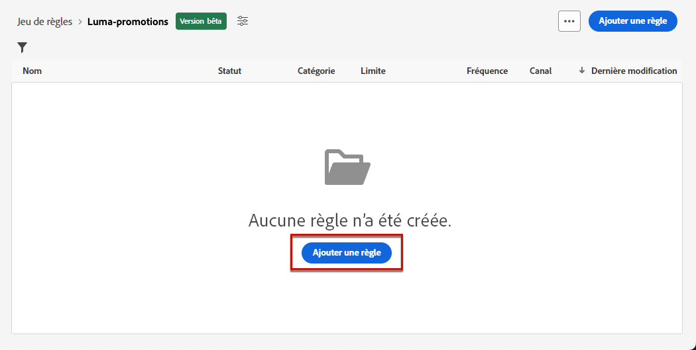

# Règles de fonctionnement {#business-rules}

>[!AVAILABILITY]
>
>Les règles de fonctionnement sont actuellement disponibles en version bêta pour sélectionner uniquement les utilisateurs.

[!DNL Journey Optimizer] vous permet de contrôler la fréquence à laquelle les utilisateurs recevront un message en définissant des règles cross-canal qui excluront automatiquement les profils sur-sollicités des messages et actions.

Par exemple, pour une marque, une règle peut être : envoyer au maximum 4 messages marketing par mois à ses clients. Pour cela, vous pouvez utiliser une règle de fréquence qui limite le nombre de messages envoyés sur un ou plusieurs canaux au cours d&#39;une période calendaire mensuelle.

Grâce à la création de différents ensembles de règles pour une granularité améliorée, [!DNL Journey Optimizer] vous permet d’appliquer la limitation de fréquence à différents types de communications marketing. Vous pouvez par exemple créer un ensemble de règles pour limiter le nombre de **communications promotionnelles** envoyé à vos clients et créez un autre ensemble de règles pour limiter le nombre de **newsletters** leur a été envoyé.

>[!NOTE]
>
>Les règles métier diffèrent de la gestion des désabonnements, qui permet aux utilisateurs de se désabonner de la réception des communications d’une marque. [En savoir plus](../privacy/opt-out.md#opt-out-management)

## Accès aux ensembles de règles {#access-rule-sets}

Les jeux de règles sont disponibles dans la **[!UICONTROL Administration]** > **[!UICONTROL Règles de fonctionnement (bêta)]** . Toutes les règles sont répertoriées, triées par date de création.

Cliquez sur le nom d’un jeu de règles pour afficher et modifier son contenu. Toutes les règles incluses dans ce jeu de règles sont répertoriées.

Le menu contextuel en haut à droite vous permet d’effectuer les opérations suivantes :

* Modifier le nom et la description du jeu de règles
* Activez le jeu de règles - [en savoir plus](#activate-rule)
* Supprimer le jeu de règles

Pour chaque règle du jeu, la variable **[!UICONTROL Autres actions]** vous permet d’effectuer les opérations suivantes :

* Modifier la règle
* Activer la règle [en savoir plus](#activate-rule)
* Supprimer la règle

<!--### Permissions{#permissions-frequency-rules}

To access, create, edit or delete message frequency rules, you must have the **[!UICONTROL Manage frequency rules]** permission. 

Users with the **[!UICONTROL View frequency rules]** permission are able to view rules, but not to modify or delete them.

Learn more about permissions in [this section](../administration/high-low-permissions.md).-->

## Création d’un jeu de règles {#create-rule-set}

Pour créer un jeu de règles, procédez comme suit.

1. Accédez au **[!UICONTROL Jeux de règles]** liste, puis cliquez sur **[!UICONTROL Créer un jeu de règles]**.

   

1. Définissez le nom du jeu de règles, ajoutez une description si nécessaire, puis cliquez sur **[!UICONTROL Enregistrer]**.

   

   >[!NOTE]
   >
   >Le nom du jeu de règles doit être unique.

1. Maintenant, vous pouvez [définir les règles ;](#create-new-rule) vous souhaitez ajouter à ce jeu de règles, et [activate](#activate-rule) c&#39;est le cas.

   >[!NOTE]
   >
   >Assurez-vous que toutes les règles que vous souhaitez appliquer à vos messages sont également activées dans le jeu de règles.

## Créer une règle {#create-new-rule}

>[!CONTEXTUALHELP]
>id="ajo_rule_sets_category"
>title="Sélectionner la catégorie de règle du message"
>abstract="Lorsqu’elle sont activées et appliquées à un message, toutes les règles de fréquence correspondant à la catégorie sélectionnée seront automatiquement appliquées à ce message. Actuellement, seule la catégorie Marketing est disponible."

>[!CONTEXTUALHELP]
>id="ajo_rule_sets_capping"
>title="Définir la limitation de votre règle"
>abstract="Spécifiez le nombre maximal de messages envoyés à un profil client au cours de la période choisie. La limite de fréquence sera basée sur la période calendaire sélectionnée et sera réinitialisée au début de la période correspondante."

>[!CONTEXTUALHELP]
>id="ajo_rule_sets_channel"
>title="Définissez le ou les canaux auxquels la règle s’applique."
>abstract="Sélectionnez au moins un canal. Le plafond est calculé sur l’ensemble des canaux."

Pour ajouter une règle à un jeu de règles, procédez comme suit.

1. Dans le jeu de règles que vous venez de créer, cliquez sur **[!UICONTROL Ajouter une règle]**.

   

1. Définissez le nom de la règle.

   >[!NOTE]
   >
   >Le nom du jeu de règles doit être unique.

1. Sélectionnez la catégorie de règle du message.

   >[!NOTE]
   >
   >Actuellement, seule la catégorie **[!UICONTROL Marketing]** est disponible.

1. Dans la liste déroulante **[!UICONTROL Durée]**, sélectionnez une période pour la limitation à appliquer. [En savoir plus](#frequency-cap)

1. Définissez la limitation de votre règle, c’est-à-dire le nombre maximal de messages qui peuvent être envoyés à un profil utilisateur individuel chaque mois, semaine ou jour, en fonction de votre sélection ci-dessus.

1. Sélectionnez le canal à utiliser pour cette règle : **[!UICONTROL Email]**, **[!UICONTROL SMS]**, **[!UICONTROL Notification push]** ou **[!UICONTROL Canal Courrier]**.

   

   >[!NOTE]
   >
   >Vous devez sélectionner au moins un canal pour pouvoir créer la règle.

1. Sélectionnez plusieurs canaux si vous souhaitez appliquer une limitation sur tous les canaux sélectionnés en tant que nombre total.

   Par exemple, définissez la limitation sur 5 et sélectionnez les canaux email et SMS. Si un profil a déjà reçu 3 emails marketing et 2 SMS marketing pour la période sélectionnée, ce profil sera exclu de la prochaine diffusion de tout email ou SMS marketing.

1. Cliquez sur **[!UICONTROL Enregistrer]** pour confirmer la création de la règle. Votre message est ajouté au jeu de règles, avec la variable **[!UICONTROL Version préliminaire]** statut.

   

1. Répétez les étapes ci-dessus pour ajouter autant de règles que nécessaire au jeu de règles.

Vous devez maintenant activer chaque règle avant de pouvoir l’appliquer à n’importe quel message. [En savoir plus](#activate-rule)

>[!NOTE]
>
>Assurez-vous que le jeu de règles est également activé pour pouvoir le sélectionner dans vos messages.

### Limite de fréquence {#frequency-cap}

>[!CONTEXTUALHELP]
>id="ajo_rule_sets_duration"
>title="Sélectionner la catégorie de règle du message"
>abstract="Lorsqu’elle sont activées et appliquées à un message, toutes les règles de fréquence correspondant à la catégorie sélectionnée seront automatiquement appliquées à ce message. Actuellement, seule la catégorie Marketing est disponible."

Dans la **[!UICONTROL Durée]** , sélectionnez cette option si vous souhaitez que la limitation soit appliquée tous les mois, toutes les semaines ou tous les jours.

La limite de fréquence est basée sur la période calendaire sélectionnée. Elle est réinitialisée au début de la période correspondante.

L’expiration du compteur pour chaque période se présente comme suit :

* **[!UICONTROL Mensuelle]** : la limite de fréquence est valable jusqu’au dernier jour du mois à 23:59:59 UTC. Par exemple, la date d’expiration mensuelle pour janvier est le 31 janvier à 23:59:59 UTC.

* **[!UICONTROL Hebdomadaire]** : la limite de fréquence est valable jusqu’au samedi à 23:59:59 UTC de cette semaine, car la semaine calendaire commence le dimanche. L’expiration est indépendante de la création de la règle. Par exemple, si la règle est créée le jeudi, cette règle est valide jusqu’au samedi à 23:59:59.

* **[!UICONTROL Qualité]**: la limite de fréquence quotidienne est valide pour la journée jusqu’à 23:59:59 UTC et réinitialise à 0 au début de la journée suivante.

### Limite de fréquence quotidienne {#daily-frequency-cap}

>[!CAUTION]
>
>Pour garantir la précision des règles de limitation de la fréquence quotidienne, utilisez la méthode [segmentation par flux](https://experienceleague.adobe.com/docs/experience-platform/segmentation/ui/streaming-segmentation.html?lang=fr){target="_blank"} est obligatoire. En savoir plus sur les méthodes d’évaluation de l’audience dans [cette section](../audience/about-audiences.md#evaluation-method-in-journey-optimizer).

Pour toute taille de segment pouvant aller jusqu’à 60 millions de messages par heure<!--not clear-->, vérifiez que vos campagnes sont séparées d’au moins 2 heures.

<!-- Journey example:

* If customer sets a Daily rule under the Global Ruleset for email <= 2/day:
   * Journey 123 (scheduled for noon)
   * Journey 456 (scheduled for noon)
   * Journey 789 (scheduled for 1 pm)

   In this example, the Daily Frequency cap will not guarantee <= 2/day. The rule will only be guaranteed when Journeys are at least 2 hours apart:
   * Journey 123 (scheduled for noon)
   * Journey 456 (scheduled for 2 pm)
   * Journey 789 (scheduled for 4 pm)-->

Par exemple, si vous définissez une règle quotidienne sous un jeu de règles pour le canal email qui est inférieur ou égal à 2 jours, et si vous créez les campagnes suivantes :
* Campagne A (planifiée à midi)
* Campagne A (planifiée à 15h00)
* Campagne B (planifiée à 13h00)

Cette configuration ne fonctionnera pas pour deux raisons :
* La limite de fréquence quotidienne n’est pas garantie, car les campagnes ne sont pas séparées de 2 heures.
* Il n’est pas recommandé de planifier la même campagne plusieurs fois par jour pour profiter de la limite quotidienne.

L’exemple ci-dessous doit être respecté par la limite de fréquence quotidienne :
* Campagne A (planifiée à midi)
* Campagne B (planifiée à 14 heures)

<!--* To use the Daily Cap with a Journey, customers can use either an Event Triggered Journey or an Audience Qualified Journey. If customers wish to use the Daily Cap with a Read Audience Journey, they should use a Campaign instead and associate a Local Ruleset with the campaign, following the example given above.-->

## Activation des règles et des ensembles de règles {#activate-rule}

Une fois créée, une règle comporte la variable **[!UICONTROL Version préliminaire]** et n’a encore aucun impact sur le message. Pour l’activer, cliquez sur le bouton **[!UICONTROL Autres actions]** en regard de la règle et sélectionnez **[!UICONTROL Activer]**.

Vous devez également activer l’ensemble de règles pour pouvoir y accéder dans les campagnes/parcours et l’appliquer à vos messages.

L’activation d’un jeu de règles affectera tous les messages auxquels il s’applique lors de leur prochaine exécution. Découvrez comment [appliquer un ensemble de règles à un message ;](#apply-rule-set).

>[!NOTE]
>
>L’activation complète d’une règle ou d’un jeu de règles peut prendre jusqu’à 10 minutes. Vous n’avez pas besoin de modifier des messages ou de republier des parcours pour qu’une règle prenne effet.

<!--Currently, once a rule set is activated, no more rules can be added to that rule set.-->

## Désactivation des règles et des ensembles de règles {#deactivate-rule}

Pour désactiver une règle ou un jeu de règles, cliquez sur le bouton **[!UICONTROL Autres actions]** en regard de l’élément souhaité et sélectionnez **[!UICONTROL Désactiver]**.

Son état sera défini sur **[!UICONTROL Inactif]** et la règle ne s&#39;appliquera pas aux futures exécutions de messages. Les messages en cours d&#39;exécution ne seront pas affectés.

>[!NOTE]
>
>La désactivation d’un jeu de règles ou de règles n’affecte ou ne réinitialise aucun comptage sur les profils individuels.

## Appliquer une règle de fréquence à un message {#apply-frequency-rule}

Pour appliquer une règle de fréquence à un message, procédez comme suit.

1. Lorsque vous créez un événement [campaign](../campaigns/create-campaign.md), sélectionnez l’un des canaux que vous avez définis pour votre jeu de règles et modifiez le contenu de votre message.

1. Dans l’écran d’édition du contenu, cliquez sur le bouton **[!UICONTROL Ajouter une règle métier]** bouton .

1. Sélectionnez la variable [ensemble de règles que vous avez créé](#create-rule-set).

   

   >[!NOTE]
   >
   >Uniquement [activé](#activate-rule) les ensembles de règles s’affichent dans la liste.

   <!--Messages where the category selected is **[!UICONTROL Transactional]** will not be evaluated against business rules.-->

1. Vous pouvez visualiser le nombre de profils exclus de la diffusion dans le [rapport global](../reports/global-report.md) et dans le [rapport dynamique](../reports/live-report.md), où les règles de fréquence seront répertoriées comme une raison possible pour les utilisateurs exclus de la diffusion.

>[!NOTE]
>
>Plusieurs règles peuvent s’appliquer au même canal, mais une fois la limite inférieure atteinte, le profil sera exclu des prochaines diffusions.

<!--
## Example: combine several rules {#frequency-rule-example}

You can combine several message frequency rules, such as described in the example below.

1. [Create a rule](#create-new-rule) called *Overall Marketing Capping*:

   * Select all channels.
   * Set capping to 12 monthly.

   

1. To further restrict the number of marketing-based push notifications that a user is sent, create a second rule called *Push Marketing Cap*:

   * Select Push channel.
   * Set capping to 4 monthly.

   

1. Save and [activate](#activate-rule) the rule.

1. [Create a message](../building-journeys/journeys-message.md) for every channel you want to communicate through and select the **[!UICONTROL Marketing]** category for each message. [Learn how to apply a frequency rule](#apply-frequency-rule)

   

In this scenario, an individual profile:
* can receive up to 12 marketing messages per month;
* but will be excluded from marketing push notifications after they have received 4 push notifications.-->

Lors du test des règles de fréquence, il est recommandé d’utiliser une [profil de test](../audience/creating-test-profiles.md), car une fois le plafond de fréquence d’un profil atteint, il n’est pas possible de réinitialiser le compteur avant la période suivante. La désactivation d’une règle permet aux profils limités de recevoir des messages, mais elle ne supprime pas les incréments de compteur.

