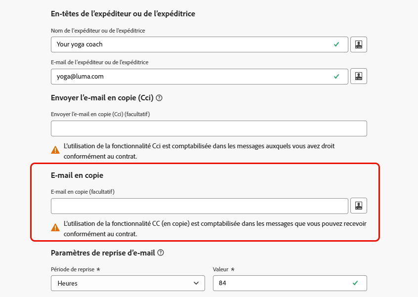

# Ajouter un champ CC aux e-mails {#cc-email-field}

>[!CONTEXTUALHELP]
>id="ajo_admin_config_cc"
>title="Définition d’une adresse e-mail en Cc"
>abstract="Vous pouvez ajouter un champ CC (copie carbone) visible aux e-mails envoyés avec cette configuration de canal. Saisissez une adresse e-mail fixe ou utilisez la personnalisation (attribut de profil ou variable contextuelle). N’oubliez pas que l’utilisation du CC est comptabilisée dans le volume de messages auquel vous avez droit."

>[!AVAILABILITY]
>
>Cette fonctionnalité est disponible pour tous les clients en disponibilité limitée. Contactez votre représentant ou représentante Adobe pour en obtenir l’accès.

Vous pouvez ajouter un champ CC (copie carbone) visible aux e-mails envoyés par [!DNL Journey Optimizer] via vos parcours et campagnes. Cette fonctionnalité facultative est configurée au niveau [configuration du canal](channel-surfaces.md), avec les paramètres d’en-tête des e-mails et l’option E-mail Cci .

>[!CAUTION]
>
>L’utilisation de la fonctionnalité CC est comptabilisée par rapport au nombre de messages pour lesquels vous disposez d’une licence. Ne l’activez que si vous avez besoin de destinataires en copie visible. Vérifiez votre contrat pour les volumes sous licence.

Comme [Cci](archiving-support.md#bcc-email), le champ Cci est destiné à envoyer une copie de l’e-mail à une adresse supplémentaire. Cependant, elle diffère de la fonctionnalité Cci des manières suivantes :

* L’adresse e-mail en copie cachée est visible par le destinataire principal, ce qui permet à ce dernier de voir qui est copié et de savoir qui contacter pour le suivi.
* Contrairement à la fonctionnalité Cci, le champ d’e-mail Cci prend en charge la personnalisation, ce qui vous permet d’utiliser une configuration de canal pour de nombreux scénarios et d’envoyer la copie à la bonne personne par destinataire (par exemple, son gestionnaire de relations). Pour les campagnes déclenchées par API, vous pouvez ainsi mettre en copie l’adresse pertinente pour un événement ou une transaction spécifique.

>[!NOTE]
>
>Si vous devez conserver des copies dont l’adresse ne doit pas être visible par le destinataire à des fins d’archivage ou de conformité, utilisez [Cci](archiving-support.md#bcc-email) au lieu de Cci.

## Activer l’e-mail CC {#enable-cc}

Pour activer l’option **[!UICONTROL E-mail CC]**, configurez le champ CC dans la [configuration du canal e-mail](../email/email-settings.md).

Vous pouvez spécifier n’importe quelle adresse externe au format correct, à l’exception d’une adresse e-mail définie sur un sous-domaine délégué à Adobe. Par exemple, si vous avez délégué le sous-domaine *marketing.luma.com* à Adobe, toute adresse comme *abc@marketing.luma.com* est interdite.

>[!CAUTION]
>
>Vous ne pouvez définir qu’une seule adresse e-mail. Assurez-vous que l’adresse CC dispose de suffisamment de capacité pour stocker tous les e-mails envoyés à l’aide de la configuration de canal actuelle.
>
>D’autres recommandations sont répertoriées dans [cette section](#cc-recommendations-limitations).

Le champ **[!UICONTROL E-mail CC]** accepte trois types de valeurs :

* Une **valeur codée en dur**, qui peut être une adresse e-mail fixe.

* Attribut **profile**, tel que l’adresse e-mail du responsable de relation disponible dans le profil.

* Un **attribut contextuel** - cette valeur ne peut **être utilisée que dans les campagnes déclenchées par l’API**. Elle est récupérée à partir de la payload de l’API qui doit inclure la variable contextuelle `context.channel.email.ccvalues` avec la valeur d’adresse CC .

  >[!WARNING]
  >
  >Lorsque la fonctionnalité CC est définie à l’aide d’une **variable contextuelle**, elle est uniquement prise en charge dans les campagnes déclenchées par **API**. Si vous utilisez cette configuration de canal dans un parcours ou une campagne d’action, l’e-mail est envoyé au destinataire principal uniquement. Aucune copie n’est envoyée à l’adresse CC.

Toute [pièce jointe](../email/pdf-attachments.md) incluse dans le message est envoyée à la fois au destinataire principal et à l’adresse CC.

Si la valeur CC n’est pas valide ou est manquante au moment de l’envoi (par exemple, une variable de contexte vide), la copie CC est ignorée ; le destinataire principal reçoit toujours l’e-mail.

S’il existe plusieurs valeurs pour le champ CC (par exemple, lors de l’utilisation d’un attribut de profil ou d’une expression qui se résout en plusieurs adresses), seule la première valeur est utilisée pour envoyer l’e-mail.

## Modifier l’e-mail CC dans les configurations de canal existantes {#cc-edit}

Si vous [modifiez une configuration d’e-mail](channel-surfaces.md#edit-channel-surface) et ajoutez ou modifiez le champ CC , vous pouvez uniquement utiliser :

* Une adresse e-mail **codée en dur** en CC, ou
* Une **variable contextuelle** (pour une utilisation déclenchée par API).

>[!CAUTION]
>
>Lors de la modification d’une configuration de canal e-mail existante, vous ne pouvez pas ajouter de nouveaux [attributs de profil](../personalization/personalization-build-expressions.md#sources) au champ **[!UICONTROL E-mail CC]**. Vous devez créer une [nouvelle configuration de canal](channel-surfaces.md#create-channel-surface).

## Recommandations et limitations {#cc-recommendations-limitations}

* **Droit :** l’utilisation du CC est comptabilisée dans le volume de messages auquel vous avez droit. Utilisez Cc uniquement lorsque vous avez besoin de destinataires Cc visibles. Vérifiez votre contrat pour les volumes sous licence.

* **Confidentialité et conformité :** pour garantir votre conformité en matière de confidentialité, les e-mails en CC doivent être traités par un système capable de stocker en toute sécurité les informations d’identification personnelle (PII), le cas échéant. Comme les messages peuvent contenir des données sensibles ou privées, telles que des informations d’identification personnelles, assurez-vous que l’adresse CC est correcte et sécurisez l’accès aux messages.

* **Gestion de la boîte de réception :** votre boîte de réception utilisée pour la fonctionnalité CC doit être correctement gérée pour l’espace et la diffusion. Si la boîte de réception renvoie des bounces, certains e-mails peuvent ne pas être reçus.

* **Délai de diffusion :** les messages peuvent être diffusés à l’adresse e-mail en copie (CC) avant les destinataires cibles. Les messages CC peuvent également être envoyés même si les messages d’origine peuvent avoir fait l’objet de [&#x200B; bounces](../reports/suppression-list.md#delivery-failures).

* **Création de rapports :** les ouvertures, les clics et autres engagements des destinataires CC sont inclus dans les mesures de création de rapports par e-mail. Ainsi, les ouvertures ou les clics des destinataires en copie cachée entraînent des erreurs de calcul dans les [rapports](../reports/report-gs-cja.md).

* **Spam :** ne marquez pas les messages comme spam dans la boîte de réception CC, car cela aura un impact sur tous les autres e-mails envoyés à cette adresse.

* **Délivrabilité :** utilisez la fonctionnalité CC en fonction de vos pratiques d’envoi et des attentes des destinataires. Une utilisation excessive de la fonctionnalité CC peut affecter la délivrabilité. Suivez les [bonnes pratiques en matière de délivrabilité](../reports/deliverability.md) ainsi que les termes de votre contrat.

>[!CAUTION]
>
>Ne cliquez pas sur le lien de désabonnement dans les e-mails envoyés à l&#39;adresse CC, car vous désabonnez immédiatement le destinataire **À** de l&#39;e-mail.
