# Paramétrer des configurations de canal {#set-up-channel-surfaces}

>[!CONTEXTUALHELP]
>id="ajo_admin_channel_surfaces"
>title="Configuration des canaux"
>abstract="Une configuration des canaux est une configuration définie par l’équipe d’administration système. Elle contient tous les paramètres techniques relatifs à l’envoi du message, tels que les paramètres d’en-tête, le sous-domaine, les applications mobiles, etc."

>[!CONTEXTUALHELP]
>id="ajo_admin_marketing_action"
>title="Action marketing"
>abstract="Sélectionnez les Actions marketing pour associer des politiques de consentement aux messages utilisant cette configuration. Toutes les politiques de consentement liées à l’action marketing seront utilisées pour respecter les préférences de vos clientes et clients."

Avec [!DNL Journey Optimizer], vous pouvez paramétrer des configurations de canal (c’est-à-dire des paramètres prédéfinis de message) qui définissent tous les paramètres techniques requis pour vos messages : type d’e-mail, nom et adresse e-mail de l’expéditeur ou de l’expéditrice, applications mobiles, configuration des SMS, etc.

>[!CAUTION]
>
> * Pour créer, modifier et supprimer des configurations de canal, vous devez disposer de l’autorisation [Gérer les paramètres prédéfinis de message](../administration/high-low-permissions.md#administration-permissions).
>
> * Vous devez effectuer les étapes [Configuration du canal e-mail](../email/get-started-email-config.md), [Configuration des notifications push](../push/push-configuration.md), [Configuration des SMS](../sms/sms-configuration.md), [Configuration in-app](../in-app/inapp-configuration.md), [Configuration basée sur le code](../code-based/code-based-configuration.md), [Configuration web](../web/web-configuration.md) et [Configuration du courrier](../direct-mail/direct-mail-configuration.md) avant de créer des configurations de canal.

Une fois les configurations de canal paramétrées, vous pourrez les sélectionner lors de la création de messages à partir d’un parcours ou d’une campagne.

Vous pouvez également utiliser la configuration de canal guidée pour automatiser et valider la configuration de canal dans une expérience unifiée, ce qui accélère le processus de prise en main de Journey Optimizer. [En savoir plus](set-mobile-config.md)

<!--
➡️ [Learn how to create and use email configurations in this video](#video-presets)
-->

## Créer une configuration des canaux {#create-channel-surface}

>[!CONTEXTUALHELP]
>id="ajo_admin_message_presets_header"
>title="Paramètres de la configuration des canaux"
>abstract="Lors du paramétrage d’une configuration de canal, sélectionnez le canal auquel elle s’applique et définissez tous les paramètres techniques obligatoires pour vos envois, tels que le type d’e-mail, le nom de l’expéditeur ou de l’expéditrice, les applications mobiles, la configuration des SMS, etc."

>[!CONTEXTUALHELP]
>id="ajo_admin_message_presets"
>title="Paramètres de la configuration des canaux"
>abstract="Pour pouvoir créer des actions telles que des e-mails provenant d’un parcours ou d’une campagne, vous devez d’abord créer une configuration de canal qui définit tous les paramètres techniques requis pour vos messages. Vous devez disposer de l’autorisation Gérer les paramètres prédéfinis de message pour créer, modifier et supprimer les configurations de canal."

>[!CONTEXTUALHELP]
>id="ajo_surface_marketing_action"
>title="Sélectionner une action marketing"
>abstract="Choisissez une action marketing dans la configuration pour pouvoir associer une politique de consentement au message."

Pour créer une configuration des canaux, procédez comme suit :

1. Accédez au menu **[!UICONTROL Canaux]** > **[!UICONTROL Paramètres généraux]** > **[!UICONTROL Configurations des canaux]**, puis cliquez sur **[!UICONTROL Créer une configuration de canal]**.

   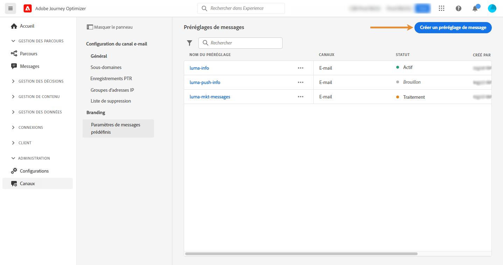

1. Saisissez un nom et une description (facultatif) pour la configuration, puis sélectionnez le canal à configurer.

   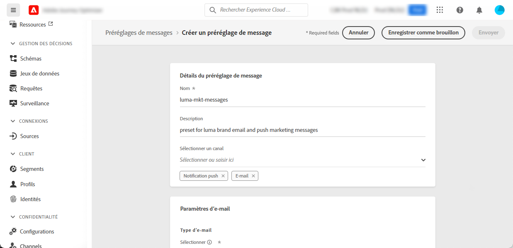

   >[!NOTE]
   >
   > Les noms doivent commencer par une lettre (A-Z). Ils ne peuvent contenir que des caractères alphanumériques. Vous pouvez également utiliser le trait de soulignement `_`, le point`.` et le trait d&#39;union `-`.

1. Pour attribuer des libellés d’utilisation des données personnalisés ou de base à la configuration, vous pouvez sélectionner **[!UICONTROL Gérer l’accès]**. [En savoir plus sur le contrôle d’accès au niveau de l’objet (OLAC)](../administration/object-based-access.md)

1. Sélectionnez votre canal.

1. Sélectionnez une **[!UICONTROL Action marketing]** ou plusieurs pour associer des politiques de consentement aux messages utilisant cette configuration. Toutes les politiques de consentement associées à cette action marketing sont utilisées afin de respecter les préférences de vos clientes et clients. [En savoir plus](../action/consent.md#surface-marketing-actions)

   >[!NOTE]
   >
   >Les politiques de consentement ne sont actuellement disponibles que pour les organisations qui ont acheté les offres complémentaires **Healthcare Shield** et **Privacy and Security Shield**.

   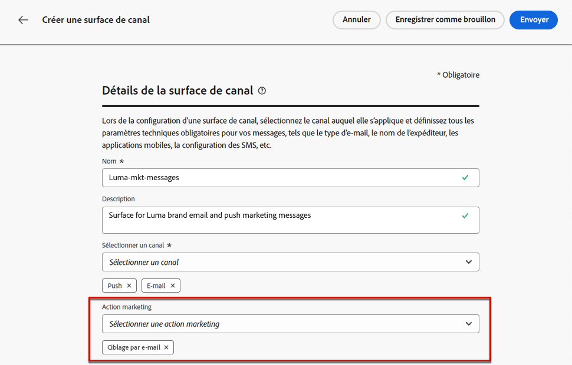

1. Une fois tous les paramètres configurés, cliquez sur **[!UICONTROL Envoyer]** pour confirmer. Vous pouvez également enregistrer la configuration de canal en tant que brouillon et reprendre son paramétrage ultérieurement.

   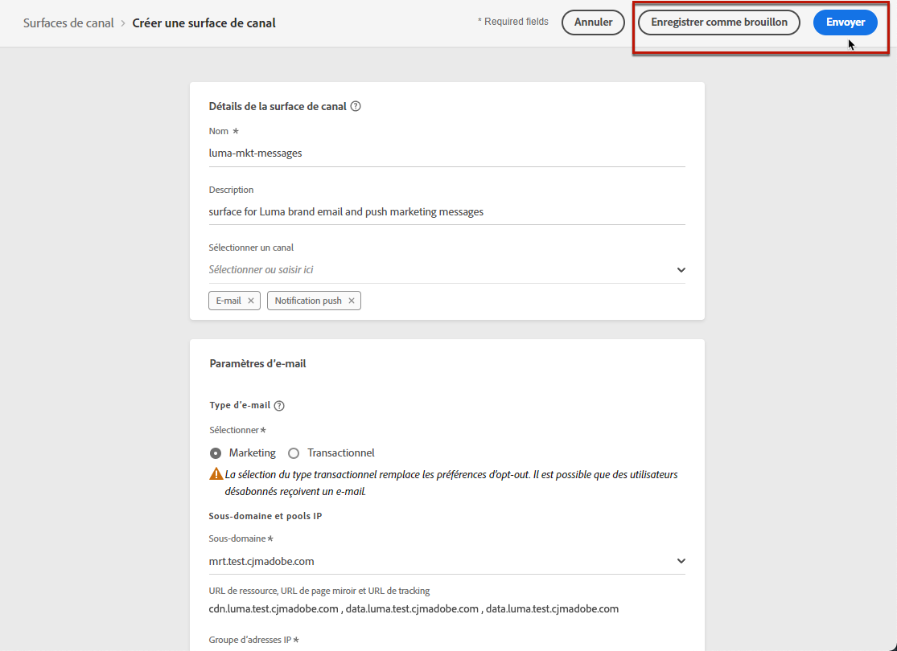

   >[!NOTE]
   >
   >Vous ne pouvez pas poursuivre la création de la configuration du canal e-mail lorsque le groupe d’adresses IP sélectionné est en cours d’[édition](ip-pools.md#edit-ip-pool) (statut **[!UICONTROL Traitement en cours]**) et n’a jamais été associé au sous-domaine sélectionné. [En savoir plus](#subdomains-and-ip-pools)
   >
   >Enregistrez la configuration en tant que brouillon et attendez que le groupe d’adresses IP ait le statut **[!UICONTROL Succès]** pour reprendre la création de la configuration.

1. Une fois la configuration de canal créée, elle s’affiche dans la liste avec le statut **[!UICONTROL En cours de traitement]**.

   Au cours de cette étape, plusieurs vérifications seront effectuées afin de vérifier que la configuration est correcte.<!--The processing time is around **48h-72h**, and can take up to **7-10 business days**.-->

   >[!NOTE]
   > Lors de la création d’une configuration du canal e-mail pour un sous-domaine, le temps de traitement varie comme décrit ci-dessous :
   >
   > * Pour les **nouveaux sous-domaines**, le processus de création de la première surface de canal peut prendre entre **10 minutes et 10 jours**.
   > * Pour les **sandbox hors production**, ou si le sous-domaine sélectionné est **déjà utilisé** dans une autre configuration de canal approuvée, le processus ne prend que **3 heures** au maximum.

   Ces vérifications comprennent des tests de configuration et des tests techniques effectués par l’équipe dʼAdobe :

   * Validation SPF
   * Validation DKIM
   * Validation des enregistrements MX
   * Vérification de la liste bloquée des adresses IP
   * Vérification de l&#39;hôte Helo
   * Vérification du pool d&#39;adresses IP
   * Enregistrement A/PTR, vérification du sous-domaine t/m/res
   * Enregistrement FBL (cette vérification ne sera effectuée que la première fois qu’une configuration de canal e-mail est créée pour un sous-domaine donné).

   >[!NOTE]
   >
   >Si les vérifications ne réussissent pas, découvrez les raisons possibles de l’échec dans [cette section](#monitor-channel-surfaces).

1. Une fois les contrôles réussis, la configuration de canal obtient le statut **[!UICONTROL Actif]**. Elle est prête à être utilisée pour diffuser des messages.

   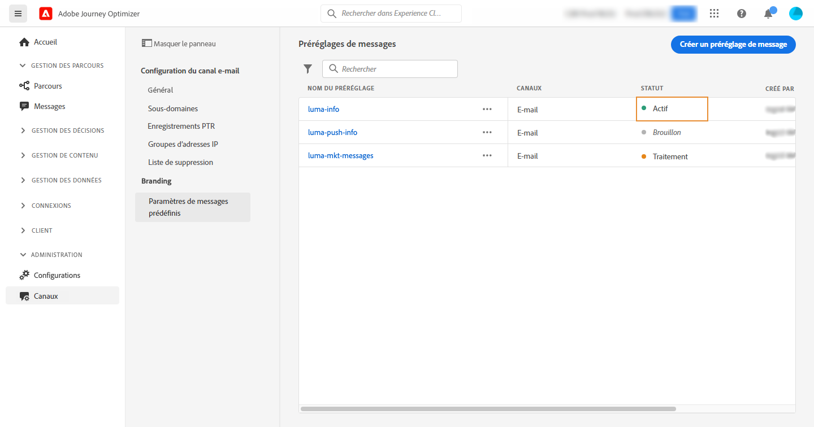

## Surveiller les configurations de canal {#monitor-channel-surfaces}

Toutes les configurations de vos canaux s’affichent dans le menu **[!UICONTROL Canaux]** > **[!UICONTROL Configurations des canaux]**. Des filtres sont disponibles pour vous aider à parcourir la liste (canal, utilisateur ou utilisatrice, statut).

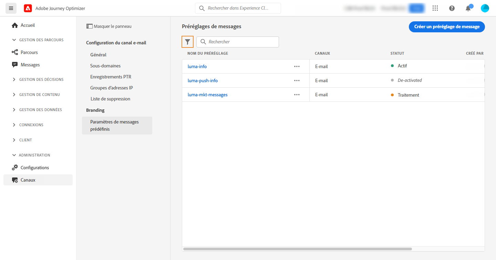

Une fois créées, les configurations de canaux peuvent avoir les statuts suivants :

* **[!UICONTROL Brouillon]** : la configuration de canal a été enregistrée en tant que brouillon et n’a pas encore été envoyée. Ouvrez-la pour reprendre la configuration.
* **[!UICONTROL En cours de traitement]** : la configuration de canal a été envoyée et passe par plusieurs étapes de vérification.
* **[!UICONTROL Actif]** : la configuration de canal a été vérifiée et peut être sélectionnée pour créer des messages.
* **[!UICONTROL Échec]** : une ou plusieurs vérifications ont échoué lors de la vérification de la configuration de canal.
* **[!UICONTROL Désactivé]** : la configuration de canal est désactivée. Elle ne peut pas être utilisée pour créer des messages.

### Raisons de l’échec de la configuration des canaux {#channel-config-failure}

En cas d’échec de la création d’une configuration de canal, les détails de chaque raison d’échec possible sont décrits ci-dessous.

Si l’une de ces erreurs se produit, contactez l’[assistance clientèle d’Adobe](https://helpx.adobe.com/fr/enterprise/admin-guide.html/enterprise/using/support-for-experience-cloud.ug.html){target="_blank"} pour obtenir de l’aide.

* **Échec de la validation SPF** : SPF (Sender Policy Framework) est un protocole d’authentification d’e-mail qui permet de spécifier des adresses IP autorisées pouvant envoyer des e-mails à partir d’un sous-domaine donné. L’échec de validation SPF signifie que les adresses IP contenues dans l’enregistrement SPF ne correspondent pas aux adresses IP utilisées pour envoyer les e-mails aux fournisseurs de messagerie.

* **Échec de la validation DKIM** : DKIM (DomainKeys Identified Mail) permet au serveur destinataire de vérifier que le message reçu a été envoyé par l’expéditeur véritable du domaine associé et que le contenu du message d’origine n’a pas été modifié en cours de route. L’échec de validation DKIM signifie que les serveurs de messagerie de réception ne peuvent pas vérifier l’authenticité du contenu du message et son association avec le domaine d’envoi.:

* **Échec de la validation des enregistrements MX** : l’échec de la validation des enregistrements MX (Mail eXchange) signifie que les serveurs de messagerie chargés d’accepter les e-mails entrants pour le compte d’un sous-domaine donné ne sont pas correctement configurés.

* **Échec des configurations de délivrabilité** : l’échec des configurations de délivrabilité peut être dû à l’une des raisons suivantes :
   * Placement sur liste bloquée des adresses IP allouées
   * Nom `helo` non valide
   * E-mails envoyés à partir d’adresses IP autres que celles spécifiées dans le groupe d’adresses IP de la configuration correspondante
   * Impossible de diffuser des e-mails vers les boîtes de réception des principaux FAI

## Modifier une configuration de canal {#edit-channel-surface}

Pour modifier une configuration de canal, procédez comme suit.

>[!NOTE]
>
>Vous ne pouvez pas modifier les **[!UICONTROL Paramètres des notifications push]**. Si une configuration de canal est uniquement paramétrée pour le canal Notification push, elle n’est pas modifiable.

1. Dans la liste, cliquez sur un nom de configuration de canal pour l’ouvrir.

   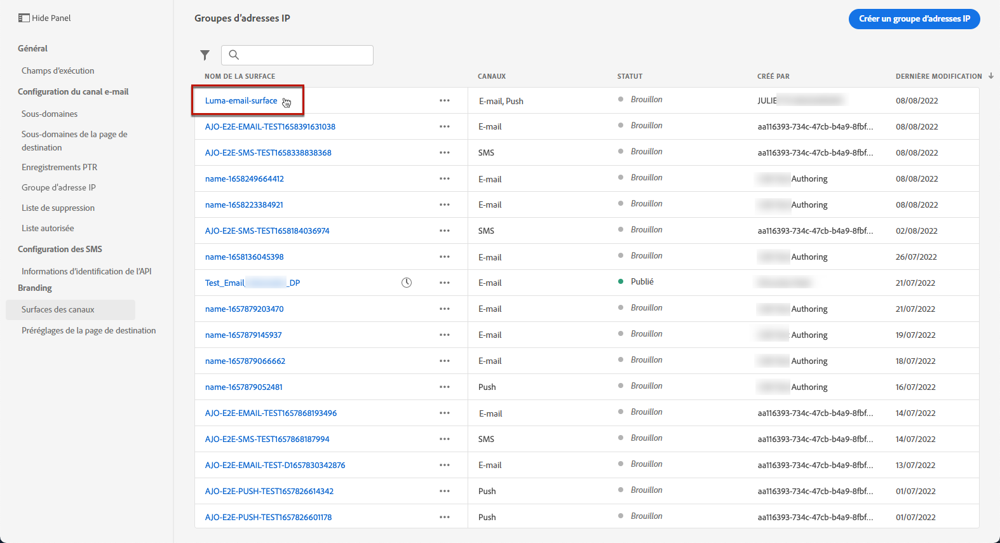

1. Modifiez ses propriétés selon vos besoins.

   >[!NOTE]
   >
   >Si une configuration de canal affiche le statut **[!UICONTROL Actif]**, les champs **[!UICONTROL Nom]**, **[!UICONTROL Sélectionner le canal]** et **[!UICONTROL Sous-domaine]** sont grisés et ne peuvent pas être modifiés.

1. Cliquez sur **[!UICONTROL Soumettre]** pour confirmer vos modifications.

   >[!NOTE]
   >
   >Vous pouvez également enregistrer la configuration de canal en tant que brouillon et reprendre sa mise à jour ultérieurement.

Une fois les modifications envoyées, la configuration de canal passera par un cycle de validation similaire à celui mis en place lors de la [création d’une configuration de canal](#create-channel-surface). Le temps de traitement des modifications peut prendre jusqu’à **3 heures**.

>[!NOTE]
>
>Si vous modifiez uniquement les champs **[!UICONTROL Description]**, **[!UICONTROL Type d’e-mail]** et/ou **[!UICONTROL Paramètres de relance de l’e-mail]**, la mise à jour est instantanée.

### Détails de la mise à jour {#update-details}

Pour les configurations de canal affichant le statut **[!UICONTROL Actif]**, vous pouvez vérifier les détails de la mise à jour. Pour ce faire, procédez comme suit :

Cliquez sur l’icône **[!UICONTROL Mise à jour récente]** qui s’affiche en regard du nom de la configuration active.

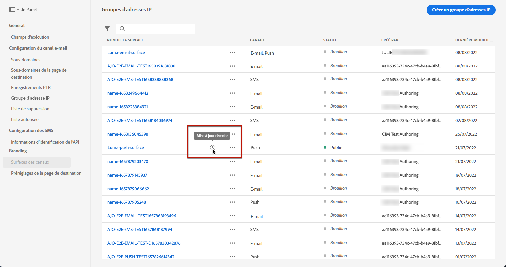

<!--You can also access the update details from an active channel configuration while update is in progress.-->

Sur l’écran **[!UICONTROL Mise à jour récente]**, vous pouvez voir des informations telles que le statut de la mise à jour et la liste des modifications demandées.

<!--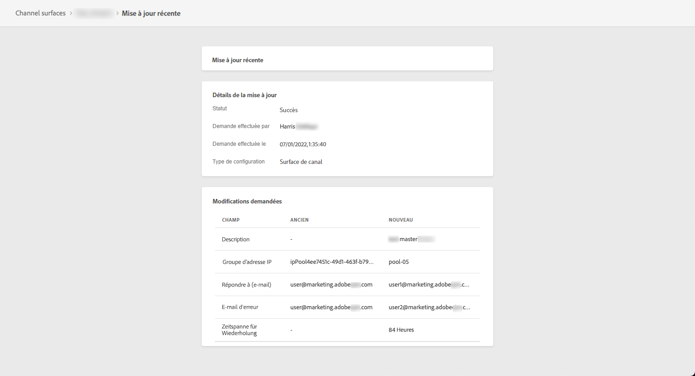-->

### Statuts de mise à jour {#update-statuses}

Une mise à jour de configuration de canal peut afficher les statuts suivants :

* **[!UICONTROL Traitement]** : la mise à jour de configuration de canal a été envoyée et passe par plusieurs étapes de vérification.
* **[!UICONTROL Succès]** : la configuration de canal mise à jour a été vérifiée et peut être sélectionnée pour créer des messages.
* **[!UICONTROL Échec]** : un ou plusieurs contrôles ont échoué lors de la vérification de la mise à jour de la configuration de canal.

Chaque statut est présenté ci-dessous.

#### En cours de traitement {#surface-processing}

Plusieurs contrôles de délivrabilité seront effectués pour vérifier que la configuration a été correctement mise à jour.

>[!NOTE]
>
>Si vous modifiez uniquement les champs **[!UICONTROL Description]**, **[!UICONTROL Type d’e-mail]** et/ou **[!UICONTROL Paramètres de reprise de l’e-mail]**, la mise à jour est instantanée.

Le temps de traitement peut prendre jusqu’à **3 heures**. En savoir plus sur les contrôles effectués lors du cycle de validation dans [cette section](#create-channel-surface).

Si vous modifiez une configuration qui était déjà active, ce qui suit s’applique :

* Son statut reste **[!UICONTROL Actif]** pendant que le processus de validation est en cours.

* L’icône **[!UICONTROL Mise à jour récente]** s’affiche en regard du nom de la configuration dans la liste des configurations de canaux.

* Pendant le processus de validation, les messages configurés à l’aide de cette configuration utilisent toujours l’ancienne version de la configuration.

>[!NOTE]
>
>Vous ne pouvez pas modifier une configuration de canal pendant que la mise à jour est en cours. Vous pouvez toujours cliquer sur son nom, mais tous les champs sont grisés. Les modifications ne seront pas répercutées tant que la mise à jour n’aura pas réussi.

#### Réussite {#success}

Une fois le processus de validation réussi, la nouvelle version de la configuration est automatiquement utilisée dans tous les messages utilisant cette configuration. Cependant, vous devrez peut-être attendre :

* quelques minutes avant qu’il soit consommé par les messages unitaires,
* jusqu’au lot suivant pour que la configuration soit effective dans les messages par lots.

#### Échec {#failed}

Si le processus de validation échoue, l’ancienne version de la configuration continuera d’être utilisée.

En savoir plus sur les causes possibles d’échec dans [cette section](#monitor-channel-surfaces).

En cas d’échec de la mise à jour, la configuration est à nouveau modifiable. Vous pouvez cliquer sur son nom et mettre à jour les paramètres à corriger.

## Désactiver une configuration de canal {#deactivate-a-surface}

Pour empêcher la création de nouveaux messages à partir d’une configuration de canal **[!UICONTROL Active]**, vous pouvez la désactiver. <!--However, journeys' messages currently using this configuration will not be affected and will continue working.-->

Vous ne pouvez pas désactiver une configuration de canal dans les cas suivants :

* S’il est référencé par un parcours actif. Toute tentative de désactivation d’une configuration toujours en cours d’utilisation par un parcours dynamique entraîne une erreur.

  Pour désactiver une configuration de canal, assurez-vous que tous les parcours en direct utilisant cette configuration sont fermés ou arrêtés. [Découvrez comment terminer un parcours ](../building-journeys/end-journey.md)

* Pendant le traitement d’une mise à jour de la configuration du canal. Vous devez attendre que la mise à jour soit réussie ou qu’elle ait échoué. En savoir plus sur la [modification des configurations de canal](#edit-channel-surface) et sur les [statuts de mise à jour](#update-statuses).

Pour désactiver une configuration de canal, procédez comme suit.

1. Accédez à la liste des configurations de canaux.

1. Pour la configuration active de votre choix, cliquez sur le bouton **[!UICONTROL Plus d’actions]**.

1. Sélectionnez **[!UICONTROL Désactiver]**.

   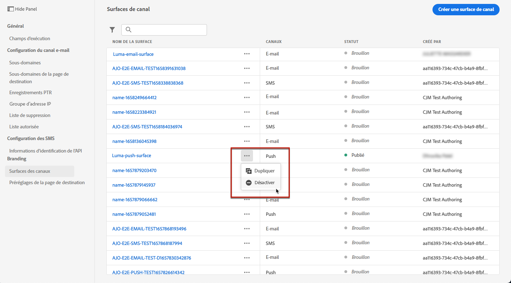

>[!NOTE]
>
>Une fois désactivées, les configurations de canaux ne peuvent pas être supprimées pour éviter tout problème dans les parcours les utilisant pour l’envoi des messages.

Vous ne pouvez pas modifier directement une configuration de canal désactivée. Cependant, vous pouvez le dupliquer et modifier la copie pour créer une nouvelle version que vous utiliserez pour créer de nouveaux messages. Vous pouvez également l’activer à nouveau et attendre que la mise à jour soit réussie pour le modifier.

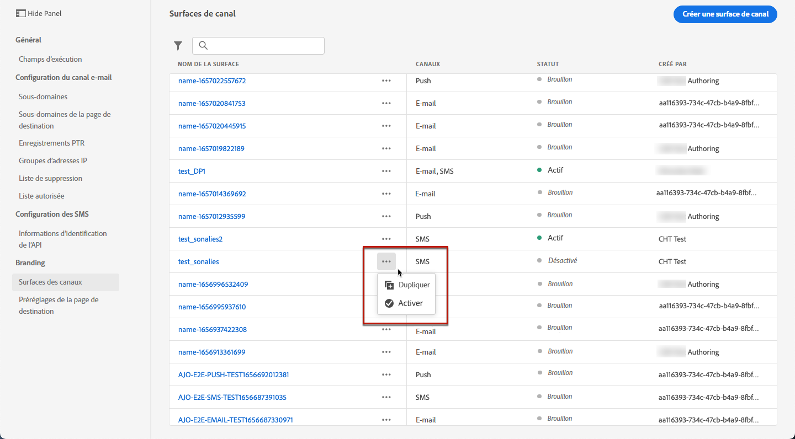

## Ajouter des balises à une configuration des canaux {#channel-config-tags}

1. Accédez à la liste des configurations de canaux.

1. Pour la configuration active de votre choix, cliquez sur le bouton **[!UICONTROL Plus d’actions]**.

1. Cliquez sur **[!UICONTROL Modifier les balises]**.

1. Sélectionnez des balises Adobe Experience Platform dans la liste pour classer la configuration des canaux et améliorer ainsi la recherche. [Découvrir comment utiliser les balises unifiées](../start/search-filter-categorize.md#tags)

   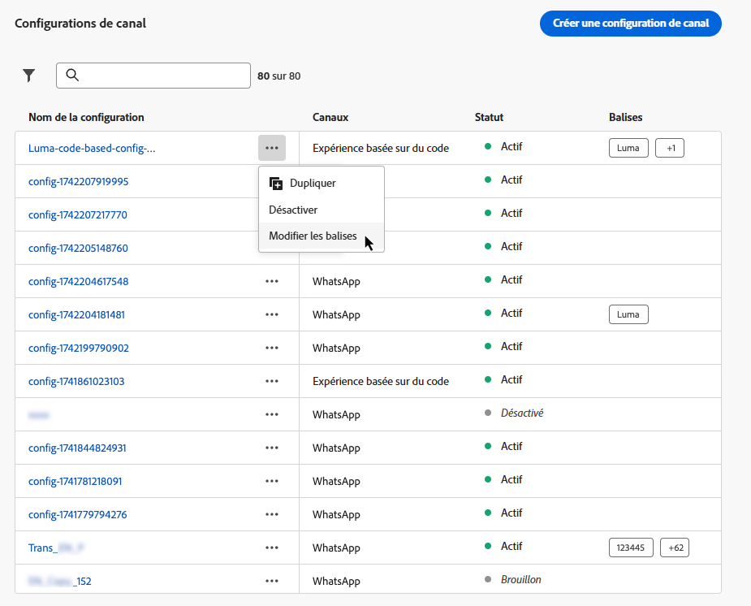

1. Une fois que vous avez attribué des balises à vos configurations de canal, vous pouvez les [filtrer](../start/search-filter-categorize.md#filter-on-tags) sur les balises.

## Vidéo pratique{#video-presets}

Découvrez les configurations de canal et leur utilisation dans Adobe Journey Optimizer.

>[!VIDEO](https://video.tv.adobe.com/v/3433124/?learn=on)
