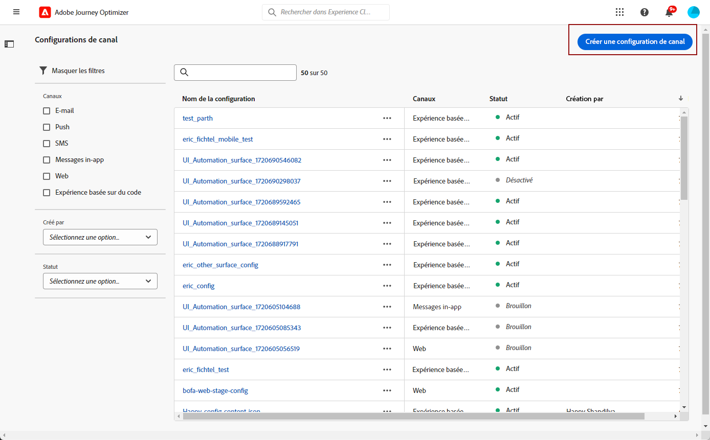
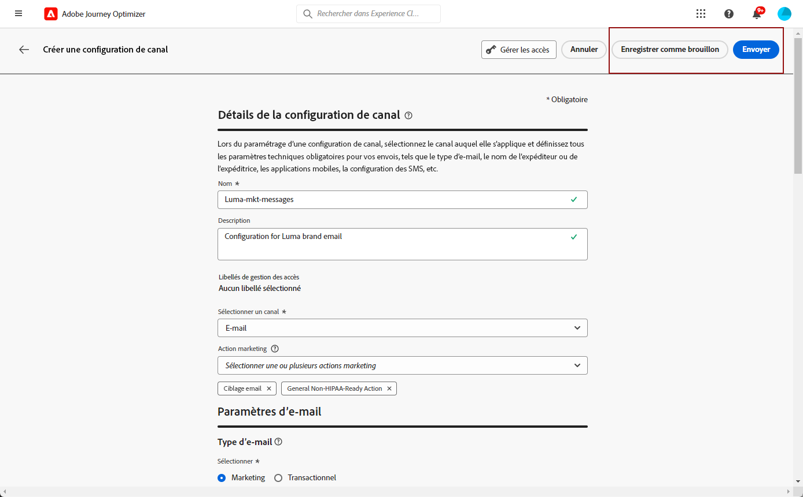
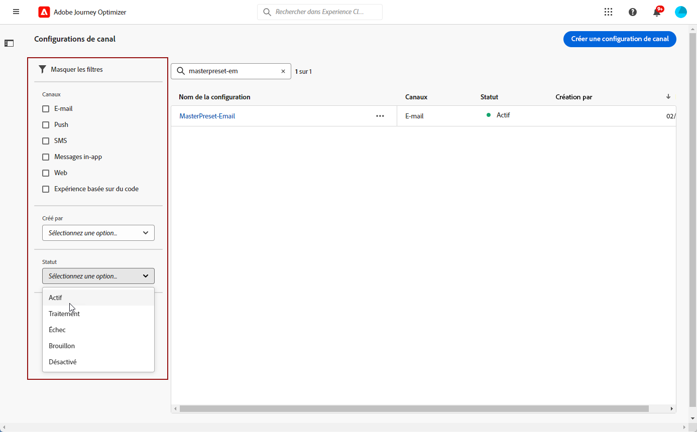

# Configuration des surfaces de canal {#set-up-channel-surfaces}

Avec [!DNL Journey Optimizer], vous pouvez configurer des surfaces de canal (c’est-à-dire des paramètres prédéfinis de message) qui définissent tous les paramètres techniques requis pour vos messages : type d’email, nom et adresse email de l’expéditeur, applications mobiles, configuration des SMS, etc.

>[!CAUTION]
>
> * Pour créer, modifier et supprimer des surfaces de canal, vous devez disposer de l’autorisation [Gérer la surface du canal](../administration/high-low-permissions.md#manage-channel-surface).
>
> * Vous devez effectuer les opérations suivantes : [Configuration du canal e-mail](#configure-email-settings), [Configuration du canal push](../configuration/push-configuration.md) et [Configuration du canal SMS](../configuration/sms-configuration.md) avant de créer des surfaces de canal.

Une fois les surfaces de canal configurées, vous pourrez les sélectionner lors de la création de messages à partir d’un parcours.

<!--
➡️ [Learn how to create and use email surfaces in this video](#video-presets)
-->

## Création d’une surface de canal {#create-channel-surface}

>[!CONTEXTUALHELP]
>id="ajo_admin_message_presets_header"
>title="Paramètres de surface de canal"
>abstract="Lors de la configuration d’une surface de canal, sélectionnez le canal auquel il s’applique et définissez tous les paramètres techniques requis pour vos messages, tels que le type d’email, le sous-domaine, le nom de l’expéditeur, les applications mobiles, la configuration des SMS, etc."

>[!CONTEXTUALHELP]
>id="ajo_admin_message_presets"
>title="Paramètres de surface de canal"
>abstract="Lors de la configuration de la surface d’un canal, sélectionnez le canal auquel il s’applique et définissez tous les paramètres techniques requis pour vos messages, tels que le type d’email, le nom de l’expéditeur, les applications mobiles, la configuration des SMS, etc."

<!--New contextual help content for September release: A channel surface defines all the technical parameters required for your messages (email type, sender name, mobile apps, SMS configuration, etc.): once configured, you will be able to select it when creating actions from a journey or a campaign. Note that you must have the Manage channel surface permission to create, edit and delete channel surfaces.

To create a channel surface, follow these steps:

1. Access the **[!UICONTROL Channels]** > **[!UICONTROL Branding]** > **[!UICONTROL Channel surfaces]** menu, then click **[!UICONTROL Create channel surface]**.

    

1. Enter a name and a description (optional) for the surface, then select the channel(s) to configure.

    

    >[!NOTE]
    >
    > Names must begin with a letter (A-Z). It can only contain alpha-numeric characters. You can also use underscore `_`, dot`.` and hyphen `-` characters. 

1. If you selected the **[!UICONTROL Email]** channel, configure your settings as described in [this section](email-settings.md).

    

1. For the **[!UICONTROL Push Notification]** channel, select at least one platform  -  **iOS** and/or **Android** -, and the mobile applications to use for each platform.

    
        
    >[!NOTE]
    >
    >For more on how to configure your environment to send push notifications, refer to [this section](push-gs.md).

1. For the **[!UICONTROL SMS]** channel, define your settings as detailed in [this section](sms-configuration.md#message-preset-sms).

    

    >[!NOTE]
    >
    >For more on how to configure your environment to send SMS messages, refer to [this section](sms-configuration.md).

1. Once all the parameters have been configured, click **[!UICONTROL Submit]** to confirm. You can also save the channel surface as draft and resume its configuration later on.

    

    >[!NOTE]
    >
    >You cannot proceed with surface creation while the selected IP pool is under [edition](ip-pools.md#edit-ip-pool) (**[!UICONTROL Processing]** status), and has never been associated with the selected subdomain. [Learn more](#subdomains-and-ip-pools)
    >
    >Save the surface as draft and wait until the IP pool has the **[!UICONTROL Success]** status to resume surface creation.
    
1. Once the channel surface has been created, it displays in the list with the **[!UICONTROL Processing]** status.

    During this step, several checks will be performed to verify that it has been configured properly. The processing time is around **48h-72h**, and can take up to **7-10 business days**.

    These checks include configuration and technical tests that are performed by the Adobe team:

    * SPF validation
    * DKIM validation
    * MX record validation
    * Check IPs denylisting
    * Helo host check
    * IP pool verification
    * A/PTR record, t/m/res subdomain verification

    >[!NOTE]
    >
    >If the checks are not successful, learn more on the possible failure reasons in [this section](#monitor-channel-surfaces).  

1. Once the checks are successful, the channel surface gets the **[!UICONTROL Active]** status. It is ready to be used to deliver messages.

    

## Monitor channel surfaces {#monitor-channel-surfaces}

All your channel surfaces display in the **[!UICONTROL Channels]** > **[!UICONTROL Channel surfaces]** menu. Filters are available to help you browse through the list (channel, user, status).

Once created, channel surfaces can have the following statuses:

* **[!UICONTROL Draft]**: The channel surface has been saved as a draft and has not been submitted yet. Open it to resume the configuration.
* **[!UICONTROL Processing]**: The channel surface has been submitted and is going through several verifications steps.
* **[!UICONTROL Active]**: The channel surface has been verified and can be selected to create messages.
* **[!UICONTROL Failed]**: One or several checks have failed during the channel surface verification.
* **[!UICONTROL Deactivated]**: The channel surface is deactivated. It cannot be used to create new messages.

In case a channel surface creation fails, the details on each possible failure reason are described below.

If one of these errors occurs, contact [Adobe Customer Care](https://helpx.adobe.com/enterprise/admin-guide.html/enterprise/using/support-for-experience-cloud.ug.html){target="_blank"} to get assistance.

* **SPF validation failed**: SPF (Sender Policy Framework) is an email authentication protocol that allows to specify authorized IPs that can send emails from a given subdomain. SPF validation failure means that the IP addresses in the SPF record do not match the IP addresses used for sending emails to the mailbox providers. 

* **DKIM validation failed**: DKIM (DomainKeys Identified Mail) allows the recipient server to verify that the received message was sent by the genuine sender of the associated domain and that the content of the original message was not altered on its way. DKIM validation failure means that the receiving mail servers are unable to verify the authenticity of the message content and its association with the sending domain.:

* **MX record validation failed**: MX (Mail eXchange) record validation failure means that the mail servers responsible for accepting inbound emails on behalf of a given subdomain are not correctly configured.

* **Deliverability configurations failed**: Deliverability configurations failure can happen due to any of the following reasons:
    * Blocklisting of the allocated IPs
    * Invalid `helo` name
    * Emails being sent from IPs other than the ones specified in the IP pool of the corresponding surface
    * Unable to deliver emails to inboxes of major ISPs like Gmail and Yahoo

## Edit a channel surface {#edit-channel-surface}

To edit a channel surface, follow the steps below.

>[!NOTE]
>
>You cannot edit the **[!UICONTROL Push notification settings]**. If a channel surface is only configured for the Push notification channel, it is not editable.

1. From the list, click a channel surface name to open it.

    

1. Edit its properties as desired.

    >[!NOTE]
    >
    >If a channel surface has the **[!UICONTROL Active]** status, the **[!UICONTROL Name]**, **[!UICONTROL Select channel]** and **[!UICONTROL Subdomain]** fields are greyed out and cannot be edited.

1. Click **[!UICONTROL Submit]** to confirm your changes.

    >[!NOTE]
    >
    >You can also save the channel surface as draft and resume update later on.

Once the changes are submitted, the channel surface will go through a validation cycle similar to the one in place when [creating a channel surface](#create-channel-surface). The edition processing time can take up to **3 hours**.

>[!NOTE]
>
>If you only edit the **[!UICONTROL Description]**, **[!UICONTROL Email type]** and/or **[!UICONTROL Email retry parameters]** fields, the update is instantaneous.

### Update details {#update-details}

For channel surfaces that have the **[!UICONTROL Active]** status, you can check the details of the update. To do so:

Click the **[!UICONTROL Recent update]** icon that is displayed next to the active surface name.

<!--You can also access the update details from an active channel surface while update is in progress.-->

Sur l’écran **[!UICONTROL Mise à jour récente]**, vous pouvez voir des informations telles que le statut de la mise à jour et la liste des modifications demandées.

<!---->

### Statuts de mise à jour {#update-statuses}

Une mise à jour de surface de canal peut afficher les statuts suivants :

* **[!UICONTROL Traitement]** : la mise à jour de surface de canal a été envoyée et passe par plusieurs étapes de vérification.
* **[!UICONTROL Succès]** : la surface de canal mise à jour a été vérifiée et peut être sélectionnée pour créer des messages.
* **[!UICONTROL Échec]** : une ou plusieurs vérifications ont échoué lors du contrôle de la mise à jour de la surface de canal.

Chaque statut est présenté ci-dessous.

#### En cours de traitement {#surface-processing}

Plusieurs contrôles de délivrabilité seront effectués pour vérifier que le surface a été correctement mise à jour.

>[!NOTE]
>
>Si vous modifiez uniquement les champs **[!UICONTROL Description]**, **[!UICONTROL Type d’e-mail]** et/ou **[!UICONTROL Paramètres de reprise de l’e-mail]**, la mise à jour est instantanée.

Le temps de traitement peut prendre jusqu’à **3 heures**. En savoir plus sur les contrôles effectués lors du cycle de validation dans [cette section](#create-channel-surface).

Si vous modifiez une surface qui était déjà active :

* Son statut reste **[!UICONTROL Actif]** pendant que le processus de validation est en cours.

* L’icône **[!UICONTROL Mise à jour récente]** s’affiche en regard du nom de la surface dans la liste des surfaces de canaux.

* Pendant le processus de validation, les messages configurés à l’aide de cette surface utilisent toujours l’ancienne version de la surface.

>[!NOTE]
>
>Vous ne pouvez pas modifier une surface de canal pendant que la mise à jour est en cours. Vous pouvez toujours cliquer sur son nom, mais tous les champs sont grisés. Les modifications ne seront pas répercutées tant que la mise à jour n’aura pas réussi.

#### Réussite {#success}

Une fois le processus de validation réussi, la nouvelle version de la surface est automatiquement utilisée dans tous les messages utilisant cette surface. Cependant, vous devrez peut-être attendre :
* quelques minutes avant qu’il soit consommé par les messages unitaires,
* jusqu’au lot suivant pour que la surface soit effective dans les messages par lots.

#### Échec {#failed}

Si le processus de validation échoue, l’ancienne version de la surface sera toujours utilisée.

Pour en savoir plus sur les causes possibles d’échec, consultez [cette section](#monitor-channel-surfaces).

En cas d’échec de la mise à jour, la surface est à nouveau modifiable. Vous pouvez cliquer sur son nom et mettre à jour les paramètres à corriger.

## Désactivation de la surface d’un canal {#deactivate-a-surface}

Pour empêcher la création de nouveaux messages à partir d’une surface de canal **[!UICONTROL active]**, vous pouvez la désactiver. Toutefois, les messages des parcours qui utilisent actuellement cette surface ne seront pas affectés et continueront à fonctionner.

>[!NOTE]
>
>Vous ne pouvez pas désactiver une surface de canal pendant qu’une mise à jour est en cours. Vous devez attendre que la mise à jour soit réussie ou qu’elle ait échoué. En savoir plus sur la [modification de surfaces de canaux](#edit-channel-surface) et sur les [statuts de mise à jour](#update-statuses).

1. Accédez à la liste des surfaces de canaux.

1. Pour la surface active de votre choix, cliquez sur le bouton **[!UICONTROL Plus d’actions]**.

1. Sélectionnez **[!UICONTROL Désactiver]**.

   

>[!NOTE]
>
>Une fois désactivées, les surfaces de canaux ne peuvent pas être supprimées pour éviter tout problème dans les parcours les utilisant pour l’envoi des messages.

Vous ne pouvez pas modifier directement une surface de canal désactivée. Cependant, vous pouvez le dupliquer et modifier la copie pour créer une nouvelle version que vous utiliserez pour créer de nouveaux messages. Vous pouvez également l’activer à nouveau et attendre que la mise à jour soit réussie pour le modifier.

<!--
## How-to video{#video-presets}

Learn how to create channel surfaces, how to use them and how to delegate a subdomain and create an IP pool.

>[!VIDEO](https://video.tv.adobe.com/v/334343?quality=12)
-->
