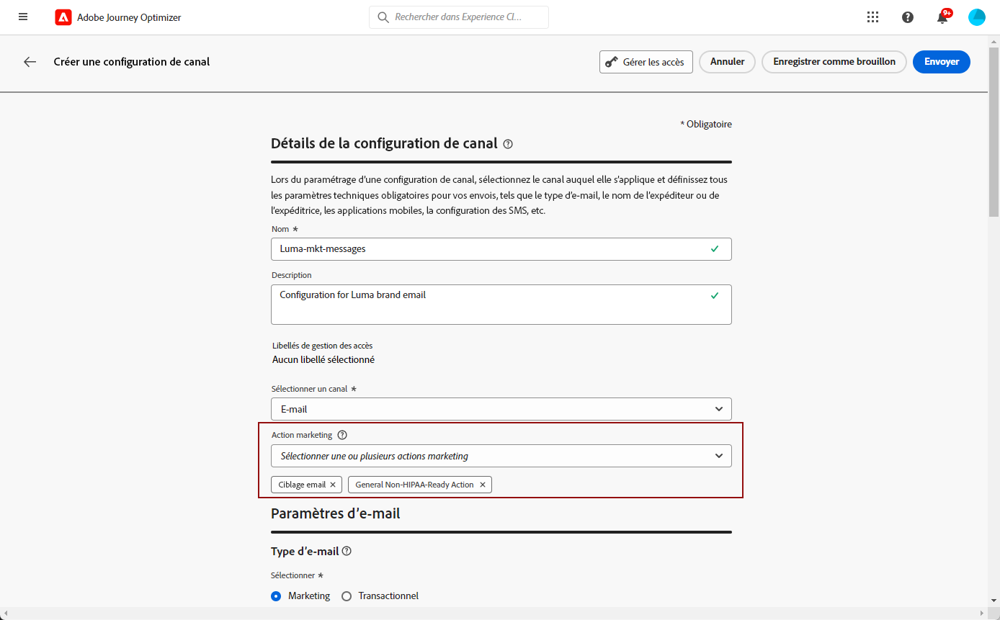

# Configurer des surfaces de canal {#set-up-channel-surfaces}

>[!CONTEXTUALHELP]
>id="ajo_admin_channel_surfaces"
>title="Surface de canal"
>abstract="Une surface de canal est une configuration définie par l’équipe d’administration système. Elle contient tous les paramètres techniques relatifs à l’envoi du message, tels que les paramètres d’en-tête, le sous-domaine, les applications mobiles, etc."

Avec [!DNL Journey Optimizer], vous pouvez configurer des surfaces de canal (c’est-à-dire des préréglages de message) qui définissent tous les paramètres techniques requis pour vos messages : type d’e-mail, nom et adresse e-mail de l’expéditeur, applications mobiles, configuration des SMS, etc.

>[!CAUTION]
>
> * Pour créer, modifier et supprimer des surfaces de canal, vous devez disposer de l’autorisation [Gérer les préréglages de message](../administration/high-low-permissions.md#administration-permissions).
>
> * Vous devez effectuer les étapes de [Configuration du canal e-mail](../email/get-started-email-config.md), de [Configuration du canal push](../push/push-configuration.md), de [Configuration du canal SMS](../sms/sms-configuration.md) et de [Configuration du courrier](../direct-mail/direct-mail-configuration.md) avant de créer des surfaces de canal.

Une fois les surfaces de canal configurées, vous pourrez les sélectionner lors de la création de messages à partir d’un parcours ou d’une campagne.

<!--
➡️ [Learn how to create and use email surfaces in this video](#video-presets)
-->

## Création d’une surface de canal {#create-channel-surface}

>[!CONTEXTUALHELP]
>id="ajo_admin_message_presets_header"
>title="Paramètres de surface de canal"
>abstract="Lors de la configuration d’une surface de canal, sélectionnez le canal auquel elle s’applique et définissez tous les paramètres techniques obligatoires pour vos messages, tels que le type d’e-mail, le nom de l’expéditeur, les applications mobiles, la configuration des SMS, etc."

>[!CONTEXTUALHELP]
>id="ajo_admin_message_presets"
>title="Paramètres de surface de canal"
>abstract="Pour pouvoir créer des actions telles que des e-mails provenant d’un parcours ou d’une campagne, vous devez d’abord créer une surface de canal qui définit tous les paramètres techniques requis pour vos messages. Vous devez disposer de l’autorisation Gérer les préréglages de message pour créer, modifier et supprimer les surfaces de canal."

>[!CONTEXTUALHELP]
>id="ajo_surface_marketing_action"
>title="Sélection d’une action marketing"
>abstract="Sélectionnez une action marketing en surface afin d&#39;associer une stratégie de consentement au message."

Pour créer une surface de canal, procédez comme suit :

1. Accédez au menu **[!UICONTROL Canaux]** > **[!UICONTROL Branding]** > **[!UICONTROL Surfaces des canaux]**, puis cliquez sur **[!UICONTROL Créer une surface de canal]**.

   

1. Saisissez un nom et une description (facultatif) pour la surface, puis sélectionnez le ou les canaux à configurer.

   

   >[!NOTE]
   >
   > Les noms doivent commencer par une lettre (A-Z). Ils ne peuvent contenir que des caractères alphanumériques. Vous pouvez également utiliser le trait de soulignement `_`, le point`.` et le trait d&#39;union `-`.

1. Si vous avez sélectionné le canal **[!UICONTROL E-mail]**, configurez vos paramètres comme indiqué dans [cette section](../email/email-settings.md).

   

1. Pour le canal **[!UICONTROL Notification push]**, choisissez au moins une plateforme, **iOS** et/ou **Android**, puis les applications mobiles à utiliser pour chaque plateforme.

   

   >[!NOTE]
   >
   >Pour plus d’informations sur la configuration de votre environnement pour envoyer des notifications push, consultez [cette section](../push/push-gs.md).

1. Pour le canal **[!UICONTROL SMS]**, définissez vos paramètres comme décrit dans [cette section](../sms/sms-configuration.md#message-preset-sms).

   

   >[!NOTE]
   >
   >Pour plus dʼinformations sur la configuration de votre environnement pour envoyer des messages SMS, consultez [cette section](../sms/sms-configuration.md).

<!--
1. Select a **[!UICONTROL Marketing action]** to associate consent policies to the messages using this surface. All consent policies associated with that marketing action are leveraged in order to respect the preferences of your customers. [Learn more](../action/consent.md#marketing-actions)

    >[!NOTE]
    >
    >Consent policies are currently only available for organizations that have purchased the **Healthcare Shield** and **Privacy and Security Shield** add-on offerings. [Learn more](https://experienceleague.adobe.com/docs/events/customer-data-management-voices-recordings/governance/healthcare-shield.html){target="_blank"}

    

    >[!NOTE]
    >
    >You can only select one marketing action.-->

1. Une fois tous les paramètres configurés, cliquez sur **[!UICONTROL Envoyer]** pour confirmer. Vous pouvez également enregistrer la surface de canal en tant que brouillon et reprendre sa configuration ultérieurement.

   

   >[!NOTE]
   >
   >Vous ne pouvez pas poursuivre la création de la surface d’email lorsque le pool d’adresses IP sélectionné se trouve sous [edition](ip-pools.md#edit-ip-pool) (**[!UICONTROL Traitement]** status) et n’a jamais été associé au sous-domaine sélectionné. [En savoir plus](#subdomains-and-ip-pools)
   >
   >Enregistrez la surface en tant que brouillon et attendez que le groupe d’adresses IP ait le statut **[!UICONTROL Succès]** pour reprendre la création de la surface.

1. Une fois la surface de canal créée, elle s&#39;affiche dans la liste avec le statut **[!UICONTROL Traitement]**.

   Au cours de cette étape, plusieurs vérifications seront effectuées afin de vérifier que la configuration est correcte.<!--The processing time is around **48h-72h**, and can take up to **7-10 business days**.-->

   >[!NOTE]
   > Lors de la création d’une surface d’e-mail pour un sous-domaine, le temps de traitement varie comme décrit ci-dessous :
   >
   > * Pour les **nouveaux sous-domaines**, le processus de création de la première surface de canal peut prendre entre **10 minutes et 10 jours**.
   > * Pour les **sandbox hors production**, ou si le sous-domaine sélectionné est **déjà utilisé** dans une autre surface de canal approuvée, le processus ne prend que **3 heures** au maximum.

   Ces vérifications comprennent des tests de configuration et des tests techniques effectués par l’équipe dʼAdobe :

   * Validation SPF
   * Validation DKIM
   * Validation des enregistrements MX
   * Vérification de la liste bloquée des adresses IP
   * Vérification de l&#39;hôte Helo
   * Vérification du pool d&#39;adresses IP
   * Enregistrement A/PTR, vérification du sous-domaine t/m/res
   * Enregistrement FBL (cette vérification ne sera effectuée que la première fois qu’une surface d’e-mail est créée pour un sous-domaine donné)

   >[!NOTE]
   >
   >Si les vérifications ne réussissent pas, découvrez les raisons possibles de l’échec dans [cette section](#monitor-channel-surfaces).

1. Une fois les vérifications effectuées, la surface de canal obtient le statut **[!UICONTROL Actif]**. Elle est prête à être utilisée pour diffuser des messages.

   

## Surveiller les surfaces des canaux {#monitor-channel-surfaces}

Toutes les surfaces de vos canaux s’affichent dans le menu **[!UICONTROL Canaux]** > **[!UICONTROL Surfaces des canaux]**. Des filtres sont disponibles pour vous aider à parcourir la liste (canal, utilisateur, statut).

Une fois créées, les surfaces de canaux peuvent avoir les statuts suivants :

* **[!UICONTROL Brouillon]** : la surface de canal a été enregistrée en tant que brouillon et n&#39;a pas encore été envoyée. Ouvrez-le pour reprendre la configuration.
* **[!UICONTROL Traitement]** : la surface de canal a été envoyée et passe par plusieurs étapes de vérification.
* **[!UICONTROL Actif]** : la surface de canal a été vérifiée et peut être sélectionnée pour créer des messages.
* **[!UICONTROL Échec]** : une ou plusieurs vérifications ont échoué lors du contrôle de la surface de canal.
* **[!UICONTROL Désactivé]** : la surface de canal a été désactivée. Elle ne peut pas être utilisée pour créer de nouveaux messages.

En cas d’échec de la création d’une surface de canal, les détails de chaque raison d’échec possible sont décrits ci-dessous.

Si l’une de ces erreurs se produit, contactez l’[assistance clientèle d’Adobe](https://helpx.adobe.com/fr/enterprise/admin-guide.html/enterprise/using/support-for-experience-cloud.ug.html){target="_blank"} pour obtenir de l’aide.

* **Échec de la validation SPF** : SPF (Sender Policy Framework) est un protocole d’authentification d’e-mail qui permet de spécifier des adresses IP autorisées pouvant envoyer des e-mails à partir d’un sous-domaine donné. L’échec de validation SPF signifie que les adresses IP contenues dans l’enregistrement SPF ne correspondent pas aux adresses IP utilisées pour envoyer les e-mails aux fournisseurs de messagerie.

* **Échec de la validation DKIM** : DKIM (DomainKeys Identified Mail) permet au serveur destinataire de vérifier que le message reçu a été envoyé par l’expéditeur véritable du domaine associé et que le contenu du message d’origine n’a pas été modifié en cours de route. L’échec de validation DKIM signifie que les serveurs de messagerie de réception ne peuvent pas vérifier l’authenticité du contenu du message et son association avec le domaine d’envoi.:

* **Échec de la validation des enregistrements MX** : l’échec de la validation des enregistrements MX (Mail eXchange) signifie que les serveurs de messagerie chargés d’accepter les e-mails entrants pour le compte d’un sous-domaine donné ne sont pas correctement configurés.

* **Échec des configurations de délivrabilité** : l’échec des configurations de délivrabilité peut être dû à l’une des raisons suivantes :
   * Placement sur liste bloquée des adresses IP allouées
   * Nom `helo` non valide
   * E-mails envoyés à partir d’adresses IP autres que celles spécifiées dans le groupe d’adresses IP de la surface correspondante
   * Impossible de diffuser des e-mails vers les boîtes de réception des principaux FAI

## Modification d’une surface de canal {#edit-channel-surface}

Pour modifier une surface de canal, procédez comme suit.

>[!NOTE]
>
>Vous ne pouvez pas modifier les **[!UICONTROL Paramètres des notifications push]**. Si une surface de canal est uniquement configurée pour le canal Notification push, elle n’est pas modifiable.

1. Dans la liste, cliquez sur un nom de surface de canal pour l’ouvrir.

   

1. Modifiez ses propriétés selon vos besoins.

   >[!NOTE]
   >
   >Si une surface de canal affiche le statut **[!UICONTROL Actif]**, les champs **[!UICONTROL Nom]**, **[!UICONTROL Sélectionner le canal]** et **[!UICONTROL Sous-domaine]** sont grisés et ne peuvent pas être modifiés.

1. Cliquez sur **[!UICONTROL Soumettre]** pour confirmer vos modifications.

   >[!NOTE]
   >
   >Vous pouvez également enregistrer la surface de canal en tant que brouillon et reprendre sa mise à jour ultérieurement.

Une fois les modifications soumises, la surface de canal passera par un cycle de validation similaire à celui mis en place lors de la [création d’une surface de canal](#create-channel-surface). Le temps de traitement des modifications peut prendre jusqu’à **3 heures**.

>[!NOTE]
>
>Si vous modifiez uniquement les champs **[!UICONTROL Description]**, **[!UICONTROL Type d’e-mail]** et/ou **[!UICONTROL Paramètres de relance de l’e-mail]**, la mise à jour est instantanée.

### Détails de la mise à jour {#update-details}

Pour les surfaces de canal affichant le statut **[!UICONTROL Actif]**, vous pouvez vérifier les détails de la mise à jour. Pour ce faire :

Cliquez sur l’icône **[!UICONTROL Mise à jour récente]** qui s’affiche en regard du nom de surface active.

<!--You can also access the update details from an active channel surface while update is in progress.-->

Sur l’écran **[!UICONTROL Mise à jour récente]**, vous pouvez voir des informations telles que le statut de la mise à jour et la liste des modifications demandées.

<!---->

### Statuts de mise à jour {#update-statuses}

Une mise à jour de surface de canal peut afficher les statuts suivants :

* **[!UICONTROL Traitement]** : la mise à jour de surface de canal a été envoyée et passe par plusieurs étapes de vérification.
* **[!UICONTROL Succès]** : la surface de canal mise à jour a été vérifiée et peut être sélectionnée pour créer des messages.
* **[!UICONTROL Échec]** : une ou plusieurs vérifications ont échoué lors du contrôle de la mise à jour de la surface de canal.

Chaque statut est présenté ci-dessous.

#### En cours de traitement {#surface-processing}

Plusieurs contrôles de délivrabilité seront effectués pour vérifier que le surface a été correctement mise à jour.

>[!NOTE]
>
>Si vous modifiez uniquement les champs **[!UICONTROL Description]**, **[!UICONTROL Type d’e-mail]** et/ou **[!UICONTROL Paramètres de reprise de l’e-mail]**, la mise à jour est instantanée.

Le temps de traitement peut prendre jusqu’à **3 heures**. En savoir plus sur les contrôles effectués lors du cycle de validation dans [cette section](#create-channel-surface).

Si vous modifiez une surface qui était déjà active :

* Son statut reste **[!UICONTROL Actif]** pendant que le processus de validation est en cours.

* L’icône **[!UICONTROL Mise à jour récente]** s’affiche en regard du nom de la surface dans la liste des surfaces de canaux.

* Pendant le processus de validation, les messages configurés à l’aide de cette surface utilisent toujours l’ancienne version de la surface.

>[!NOTE]
>
>Vous ne pouvez pas modifier une surface de canal pendant que la mise à jour est en cours. Vous pouvez toujours cliquer sur son nom, mais tous les champs sont grisés. Les modifications ne seront pas répercutées tant que la mise à jour n’aura pas réussi.

#### Réussite {#success}

Une fois le processus de validation réussi, la nouvelle version de la surface est automatiquement utilisée dans tous les messages utilisant cette surface. Cependant, vous devrez peut-être attendre :
* quelques minutes avant qu’il soit consommé par les messages unitaires,
* jusqu’au lot suivant pour que la surface soit effective dans les messages par lots.

#### Échec {#failed}

Si le processus de validation échoue, l’ancienne version de la surface sera toujours utilisée.

Pour en savoir plus sur les causes possibles d’échec, consultez [cette section](#monitor-channel-surfaces).

En cas d’échec de la mise à jour, la surface est à nouveau modifiable. Vous pouvez cliquer sur son nom et mettre à jour les paramètres à corriger.

## Désactivation de la surface d’un canal {#deactivate-a-surface}

Pour empêcher la création de nouveaux messages à partir d’une surface de canal **[!UICONTROL active]**, vous pouvez la désactiver. Toutefois, les messages des parcours qui utilisent actuellement cette surface ne seront pas affectés et continueront à fonctionner.

>[!NOTE]
>
>Vous ne pouvez pas désactiver une surface de canal pendant qu’une mise à jour est en cours. Vous devez attendre que la mise à jour soit réussie ou qu’elle ait échoué. En savoir plus sur la [modification de surfaces de canaux](#edit-channel-surface) et sur les [statuts de mise à jour](#update-statuses).

1. Accédez à la liste des surfaces de canaux.

1. Pour la surface active de votre choix, cliquez sur le bouton **[!UICONTROL Plus d’actions]**.

1. Sélectionnez **[!UICONTROL Désactiver]**.

   

>[!NOTE]
>
>Une fois désactivées, les surfaces de canaux ne peuvent pas être supprimées pour éviter tout problème dans les parcours les utilisant pour l’envoi des messages.

Vous ne pouvez pas modifier directement une surface de canal désactivée. Cependant, vous pouvez le dupliquer et modifier la copie pour créer une nouvelle version que vous utiliserez pour créer de nouveaux messages. Vous pouvez également l’activer à nouveau et attendre que la mise à jour soit réussie pour le modifier.

<!--
## How-to video{#video-presets}

Learn how to create channel surfaces, how to use them and how to delegate a subdomain and create an IP pool.

>[!VIDEO](https://video.tv.adobe.com/v/334343?quality=12)
-->
